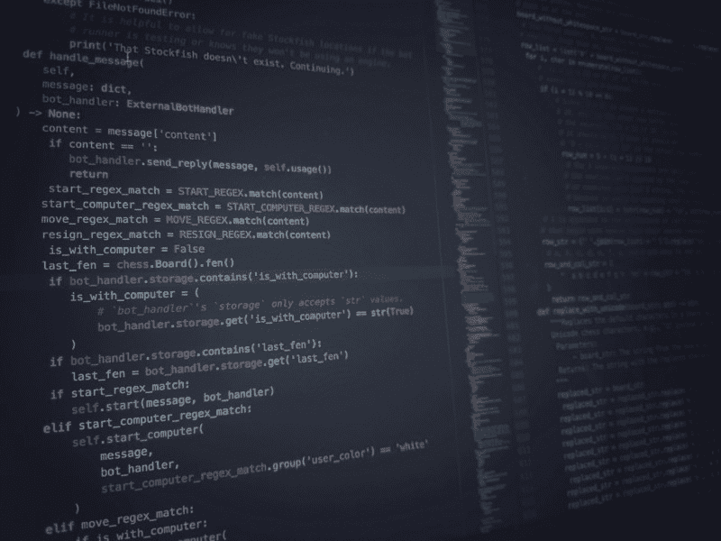
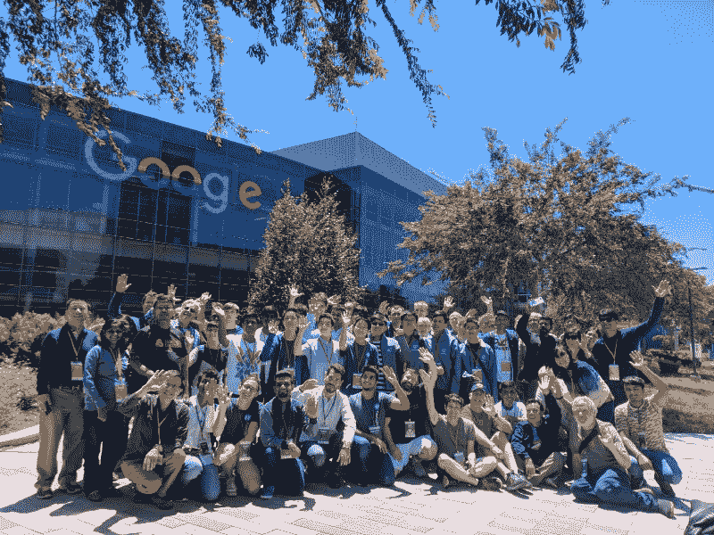
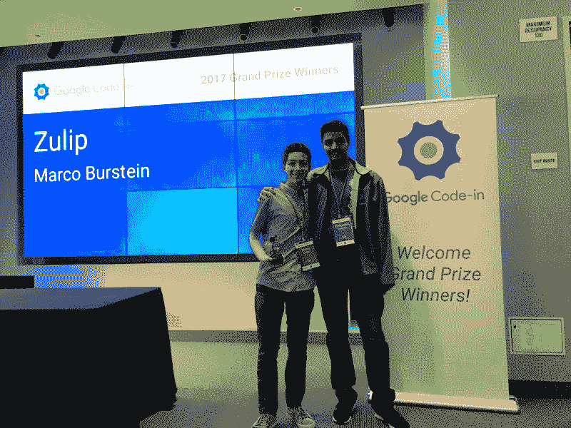
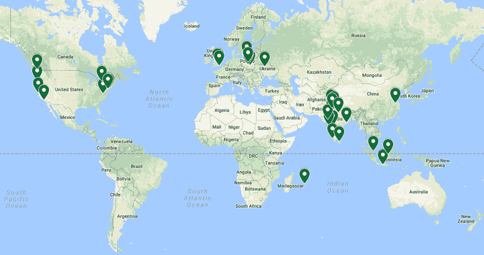

# 聊点什么:Google Code——2017 年和 Zulip 在一起！

> 原文：<https://www.freecodecamp.org/news/something-to-chat-about-google-code-in-2017-and-the-power-of-open-source-7efa4c9347ef/>

马可·伯斯坦(skunkmb)

# 聊点什么:Google Code——2017 年和 Zulip 在一起！

#### 来自 2017 年谷歌代码获奖者的思考

Source code for a chess-playing Zulip chatbot

我叫 Marco Burstein，去年我是 Google Code 的获奖者——2017 年与一个叫做 [Zulip](http://zulipchat.com) 的组织合作。随着 Google Code-2018 年[即将到来](https://opensource.googleblog.com/2018/08/announcing-google-code-in-2018.html)，我认为这将是一个与世界分享我的 Google Code-in 体验的好时机！

### 那么，什么是谷歌代码？

The Google Code-in Logo

Google Code-in(或简称为*“GCI”*)是一项竞赛，来自全球各地的学生为开源项目做出贡献。GCI 的学生从 10 月 23 日到 12 月 12 日完成开源组织(或*“orgs”*)的任务。

比赛结束后，每个组织将选出六名决赛选手和两名大奖得主。每位决赛选手都将获得一件限量版帽衫，获胜者将获得一次免费的加州谷歌总部之旅！

为了进入 Google Code-in，你不需要成为一名程序员。Google Code-in 包括几种不同的任务类型，包括编程任务以及质量保证、拓展等等。

#### 什么是开源？

A tree can represent open-source concepts like branches and pull requests!

Google Code-in 的支柱是开源软件。本质上，软件是*“开源”*意味着**任何人都可以查看和修改项目的代码**。

很多时候，组织使用 GitHub 这样的工具作为他们开源工作流的平台。学生们将学习为新功能创建*分支*，并将获得打开*拉请求*的经验，在那里他们将分支提交给组织的主存储库。

在整个 Google Code-in 中，学生们以许多不同的方式为这些开源组织做出贡献，比如添加新功能、修复 bug 或进行研究。

#### 谁可以报名？

Any pre-university student can enter Google Code-in

Google Code-in 对任何 13-17 岁的大学预科学生开放。每年，越来越多的学生入学，去年有 3555 名学生入学。

### 我的谷歌代码体验

#### 选择 Zulip

The Zulip Logo

我跑到我的电脑前，输入我的密码。是时候了。这一天终于到来了:2017 年谷歌代码开始了！我等 GCI 开始已经等了几个月了；现在我有机会测试我的编程技能，并有可能赢得一次去谷歌总部的旅行。

在比赛开始之前，我严格地研究了每个组织，确保我知道我将关注哪一个组织。我甚至做了一个电子表格来帮助我做决定！我最终选择的组织是 [Zulip:“世界上最有生产力的群聊”](https://zulipchat.com/)；它在后端使用 Python 和 Django，在前端使用 JavaScript。Zulip 将聊天的即时性与电子邮件式消息线程的效率相结合，使群组聊天比其他任何地方都好。也是完全免费的！

一旦我选择了我的组织，我就准备开始完成任务。

#### 一路上的任务和教训

I worked on a chess-playing chatbot for Zulip.

在整个比赛过程中，在 Zulip 导师和团队的支持下，我完成了很多在一年前甚至无法想象的任务。比赛期间，我日复一日地工作，有时甚至不脱睡衣！我个人最喜欢的一个游戏是我发明的一个 Zulip 聊天机器人，它可以和一个用户下棋。“Chessbot”不仅支持与其他用户对弈，还通过与另一个开源项目[stock fish 象棋引擎](https://github.com/official-stockfish/Stockfish)的连接支持与计算机本身对弈。在编写了 900 多行代码之后，我提交了一个功能正常的——尽管有点问题——chess bot 系统。在与我的导师们通过代码审查会议进行了几天的调整后，chessbot 被接受并合并了。

我最喜欢的另一个任务是添加一个 Zulip 功能，它会自动将表情符号(如“`:)`”)转换成表情符号(如“？”)).在与我的导师一起进行了多次改进和更改之后，我的功能被添加到了 Zulip 设置中。打开 Zulip，看到我努力创造的一个选项，感觉非常满足！

这些任务向我展示了挑战自我是多么有意义。许多任务花了我好几天才完成，但最后，我对自己的成就感到无比的满足和喜悦。此外，这些任务向我展示了编程过程中协作的重要性。在开源项目中工作让我明白了**在别人的帮助下极大地提高了你的代码质量**。在 Google Code-in 之前，我从未进行过代码审查，但通过 make chess bot、表情翻译功能等，我看到了在别人的帮助下捕捉 bug 并找到解决方案的重要性。

有了导师，我能够学习如何编写适合更大生态系统的代码，与 Zulip 的合作让我看到了开源的力量，无论是在创建软件还是将人们聚集在一起方面。

### 旅行

Students, mentors, and parents at Google!

Google Code-in 的大奖之旅是一次奇妙的旧金山之旅，包括在山景城的 Googleplex 度过一天。我在旅途中度过了一段美好的时光，能够参观谷歌总部真的是梦想成真。我感到非常幸运和兴奋，能够看到这家激励我如此之多的科技公司的内部运作。

Me and one of my mentors, Rohitt

在旧金山的时候，我和我的一位 Zulip 导师 Rohitt 在网上交流了几个月后，见到了他本人。在 GCI 进程中，Rohitt 非常热情，对我帮助很大，能有机会遇到对我有如此积极影响的人真是太好了。

Where other winners are from

与来自世界各地的其他获奖者和导师会面也很棒。尽管我们生活在不同的国家，说着不同的语言，但我们都因为对开源技术的共同热情而走到了一起。

### 一些提示

为了帮助那些通过这篇文章了解 Google Code-in 的新来者，我想我会提供一些在 GCI 竞争的技巧和诀窍。首先，我建议您熟悉许多开源组织使用的一些重要工具:

1.  [**GitHub**](https://goo.gl/nqMPX9) ，也就是几乎所有开源代码都托管在线的地方。为了提交作品和获得反馈，你必须了解如何使用 GitHub。
2.  IRC，是**互联网中继聊天**的缩写，是很多开源组织交流的方式。有多种不同的 IRC 客户端，可以让你和任何使用该服务的人聊天。你可以看看[这个由谷歌](https://goo.gl/amCmgZ)制作的关于如何使用它的指南。

在比赛中，我认为有几件重要的事情要记住，这样你才能尽可能的成功。

#### 坚持一个组织。

专门为一个组织做任务使你更有效率，因为你将总是使用相同的开发生态系统。随着时间的推移，你会越来越适应你的组织的源代码的结构，这提高了你的生产力。

#### 积极参与社区活动。

组织喜欢有奉献精神和责任感的学生。通过积极参与社区活动，您可以展示您对组织的参与和兴趣。保持活跃的一个方法是在 IRC 聊天中回答其他人的问题。您还可以对其他拉动式请求留下评论或反馈，或者为组织做除了 GCI 任务之外的工作。

#### 做艰苦的工作。

做困难的任务向你的组织表明你愿意挑战自己，在舒适区之外工作。具有挑战性的任务也更好地展示你的技能，无论是在编程、图形设计还是其他领域。

但是，请注意，GCI 规则规定…

> 如果你想进入决赛或赢得大奖，你需要成为某个组织的**前二十名任务完成者。**

因为做一个困难的任务通常比一个简单的任务需要更长的时间，所以在这两种类型之间保持平衡是很重要的，这样你就可以确保在竞争结束之前你能进入你的组织的前二十名。

此外，从学习的角度来看，做有挑战性的任务更有益。解决更困难的问题会帮助你提高编程、设计或任何其他技能。

#### 要有礼貌。

永远对你所有的导师*以及你的竞争对手同伴*保持礼貌和亲切。导师投入他们的时间和精力来帮助学生学习，所以对他们所做的一切表示感激是很重要的！

#### 玩得开心！

最后但同样重要的是，玩得开心！参加 Google Code-in 是一种奇妙的体验，也是学习新事物的好方法。重要的是，从只关注胜利后退一步，享受竞争！

如果你没有被选为获胜者，你不应该失望；相反，为你能够竞争而高兴，并从你的错误中学习。明年可以再参赛！

*(如果你想听更多关于我的建议，我写了一篇[单独的文章](https://medium.com/@skunkmb/5-tips-to-win-google-code-in-f8e0d29499eb)，更深入地介绍了我的建议。)*

### 结论

所以，最后，我想说谢谢你。非常感谢 Zulip 对我的指导，以及作为如此令人惊叹的社区的一部分。我真的很感谢我的导师花了所有的时间和精力来检查我的任务并帮助我改进。期待未来继续为 Zulip 做贡献！此外，我要感谢谷歌和谷歌开源团队，感谢他们推出谷歌代码，感谢他们在旧金山招待我们所有人参加如此精彩的一周活动。我很感激能有这样一个难得的机会，我将终生难忘。

Google Code-in 让我对开源软件大开眼界，并激励我更加积极地参与这个社区。我很高兴能够通过这次比赛为开源做出贡献，我知道这只是我开源努力的开始。