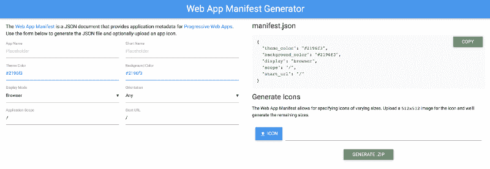
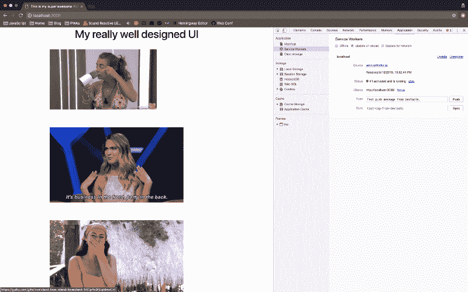

# 渐进式网络应用 102:从零开始构建渐进式网络应用

> 原文：<https://www.freecodecamp.org/news/progressive-web-apps-102-building-a-progressive-web-app-from-scratch-397b72168040/>

我们在第 1 部分学习了什么是渐进式网络应用程序(PWA) 。在这一部分中，我们将构建一个不使用框架，只使用 DOM 操作的渐进式 web 应用程序。

让我们快速回顾一下到目前为止我们所学的内容。要使应用程序具有进步性，它需要满足以下要求:

1.  清单文件— `manifest.json`
2.  至少有一个获取事件的服务人员— `serviceworker.js`
3.  图标— `icon.jpeg`
4.  在 HTTPS 上空服役— `https://www.myawesomesite.com`

在本教程中，我将讨论需求 1 和 2——创建一个清单文件并注册一个服务人员。

### 目标

对于这个例子，我们将创建一个简单的渐进式 web 应用程序。复杂性有意保持简单，以便我们可以专注于渐进式 web 应用程序的概念。你应该能够将这些概念应用到你自己的 Angular、React、Vue 或 vanilla JavaScript 应用程序中。

我们将创造一个迷因引擎。我们将从`giphy.com`中提取最新流行的迷因，并在我们的应用程序中展示它们。即使连接断开，用户也应该能够查看图像。因此，我们正在提供无缝的离线体验。

太好了！所以现在让我们开始重要的事情。


### 步骤 0:构建应用程序

让我们从一个框架 index.html 开始:

```
<!DOCTYPE html>
<html lang="en">
<head>
    <meta charset="UTF-8">
    <title>All the memes!</title>
    <link rel="stylesheet" href="/styles.css">
</head>
<body>
<header>
    <h1 class="center">Top trending memes today</h1>
</header>
<main>
    <div class="container"></div>
</main>
<script src="app.js"></script>

</body>
</html>
```

如您所见，这是一个简单的`index.html`，它只打印出文本`Top trending memes today`。没什么特别的。

接下来，让我们添加一个从`giphy.com`获取趋势迷因的功能。下面是 fetch 函数的样子:

```
async function fetchTrending() {
    const res = await fetch(`https://api.giphy.com/v1/gifs/trending?api_key=${apiKey}&limit=25`);
    const json = await res.json();

    main.innerHTML = json.data.map(createMeme).join('\n');
}
```

### 让我们让它进步

#### 步骤 1:清单文件

您可能还记得第 1 部分，清单文件是一个`json`文件。它有关于应用程序的元信息，如图标名称，背景颜色，应用程序的名称等。下面是一个包含这些参数的`manifest.json`文件:

```
{
  "name": "Meme",
  "short_name": "Meme",
  "icons": [{
    "src": "images/icons/icon-128x128.png",
      "sizes": "128x128",
      "type": "image/png"
    }, {
      "src": "images/icons/icon-144x144.png",
      "sizes": "144x144",
      "type": "image/png"
    }, {
      "src": "images/icons/icon-152x152.png",
      "sizes": "152x152",
      "type": "image/png"
    }, {
      "src": "images/icons/icon-192x192.png",
      "sizes": "192x192",
      "type": "image/png"
    }, {
      "src": "images/icons/icon-256x256.png",
      "sizes": "256x256",
      "type": "image/png"
    }],
  "start_url": "/index.html",
  "display": "standalone",
  "background_color": "#3E4EB8",
  "theme_color": "#2F3BA2"
}
```

您也可以使用工具来生成它。这里有一个我觉得有用的工具:



Web App manifest generator

将其添加到我们的应用程序很简单。在`index.html`中添加以下一行:

```
<link rel="manifest" href="/manifest.json">
```

#### **第二步:服务人员**

让我们创建文件`serviceworker.js`。首先，我们将在安装时注册服务人员。然后我们将缓存一些静态资产，如`styles.css`和`app.js.`，接下来，我们需要使用`fetch`提供离线能力。这里是`serviceWorker.js`的样子:

```
const staticAssets = [
    './',
    './styles.css',
    './app.js'
];

self.addEventListener('install', async event => {
    const cache = await caches.open('static-meme');
    cache.addAll(staticAssets);
});

self.addEventListener('fetch', event => {
    const {request} = event;
    const url = new URL(request.url);
    if(url.origin === location.origin) {
        event.respondWith(cacheData(request));
    } else {
        event.respondWith(networkFirst(request));
    }

});

async function cacheData(request) {
    const cachedResponse = await caches.match(request);
    return cachedResponse || fetch(request);
}

async function networkFirst(request) {
    const cache = await caches.open('dynamic-meme');

    try {
        const response = await fetch(request);
        cache.put(request, response.clone());
        return response;
    } catch (error){
        return await cache.match(request);

    }

}
```

我们来分析一下。服务人员将帮助我们缓存数据和获取资源。如果我们的缓存中有数据，我们就从缓存中返回数据，或者从网络中获取数据。对于你自己的应用程序，考虑一下你需要为离线访问提供什么功能。然后，相应地缓存资源。对于我的例子，我想在网络中断时显示以前缓存的图像。

我们需要将它添加到我们的 index.html 中。为了添加它，我们将利用浏览器的导航库来注册服务人员:

```
window.addEventListener('load', async e => {
    await fetchTrending();

    if ('serviceWorker' in navigator) {
        try {
            navigator.serviceWorker.register('serviceWorker.js');
            console.log('SW registered');

        } catch (error) {
            console.log('SW failed');

        }
    }
});
```

让我们验证它实际上已经被注册了。单击浏览器中的网络选项卡，然后转到应用程序设置。在开发渐进式 web 应用程序时，此选项卡非常有用。重新加载页面，您将能够在该选项卡中看到一名服务人员。



Service Worker has been registered

现在让我们刷新浏览器。在第一次加载时，数据将由服务人员缓存。尝试关闭连接。我们仍然可以看到图像。

我们的应用程序现在甚至可以离线使用！如果你已经启用了 HTTPS 并上传了图标，那么恭喜你现在有了一个进步的网络应用程序！

### 后续步骤

如果你对开发自己的渐进式网络应用感兴趣，我强烈推荐你看看谷歌开发者的这个 [codelabs](https://codelabs.developers.google.com/codelabs/your-first-pwapp/) 。

你学到新东西了吗？有评论？知道一个笑话吗？[发微博给我@shrutikapoor08](https://twitter.com/shrutikapoor08)

> //我写这个的时候，只有上帝和我明白我在做什么
> //现在，只有上帝知道[# dev joke](https://twitter.com/hashtag/devjoke?src=hash&ref_src=twsrc%5Etfw)[# nota joke](https://twitter.com/hashtag/notajoke?src=hash&ref_src=twsrc%5Etfw)[# dev](https://twitter.com/hashtag/development?src=hash&ref_src=twsrc%5Etfw)[# JavaScript](https://twitter.com/hashtag/javascript?src=hash&ref_src=twsrc%5Etfw)[pic.twitter.com/4V6lMUdhdb](https://t.co/4V6lMUdhdb)
> 
> — Shruti Kapoor (@shrutikapoor08) [August 9, 2018](https://twitter.com/shrutikapoor08/status/1027666190447955968?ref_src=twsrc%5Etfw)