# 评估任何新的 JavaScript 库时需要考虑的 12 件事

> 原文：<https://www.freecodecamp.org/news/the-12-things-you-need-to-consider-when-evaluating-any-new-javascript-library-3908c4ed3f49/>

萨沙·格里菲

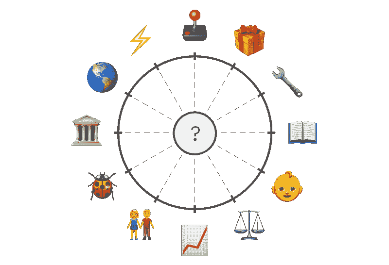

# 评估任何新的 JavaScript 库时需要考虑的 12 件事

#### 你如何知道一项新技术是否值得投入时间？

对于今年的[JavaScript 状态调查](http://stateofjs.com/)，我想更深入一点，不仅要知道人们在使用哪些工具和库，还要知道*为什么*他们在使用它们。

这意味着我必须找到一种方法，将个人偏好转化为冰冷的硬数据。经过一些研究，我提出了一个 12 分的标准，涵盖了选择和使用任何技术的主要方面。

### 参加测验！

为了让你更容易将这个标准应用到任何图书馆，我准备了一个快速测验，带你了解所有 12 个因素，并给你一个最终建议:

#### ➡️ [参加 12 个因素的测验](https://stateofjs.typeform.com/to/hTRAcc)

如果你不确定要评估什么，就在你熟悉的库(React、Vue、jQuery……)上做，看看它的得分有多高！

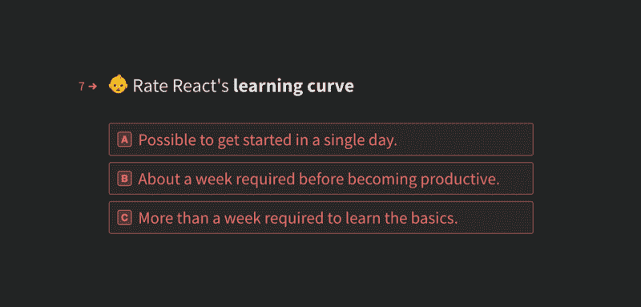

或者，您可以继续阅读，了解每个因素的更多信息，并了解如何应用它们。

### 注意:关于 JavaScript 的现状调查

正如我提到的，我最初开发这个量表是为了给年度 JavaScript 状态调查获取更详细的数据。

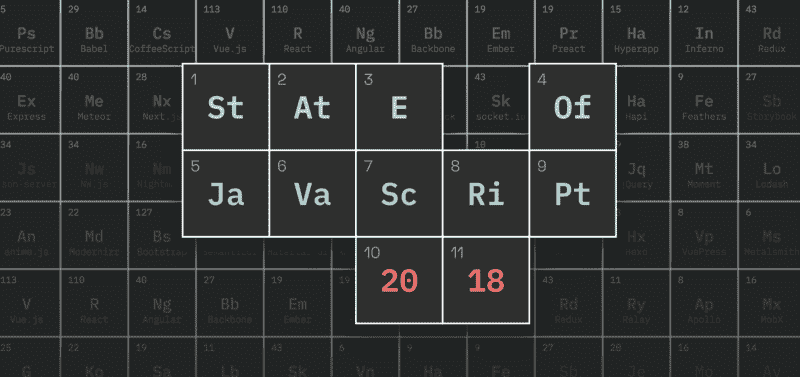

如果您想为 JavaScript 生态系统的最新趋势做出贡献，请[参加调查](http://stateofjs.com)！

现在回到 12 分制。

### 工厂

以下是完整列表:

1.  **？️特色**
2.  **？稳定性**
3.  **⚡的表现**
4.  **？包装生态系统**
5.  ？C **社区**
6.  **？学习曲线**
7.  **？文件**
8.  **？工具**
9.  **？️记录**
10.  **？团队**
11.  **⚖️兼容性**
12.  **？动量**

我会解释每个因素的重要性，也会给你一个评分网格，告诉你如何评价。让我们浏览一下列表！

### ？️特色

你选择任何技术的第一个原因可能是它的功能。

但这里的关键问题是知道要走多远。React 可能是目前最受欢迎的前端库，但一个常见的抱怨是它做得不够，将路由和状态管理之类的事情留给了 React-Router 和 Redux 等第三方库。

其实这也是 React 最大的竞争对手 Vue 的很大一部分吸引力。通过为这些常见用例提供官方包，它设法提供了一个更全面的解决方案，并获得了很大的市场份额。

然而，如果走得太远，你最终可能会得到一个臃肿、复杂的框架，试图成为每个人的一切。

所以有时候，极简主义方法是需要的。像 Lodash 或 Ramda 这样的库可以让你用简洁的函数表达式替换杂乱的嵌套 for 循环，这足以使它们成为无价的工具。

再次强调，这一切都是为了找到正确的平衡！

#### 计分系统

*   **答:**解锁以前不可能的事情。
*   B: 让你做和以前一样的事情，但方式更好。
*   **C:** 比当前解决方案做得少。

### ？稳定性

你可以拥有有史以来最优雅、功能最全的框架，但是如果开发人员每两分钟就犯一次错误，那么这个框架就没有意义了。

因此，当前 JavaScript 生态系统中的许多工具都致力于增加堆栈的稳定性和安全性。只需看看 TypeScript 和 Flow 的成功，甚至像 Reason 这样的语言。

在数据层方面，GraphQL 的类型系统也有助于确保一切顺利运行。

#### 计分系统

*   **答:【debug 更少，问题变得更容易调试和解决。**
*   **B:** 采用该技术不会对你的软件的稳定性产生影响。
*   采用这项技术的直接结果是新的缺陷和问题出现了。

### ⚡表演

如果你曾经训练过武术，你会知道你能拥有的最好的属性之一是速度，而不是力量。

同样，如果你的应用程序需要 15 秒才能加载，那么世界上所有的功能都没有用。到那时，用户已经关闭了标签，你甚至在战斗开始前就已经输了！

在 JavaScript 生态系统中，只需看看 [Preact](https://preactjs.com/) 就可以看到一个关注速度的例子:它的 API 与 react 完全相同，因此它并不试图在功能强度上竞争。但是，由于它比 React 更轻量级，加载速度更快，因此可以节省宝贵的毫秒数，并提高 webapp 的性能。

#### 计分系统

*   **答:**更轻的包、更快的加载时间或其他性能改进。
*   采用这项技术不会对你的软件性能产生影响。
*   采用这种技术会显著降低你的应用程序的速度。

### ？包装生态系统

在投资任何新技术之前，观察围绕它发展起来的生态系统是很重要的。

一个充满活力的软件包生态系统不仅可以节省大量的时间，因为它可以让你搭载他人的工作，而且它也是技术已经达到一定成熟水平的标志。出于这个原因，维护良好的第三方包是开发者长期接受一项技术的最好标志之一。

#### 计分系统

*   **答:**生态系统对常见问题有明确的解决方案；第三方包得到了很好的维护和很好的记录。
*   **B:** 具有许多竞争性新选项的萌芽包装生态系统。
*   **C:** 没有软件包生态系统可言，需要大量的手动工作。

### ？社区

另一个要考虑的因素是整个社区。当遇到问题时，专门的论坛或 Slack 频道会有很大的帮助。

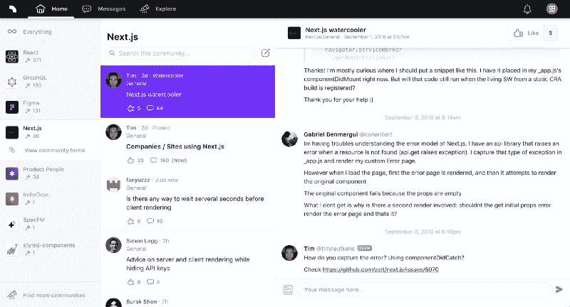

[Spectrum](https://spectrum.chat/) is an increasingly popular middle ground between chatrooms and traditional forums.

有一个现有的堆栈溢出答案库可供查找也很有帮助。当然，一个维护良好的 GitHub 问题页面是必须的！

#### 计分系统

*   **答:**论坛和/或聊天室(松弛/不和谐/等。)的日常活动，GitHub 的问题在一天之内得到解决。许多人回答了堆栈溢出问题。
*   不经常活动的论坛和/或聊天室。
*   **C:**GitHub 之外没有社区。

### ？学习曲线

简单的学习曲线使得开发者更有可能给你的框架或库一个机会。人们很容易认为，如果一项技术真的具有颠覆性，人们就会冲破任何障碍，但事实往往并非如此。

一个密切相关(但有时相反)的概念是“采用”曲线。当它第一次推出时， [Meteor](http://meteor.com/) 非常容易使用(至少与现有的替代产品相比),但是它要求你一次采用它的整个堆栈，这使得它很难在现有的项目中实现。

React 也因其粗糙的学习曲线而闻名:对于习惯于分离 HTML 和 JavaScript 的开发人员来说，不得不使用 JSX 可能会很困难。另一方面，Vue 使开始变得容易得多，而不必重新思考前端编码的方式。

#### 计分系统

*   **答:**一天之内有可能开始。
*   大约需要一周时间才能开始生产。
*   **C:** 学习基础知识需要一个多星期。

### ？证明文件

简单学习曲线的很大一部分是拥有优秀的文档。这比听起来更难实现，因为编写文档的人通常是最有经验的人；这意味着他们也离新的开发者体验最远。

因此，编写好的文档需要暂时忘记你所知道的，并把自己放在一个刚刚发现你的技术的人的位置上。

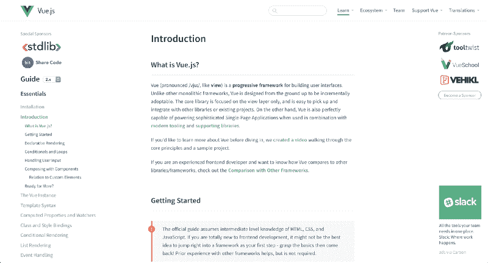

Vue.js’ documentation is both well-designed and well-written.

它还需要预测常见的问题，理解用户的心理模型，最重要的是，随着代码库的变化，保持所有的东西都是最新的！所有这些都占用了实际编码的宝贵时间…

考虑到所有这些因素，您就可以理解为什么好的文档是一种稀有而有价值的东西了！

#### 计分系统

*   **答:**专门的文档站点、截屏、示例项目、教程、API 文档和评论良好的代码。
*   **B:** 基本的 Read Me 和 API 文档。
*   **C:** 非常简洁的 Read Me，知道如何使用库的唯一方法就是看它的代码。

### ？工具作业

就像文档一样，对于一些维护人员来说，工具似乎是次要的干扰，但实际上对于任何技术的普及和成功都是至关重要的。

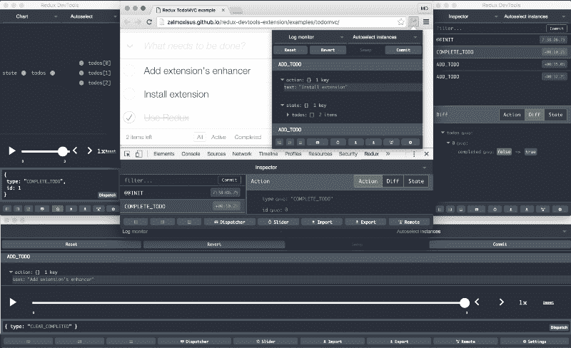

Redux’s DevTools alone make it worth considering.

我相信 Redux 成功背后的一个重要原因是它惊人的 Devtools 浏览器扩展，它让你以一种非常用户友好的方式可视化 Redux 存储和操作。类似地，VS Code 强大的 TypeScript 支持为它的采用创造了奇迹。

#### 计分系统

*   **答:**浏览器扩展、文本编辑器扩展、CLI 实用程序、专用第三方 SaaS 服务中的两个或多个。
*   B: 浏览器扩展、文本编辑器扩展、CLI 实用程序、专用第三方 SaaS 服务之一。
*   **C:** 无外部工具。

### ？跟踪记录

一天结束时，即使是最优雅、记录最完整的图书馆，如果只存在了六个月，也很容易被视为昙花一现。

我们都可以讲述采用“下一件大事”的故事，但当事情开始变糟时，我们只能爬回到良好的旧 Rails/PHP/*在此插入可靠的技术。

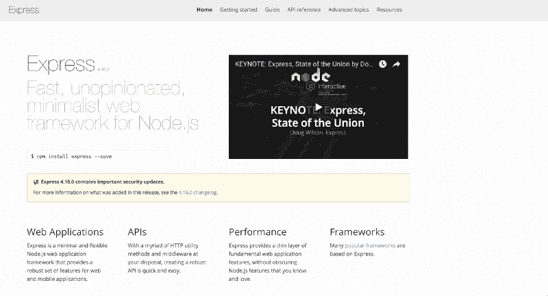

Express: still a contender even after all these years

出于这个原因，没有什么可以打败坚实的记录。Express 就是其中的一个例子:它最初发布于 2010 年，尽管 JavaScript 生态系统发展迅速，但它仍被视为默认的 Node.js 服务器框架。

#### 计分系统

*   **答:**已经有 4 年多的时间了，在我的主要公司和知名科技咨询公司工作过。
*   **B:** 已经存在了 1-4 年，由早期采用者和较小规模的咨询公司使用。
*   **C:** 问世不到一年，还没有真正的采用。

### ？组

并非所有项目都有现有的跟踪记录。当一个图书馆是全新的，你如何判断它的潜力？一个可靠的方法是找出幕后黑手。

当 React 第一次出现时，正是脸书在背后支持它，这是一个很大的争论，至少要尝试一下。脸书接着发布了 Relay 和 GraphQL，表明 React 的成功不是侥幸！

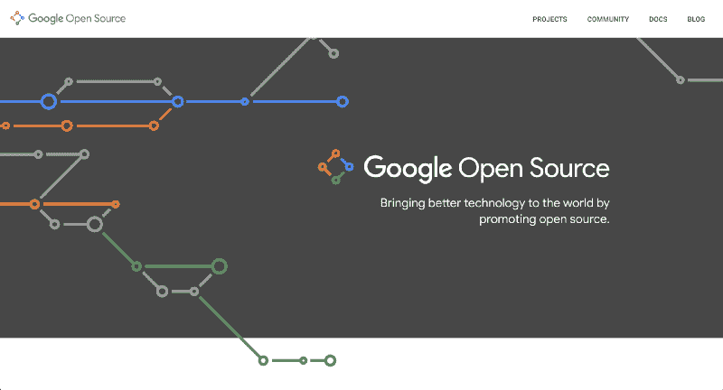

Google Open Source: over 2000 projects covering desktop, mobile, and more.

更大的公司也有更多的资源可以投资:即使在发布更新、不兼容的版本后，谷歌也能够继续维护最初的 Angular.js。

当然，这并不意味着孤独的维护者不能创造重大的创新。Vue.js 就是这样诞生的，更不用说 99%的开源软件了。

#### 计分系统

*   **答:**由一家大公司用专门的开源团队维护。
*   B: 由一个中等规模的工程师团队维护，拥有可靠的个人跟踪记录。
*   **C:** 独立工作的孤独维护者。

### ⚖️ **兼容性**

采用前沿库的伟大之处在于，它们通常发展得相当快。可悲的是，这也可能是一个主要的不利因素！

快速的改进率也可能意味着频繁的突破性变化，因为新的最佳实践取代了旧的模式，让早期采用者来支付重构成本。

当 React Router 决定在版本 3 和 4 之间完全改变他们的 API 时，他们引起了很多抱怨。Angular 也是如此，当他们从 Angular.js 转向新的“just Angular”时。

当你刚刚开始一个新项目时，频繁的更新是有趣和令人兴奋的，但是一旦你的应用程序启动并在生产中运行，你最不希望的事情就是每次新版本的库出现时都必须花费数周的时间进行重构和调试。

#### 计分系统

*   **A:** 更新大多是向后兼容的，弃用是带警告处理的，不兼容的老版本维持两年甚至更久。
*   **B:** 突破性的变化确实会发生，但会被很好地记录下来，并且会逐步推出。
*   **C:** 频繁的破坏性更新需要在没有适当指导的情况下进行重大重构。

### ？动力

最后但同样重要的是，动力。换句话说，炒作。

炒作通常被视为一件坏事(“不要成为炒作的牺牲品”)，被视为风格重于实质的标志。但并不总是如此。

有了足够的动力，一个新的软件项目可以吸引更多的用户和贡献者，这意味着错误可以更快地被发现和修复，一个软件包生态系统可以发展，并且每个人最终都会更好地结束。

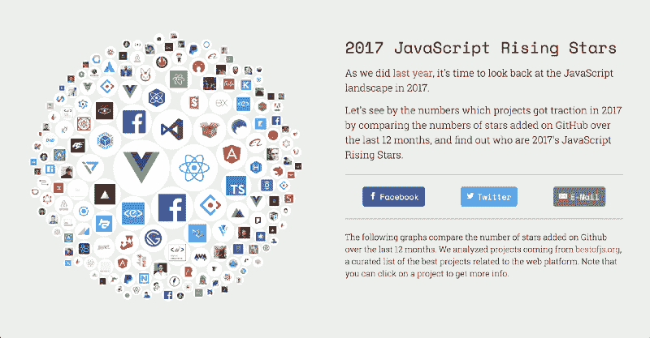

JavaScript Rising Stars, our project charting the growth of popular JavaScript libraries

但是，是的，硬币也有另一面:太早太多的宣传可能会让潜在用户看到一个充满问题的未完成版本，让他们永远失去兴趣。就像他们说的，你只有一次机会留下第一印象。

#### 计分系统

*   **A:** 炒作水平超过 9000:黑客新闻之巅，GitHub 明星千人千面，各大会议演讲。
*   **B:** 围绕最初推出的一些兴趣，几百个 GitHub 明星。
*   孤独的开发者默默无闻地辛苦工作。总有一天我会让他们看看！我会给他们看的！！

### 更新:还有几个因素

你们中的一些人提出了更多值得关注的因素。对于秤的潜在版本 2.0，需要考虑一些事情！

*   可伸缩性:这项技术在大型项目中的表现如何。
*   **采用**:目前还有谁在使用这项技术？
*   兼容性:这项技术与其他现有技术的兼容性如何？
*   **解耦**:如果你想停止使用这项技术，那么从这项技术中迁移出来有多容易？

### 案例研究:阿波罗客户端

让我们将我们的评分系统应用到一个实际的、真实世界的图书馆来进行测试: [Apollo Client](https://github.com/apollographql/apollo-client) 。

Apollo Client

Apollo 是一个 GraphQL 客户端，换句话说，它是一个查询 GraphQL 端点并为您在客户端加载其数据的库。它还处理诸如缓存、确保数据不重复以及将所述数据发送到您选择的前端库之类的事情。

让我们看看它在我们的评分系统上表现如何！

#### ？️特色:b

Apollo 为您提供了更好的数据查询方式，因此它是对现有工具的逐步改进。

#### ？稳定性:A

采用 Apollo 和 GraphQL 确实使推理数据和追踪问题变得更加容易。

#### ⚡表演:b

Apollo 确实包含了优化数据加载的工具，但总体来说不会对应用程序的性能产生太大的影响。

#### ？包装生态系统:A

Apollo 支持名为[链接](https://www.apollographql.com/docs/link/#linkslist)的包，以便启用额外的功能。

#### ？社区:B

Apollo 确实有一个非常活跃的 Slack 聊天室，但根据我的经验，问题有时可能得不到回答，而且很难从忙碌的核心团队成员那里得到回复。

#### ？学习曲线:B

学习 Apollo 的所有细微差别实际上可能是一个挑战，尤其是如果您正在同时学习使用 GraphQL 的话。

#### ？文件:A

为多个前端框架提供了良好的、维护良好的文档，以及示例代码库。

#### ？工具:A

浏览器扩展和专用的[指标平台](https://www.apollographql.com/engine/)。

#### ？跟踪记录:b

Apollo 本身还是相当新的，但 GraphQL 领域也是如此。

#### ？团队:A

能力强、资金雄厚的团队，拥有启动其他开源项目的经验( [Meteor](http://meteor.com/) )。

#### ⚖️稳定性:b

从 v1 到 v2 的中断更新，但整体良好的稳定性和向后兼容性。

#### ？动量:B

阿波罗可能还不是一个家喻户晓的名字，但它是其利基市场的主导者，尽管接力开始领先。

#### 综合成绩:A？

阿波罗最终取得了满分 36 分中的 29 分，表现非常出色！即使总会有需要改进的地方，也很容易理解为什么它被许多需要可靠方法来处理 GraphQL 数据的团队在生产中采用。

### 其他方法

NPMS 的人们已经实现了类似的评级系统，通过查看 GitHub 和 NPM 的数据自动生成。这使得他们的评分不那么主观，但另一方面，它不包括像文档或社区这样的东西。

在原始数据方面，你也可以通过 NPM 趋势得到一些很酷的数据:

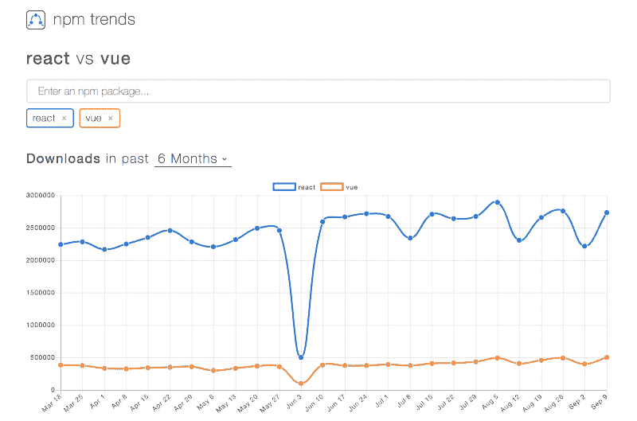

NPM Trends

并在 Best of JS 上了解当前流行的库:

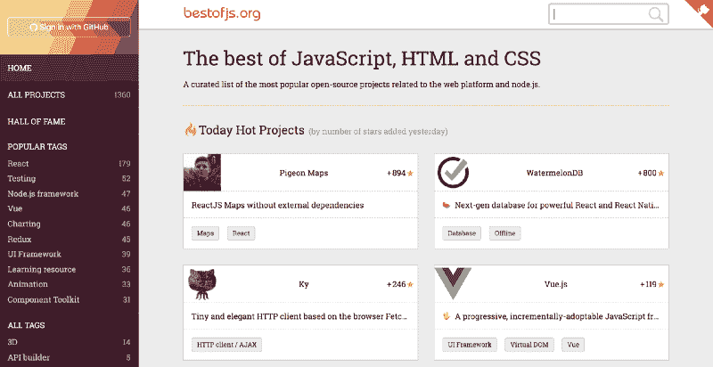

Best of JS

当然，还有去年的 JS 调查结果:

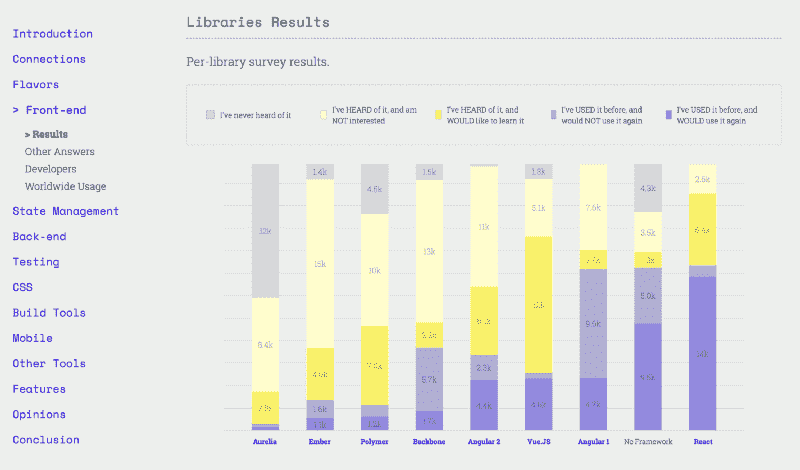

The State of JavaScript 2017 survey results

你呢，你通常如何评价图书馆？留下评论让我知道！

### 结论

这个规模绝不是图书馆价值的绝对衡量标准。毕竟这总是很主观的，并且强烈地依赖于你的项目和你的需求。

尽管如此，我们还是希望它可以作为一个有用的起点。如果没有别的，它可以作为一个清单，以确保你没有忽略任何重要的事情之前，大跳向未来！