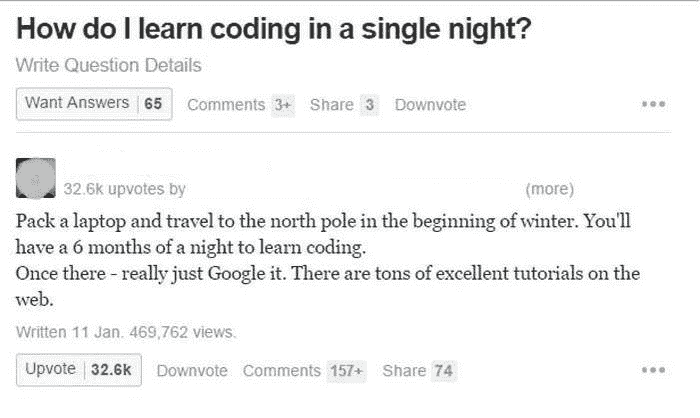

# WordPress 开发新手的学习之路

> 原文：<https://www.freecodecamp.org/news/learning-path-for-newbies-in-wordpress-development-a283981adf53/>

在这个信息时代，学习新事物的一个障碍不是去哪里找资源。这是从哪里开始，并使所有这些天网上可用的资源有意义。当新工具一夜之间涌现出来时，这在 web 开发中尤其如此。

回到 2015 年，自从我第一次决定学习 web 开发，我就面临着自我怀疑和缺乏动力的挑战。但是耗尽我精力的一个挑战是不知道该走哪条路。

考虑到这条道路上最初的挑战，我为那些想涉足 web 开发的技术爱好者写了这篇文章。尤其是 WordPress 开发。所有这些都是为了希望你能花时间做一些更酷的事情，而不是陷入一个工具学习另一个工具的永无止境的恶性循环。

# **小心！在这条道路上学习了很多东西**

我是一名 WordPress 开发者(尽管我的冒名顶替综合症告诉我并非如此)。我能分享的经验只和 WordPress 有关。但是在深入细节之前，让我们先来看一个问答环节。

现在，回答是刻薄吗？也许吧。是真的吗？绝对的！WordPress 和 Web 开发，总的来说，和任何职业一样严肃和苛刻。所以做好准备…

*   终生学习
*   偶尔通宵工作

好了，以上几点你看懂了吗？太好了。现在放松，因为这不会让你沮丧或任何事情。这就是这个领域不断变化的本质所要求的开发人员的生活方式。

好消息是，要掌握 WordPress 开发技巧，你不需要学习太多的网络技术。也就是说，把你的时间花在这个令人惊奇的软件上，WordPress 也会喜欢你的。

如果你愿意，WordPress 将会改变你的生活——克里斯·马乐

都很励志很可爱吧？这也是 Topher DeRosia(巨大的道具)为文字记者提供 [HeroPress](https://heropress.com/) 平台的原因之一(是的，这是我们自豪的称呼)。在这里，WordPress 用户定期与[社区](https://opensource.org/community)分享他们的 WordPress 起源故事。请放心，在通读这些故事的时候，你会感觉到肾上腺素在你的身体里涌动，因为你们中的许多人会发现自己与这些故事有关联。

# WordPress for Everyone！

WordPress 超级好用。事实上，任何没有任何技术知识的人都可以很快建立并开始使用 WordPress。然而，WordPress 有一个庞大的生态系统。就我个人而言，我会将 WordPress 的开发分为两个不同的领域。我将首先在下面列出这些领域，然后我将分别讨论每一个。

*   WordPress 站点定制
*   WordPress 主题/插件开发

# WordPress 站点定制

WordPress 站点定制是所有讨论的焦点，因为它包含了 WordPress 使用方面的大部分工作。站点定制是不需要预先编码知识的领域。

也就是说，WordPress power 用户可以很容易地使用页面生成器完成主题/插件设置和定制、站点调试和站点维护等任务。此外，主题定制就是根据客户的要求定制或修改预先制作好的主题。

考虑到这一点，并给你一个关于这个过程的视角，你可以看看下面泰勒·摩尔的简短教程。在他的教程中，他通过使用 Elementor 页面生成器定制一个预先制作的主题来构建一个新网站。

[https://www.youtube.com/embed/8AZ8GqW5iak?feature=oembed](https://www.youtube.com/embed/8AZ8GqW5iak?feature=oembed)

WordPress Site Customization using Elementor Page Builder by Tyler Moore

# WordPress 主题/插件开发

这是 WordPress 极客的所有乐趣所在。我们可以称之为 **实际的** WordPress 开发，因为这个领域是关于了解和进入编程的本质技术细节。它可以简单到用几个 WordPress 钩子修改回复，也可以复杂到在 WordPress 上构建一个完整的产品。

所以，如果你想进入这个领域，你必须投入更多的时间学习 WordPress 开发中涉及的网络技术。考虑到这一点，本文的其余部分将讨论所有的技术和一些技巧，让你开始真正的*WordPress 开发。*

# ***学习路径***

*为了开始你的 WordPress 开发之旅，这些工具和技术是你将要使用的。*

1.  *打个招呼，用语义和可访问性概念拥抱 g̵o̵o̵d̵ ̵o̵̵̵l̵̵̵' HTML5 模块。HTML 为网站内容提供了结构。*

*2.这句话说明了一切:*

*你是我的 HTML 的 CSS 某个天才*

*CSS 是 HTML 在 web 浏览器中的呈现方式。一旦掌握了基础知识，一定要学习 SASS 预处理器，它是你编写模块化 CSS 的救星。*

*3.WordPress 背后的组织有一个大计划，让 JavaScript 成为 WordPress 前端的一部分。这正式来自 WordPress 的原作者。*

*深入学习 JavaScript——马特·莫楞威格*

*是的，我知道对于一个刚开始遵循这个建议的新手来说，这可能有些牵强，但是请留意这个领域的发展。现在，这并不意味着你必须掌握 JavaScript 才能使用 WordPress。从基础开始，包括它非常流行的库 jQuery。*

*4.如果你能用这三种技术领先 1000 步来加速你的开发过程，那不是很好吗？这就是前端框架如 [Twitter Bootstrap](http://getbootstrap.com/) 发挥作用的地方。探索它，获得惊喜。不要混淆前端框架和 JavaScript 框架。前端与 JavaScript 库和框架互换使用，是完全不同的路径。*

*5.PHP 是支持 WordPress 的脚本语言。如果你想深入 WordPress，先学习 PHP 及其 OOP 概念，包括作为后端数据库的 MySQL。*

*6.一般来说，当人们谈论 WordPress 开发时，通常只指 WordPress 的两个片段。*

*   *WordPress 主题开发，这是开发一个网站的展示(布局)(因此得名“主题”)。*
*   *WordPress 插件开发，为 WordPress 站点增加功能*

*对于一个开发人员来说，最重要的是理解并适应这两个部分。为了在您的学习之旅中增加一点内容，请熟悉国际化和本地化。你还需要知道 WordPress 钩子和 API 等等。*

*开发网站时，你的大部分时间将花在本地开发环境和代码编辑器中。为了在本文中获得完整的信息，让我向您介绍一个易于设置但功能强大的本地开发环境( [Local by Flywheel](https://local.getflywheel.com/) )和快如闪电的代码编辑器([Visual Studio Code](https://code.visualstudio.com/)by Microsoft)。是的，它们都像 WordPress 一样是免费的。*

## ***工作流程***

*随着你的工作流程变得越来越高级和复杂，保持理智和享受生活对你来说很重要。在这种情况下，你需要简化你的工作流程。尝试像 [Grunt](https://gruntjs.com/) / [Gulp](https://gulpjs.com/) 这样的任务自动化工具，并使用像 [git](https://git-scm.com/) 这样的版本控制系统来防止你犯错误。*

## ***GitHub 上发布的学习路径指南插图***

*为了让您更清楚地了解情况，我已经在 [GitHub](https://github.com/ihtishamzahoor/wordpress-learning-path) 上发布了一个学习路径的图解，作为一个逐步的指南，我在下面已经提供了。*

**

*从中学习，给出反馈，改进它，使之更适合新手，并通过这种方式随时发送公关请求。*

# ***资源***

*如果你仍然担心你需要更多的激励性话语来真正开始做有意义的工作，也许你需要一个循序渐进的指南——好了，不用再担心了。遵循[******WordPress WordPress 开发者手册******](https://developer.wordpress.org/) 和[******WordPress 开发者手册******](https://codex.wordpress.org/) 喜欢宗教，认为自己安全无虞。*

*此外，您可以从 [******WordPress 支持******](https://wordpress.org/support/)*论坛以及从 Q & A 站点 [******栈溢出******](https://stackoverflow.com/) 中挖掘您的答案，这在开发人员社区中非常受欢迎。**

*除了官方的 WordPress 资源、支持论坛和以开发者为中心的问答网站。令人敬畏的 WordPress 社区提供以 WordPress 为中心的免费教程和指南，使得像[******WP 初学者******](https://wpbeginner.com/)*这样的网站不胜枚举。**

**[******CodexSpot******](https://www.codexspot.com/category/tutorials/)是一群[**WordPress geeks**](https://www.codexspot.com/about-us/)包括你自己在内的真正回馈社区的尝试之一。CodexSpot 是一个在线平台，专注于提供网络解决方案。我们的目标是提供高质量的教程、DIY 指南，并让您了解最新的网络行业新闻和趋势报告。**

*我们是自由和开源软件倡议的巨大支持者，不会错过任何宣传自由和开源软件实践的机会来推动这一运动。除此之外，我们还提供免费的 web 开发生成器和工具来加速您的开发时间。*

*现在，还有另一种学习资源，那就是高级课程。与免费资源相比，优质资源的主要好处是课程教师为学生提供及时的支持。也就是说，能够让你的问题得到你正在学习的导师的回答，在你的学习过程中会给你带来巨大的好处。此外，他们紧跟最新的行业趋势。*

*我个人从[******【Lynda.com】******](https://www.lynda.com/learning-paths/Web/become-a-junior-wordpress-developer)(现 **LinkedIn 学习** )课程中学到了很多，强烈推荐。我还找到了[******Learn WordPress******](https://onemonth.com/courses/wordpress)*课程由***Chris castig lione 提供，这是一个不错的初学者友好课程。所以，如果你正在 WordPress 上寻找一门高级课程，你会发现这些课程都物有所值** 。***

*在这一点上，你有足够的精力和大量的资源来学习关于 WordPress 的一切。然而，同样重要的是，你要了解就业市场以及公司对申请 WordPress 开发者职位的候选人的要求。*

*全球顶尖自由职业者的专属网络 Toptal 发布了一份招聘“[伟大的 WordPress 开发者](https://www.toptal.com/wordpress#hiring-guide)的指南，你可以阅读这份指南，更好地掌握最受欢迎的 WordPress 技能。*

# *结论*

*不要试图一下子学会所有的东西。从基础开始。实施你所学到的，然后在此基础上进行构建。请注意以下两条并非一成不变的指导规则，因为这些规则会在你的旅程中派上用场。*

*   ***【JIT】学习** 是你在需要的时候学习的工具。*
*   ***80/20 学习法则** 就是你把 20%的时间用于学习，80%的时间用于实现你已经学到的东西。*

*现在跟我重复:*

*我学会了。
我码！
我又码了！！
我又多编了一些！！！
我继续编码！！！！！*

*…这就是你如何开始使用 WordPress。祝你好运，欢迎加入 WordPress 大家庭！*