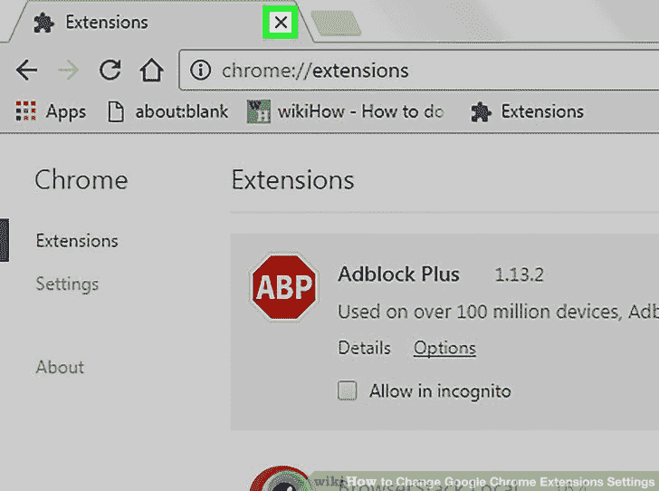

# 如何从编码教程到构建自己的项目

> 原文：<https://www.freecodecamp.org/news/how-to-go-from-coding-tutorials-to-building-your-own-projects-b9ab51074980/>

在学习如何编码时，我不断听到同样的建议。

“教程很棒，但构建项目是最好的学习方式。去造东西吧！”

但是……*怎么*？

作为初学者，这就像听到“去跳伞吧！”

刚开始时，从头开始构建应用程序的想法令人望而生畏。尝试的时候觉得力不从心，就放弃了。所以我继续只学习编码教程——我的学习很快就停滞不前了。

我被卡住了。

我开始思考如何开始建设项目，但不是那些看起来复杂到让我失去继续下去的动力的项目。最终，我找到了摆脱教程训练的方法，并开始开发自己的应用程序。后来，当我得到我的第一份工作[作为一名开发人员](https://medium.freecodecamp.org/how-i-went-from-fashion-model-to-software-engineer-in-1-year-a7399a40d9e7)时，人们问我如何学习编码。在这里。

构建项目是最好的学习方式——但是你不必一头扎进创建一个感觉不可能开始的项目，更不用说完成了。

有一些有趣的、切实的方法可以让你从仅仅学习教程转变为自信地构建自己的项目。

这里有三个对我有用的方法。

### 1.向您的教程应用程序添加新功能

教程曾经是(现在也是)我学习编码的重要部分，它们让我可以向一些最好的程序员学习。然而，在基于项目的教程结束时，我经常会意识到，虽然我有一个完成的应用程序，但我并没有构建它，因为我只是简单地看着教师并复制他们的代码。

我的姐姐是 Eventbrite 的高级开发人员，她建议了一个简单但有效的练习。

> “以您在教程中构建的应用程序为例，想出一个您可以添加到该应用程序中的小功能。然后自己动手建造。”

我参加了一个 React 教程，在那里你编写了一个应用程序，然后我给这个应用程序添加了一个按钮。接下来，我决定在应用程序中添加一个搜索栏，并想出了如何构建它。然后我想出了另一个功能，并建立了它。这很有效，因为我是从我已经知道的东西开始的(到目前为止这个应用程序是如何工作的)，然后慢慢地在这些知识的基础上构建。这样做感觉很难，但可以实现。我做的东西越多，我的信心就越大。

这样做了一段时间后，构建自己的应用程序的想法似乎并不可怕。我开始了一个新项目，并把它分解成几个“特征”，即我需要完成它的所有小步骤。就像我以前做的那样，我开始只做一个小东西。

安德鲁·米德(Andrew Mead)在 Udemy 上的 JavaScript 课程有一个名为“构建”挑战的部分，他会带你构建一个应用程序，然后挑战你为你刚刚构建的应用程序添加一个功能。然后，他向您展示他将如何着手构建该功能。你看教程的次数几乎和你构建的次数一样多。不管你是否参加他的课程，对你参加的每个辅导课都这样做。

向您的教程应用程序添加新功能。看看当你总是在构建时，你学得有多快。

开始一个新项目让我感觉自己在一座山的底部，不知道如何开始。但是给教学应用添加新功能感觉像是走一条充满挑战但可行的上坡之路。最终，当我到达另一座山的底部时，我知道了如何前进。

**提示**:不要担心新功能是否会打乱你的应用程序的布局或结构。当我强调这一点时，我姐姐会指出，“你还没有完成第二步，就在担心第二十步。”一旦你建立了如此多的东西，以至于淹没在你所有的酷项目中，那么你就可以担心类似的事情了。现在——开始建造！

### 2.构建 Google Chrome 扩展

作为一个初学者，我渴望建造并完成一些东西。然而，当我尝试构建新项目时，我意识到我可以在一个应用上工作一周又一周，但仍然离完成它很远，这让我感到沮丧。

看到自己的进步有助于你在学习新事物时保持动力。我需要挑战自己，做一些对我来说很难的事情。但我也知道我需要看到自己设定并实现开始和完成一个项目的目标，不管这个项目有多小。我不能永远呆在教程世界里，尽管它很棒。

有人问 Codesmith 的首席执行官兼 Frontend masters 的教师 Will Sentance，“你如何建立一个可行的东西——不需要花费*永远*？”他的[回答](https://www.quora.com/What-are-some-programming-project-ideas/answer/Will-Sentance)？

构建 Google Chrome 扩展。

对于初学者来说，这是一种有趣而快速的方法。

我通过这些教程向我展示了如何在仅仅*10*分钟或者[20 分钟](https://medium.freecodecamp.org/how-to-create-and-publish-a-chrome-extension-in-20-minutes-6dc8395d7153)内创建一个 Chrome 扩展。然后我利用我所学的知识，构建了我自己的非常简单的扩展。我被迷住了。正如威尔·森坦斯所解释的:

> “你不用从头开始构建和设计应用程序，就可以练习 JavaScript 它只是插入你已经在使用的东西。”

正如 Sentance 指出的，JavaScript 中的这些小“应用”给了你巨大的力量。您可以构建扩展来为您所在的任何页面添加功能，并且您的扩展可以做的事情是无限的。

Google Chrome 扩展不仅是我学习的好方法，也是我在相对较短的时间内完成项目并展示给朋友看的好方法。

在我第一次构建一个扩展之后，我意识到我已经完成了最初让我着迷的编码工作——我已经从头到尾构建了一些有用的东西。我只用了一两天就完成了，而不是几周。我很快看到了自己的进步，这让我更想学习。

通过从头到尾构建扩展，我作为初学者的动力翻了两番。这种动力让我从初学者变成了初级开发人员。

如果你正在学习 JavaScript 之外的语言，试着找一些你可以从头到尾快速构建的小程序。

提示:Sentance 指出你应该总是构建扩展来解决你所面临的问题。如果这是你遇到的一个恼人问题的解决方案，你会更关心完成你的扩展。被脸书分散了太多注意力？构建一个隐藏您的脸书源的扩展。

### 3.与朋友一起构建项目

Unplash

我遇到过很多新程序员，他们在开始的新项目中感到不知所措或不知所措。

我发现解决这个问题的最好方法是和朋友一起开始一个项目。

当与朋友一起构建时，一个新的编码项目看起来不再那么可怕。当你分享你的想法和知识时，所有未回答的问题都变成了有趣对话的一部分。当你和你的朋友一起努力解决问题时，你和他们在一起，当你解决了问题时，你会庆祝。

freeCodeCamp 的创始人昆西·拉森说过，“学习编程的最糟糕的方法就是单独学习*。”当你独自工作时，当你在建立一个项目时感到失落和不确定下一步该做什么时，你更容易放弃。*

*但是当你和朋友一起迷路时，一起努力找出你需要做什么就成了一个有趣的挑战。当你们朝着自己的目标努力时，你们要彼此负责。*

*这些是我发现的从学习教程到实际构建自己的项目的一些最好的方法。一旦我开始构建，我的学习速度就开始飙升。尽可能经常地开始构建东西——并看到您的编码之旅开始加速。*

*建造东西是最好的学习方法。我只是希望我能早点开始。*

*不要犯我的错误。去造东西吧。*

*欢迎在下面的评论中与我分享你已经建立的或者正在做的东西。我等不及要看你创造的东西了。*

## *我正在为初学者创建一个免费的 JavaScript 课程。[注册](https://madisonkanna.us14.list-manage.com/subscribe/post?u=323fd92759e9e0b8d4083d008&id=033dfeb98f)以便在发布时得到通知，并让它 100%免费发送到您的收件箱！*