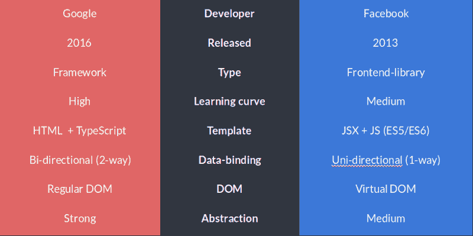
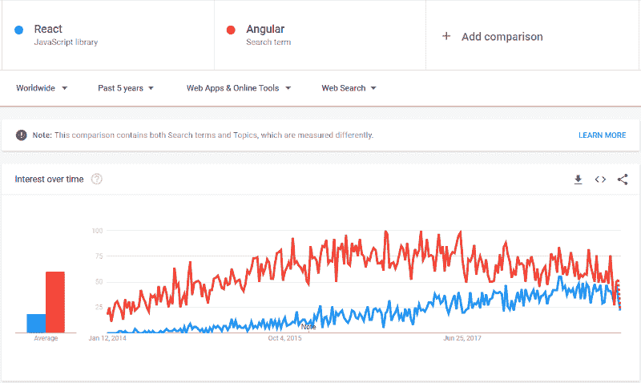
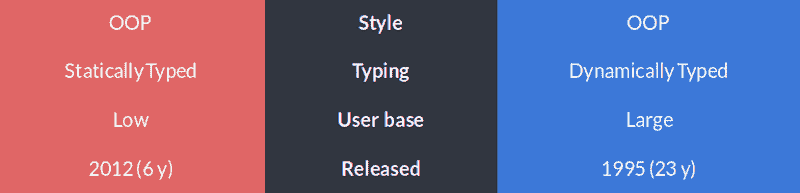
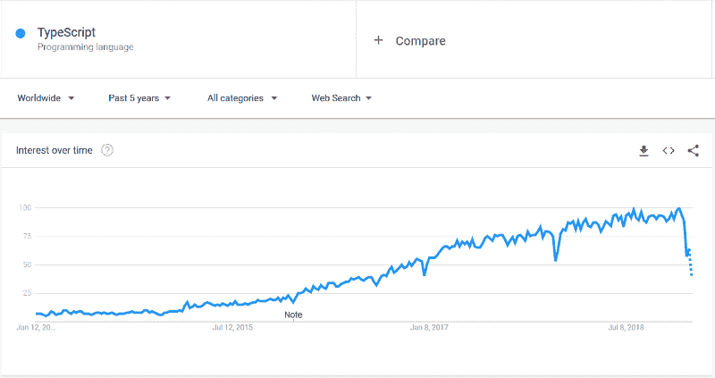
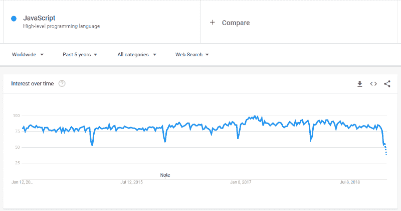
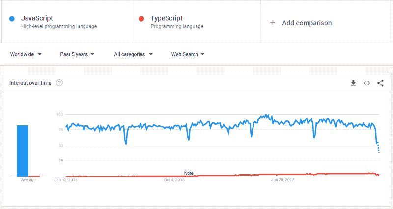
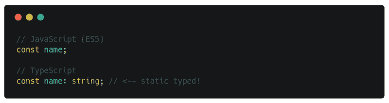
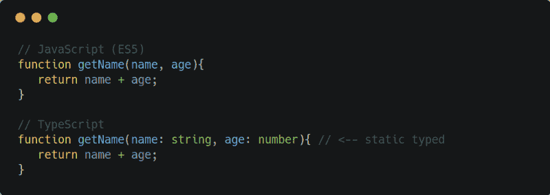
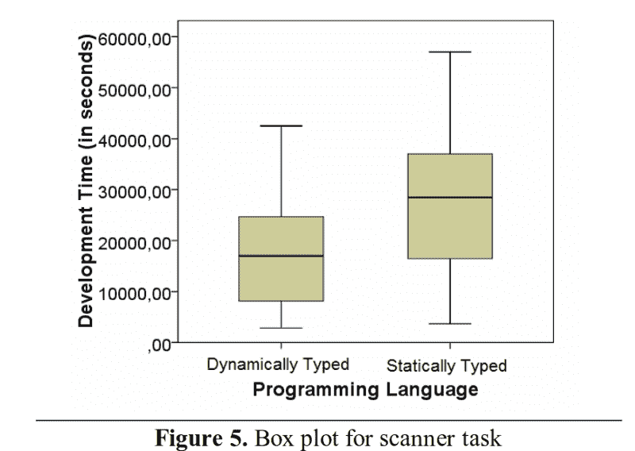
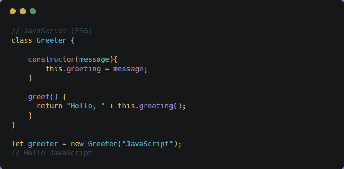

# Angular 和 React 及其核心语言的比较

> 原文：<https://www.freecodecamp.org/news/a-comparison-between-angular-and-react-and-their-core-languages-9de52f485a76/>

在本文中，我们将比较 2019 年最流行的两种 web 技术，并阐述它们的历史、主要差异、推荐的核心语言(TypeScript 和 JavaScript)等。总的来说，这些技术通过将事情分成模块/组件，使得开发人员更容易重用、重构和维护代码。

本文的目标不是找到最好的技术，而是比较、强调和澄清一些误解。我们还会关注什么是重要的，而不是从长远来看并不重要的小细节。

您应该知道，这两种技术之间的比较不可能完全涵盖。Angular 有一个完整的框架(MVC)，而 React 是一个前端库，有许多开源包可以集成。

> 如果你想成为一个更好的 web 开发人员，开创自己的事业，教别人，或者只是提高你的开发技能，订阅我的时事通讯来获得最新的 web 新闻和更新。

### 有待解决的问题

*   Angular 和 React 的主要区别是什么？
*   是什么让 TypeScript 如此特别？
*   这些技术有多受欢迎？
*   目前开源现状如何？
*   公司使用最多的是哪种技术？
*   静态类型语言会影响代码质量和开发时间吗？

未来的部分将根据评论的需求进行添加。

### 关键比较

下面是 Angular(左)和 React(右)之间的快速横向比较。

Angular and React

就性能而言，React 最棒的一点是虚拟 DOM，您可能已经听说过几次了。如果没有，不用担心，我会解释的！

**问题**
假设你想在一个 HTML 标签块中更新一个用户的出生日期。

虚拟 DOM
通过查看以前和当前 HTML 版本之间的差异，它只更新需要的部分。这与 GitHub 在检测文件变化时的操作方式类似。

**常规 DOM**
它会更新 HTML 标签的整个树形结构，直到到达诞生日期。

#### 为什么重要？

对于上述问题来说，这可能无关紧要。然而，如果我们在同一个页面上处理 20–30 个异步数据请求(对于每个页面请求，我们替换整个 HTML 块)，这将影响性能和用户体验。

需要更多上下文吗？查看[戴斯](https://www.freecodecamp.org/news/a-comparison-between-angular-and-react-and-their-core-languages-9de52f485a76/undefined)的[文章！](https://medium.com/@hidace/understanding-reacts-virtual-dom-vs-the-real-dom-68ae29039951)

但是首先，回到开始…

### 历史

我们需要了解一点历史(背景)，因为它提供了对未来事情可能如何发展的洞察力。

> *我不会详细讲述 Angular 和 AngularJS 之间到底发生了什么，我相信有很多可用的资源来覆盖它。但简而言之，Google 用 Angular 取代了 AngularJS，用 TypeScript 取代了 JavaScript。*

好吧，回到 ES4/ES5 时代，JavaScript 的学习曲线非常高。如果你来自 Java、C#或 C++的世界，一个面向对象编程(OOP)的世界，那么学习 JavaScript 就没有那么直观了。换句话说，这是一个痛苦的屁股。

这不是因为语言写得不好，而是因为它有不同的目的。它是为了处理 web 的异步特性而构建的，比如用户交互、事件绑定、过渡/动画等等。这是一种不同的动物，有不同的本能。

### 流行

正如谷歌趋势所揭示的那样，Angular 和 React 是 2019 年最受欢迎的两种 web 技术。

Angular 的搜索命中比 React 多，但这并不一定意味着一个比另一个好。但这表明了人们觉得有趣的东西，不管原因是什么。重要的是要意识到，人们可能会混合使用 AngularJS 或 Angular 等关键词，从而导致更高的搜索命中率。

有一点是肯定的——两种技术都在发展，未来看起来很光明。这意味着您不必担心某项技术会失败，而将您抛在后面。

重要的是，我们不能忽视安古拉和安古拉之间发生的历史，因为历史是未来可能发生的事情的一种表现形式。但是如果你有一些关于棱角的经验，那么你很可能会明白为什么这些决定会变得更好。只是提一下，这样的事情可能发生在任何框架上，包括 React。

Google Trends Angular vs React

#### 开源

React 拥有超过 100，000 颗星，1200 名贡献者和近 300 个有待解决的问题。

React 拥有上市时间优势，因为它比 Angular 早 3 年发布。这意味着它已经面临了许多现实世界的问题，经历了关键的测试，总体上已经发展成为一个适应性强、灵活的前端库，受到许多人的喜爱。

说到 Angular，乍一看，我们可以清楚地看到 Angular 的问题比 React 多 6 倍(不好)。然而，我们不能忘记 Angular 是一个更大的框架，并且也有更少的开发人员使用它(目前)，因为它是在 2016 年发布的。

Angular and React — Github popularity

> 统计数据来自 GitHub 页面的[角度](https://github.com/angular/angular)和[反应](https://github.com/facebook/react)。

### 哪些公司在使用

React 最初是在脸书为脸书开发的，用于优化和简化组件的开发。Chris Cordle 写的一篇文章指出，React 在脸书的使用率高于 Angular 在谷歌的使用率。

那么谁使用哪种技术呢？

#### [#反应](https://github.com/facebook/react/wiki/Sites-Using-React)

*   脸谱网
*   爱彼迎
*   超级的
*   网飞
*   照片墙
*   Whatsapp
*   Dropbox

#### [#角度](https://www.madewithangular.com/categories/angular)

*   Eat24
*   CVS 商店
*   一个足球
*   谷歌快递
*   美国篮球职业联盟
*   三角洲
*   wix.com

> *如果您知道有大型(知名)公司使用 Angular，请通过链接分享。*

### 类型脚本和 JavaScript (ES6+)

正如我提到的，只比较角度和反应，而不关注每个人强调的核心语言(根据他们的文件)，可能会产生误导。

> 注意！本节的目的不是决定我们是选择角度还是反应。但是澄清了静态类型语言和动态类型语言之间的一些误解，这些误解已经持续了一段时间，并得到了研究的支持。

TypeScript (left) vs JavaScript (right)

从用户基础来说，JavaScript 更胜一筹。但是 TypeScript 正在快速增长，所以谁知道 10-15 年会带来什么。

#### 过去 5 年打字稿的受欢迎程度

Google Trends — TypeScript popularity

#### JavaScript 在过去 5 年中的流行程度

Google Trends —JavaScript popularity

#### JavaScript 与 TypeScript 在过去 5 年中的流行程度

Google trends — TypeScript and JavaScript popularity

TypeScript 最初是由微软开发的，目的是让 JavaScript 更简单(换句话说，是让 ES5 更简单)。2012 年 10 月发布。它只是一个 transpiler，将 TypeScript 编译成 JavaScript 代码，这也意味着您可以在 TypeScript 文件中编写 ES5 代码。TypeScript 被称为 JavaScript 的超集。

一般来说，TypeScript 为具有面向对象编程(OOP)背景的程序员提供了一个平稳的过渡。需要注意的是，TypeScript 是在 ES5 时期发布的，在那个时期，ES5 还不是基于类的 OOP 语言。

简而言之，那时最接近类和对象的方法是通过原型继承。正如我们所知，对于大多数有 OOP 背景的开发人员来说，这是一个困难的转变。所以最理想的决定当然是选择你觉得舒服和熟悉的东西，很可能是打字稿。

然而，在过去的几年里，JavaScript 已经发展并实现了许多巨大的变化，如模块、类、扩展操作符、箭头函数、模板文字等等。总的来说，它允许开发人员编写声明性代码，同时支持真正 OOP 语言的特征(即包括基于类的结构)。

#### 静态和动态类型的语言

静态类型语言基本上意味着你可以定义变量类型(字符串、数字或数组等)。你可能会问为什么这很重要。这是我设置的一个真实世界的类比(创造力处于最佳状态)。

假设你想给你的车加油。重要的一点是使用正确的汽油或柴油。如果你不知道，你可能需要买一辆新车。

当然，严重性不像编码，但是，在某些情况下，它可能是。想想吧。如果您使用一个大型应用程序，您会希望知道传递的参数和属性类型，否则您可能会破坏代码。

好吧，如果你仍然不明白静态类型的意思，看看这个:

#### 静态类型属性

Static typed property comparison between JavaScript and TypeScript

#### 静态类型参数

Static typed argument comparison between JavaScript and TypeScript

我了解到很多人认为静态类型语言意味着可靠的代码，并且经常被用作胜过动态类型语言的有力论据。坦率地说，很难否定这种说法，因为它从根本上依赖于开发环境、程序员经验，当然还有项目需求。

很幸运，[研究](https://courses.cs.washington.edu/courses/cse590n/10au/hanenberg-oopsla2010.pdf)(TL；T2 博士很重视这个问题，用 49 名受试者测试了这个流言。

#### 这项研究的观察结果是:

*   静态类型语言需要更多的时间来修复打字错误
*   动态类型的语言可读性更好，也更容易编写(声明性代码)

图 5 显示，平均而言，开发人员在编写动态类型语言时，开发时间减少了一半。

如果你想更深入地了解这个话题，我建议你阅读 Eric Elliott 的文章，这篇文章指出你可能不需要类型脚本(或者静态类型语言)。

#### 选择什么

所以问题不仅在于 Angular 或 React 提供了什么，还在于你应该花时间在什么核心语言上。只要您选择适合您的需求和复杂性的东西，这并不重要。

如果您不喜欢类型，那么在 TypeScript 中编写 ES6 代码没有任何障碍。只是如果你需要它，它就在那里。

但是如果你用 Angular 构建一个相当大的前端应用程序来处理许多 HTTP 请求，那么拥有类型确实有助于解决诸如“这是什么类型的对象，我可以使用什么字段，这个字段是什么类型的”等问题。它非常适合协作和澄清小事情。

下面是 TS 和 JS (ES6)的一个简单的类对象比较。

TypeScript

JavaScript (ES6)

#### 国际海事组织；依我之见

静态类型给人的感觉是结构化的、安全的、可读的，并且易于与他人协作(防止人们传递意外的值)。然而，当使用动态类型时，我有灵活性和创造力，可以更专注于创造，而不是过多地考虑类型、接口和泛型等等。

从我过去开发的 web 应用程序来看，没有静态类型，我真的没有遇到任何大问题。这并不意味着我不喜欢它——我只是说我不需要它，但也许将来我会需要它。

这里有一个更新——目前我正与几个微软开发人员一起使用 Angular framework 构建一个应用程序。我们选择 Angular 的原因是因为大多数包都已经定义好了，所有的文档都在一个地方。它还强调了 TypeScript，这是一个完美的选择，因为大多数开发人员已经有了很多面向对象编程的经验。

另一方面，我看到了我们正在使用 React 构建的类似应用程序。所以总的来说，两者都是强大的工具，并且主要取决于你如何设置架构。

### 外卖笔记

*   TypeScript 只是一个 transpiler，它可以与 React 或任何其他 JS 框架一起使用
*   React 有效地处理内存管理(虚拟 DOM)
*   React 使用 JavaScript (ES6)，这是一种自 1995 年以来就被认可的网络语言
*   Angular 使用 2012 年发布的 TypeScript
*   静态类型语言很棒，但不是必须的
*   动态类型语言需要更少的编写时间和更大的灵活性来发挥创造力
*   学习静态类型的语言可能是一个挑战，尤其是如果你只使用过动态类型的语言
*   ES6 已经实现了很多很棒的特性，比如模块、类、扩展操作符、箭头函数、模板文字，允许你写更少、更干净、更结构化的代码(语法糖)
*   TS 是简单的 ES6+,有类型和更多

### 结论

你选择的框架/组件库可能会影响你花在编程上的时间和预算。如果你有一个由 C#、Java 或 C++开发人员组成的团队，那么我可能会选择 Angular，因为 TypeScript 与这些语言有许多相似之处。

我能提供的最佳建议是在 Angular 和 React 中设置一个基本应用程序，然后在做出决定之前评估语言和工作流程。

如前所述，这两种技术都有各自的优点和相似之处，这实际上可以归结为**应用程序提供什么类型的需求、复杂性以及开发人员的经验水平。**

这里是我写的几篇关于网络生态系统的文章，以及个人编程技巧和诀窍。

*   [混乱的头脑导致混乱的代码](https://medium.freecodecamp.org/a-chaotic-mind-leads-to-chaotic-code-e7d6962777c0)
*   [不断想学习新事物的开发人员](https://codeburst.io/developers-that-constantly-want-to-learn-new-things-heres-a-tip-7a16e42302e4)
*   [ES6 模块实用指南](https://medium.freecodecamp.org/how-to-use-es6-modules-and-why-theyre-important-a9b20b480773)
*   [了解这些核心网络概念](https://medium.freecodecamp.org/learn-these-core-javascript-concepts-in-just-a-few-minutes-f7a16f42c1b0?gi=6274e9c4d599)
*   [用这些重要的 JavaScript 方法提升你的技能](https://medium.freecodecamp.org/7-javascript-methods-that-will-boost-your-skills-in-less-than-8-minutes-4cc4c3dca03f)
*   [通过创建自定义 bash 命令加快编程速度](https://codeburst.io/learn-how-to-create-custom-bash-commands-in-less-than-4-minutes-6d4ceadd9590)

你可以在我每周发表文章的媒体上找到我。或者你可以在 Twitter 上关注我，在那里我会发布相关的 web 开发技巧和窍门以及个人故事。

另外，如果你喜欢这篇文章，还想看更多，请为❤鼓掌，并与可能需要它的朋友分享，这是善缘。