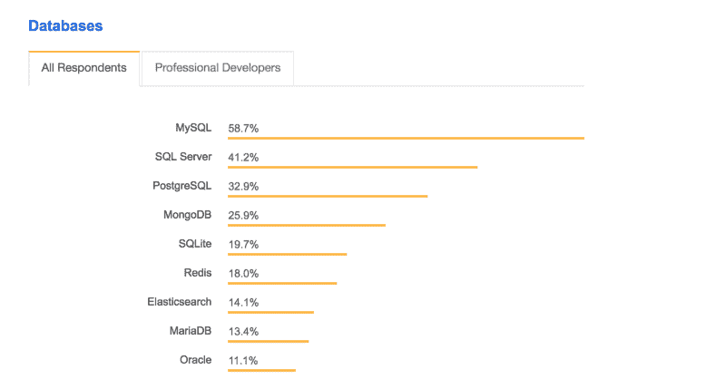
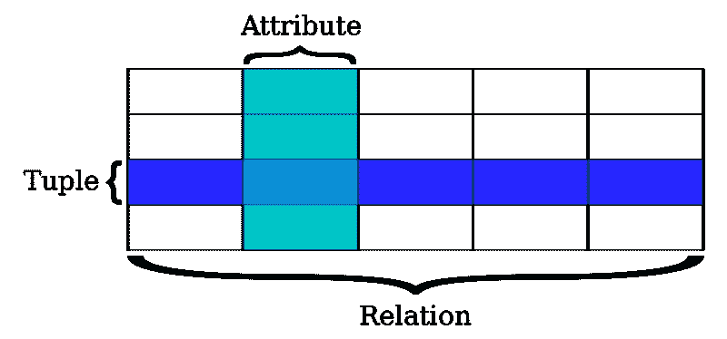
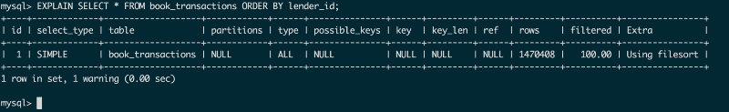

# 如何最佳地使用关系数据库

> 原文：<https://www.freecodecamp.org/news/how-to-work-optimally-with-relational-databases-627073f82d56/>

无论是处理少量数据还是处理数百万行数据，关系数据库都能平稳地处理数据。我们将研究如何根据我们的需要使用关系数据库，并充分利用它们。

由于 MySQL 的可伸缩性，它已经成为从小型到大型企业公司的流行选择。同样，PostgreSQL 也越来越受欢迎。



Photo source: [https://insights.stackoverflow.com/survey/2018/](https://insights.stackoverflow.com/survey/2018/)

> 根据 [Stack Overflow survey 2018](https://insights.stackoverflow.com/survey/2018/) ，MySQL 是所有用户中最受欢迎的数据库。

下面描述的例子使用 InnoDB 作为 MySQL 引擎。这些不仅限于 MySQL，还与其他关系数据库相关，如 PostgreSQL。所有基准测试都是在一台配备 8GB RAM 和 i5 2.7 GHz 处理器的计算机上完成的。

让我们从关系数据库如何存储数据的基础开始。

### 理解关系数据库

#### 储存；储备

MySQL 是一个关系数据库，其中所有的**数据**都以元组的形式表示，并分组为**关系**。元组由其属性来表示。



Image source: [https://commons.wikimedia.org/wiki/File:Relational_database_terms.svg](https://commons.wikimedia.org/wiki/File:Relational_database_terms.svg)

假设我们有一个人们可以借书的应用程序。我们需要存储所有图书借阅交易。为了存储它们，我们用以下命令设计了一个简单的关系表:

```
> CREATE TABLE book_transactions ( id INTEGER NOT NULL   AUTO_INCREMENT, book_id INTEGER, borrower_id INTEGER, lender_id INTEGER, return_date DATE, PRIMARY KEY (id));
```

该表看起来像:

```
book_transactions
------------------------------------------------
id  borrower_id  lender_id  book_id  return_date
```

这里 **id** 是主键，**借方 _id** ，**贷方 _id** ， **book_id** 是外键。在我们启动应用程序后，记录的交易很少:

```
book_transactions
------------------------------------------------
id  borrower_id  lender_id  book_id  return_date
------------------------------------------------
1   1            1          1        2018-01-13
2   2            3          2        2018-01-13
3   1            2          1        2018-01-13
```

#### 获取数据

我们为每个用户提供了一个仪表板页面，他们可以在这里看到他们的图书租赁交易。因此，让我们为一个用户获取图书交易:

```
> SELECT * FROM book_transactions WHERE borrower_id = 1;
book_transactions
------------------------------------------------
id  borrower_id  lender_id  book_id  return_date
------------------------------------------------
1   1            1          1        2018-01-13
2   1            2          1        2018-01-13
```

这将按顺序扫描关系，并为用户提供数据。这似乎很快，因为在我们的关系中很少有数据。要查看查询执行的确切时间，**通过执行以下命令将分析**设置为真:

```
> set profiling=1;
```

一旦设置了概要分析，再次运行查询并使用下面的命令查看**执行时间:**

```
> show profiles;
```

这将返回我们执行的查询的持续时间。

```
Query_ID | Duration   | Query
       1 | 0.00254000 | SELECT * FROM book_transactions ...
```

执行力似乎很好。

慢慢地，book_transactions 表开始被数据填满，因为有很多事务正在进行。

### 问题是

这增加了我们关系中的**元组**的数量。这样，为用户获取图书交易所需的时间将开始变长。MySQL 需要遍历所有的元组来找到结果。

为了向该表中插入大量数据，我编写了以下存储过程:

```
DELIMITER //
 CREATE PROCEDURE InsertALot()
   BEGIN
   DECLARE i INT DEFAULT 1;
   WHILE (i <= 100000) DO
    INSERT INTO book_transactions (borrower_id, lender_id, book_id,   return_date) VALUES ((FLOOR(1 + RAND() * 60)), (FLOOR(1 + RAND() * 60)), (FLOOR(1 + RAND() * 60)), CURDATE());
    SET i = i+1;
   END WHILE;
 END //
 DELIMITER ;
* It took around 7 minutes to insert 1.5 million data
```

这将在我们的表 book_transactions 中插入 100，000 条随机记录。运行此程序后，概要分析器显示运行时间略有增加:

```
Query_ID | Duration   | Query
       1 | 0.07151000 | SELECT * FROM book_transactions ...
```

让我们添加一些运行上述过程的数据，看看会发生什么。随着添加的数据越来越多，查询的持续时间也会增加。随着 150 万个数据被插入到表中，获得相同查询的响应时间现在增加了。

```
Query_ID | Duration   | Query
       1 | 0.36795200 | SELECT * FROM book_transactions ...
```

这只是一个涉及整数字段的简单查询。

随着复合查询、顺序查询和计数查询的增多，执行时间会变得更长。

对于单个查询来说，这似乎不是很长的时间，但是当我们每分钟都有数千甚至数百万个查询运行时，这就有很大的不同了。

将会有更多的等待时间，这将会影响应用程序的整体性能。相同查询的执行时间从 2 毫秒增加到 370 毫秒。

### 恢复速度

#### 索引

MySQL 和其他数据库提供索引，这种数据结构有助于更快地检索数据。

MySQL 中有不同类型的索引:

*   **主键** —添加到主键的索引。默认情况下，主键总是被索引。它还确保两行没有相同的主键值。
*   **唯一—** 唯一键索引确保关系中没有两行具有相同的值。一个唯一的索引可以存储多个空值。
*   **索引—** 除主键以外的任何其他字段的附加项。
*   **全文—** 全文索引有助于基于字符的数据查询。

索引主要有两种存储方式:

**哈希** —这主要用于精确匹配(=)，不适用于比较(≥，≤)

**B 树** —这是存储上述索引类型的最常见方式。

MySQL 使用 B 树作为默认的索引格式。数据存储在[二叉树](https://en.wikipedia.org/wiki/Binary_tree)中，这使得数据检索更快。


B-Tree data storage format

B 树完成的数据组织有助于跳过对我们关系中所有元组的全表扫描。

上述 B 树中共有 16 个节点。假设我们需要找到数字 6。我们只需要总共进行 3 次扫描就可以得到这个数字。这有助于提高搜索的性能。

因此，为了提高 book_transactions 关系的性能，让我们在字段 lender_id 上添加索引。

```
> CREATE INDEX lenderId ON book_transactions(lender_id)
----------------------------------------------------
* It took around 6.18sec Adding this index
```

上面的命令在 lender_id 字段上添加了一个索引。让我们通过再次运行相同的查询，来看看这对我们拥有的 150 万个数据的性能有何影响。

```
> SELECT * FROM book_transactions WHERE lender_id = 1;
Query_ID | Duration   | Query
       1 | 0.00787600 | SELECT * FROM book_transactions ...
```

呜哇！我们现在回来了。

这和我们关系中只有 3 个记录时一样快。添加正确的索引后，我们可以看到性能的显著提高。

#### 综合指数和单一指数

我们添加的索引是单字段索引。还可以将索引添加到复合字段中。

如果我们的查询涉及多个字段，复合索引会对我们有所帮助。我们可以使用以下命令添加复合索引:

```
> CREATE INDEX lenderReturnDate ON book_transactions(lender_id, return_date);
```

#### 指数的其他用途

查询不是索引的唯一用途。它们也可以用于 ORDER BY 子句的**。让我们根据贷方 id 对记录进行排序。**

```
> SELECT * FROM book_transactions ORDER BY lender_id;
1517185 rows in set (4.08 sec)
```

**4.08** **秒**，真多！那么是哪里出了问题呢？我们已经有了索引。让我们在**解释**子句的帮助下，深入探究查询是如何执行的。

#### 使用解释

我们可以添加一个 explain 子句来查看查询将如何在我们当前的数据集中执行。

```
> EXPLAIN SELECT * FROM book_transactions ORDER BY lender_id; 
```

其输出如下所示:



Using explain to see how the query will be executed

有各种字段[解释](https://dev.mysql.com/doc/refman/5.5/en/explain.html)返回。让我们看看上面的表格，找出问题所在。

**行:**将被扫描的总行数

**已过滤:**将被扫描以获取数据的行的百分比

**类型:**如果索引被使用，则给出。全部意味着它没有使用索引

**possible_keys，key，key_len** 都为空，这意味着没有使用任何索引。

那么为什么查询不使用 index 呢？

这是因为我们的查询中有`select *`，这意味着我们从我们的关系中选择所有的字段。

索引只包含被索引字段的信息，不包含其他字段的信息。这意味着 MySQL 将需要再次到主表获取数据。

那么我们应该如何编写查询呢？

#### 仅选择必填字段

为了消除到主表进行查询的需要，我们需要只选择索引表中存在的值。因此，让我们更改查询:

```
> SELECT lender_id FROM book_transactions ORDER BY lender_id; 
```

这将在 0.46 秒内返回结果，这要快得多。但仍有改进的余地。

因为这个查询是在我们拥有的 150 万条记录上完成的，所以需要多花一点时间，因为它需要将数据加载到内存中。

#### 使用限制

我们可能不需要同时拥有 150 万条数据。因此，与获取所有数据相比，使用 LIMIT 并批量获取数据是一种更好的方法。

```
> SELECT lender_id
  FROM book_transactions
  ORDER BY lender_id LIMIT 1000;
```

有了限制，现在响应时间大大提高，执行时间为 0.0025 秒。现在我们可以用**偏移量获取下一批。**

```
> SELECT lender_id
  FROM book_transactions
  ORDER BY lender_id LIMIT 1000 OFFSET 1000;
```

这将获取下一个 1000 行批次。这样我们就可以增加偏移量和限制来获得所有的数据。但是有一个“抓到你了”！随着偏移量的增加，查询的性能会降低。

这是因为 MySQL 将扫描所有数据以到达偏移点。所以最好不要用更高的偏移量。

#### 计数查询呢？

InnoDB engine 具有并发写入的能力。这使得它具有高度的可伸缩性，并提高了每秒的吞吐量。

但这是有代价的。InnoDB 无法为任何表中的记录数添加缓存计数器。因此，计数必须通过扫描所有过滤数据来实时完成。这使得计数查询很慢。

因此，对于大量数据，建议从应用程序逻辑计算汇总计数数据。

### 为什么不对所有字段添加索引呢？

添加索引有助于提高性能，但也有代价。应该有效利用。向更多字段添加索引存在以下问题:

*   需要大量内存，更大的机器
*   当我们删除时，有一个重新索引(CPU 密集型和较慢的删除)
*   当我们添加任何东西时，都会有重新索引(CPU 密集型和较慢的插入)
*   更新不进行完全重新索引，因此更新速度更快，CPU 效率更高。

我们现在清楚了，增加一个索引很有帮助。但是我们不能选择所有的数据，除了为快速性能而索引的数据。

那么，我们如何选择所有的属性，并仍然获得快速的性能呢？

### 分割

当我们构建索引时，我们只有关于被索引的字段的信息。但是我们没有索引中没有的字段的数据。

因此，正如我们前面所说的，MySQL 需要回头查看主表来获取其他字段的数据。这可能会降低执行时间。

我们可以通过使用分区来解决这个问题。

分区是一种技术，在这种技术中，MySQL 将一个表的数据分成多个表，但仍然作为一个表来管理。

在表中进行任何类型的操作时，我们都需要指定正在使用哪个分区。随着数据被分解，MySQL 可以查询的数据集变小了。根据需求确定正确的分区是实现高性能的关键。

但是如果我们还在用同一台机器，它会扩展吗？

### 分片

对于庞大的数据集，将所有数据存储在同一台机器上会很麻烦。

一个特定分区可能很重，需要更多的查询，而其他分区则不那么重。所以一个会影响另一个。它们不能单独扩展。

假设最近三个月的数据使用最多，而旧的数据使用较少。也许最近的数据大部分是被更新/创建的，而旧数据大部分只是曾经被读取过。

为了解决这个问题，我们可以将最近三个月的分区移动到另一台机器上。分片是我们将一个大数据集分成较小的块，并转移到单独的 RDBMS 的一种方式。换句话说，分片也可以称为“水平分区”。

关系数据库能够随着应用程序的增长而扩展。找到正确的索引并根据需要调整基础设施是必要的。

* * *

也发表在 Milap Neupane 博客上:[如何以最佳方式使用关系数据库](https://milapneupane.com.np/2019/07/06/how-to-work-optimally-with-relational-databases/)