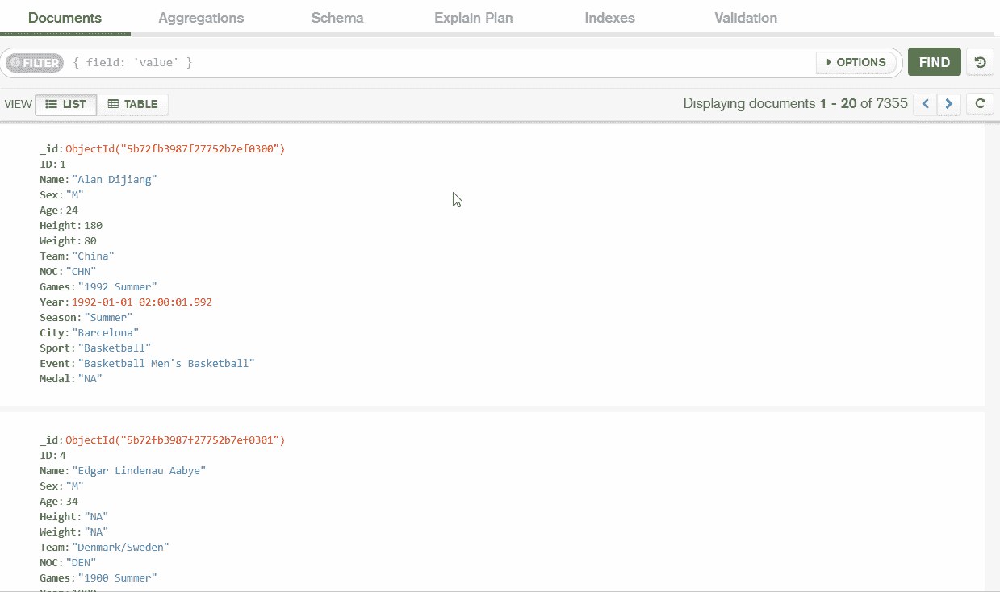
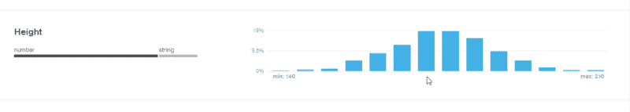
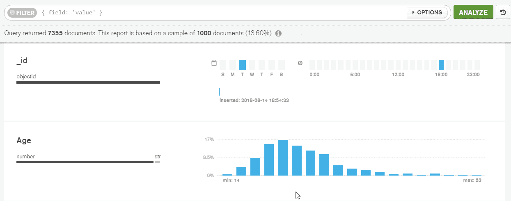
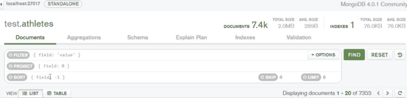
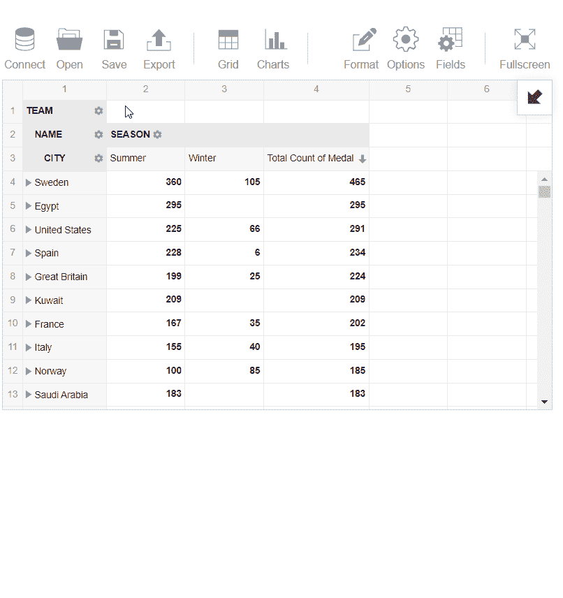
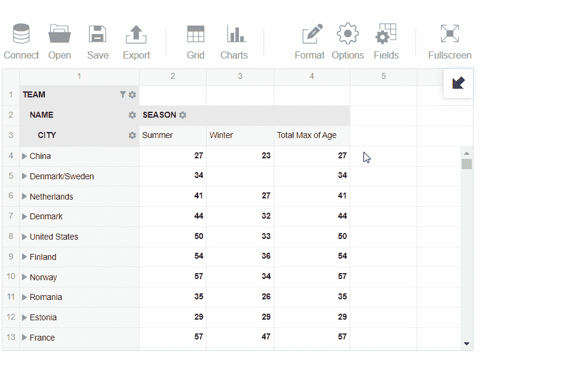
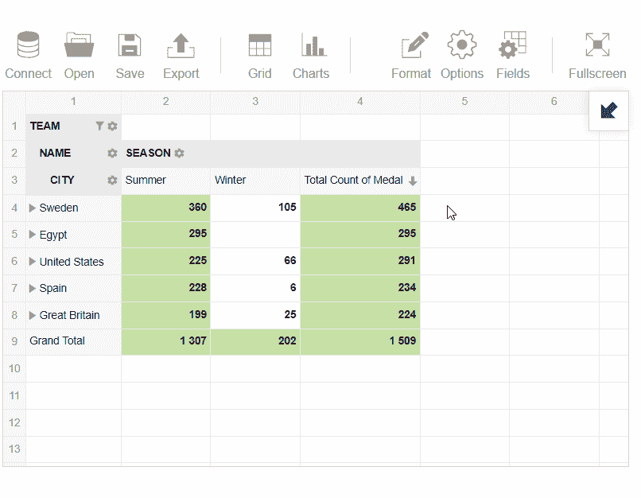

# MongoDB 数据可视化的强大工具

> 原文：<https://www.freecodecamp.org/news/mongodb-data-visualization-tools-565000c7309/>

有了无数的可视化工具，很难找到适合 MongoDB 数据的现成功能。

今天，我想告诉你我在探索这种可视化工具方面的经验。

我的目标是分析来自 MongoDB 数据库的数据集。我想为数据分析制定一个工作流程，它结合了数据库管理分析、数据聚合和数据可视化。

以下是我选择的工具:

*   [Compass](https://www.mongodb.com/products/compass/?r=m3) 是一个 GUI 应用程序，用于深入分析和可视化 MongoDB 数据和集合模式。它提供了数据的实时视图。直观的界面帮助我专注于数据的意义。
*   [Flexmonster 数据透视表](https://www.flexmonster.com/?r=m3)是一款用于高级 web 报告和分析的工具。虽然 Compass 是一个独立的应用程序，但我发现 Flexmonster 直接集成到了 web 项目中。我已经设法将它嵌入到我的 Angular 4 应用程序中，并用于数据分析。

可视化过程的第一部分是用 Compass 建立到 MongoDB 数据库的连接。然后，您可以探索 Compass 提供了哪些功能，以及使用该工具可以进行哪些分析。

第二部分致力于进一步的 MongoDB 数据分析。我们将把数据加载到一个数据透视表中，并探索它提供的可能性。

作为我研究的数据源**，**，我选择了一个关于 120 年奥运历史和结果的[数据集。](https://www.kaggle.com/heesoo37/120-years-of-olympic-history-athletes-and-results/?r=m3)

这个数据集有一个典型的 JSON 结构，它不同于 MongoDB 所要求的格式。为了将它导入 MongoDB，我在 CLI 中执行了以下命令:

```
mongoimport - db <db-name> - collection athletes - type json - file athletes.json
 - jsonArray
```

### 使用 Compass 了解数据

首先，我将提到一些数据库管理特性。

Compass 能够生成直方图来表示数据频率。这有助于我分析文档的存在、数据类型以及集合中特定字段的值的分布。

首先，我使用 Compass 应用程序连接到运行在 localhost 上的 MongoDB 实例。

在“运动员”集合的主页上，我检查了关于集合的信息，以交互模式编辑了数据，并尝试了简单和复杂的查询。

一个模式可视化工具帮助我理解我的数据。



这里我检查了字段数据类型的统计数据:集合中所有文档中用于该字段的数据类型的百分比。

我发现我在一些字段中使用了混合数据类型。在我的例子中，我在 80%的文档中使用数字类型的‘Height’*，但是在 20%的情况下使用字符串类型。*

**

*对我来说，这意味着我的数据集中有一个缺口。运动员之间存储的身高不同。*

### *用指南针聚合*

*是什么特性让 MongoDB 和 Compass 在经常处理半结构化和非结构化数据的数据分析师中如此受欢迎？*

*MongoDB 对于实时分析很有用，因为它支持聚合管道。这些可以包括排序和过滤操作，以及对数据进行分组。*

*而 Compass 支持聚合的实时查询构建。*

*为了关注数据的特定部分，我按“年龄”字段过滤了文档。*

*为了只显示 22 岁以下的运动员，我在直方图上选择了必要的区域来构建对“年龄”字段的查询。因此，匹配的文档已被退回。*

**

*同样，我也根据值的范围进行了过滤。然后我将数据按“年龄”升序排列:*

**

*但是为了在聚合管道中构建阶段并对数据进行分组，我需要使用我的 MongoDB 查询语言知识。在数据透视表中更容易做到。*

### *使用 Flexmonster 数据透视表分析数据*

*在我的网络项目中，我使用角度。于是，我跟着一个[角度教程](https://www.flexmonster.com/doc/integration-with-angular/?r=m3)嵌入了透视表。为了从我的数据库中获取数据，我使用了[这个教程](https://www.flexmonster.com/doc/connecting-to-database-with-node-js/?r=m3)。*

*我已经从我的应用程序连接到 MongoDB，并检索了关于运动员的数据。数据被压缩，然后传递到数据透视表进行可视化。*

*在将运动员的样本数据加载到数据透视表之后，我想分析运动员的最小和最大年龄。此外，我想根据他们的奖牌总数来定义历史上最好的球队。*

*为了开始数据分析，我选择了字段到列和行。*

*为了使用“Medal”字段，我选择了它来度量并获得了以下结果:*

1.  *按价值筛选记录，以显示奖牌数量最多的前 5 支队伍*
2.  *在我的报告中应用了条件格式来突出显示奖牌数超过 185 枚的队伍。*

**

*3.接下来，我选择了“年龄”并分析了运动员的最大年龄:*

**

*4.然后，我切换到数据透视表，以更直观的方式分析数据，以了解夏季最佳球队:*

**

### *结论*

*所以，今天我分享了我使用 Compass 和 Flexmonster 透视表的经验。在我看来，这两种工具都能够帮助制作一个有创意的视觉故事，并以一种聪明的方式分析数据。*

*我真心希望阅读我的经验对您有所帮助，现在您已经走上了成功进行 MongoDB 数据分析的正确道路。*

*我很高兴听到任何关于这个概述的反馈。请在评论中给出你的看法。有哪些 **MongoDB 数据可视化**的工具可以推荐？他们能很好地处理你的数据吗？*