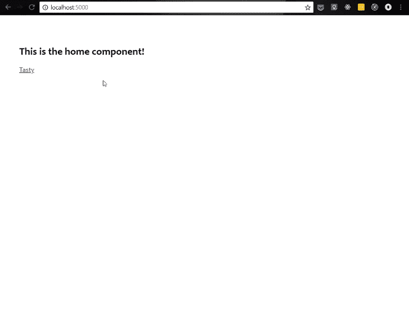
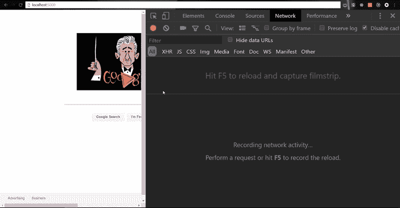
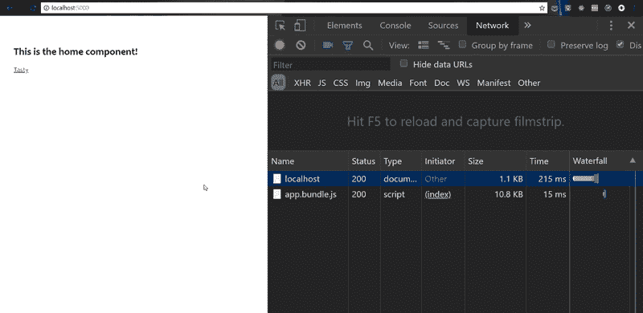
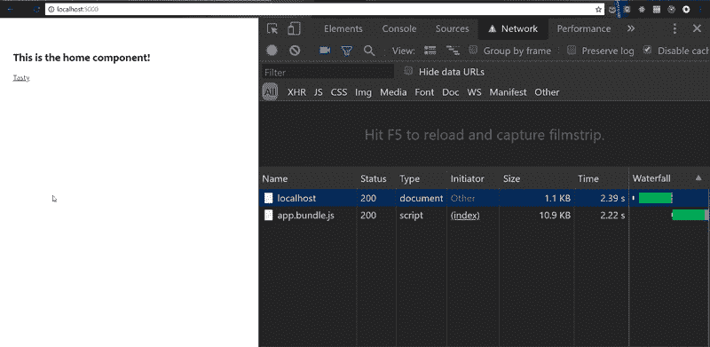

# 通过示例学习 Webpack:普通 JavaScript 应用程序中的简单代码分割

> 原文：<https://www.freecodecamp.org/news/learn-webpack-by-example-simple-code-splitting-in-a-vanilla-javascript-app-b366798336a4/>

作者卡拉劳·坎特雷尔

# 通过示例学习 Webpack:普通 JavaScript 应用程序中的简单代码分割

#### 使用 webpack 4 和动态导入


A tasty split

本文是通过各种例子学习 Webpack 的阶段性指南的一部分。如果你需要复习一下 Webpack 的**加载器**和**插件**是什么，或者一个基本的`webpack.config.js`文件是什么样的，请查看我写的这篇文章中的[部分，这篇文章关注的是这些基础知识。](https://medium.freecodecamp.org/learn-webpack-by-example-blurred-placeholder-images-4ad8b1751709)

如果你像我一样，你以前听说过“代码分解”这个术语，并且读过一些关于它的文章。但是也许你会不断地看到关于如何用这个或那个框架来实现它的帖子，而不是解释它的用途，以及一个显示这个目的的基本例子。

尽管我高度重视框架以及它们给编码带来的速度和结构，尤其是在团队内部，但我也重视尽可能深入地理解编程概念。

这通常意味着，如果我试图学习一个新的概念，我会试图将这个概念分解成更小的子概念，然后在将它们整合在一起之前单独研究每个子概念。

举一个非编程的例子，如果我想学习长板，我会在担心走得快、变戏法或定制长板设置之前，重点关注站在长板上保持平衡。

因此，为了学习代码分割，我决定要做一个尽可能小而简单的应用程序，对我来说，这意味着没有框架，没有花哨的东西。

### 应用概述

我想分享我制作的小应用程序，它帮助我探索用 Webpack 进行代码拆分。我希望它也能帮助你更好地理解这个话题。我们要做的就是制作一个单页应用程序，如下图所示。



A tasty route

如果你想在你的代码编辑器中继续，检查一下[这个 repo](https://github.com/klcantrell/webpack-through-example-blog) 的`code-split`分支中的代码。一旦你安装了包，`npm start`将为你运行一个开发服务器，如果你想看看代码分割的效果。

我们的应用有两条路线——一条是用户开始的**回家**路线，另一条是**美味**路线。**回家**路线的视图非常基本——只有一个标题和一个到**美味**路线的链接。

然而，对美味的 T1 路线的看法却远不止于此。它的特色是用 SVG 制作了一个令人愉快的甜甜圈动画，以及所有的标记和 CSS。与我们的**家**路线相比，这是很多代码。附注:感谢[本·维瑟](https://codepen.io/benvisser/)创作这部动画。

让用户立即下载*所有*该应用程序的代码，包括**美味**路线的代码及其动画，这有意义吗？除非你对导致缓慢的初始加载时间和挫败感感兴趣，更不用说担心如果用户在你的应用程序加载前停留会错过什么；).所以，让我们想想如何对这东西进行代码分解。

然而，首先是应用程序背后的代码的高级概述。这个应用程序是用普通的 JS 编写的。我只使用了一个外部库`[navigo](https://www.npmjs.com/package/navigo)`，来处理我们的客户端路由。我们来看一下`index.js`文件:

下面是`App`模块的功能:

这里有一个 UI 组件的例子，我们的`Home`组件:

### 没有代码分割

如果没有代码分割，当你的用户开始加载你的应用时，你会给他们发送一大堆代码。让我们通过查看这里没有代码分割的包的大小来建立一个基线。

你可以在下图中看到，我们的 bundle 的大小是 **22.8K** 。虽然与世界上真正的应用程序相比，这不是很大，但我们假设这是为了学习。



### 使用动态导入进行代码拆分

现在让我们开始代码分解吧！请记住，我们想要做的是让用户不必下载渲染**美味**路线所需的代码，直到需要为止。

为了实现这一点，我们将使用 JavaScript 的一个特性，叫做**动态导入**。尽管 ECMAScript 规范中还没有这个特性，但是 Webpack 和 Babel 允许我们现在使用它。

动态导入允许我们异步获取模块。它回报一个承诺。在 promise 回调中，我们可以指定在模块加载后如何处理它。动态导入的语法如下所示:

```
import('./path/to/module')
```

当 Webpack 看到这样的动态导入时，它不会将导入的模块捆绑到当前的包中。相反，它将包分成两个更小的块。

当前块可能是同步加载的(就像我们的初始页面加载)，但是我们的动态导入所导入的模块是异步加载的。在我们的例子中，当用户访问这条路线时，加载了用于**美味**路线的模块。

为了访问动态导入特性，我们需要在我们的构建过程中`npm install`几个巴别塔包:`babel-core`、`babel-loader`和`babel-plugin-syntax-dynamic-import`是绝对需要的。

根据你使用的浏览器，你可能不需要`babel-preset-env`(也就是说，当前版本的 Chrome 支持我们正在使用的所有其他 JavaScript 语法)，但为了更好的衡量，我们还是要得到它。

然后，我们为 Babel 配置 Webpack:

最后，我们可以编写我们的动态导入:

这段代码是这样说的:当触发**美味的**路线时，首先获取`Tasty`组件。然后，一旦它完成加载，就将其呈现到页面上。

让我们看看这对我们有什么帮助。在下图中，你可以看到初始页面加载现在下载了一个 10.8K 的包，而不是 22.8K 的**——好多了！然后，当用户点击进入**美味**路线时，另一个 **13.6K** 的捆绑组块被下载。**



Webpack 会自动命名这些块——如果你想控制它，可以查看 webpack 文档的本节。

### UX 改进

我们为用户节省了额外的时间来等待页面的初始加载，这很好。但是，你能猜到如果用户在一个超慢的连接上试图加载**美味**路线会发生什么吗？

按照我们目前的设置方式，页面会一直挂在那里，直到`Tasty`模块完全加载。这几分钟的挂起可能会让用户怀疑我们的应用程序是否还在工作。

让我们通过给用户一些信号来改善这种体验，当他们等待时，我们的应用程序正在做一些事情:

现在，我们的应用程序将在`Tasty`组件加载时显示一个加载微调器。虽然这可能会增加我们的初始包的大小，但它会在用户等待的时候给用户一个提示。

这种权衡用一些性能换取了更好的用户体验——找到平衡才是最重要的！



### 结论和进一步阅读

我希望这个例子能够简单地描述代码拆分的好处，以及如何使用 Webpack 这样的工具来帮助您实现这一点。

我还希望它表明代码分割并不是一种仅对某些框架有用的技术。事实上，普通的 JS 应用程序可以利用代码分割，甚至那些大部分由服务器呈现但到处嵌入了交互式小部件的应用程序也可以利用这种技术。

如果您想更深入地了解 webpack 允许您做的一些粒度代码分割，请查看 webpack 4 附带的`[optimization.splitChunks](https://webpack.js.org/plugins/split-chunks-plugin/)`插件。

如果这对你有所帮助，请鼓掌，如果有任何问题，请在下面评论，并随时在 Twitter 上向[我](https://twitter.com/kalalaucantrell)问好。