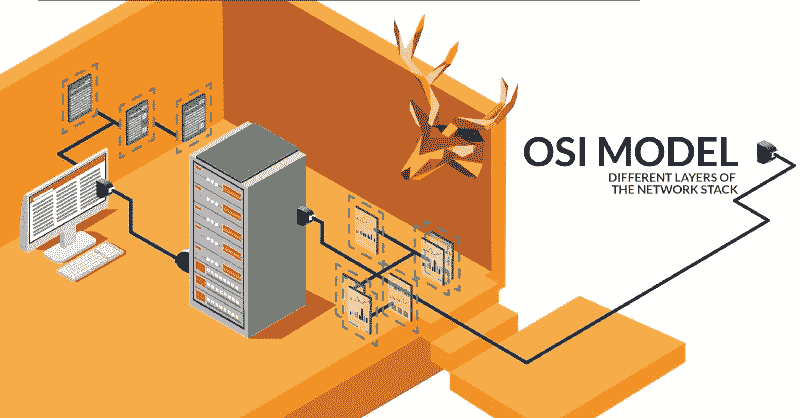
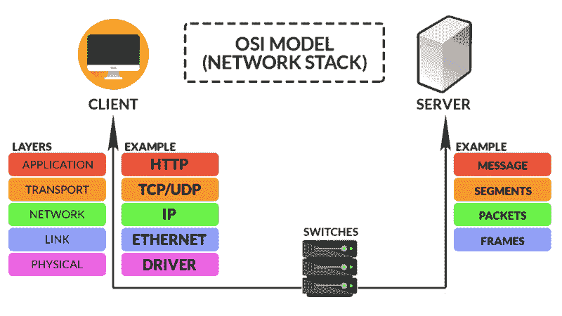
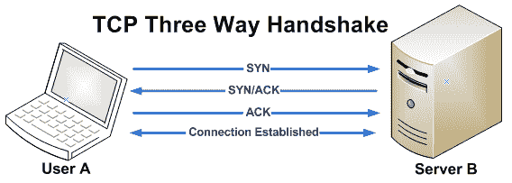
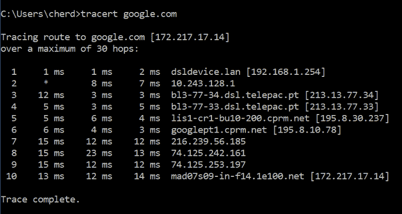
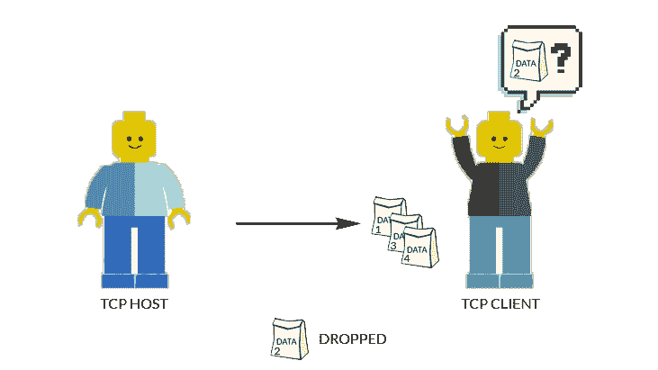
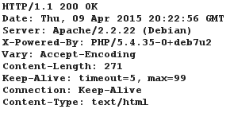
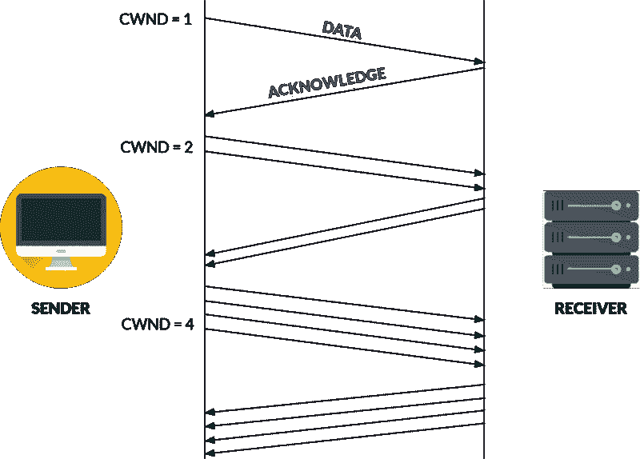
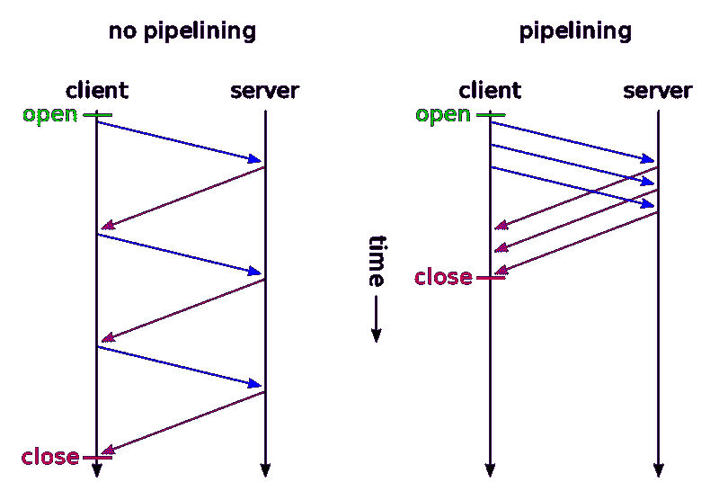
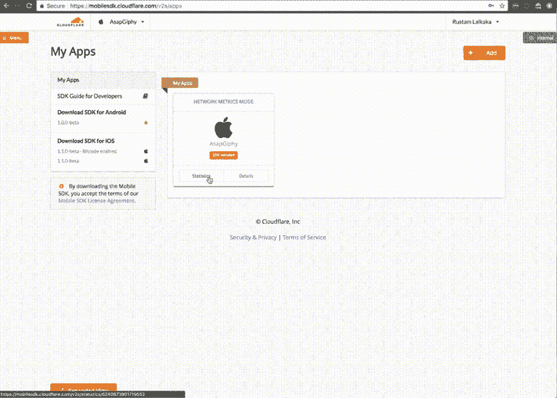

# HTTP 简介:探索计算机系统中的远程通信

> 原文：<https://www.freecodecamp.org/news/an-introduction-to-http-understanding-the-open-systems-interconnection-model-9dd06233d30e/>

切尔·唐

# HTTP 简介:探索计算机系统中的远程通信

#### 了解开放系统互连模型

### 概观

在整个系列中，我们将解决一些基础问题，例如:
[(第 1 部分)DNS 是如何工作的？](https://medium.freecodecamp.org/an-introduction-to-http-domain-name-system-servers-b3e7060eca98)
(第二部分)网络栈，OSI 模型*【你来了！]*
(第 3 部分)HTTP 方法和格式
(第 4 部分)客户端标识
(第 5 部分)基本/摘要认证
(第 6 部分)HTTPS 使用 SSL/TLS

### OSI 模型

开放系统互连(OSI)模型是计算机系统中电信的标准化模型。它不考虑底层技术，而是涉及通信的各层。让我们探索 OSI 模型中的不同层:

Typical 5-layered OSI Model

### 1.应用层

一旦建立了连接，该层允许应用程序通过网络进行通信，例如从 Web 浏览器(应用程序)到服务器。这一层的协议包括 HTTP 和 TELNET。

#### 超文本传输协议(HTTP)

一组通过互联网传输文件的规则。例如，当您在浏览器中输入 URL 时，浏览器会发送对网页的 HTTP 请求。然后，主机将返回网页，连同其中的所有元素，如图像、文本、视频、样式字体等。

### 2.传输层

这一层负责主机到主机的消息通信。这一层的协议包括 TCP 和 UDP。

#### 传输控制协议

最常见的面向连接的协议。它定义了如何建立和维护网络对话。它负责在 3 次握手中在客户端和主机之间建立连接(称为*套接字*)。

请求数据的用户会向服务器发送一个 SYN 数据包，请求*同步*。然后服务器会用一个 SYN-ACK 来响应用户，表明它已经*确认了*数据包，并且也愿意连接。因此，当用户向服务器发送最后一个 ACK 时，连接就建立了。

TCP 是最常见的，因为它很优雅，能够提供以下功能:

**面向连接的通信**
在端点之间建立握手协议，保证数据交换前的连接，并作为数据流(数据包)传输。

**可靠性**
使用校验和，确保发送和接收的数据包是相同的。如果有丢失/损坏的分组，它将通过向发送者发送 NACK 消息来请求重新传输数据分组。

**顺序**
对数据包进行编号并传输。因此，TCP 将确保在交付应用程序之前对收到的数据包进行重新排序。

**流量控制**
数据传输的速率受到调节，以提高效率，同时防止缓冲区溢出/欠载，即数据的发送速度快于接收方的处理速度，反之亦然。
其背后的机制在下面的 [TCP 慢启动](#c804)部分解释。

基本上，它能够通过同一个套接字并发地发送多个信息流。这些是通过套接字上的不同端口完成的。我们将在本文中进一步讨论[多路复用和流水线](#8aeb)之间的区别。

#### 用户数据报协议

虽然与 TCP 类似，但它是一种无连接协议。它与 TCP 完全相反，使它变得不可靠和无序。丢弃的数据包将不会重新传输，从而导致数据中出现间隙。

然而，这使得它最适合时间敏感的应用，如互联网上的语音通话(VoIP)。这是因为它在传输前不需要三次握手，因此速度很快。此外，丢包在 VoIP 中不是问题，因为人耳非常擅长处理丢包时常见的短间隙。

### 3.网路层

这一层负责为网络连接提供数据路由路径。基本上，它以最符合逻辑的路径在网络中移动数据包。

#### 互联网协议(IP)

定义数据包的结构，并用源和目的地信息对其进行标记。

源和目的地信息采用 IP 地址的形式，其中可以采用`104.16.121.127` (IPv4)或`2001:db8:0:1234:0:567:8:1` (IPv6)的形式。

### 4.链路层/物理层

这一层是 OSI 模型的基础，其中信息或者在链路层的局域网(LAN)中传输，或者在物理层以码字或符号的形式传输物理信号，例如电、机械介质。

### 可视化路线

使用`tracert google.com`，可以从客户端(你的电脑)追踪到主机(google.com)。

从上面，您可以看到从我的设备`192.168.1.254`到路由器`10.243.128.1`的路由，然后经过位于葡萄牙的互联网服务提供商(ISP)，等等。

### 互补层

#### TCP/IP 模型

TCP will request for re-transmission of dropped data packets, and re-order them

IP 只负责数据包的结构。因此，如果数据包被破坏或丢失，它将不会做出修正。这就是 TCP 发挥作用的地方，它在发送到客户端之前对数据包进行编号。在客户端，TCP 将请求重新传输丢失/损坏的数据包，然后重新排列数据包。

#### HTTP/TCP 模型

正如我们前面提到的，HTTP 现在可以通过由 [TCP 握手](#259f)建立的连接发出请求。但是它们是如何互补的呢？

**HTTP 持久连接**
这将允许在一个 TCP 连接上有多个 HTTP 请求/响应，而不是在每个请求/响应时都打开一个新的连接。

Sample response for Persistent Connection

这是通过 HTTP 头完成的，其中`Connection: Keep-Alive`。默认情况下，只有在空闲 30 秒后发送另一个响应`Connection: Close`时，连接才会关闭。

**TCP 慢启动**
前面说过，TCP 支持[流量控制](#e64e)。这是通过 TCP 慢速启动实现的，这是一种防止网络拥塞的方式。

发送方有拥塞窗口(CWND ),接收方有接收方窗口(RWND)。如果数据大于拥塞/接收器窗口，则分别会有缓冲区不足/溢出。

为了防止这种情况，发送方将首先发送一个具有小拥塞窗口(CWND = 1)的数据包，以缓慢地探测接收方的接收方窗口。

接收方将以确认响应，提示发送方每次将数据包加倍，直到没有收到确认为止。此时，已经发现了数据包的最佳数量，允许其他拥塞控制算法将连接保持在这个速度。

**一起工作**
因此，TCP 慢启动能够在连接关闭前计算出发送数据包的最佳数量。这将允许从主机发送到客户端的数据量得到优化，而没有缓冲区溢出的风险(数据发送的速度比接收的速度快)。

### 其他 HTTP 功能

#### HTTP 管道

HTTP/1.1 版中的这个特性允许在同一个套接字上一次发送多个请求，而无需等待响应。但是，在较新版本的 HTTP/2 中，它已被 TCP 多路复用所取代。

关键的区别在于，尽管两者都允许在同一个套接字上一次发送多个请求，但是管道仍然需要按顺序发送响应。这意味着，如果请求的项目是在订单(A，B，C)，客户将不会收到项目 C，如果项目 B 没有得到适当的交付。

在多路复用中，顺序并不重要。这将允许更快的交货时间。

这些方法最适合用于幂等方法，幂等方法的响应与请求的次数无关，例如，多次请求一个网页将会响应同一个网页。

#### 并联连接

曾经打开一个网页，看到网页的多个组件(视频栏，缩略图，按钮)同时加载？

Multiple components loading simultaneously | Photo courtesy of [Cloudflare Mobile SDK](https://www.cloudflare.com/products/mobile-sdk/)

这可以通过并行连接来实现，在并行连接中，可以同时建立多个 TCP 连接，从而允许这些组件并发加载，而不是一个接一个地加载。

然而，尽管它看起来加载得更快，但可能会受到客户端有限带宽的限制。如果所有并行连接都在竞争有限的带宽，那么每个组件的加载速度都会相应变慢，从而导致总体加载速度没有优势。

### 结论

有了 OSI 模型，我们可以很容易地理解网络的全貌，以及它们从硬件到软件是如何相互作用的。

总的来说，这是一个很好的教学工具，也是故障排除的参考。这个模型对设计也很有用，因为它调查每一层的功能，迫使人们一层一层地思考设计。

到目前为止，我所经历的是 OSI 5 层模型，然而还有一个 OSI 7 层模型，它也处理识别、认证和数据加密。

这是 HTTP 简介系列的第 2 部分。你可以在[第一部分](https://medium.freecodecamp.org/an-introduction-to-http-domain-name-system-servers-b3e7060eca98)中阅读第一篇关于 DNS 服务器重要性的文章。接下来让我们在第 3 部分探索 HTTP 请求的结构！

嗨！我是[雪儿唐](https://www.freecodecamp.org/news/an-introduction-to-http-understanding-the-open-systems-interconnection-model-9dd06233d30e/undefined)，目前在攻读数据科学专业。我是[律师助理机器人](https://www.linkedin.com/company/paralegal-bot/)的首席技术官，你可以在下面找到我的网站。感谢阅读！

[**被激怒；**](http://www.piqued.co)
[*优质内容我们为难以把握的概念提供最好的内容。我们去过那里，和你有同样的感受……*www.piqued.co](http://www.piqued.co)