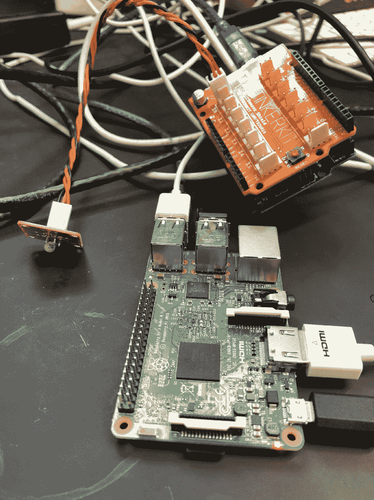
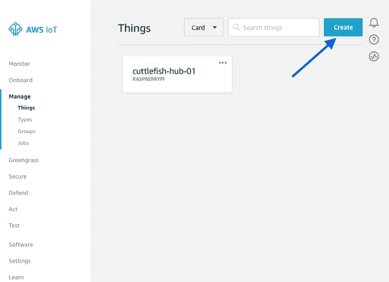
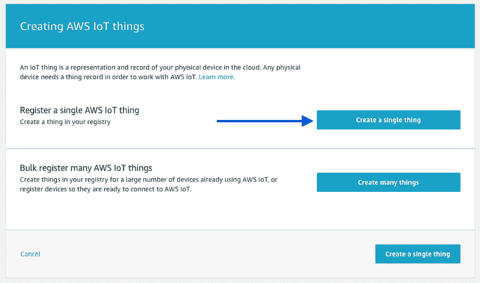
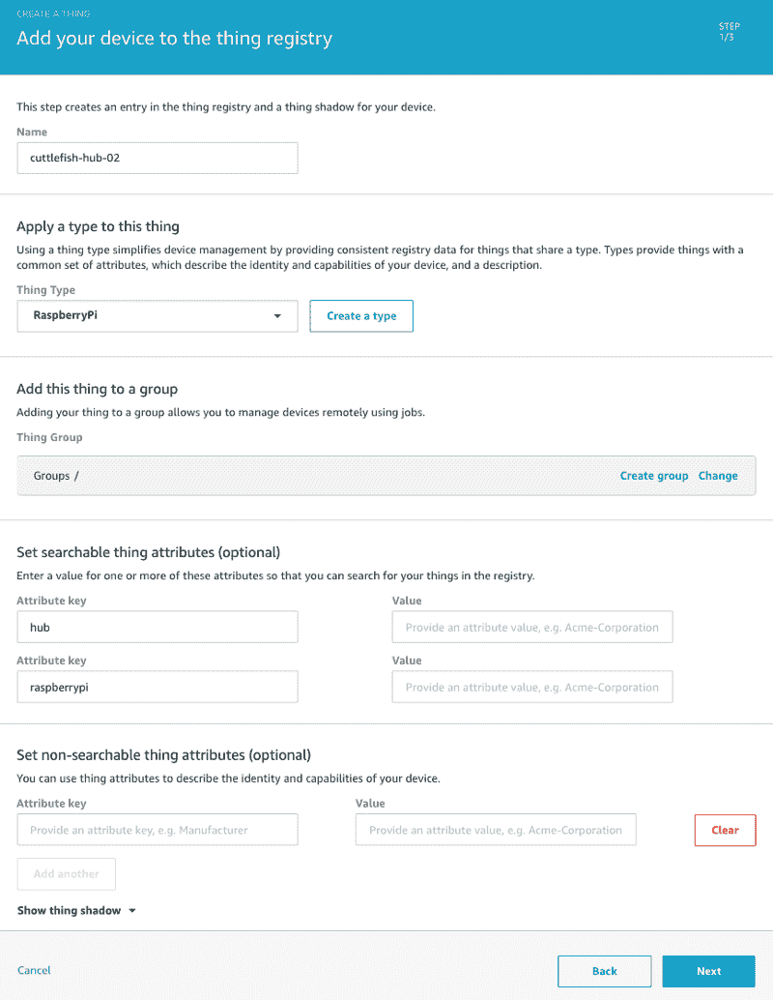
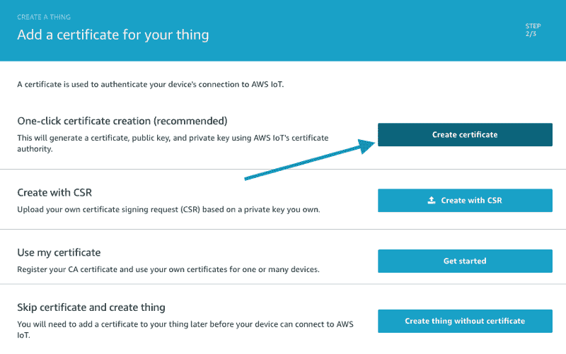
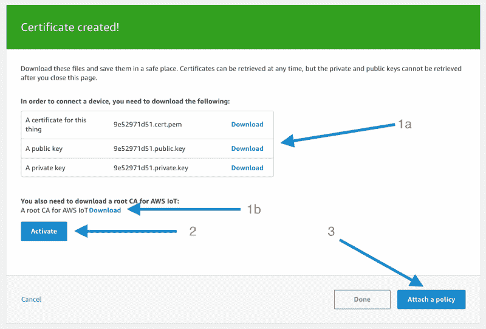
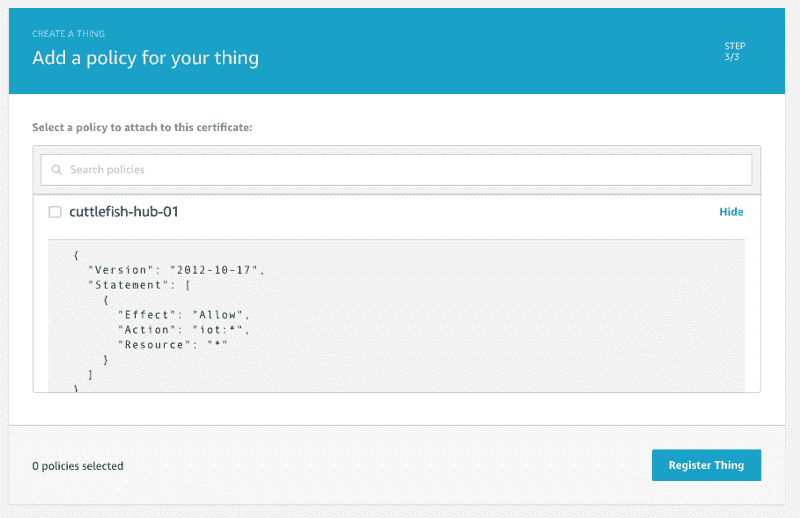

# 如何使用 Raspberry Pi 测量温度并将其发送到 AWS IoT

> 原文：<https://www.freecodecamp.org/news/how-to-measure-temperature-and-send-it-to-aws-iot-using-a-raspberry-pi-d6f7b196ec35/>

想自我校正办公室温度怎么办？或者你很好奇想用物联网传感器了解你的办公环境怎么办？

如果你对此感兴趣，请继续读下去。

首先，我们需要安装一个温度读数传感器。我们把它连接到一个 Arduino 上，Arduino 又连接到一个 RaspberryPi 上。



下一步是在你的 Raspberry Pi 上设置 AWS IoT SDK。

#### 把东西装好

1.  在 AWS IoT 中创建一个东西:



2.从创造一件事物开始:



3.创造一种特殊类型的事物。我们这里用的是 RaspberryPi(类型是你自己编的)。



4.为您的东西创建一个证书以与 AWS 通信:



5.下载证书，一个根证书颁发机构(CA)，激活它，并附加策略。



6.政策代码在这里。这可能看起来有点放纵，但对于演示应用程序来说是可以的。



#### 设置您的 RaspberryPi

在开始安装之前，请将所有证书和所有根 CA 文件复制到 RaspberryPI (scp 可能会帮助您)。如果还没有 Node.js，还需要安装它。

您还需要安装 AWS 物联网设备 SDK。

```
sudo apt-get update
sudo apt-get upgrade
sudo apt-get install nodejs

openssl x509 -in ./CA-roots/VeriSign-Class\ 3-Public-Primary-Certification-Authority-G5.pem -inform PEM -out root-CA.crt
chmod 775 root-CA.crt

npm install aws-iot-device-sdk
```

下面是使用 AWS 物联网设备 SDK 从串行端口读取数据并发送温度读数的代码。代码是基于亚马逊的例子。

```
'use strict';

console.log('Running...');

const SerialPort = require('serialport');
const Readline = require('@serialport/parser-readline')

const portName = '/dev/ttyACM0';
const port = new SerialPort(portName, (err) => {
	if (err) {
		return console.log('Error: ', err.message);
	}
});

const deviceModule = require('aws-iot-device-sdk').device;

const parser = port.pipe(new Readline({ delimiter: '\r\n' }));
const rePattern = new RegExp(/C: (.+)F:(.+)/);

parser.on('data', (data) => {
	const arrMatches = data.match(rePattern);

	if(arrMatches && arrMatches.length >= 1) {
		const readingInC = arrMatches[1].trim();
		console.log(readingInC);

		sendDataToTheNube(readingInC);
	}
});

const defaults = {
	protocol: 'mqtts',
	privateKey: './iot/f5b0580f5c-private.pem.key',
	clientCert: './iot/f5b0580f5c-certificate.pem.crt',
	caCert: './iot/root-CA.crt',
	testMode: 1,
	/* milliseconds */
	baseReconnectTimeMs: 4000,
	/* seconds */
	keepAlive: 300,
	/* milliseconds */
	delay: 4000,
	thingName: 'cuttlefish-hub-01',
	clientId: 'nouser' + (Math.floor((Math.random() * 100000) + 1)),
	Debug: false,
	Host: 'a7773lj8lvoid9a.iot.ap-southeast-2.amazonaws.com',
	region: 'ap-southeast-2'
};

function sendDataToTheNube(readingInC) {
	const device = deviceModule({
	      keyPath: defaults.privateKey,
	      certPath: defaults.clientCert,
	      caPath: defaults.caCert,
	      clientId: defaults.clientId,
	      region: defaults.region,
	      baseReconnectTimeMs: defaults.baseReconnectTimeMs,
	      keepalive: defaults.keepAlive,
	      protocol: defaults.Protocol,
	      port: defaults.Port,
	      host: defaults.Host,
	      debug: defaults.Debug
	});

	device.publish(`temperature/${defaults.thingName}`, JSON.stringify({
		temperature: readingInC
	}));
}
```

那么现在你能用这些数据做什么呢？

您可以编写一个 Lambda 来将数据排队以供处理。它可能看起来像这样:

```
require("source-map-support").install();

import { Callback, Handler } from "aws-lambda";
import { baseHandler } from "../shared/lambda";
import logger from "../shared/logger";
import {Models} from "../shared/models";
import {QueueWriter} from "./queue-writer";

const handler: Handler = baseHandler((event: any, callback: Callback) => {
    logger.json("Event:", event);

    const writer = new QueueWriter();

    const { temperature, sensorId } = event;

    const reading: Models.Readings.TemperatureReading = {
        temperature,
        sensorId,
    };

    writer.enqueue(reading)
        .then(() => callback())
        .catch(callback);
});

export { handler };
```

您的 serverless.com 文件可能如下所示:

```
functions:
    sensorReadings:
        name: ${self:provider.stage}-${self:service}-sensor-readings
        handler: sensor-readings/index.handler
        description: Gets triggered by AWS IoT
        timeout: 180
        environment:
            READING_QUEUE_NAME: ${self:provider.stage}_${self:custom.productName}_reading
            READING_DL_QUEUE_NAME: ${self:provider.stage}_${self:custom.productName}_reading_dl
        tags:
            service: ${self:service}
        events:
             - iot:
                sql: "SELECT * FROM '#'"
```

我希望这篇文章为你节省了一些设置设备的时间。感谢阅读！