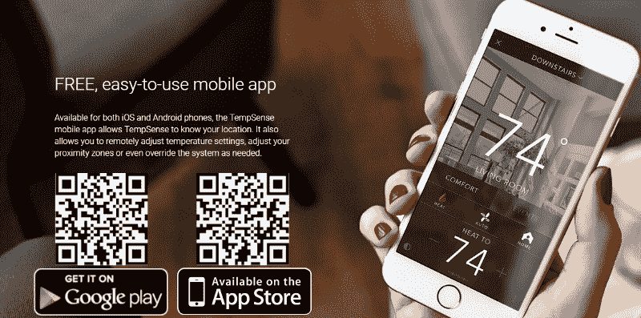
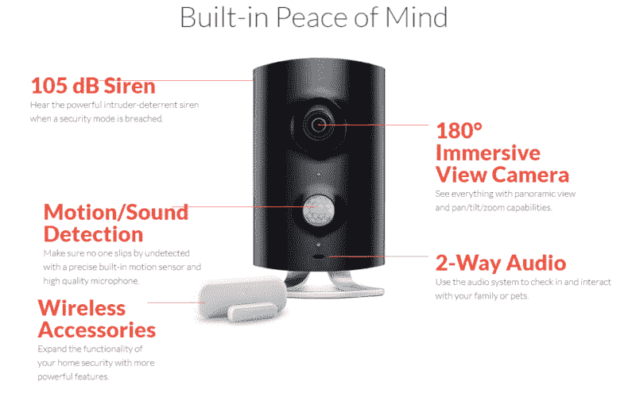

# 更顺畅的物联网应用入门技巧

> 原文：<https://www.freecodecamp.org/news/tips-for-a-smoother-internet-of-things-app-onboarding-d31d856d8b1e/>

作者:索菲亚·科波尔

# 更顺畅的物联网应用入门技巧

在用户使用你的应用的过程中，入职是一个关键阶段。它主要是第一个接触点，因此对留下良好的第一印象是必要的。一个应用程序的入门越简单，用户就越容易接受和使用它。这是让用户付诸行动的正确方法。

但对于开发者来说，制定一个从用户第一次打开应用时就吸引他们的入职计划从来都不容易。开发者面临着独特的挑战，让用户开始使用他们的应用程序，而不会感到不知所措。

好的上线总是有助于一个 app 的成败。当一个应用程序被积极使用时，它就被认为是成功的。根据分析公司 Localytics 2016 年 5 月的数据，四分之一的应用程序在使用一次后就会被卸载。

在这篇文章中，我将介绍一些帮助物联网(IoT)应用程序开发人员为他们的应用程序制定完美的入门计划的技巧。但首先，我们将了解应用程序上线的主要挑战。

#### 应用程序入门挑战

物联网应用程序总是与实体产品绑定在一起。这给用户带来了一系列新的困难，他们需要一个新的应用程序以及一个与该应用程序交互的产品。开发人员需要找出所有让用户感到沮丧的痛点。

*   难以打开或留下过多足迹的应用程序
*   冗长的说明要求用户在使用产品之前了解很多东西
*   麻烦的是将应用程序与物联网设备同步需要用户经历多个步骤

由于物联网应用程序汇集了与应用程序本身和应用程序交互的物联网设备相关的挑战，因此物联网应用程序开发人员必须制定一个坚实的入职计划，从初始设置到教程再到用户保留，这一点非常重要。

因此，这里有一个你需要做的事情列表，以获得一个平稳的入职体验:

#### 将应用程序下载说明放在产品包装中

当谈到物联网应用程序时，它将始终被用作消费者购买的实际物理设备的辅助产品。该应用程序只是一个与物联网产品交互的界面。确保你已经提供了消费者如何访问应用程序并将其下载到他们的移动设备上的简单说明。您可以在产品包装上包含一个简短的链接或二维码。链接或二维码应该引导消费者进入登录页面。

应用程序登录页面应该自动检测消费者的设备类型，并将他们重定向到适当的应用程序商店。

许多产品提供商运行短信服务器，要求用户发送短信，然后向他们发送应用程序的下载链接。

你可以选择以上任何一种方法，一个简短的链接，二维码，或短信请求。

#### **通过社交登录让登录变得简单**

客户资料和身份管理软件提供商 JanRain 表示，如果要求 92%的用户在登录或恢复凭证时经历一个漫长的过程，他们会离开网站。

用户的这种行为产生了所谓的账户疲劳。这给用户带来了记住用户名和密码的压力。毫无疑问，用户仍然记得一些他们最常用的服务的凭证，比如 Gmail 和脸书。

用户无法记住所有在线账户的所有用户名和密码。这阻碍了他们轻松地接触在线产品。这种情况可以通过允许用户使用他们的社交媒体资料(如脸书、推特或 Gmail)登录他们的账户来避免。

#### **强调物联网产品和应用的优势**

该产品应讲述物联网产品的核心优势和功能，以及如何使用该应用程序轻松管理设备并利用这些优势。

这种方法可以应用于演练教程，这些教程分别强调了每个特性。

以下是您在创建演练教程时需要考虑的事项:

*   **添加幻灯片** -当添加一个教程来告知用户好处和特点时，要保持简单明了。
*   **添加一个跳过按钮**——针对那些之前已经下载并使用过该应用的用户。
*   **用箭头指向特性**——很多开发者用箭头来告知用户什么是哪里。带有一行细节的箭头交互地通知用户什么在哪里。点击描述该功能的标题时，会出现一个新标题，告诉用户该应用程序的第二个特性/功能。

#### **包含视频教程**

添加视频教程是让用户了解您的应用程序的最佳方式之一。在你的应用中包含视频教程将有助于用户轻松设置他们的物联网产品，并指导他们如何与应用进行交互。

作为一个例子，看看 Nest 如何在这个视频中介绍他们的学习恒温器。

#### **显示教程进度**

如果消费者不知道他们的进度以及他们已经完成了多少，他们可能会对阅读教程感到厌烦。你可以通过向用户提供教程进度的指示器来避免这种情况，这样用户就有动力去完成它，从而更顺利地入职。

#### **简化客户支持服务**

即使在获得手册和教程之后，消费者也可能需要联系客户支持。通过向应用程序添加文档并提供对应用程序内支持的便捷访问，您可以让您的客户支持响应速度更快。您还可以添加一个链接，将用户重定向到产品网站的移动友好支持部分。

您还可以加入应用内聊天，直接引导客户联系客户服务代表。当用户可以通过应用程序轻松访问客户关怀服务时，他们更有可能在遇到问题时寻求支持，并提高应用程序的整体满意度和参与度。

#### **将你的应用游戏化**

人们喜欢解锁成就或访问交互式界面。游戏应用已经做了很长时间，这增加了用户的参与度。同样的游戏化概念可以添加到物联网应用程序中，让用户参与应用程序，并鼓励他们更频繁地使用它。

#### **依赖应用内和推送通知**

[物联网应用](http://www.rapidsofttechnologies.com/ioT.php)非常适合应用内和推送通知。你可以设置通知来通知用户完成他们的个人资料，或者提醒他们已经很长时间没有使用该应用程序了。可以根据任务的进度或用户即将达到的成就来触发通知。这也有助于用户查看与连接的物联网设备相关的状态和操作。

#### 结论

在设计应用程序时，请牢记上述提示，开发团队成功地创建了一个令人惊叹的入职体验，让用户立即参与到物联网设备应用程序中。虽然上述所有技巧可能不适用于每一个物联网应用程序，但每一个都可以单独尝试，并查看它们对应用程序保留的影响。

Sofia 是 Rapidsoft Technologies 的数字营销专家，Rapidsoft Technologies 是一家[离岸软件开发公司](http://www.rapidsofttechnologies.com/offshore-development-center.php)，为全球教育、自动化、建筑和金融领域开发软件。她喜欢写最新的移动趋势、技术、创业公司和企业。