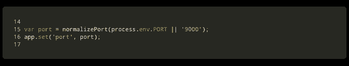
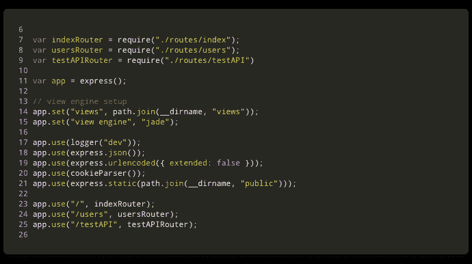
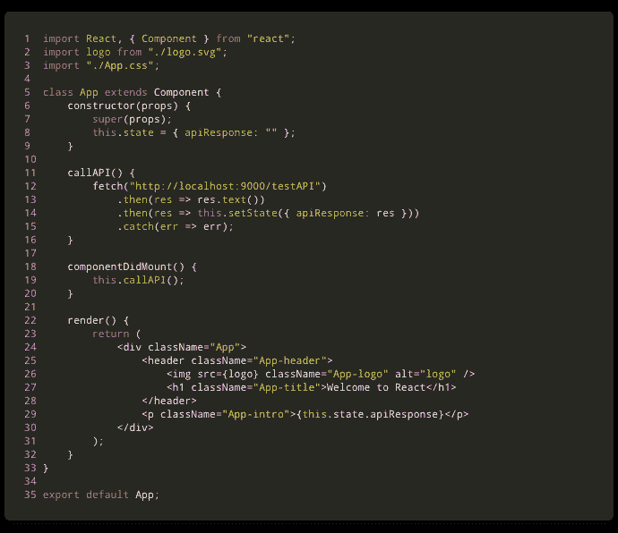
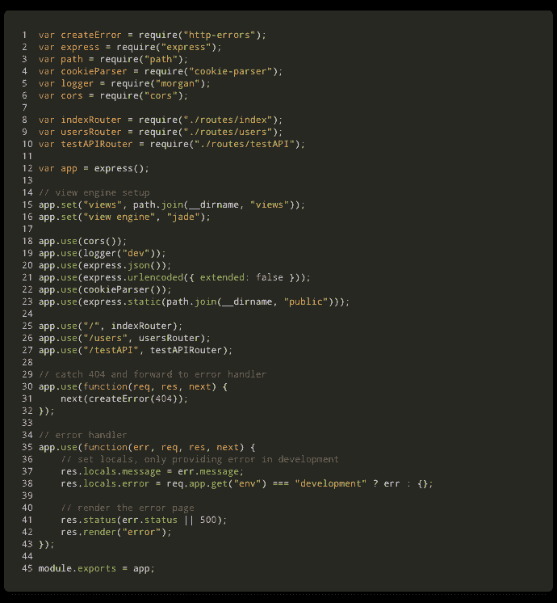

# 如何创建一个 React 前端和一个 Node/Express 后端并连接它们

> 原文：<https://www.freecodecamp.org/news/create-a-react-frontend-a-node-express-backend-and-connect-them-together-c5798926047c/>

约翰亨利克

# 如何创建一个 React 前端和一个 Node/Express 后端并连接它们


“two square blue LED lights” by [israel palacio](https://unsplash.com/@othentikisra?utm_source=medium&utm_medium=referral) on [Unsplash](https://unsplash.com?utm_source=medium&utm_medium=referral)

在本文中，我将向您介绍创建一个简单的 React 应用程序并将其连接到我们也将创建的一个简单的 Node/Express API 的过程。

我不会详细介绍如何使用我将在本教程中提到的任何技术，但我会留下链接，以防你想了解更多。

你可以在我为教程制作的 [**这个资源库**](https://github.com/Joao-Henrique/React_Express_App_Medium_Tutorial) 里找到所有的代码。

这里的目标是给你一个关于如何设置和连接**前端客户端**和**后端 API** 的实用指南。

在我们动手之前，请确保您的机器上运行了 [Node.js](https://nodejs.org/en/) 。

#### 创建主项目目录

在您的终端中，导航到您想要保存项目的目录。现在为您的项目创建一个新目录，并导航到其中:

```
mkdir my_awesome_project
cd my_awesome_project
```

#### 创建一个 [React](https://reactjs.org/) 应用

这个过程非常简单。

我将使用脸书的 [create-react-app](https://github.com/facebook/create-react-app) 来…你猜对了，轻松创建一个名为 **client** 的 react 应用:

```
npx create-react-app client
cd client
npm start
```

*让我们看看我做了什么:*

1.  *用 npm 的 [npx](https://medium.com/@maybekatz/introducing-npx-an-npm-package-runner-55f7d4bd282b) 创建了一个 react app，命名为 client。*
2.  *cd(更改目录)进入客户端目录。*
3.  *启动 app。*

在浏览器中，导航到 [http://localhost:3000/](http://localhost:3000/) 。

如果一切正常，您将看到 react 欢迎页面。恭喜你！这意味着您现在有一个基本的 [**React**](https://reactjs.org/) 应用程序运行在您的本地机器上。简单对吗？

要停止 react 应用程序，只需在终端中按下`**Ctrl + c**`。

#### 创建一个[快递](https://expressjs.com/)应用程序

好，这将和前面的例子一样简单。不要忘记导航到您的项目顶层文件夹。

我将使用 [Express 应用生成器](https://expressjs.com/en/starter/generator.html)快速创建一个应用框架，并将其命名为 **api:**

```
npx express-generator api
cd api
npm install
npm start
```

*让我们看看我做了什么:*

1.  使用 npm 的 npx 在全球范围内安装快速发电机。
2.  使用 express-generator 创建了一个 express 应用程序，并将其命名为 api。
3.  *光盘放入 API 目录。*
4.  已安装所有依赖项。
5.  已启动应用程序。

在浏览器中，导航到 [http://localhost:3000/](http://localhost:3000/) 。

如果一切正常，您将看到快速欢迎页面。恭喜你！这意味着您现在有一个基本的 [**Express**](https://expressjs.com/) 应用程序运行在您的本地机器上。简单对吗？

要停止 react 应用程序，只需在终端中按下`**Ctrl + c**`。

#### 在 Express API 中配置新的[路线](https://expressjs.com/en/guide/routing.html)

好吧，让我们把手弄脏。是时候打开你最喜欢的代码编辑器*(我用的是 [VS 代码](https://code.visualstudio.com/) )* 并导航到你的项目文件夹。

*如果你将 **react app 命名为客户端**，将 **express app 命名为 api** ，你会发现两个主文件夹:**客户端**和 **api。***

1.  在 **API** 目录中，转到 **bin/www** ，将第 15 行的端口号从 3000 改为 9000。稍后我们将同时运行这两个应用程序，这样做可以避免问题。结果应该是这样的:



my_awesome_project/api/bin/www

2.在 **api/routes** 上，创建一个 **testAPI.js** 文件并粘贴以下代码:

```
var express = require(“express”);
var router = express.Router();

router.get(“/”, function(req, res, next) {
    res.send(“API is working properly”);
});

module.exports = router;
```

3.在 **api/app.js** 文件中，在第 24 行插入一条新路线:

```
app.use("/testAPI", testAPIRouter);
```

4.好的，你在“告诉”快递使用这条路线，但是，你仍然需要它。让我们在第 9 行这样做:

```
var testAPIRouter = require("./routes/testAPI");
```

唯一的变化在第 9 行和第 25 行。结果应该是这样的:



my_awesome_project/api/app.js

5.恭喜你！您已经创建了一条新的[路线](https://expressjs.com/en/guide/routing.html)。

如果您启动您的 API 应用程序(在您的终端中，导航到 API 目录和" **npm start"** )，并在您的浏览器中转至[http://localhost:9000/testAPI](http://localhost:9000/testAPI)，您将看到消息: ***API 正常工作。***

#### 将 React 客户端连接到 Express API

1.  在您的代码编辑器中，让我们在**客户端**目录中工作。打开位于**my _ awesome _ project/client/app . js**中的 **app.js** 文件。
2.  这里我将使用 [**获取 API**](https://developer.mozilla.org/en-US/docs/Web/API/Fetch_API/Using_Fetch) 从 **API 中检索数据。**将这段代码粘贴在类声明之后，呈现方法之前:

```
constructor(props) {
    super(props);
    this.state = { apiResponse: "" };
}

callAPI() {
    fetch("http://localhost:9000/testAPI")
        .then(res => res.text())
        .then(res => this.setState({ apiResponse: res }));
}

componentWillMount() {
    this.callAPI();
}
```

3.在渲染方法里面，你会发现一个**<**；p >标签。让我们改变它，使其呈现**的顶点**响应:

```
<p className="App-intro">;{this.state.apiResponse}</p>
```

最后，该文件应该类似于以下内容:



我知道！！！这有点过了。复制粘贴是你的朋友，但是你要明白你在做什么。让我们看看我在这里做了什么:

1.  在第 6 到 9 行，我们插入了一个构造函数，初始化默认状态。
2.  *在第 11 到 16 行，我们插入了方法 **callAPI()** ，该方法将从 API 获取数据，并将响应存储在**this . state . API response .***上
3.  *在第 18 到 20 行，我们插入了一个名为**componentdimount()，**的 react 生命周期方法，它将在组件挂载后执行 **callAPI()** 方法。*
4.  最后，在第 29 行，我使用了**<**；p >标记在我们的客户端页面上显示一个段落，其中包含我们从 API 中检索到的文本。

#### 什么鬼东西！！ [CORS](https://developer.mozilla.org/en-US/docs/Web/HTTP/CORS) ？

哦耶，宝贝！我们差不多完成了。但是，如果我们启动两个应用程序(客户端和 API)并导航到 [http://localhost:3000/](http://localhost:3000/) ，您仍然不会在页面上看到预期的结果。如果你打开 chrome 开发者工具，你就会找到原因。在控制台中，您会看到以下错误:

> 无法加载[http://localhost:9000/testAPI](http://localhost:9000/testAPI):请求的资源上不存在“Access-Control-Allow-Origin”标头。原点' [http://localhost:3000'](http://localhost:3000') 因此不允许访问。如果不透明响应满足您的需要，请将请求的模式设置为“no-cors ”,以便在禁用 cors 的情况下获取资源。

这很容易解决。我们只需将 CORS 添加到我们的 API 中，以允许跨来源请求。我们就这么做吧。你应该[点击这里](https://developer.mozilla.org/en-US/docs/Web/HTTP/CORS)了解更多关于 [CORS](https://developer.mozilla.org/en-US/docs/Web/HTTP/CORS) 的信息。

1.  在您的终端中，导航到 API 目录并安装 **CORS** 包:

```
npm install --save cors
```

2.在您的代码编辑器上，转到 API 目录并打开**my _ awesome _ project/API/app . js**文件。

3.6 号线上要求 **CORS:**

```
var cors = require("cors");
```

4.现在第 18 行“告诉”快递使用 **CORS** :

```
app.use(cors());
```

API **app.js** 文件应该是这样的:



my_awesome_project/api/app.js

#### 干得好。都搞定了！！

好吧！我们都准备好了！

现在，在两个不同的终端中，使用 **npm start** 命令启动您的两个应用程序(客户端和 API)。

如果您在浏览器中导航到 [http://localhost:3000/](http://localhost:3000/) ，您应该会看到类似这样的内容:


当然，这个项目不会做太多，但它是一个完整堆栈应用程序的开始。你可以在 [**这个库**](https://github.com/Joao-Henrique/React_Express_App_Medium_Tutorial) 中找到我为教程创建的所有代码。

接下来，我将学习一些补充教程，比如如何将它连接到 MongoDB 数据库，甚至如何在 Docker 容器中运行它。

正如我的一个好朋友所说:

> 坚强起来，坚持下去！！！

…别忘了今天要表现得很棒；)