# 以下是 JavaScript 中新的内置方法和函数

> 原文：<https://www.freecodecamp.org/news/here-are-the-new-built-in-methods-and-functions-in-javascript-8f4d2fd794fa/>

在过去的几年里，JavaScript 已经发布了许多新版本。它们带来了新的特性，尤其是在语法和核心部分。这些更新使得 JavaScript 更加可读和聪明。我将向我们介绍数组、对象和字符串的新方法。这些新方法可以通过编写更少的代码，以优雅而高效的方式处理数据。这就是我们在这篇文章中要解释的。

### 新的对象方法

对象是 JavaScript 成为强大编程语言的原因。对象允许您对不同的数据类型进行分组。如果你想学习任何新的 JavaScript 框架，比如 React、Vue 或 Angular，你必须知道如何使用对象及其方法。这些框架使用对象来获取和处理用户输入。新的 JavaScript 版本为对象带来了新的方法，使它们更有趣。以下是新的对象方法:

#### 对象.分配()

Object.assign()方法有多个作业。它可以复制一个对象，从另一个对象克隆，或者连接两个或多个对象。

*   从另一个对象复制值:

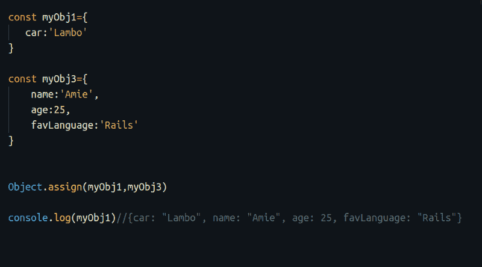

*   将对象克隆到新对象

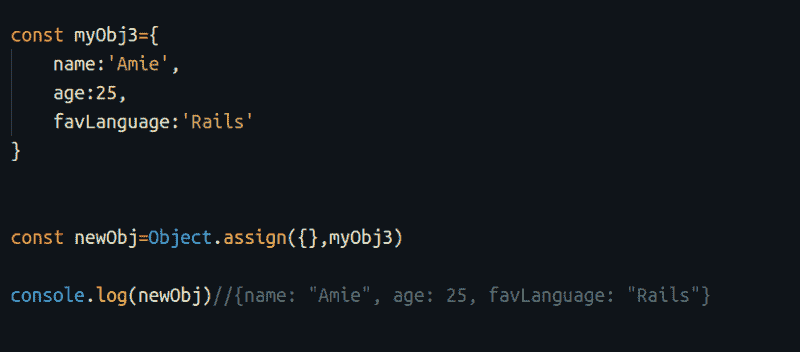

*   此外，通过将两个空括号设置为第一个参数，可以用 Object.assign()合并重复的属性:

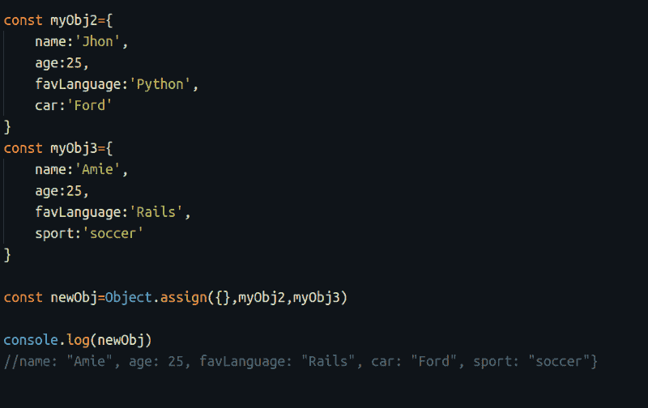

#### Object.entries()

Object.entries()方法以数组形式返回对象的键和值。

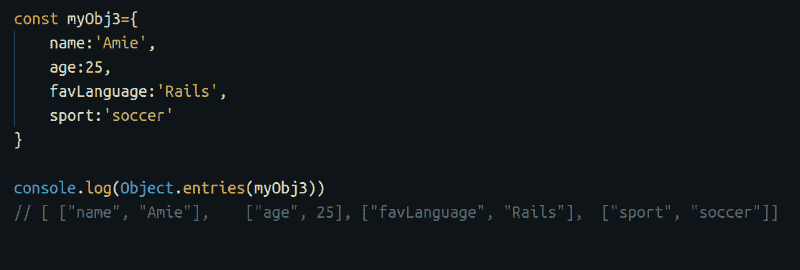

#### Object.getOwnPropertyDescriptors()

Object.getOwnPropertyDescriptors 允许我们获取对象的属性描述符。

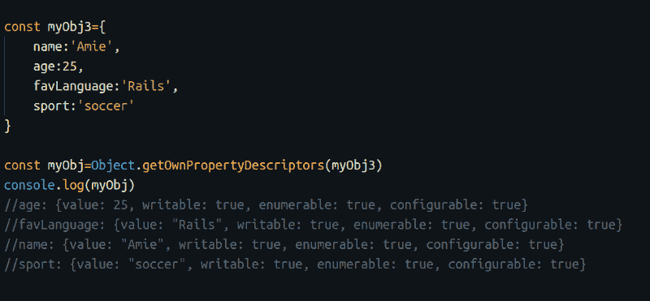

检查对象描述符的属性真的很有帮助，例如，看看它是可写的还是可枚举的。

### 新的数组方法

新的 JavaScript 版本为数组提供了新的方法。以下是新的数组方法:

#### Array.includes()

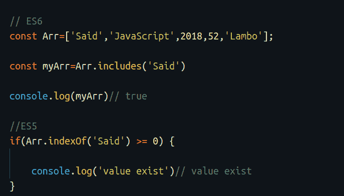

Array.includes()允许我们检查一个属性是否存在于数组中。您可以看到旧代码和新语法(ES6)之间的区别。新方法更简短，可读性更强。

#### Array.find()

Array.find()帮助我们找到数组中的一个元素。它接受一个回调函数作为参数。回调函数提供了更多的选项来查找和提取复杂数据。

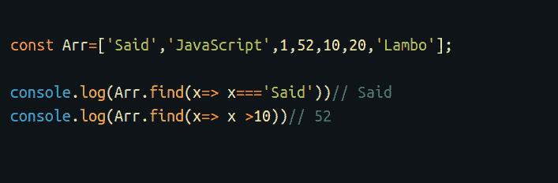

如果我们正在寻找的属性存在，它将返回找到的值。否则，它返回 undefined。

#### Array.findIndex()

Array.findIndex()返回找到的元素的索引而不是值。

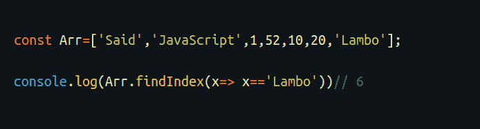

#### Array.values()

这个新方法返回值的数组迭代器，因此我们可以运行 for 循环来提取数组的每个值。

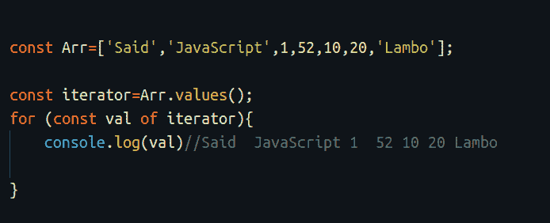

#### 数组.条目()

Array.entries()以数组格式返回键和值。

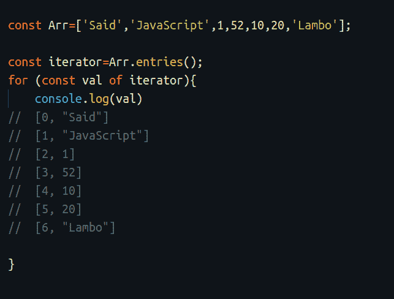

#### 数组. from()

Array.from()是在 ES6 版本中引入的。它可以通过对数据运行 map()函数来完成多项任务。它可以将一个字符串转换成一个数组，甚至可以从数据中创建一个新的数组。

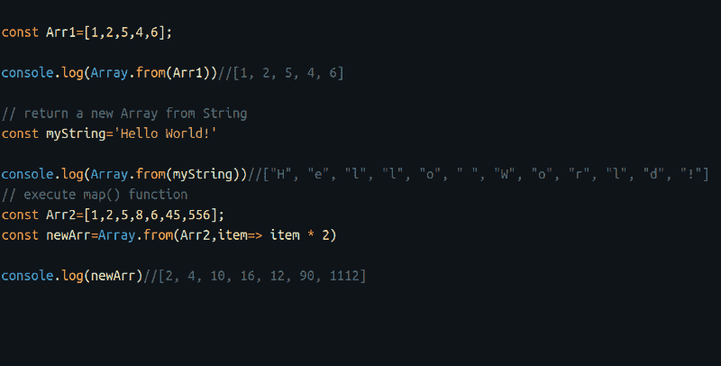

#### Array.keys()

顾名思义，这个方法返回数组的键。

### 新的字符串方法

新的 JavaScript 版本提供了新的字符串方法。以下是新的字符串方法:

#### 字符串.重复()

方法允许你重复一个字符串。

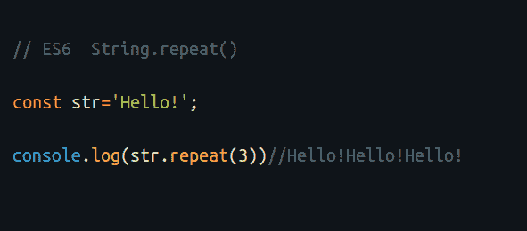

#### String.includes()

String.includes()的工作方式类似于 Array.includes()。如果输入的值存在，它将返回一个布尔值。

### 新的数字方法

新的 JavaScript 版本提供了新的数字方法。以下是新的编号方法:

#### Number.isNaN()

该方法在 ES6 更新中发布。它检查传入的数值，如果该值为 NaN，则返回 true。否则，它返回 false。这个方法的灵感来源于 JavaScript 中的经典函数 isNAN()。

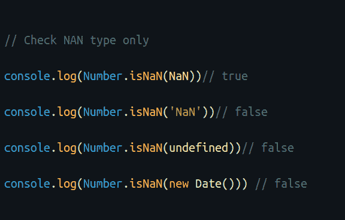

#### Number.isInteger()

和前面的方法一样，Number.isInteger()检查传递的值是否是整数。如果值是整数，它将返回 true，否则返回 false。

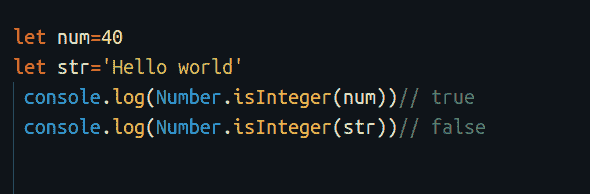

#### Number.isSafeInteger()

您可能总是希望验证用户的输入，以确保它是一个数字。Number.isSafeInteger()检查该数字是否是安全数字。

[在此了解更多信息](https://www.sitepoint.com/es6-number-methods/)

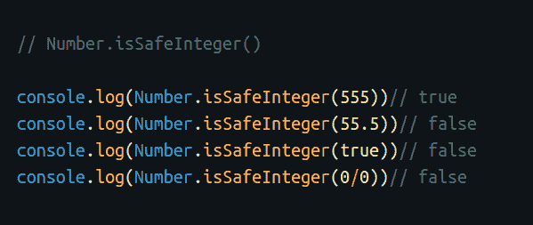

#### Number.isFinite()

检查传入的值是否是一个有限的数字。

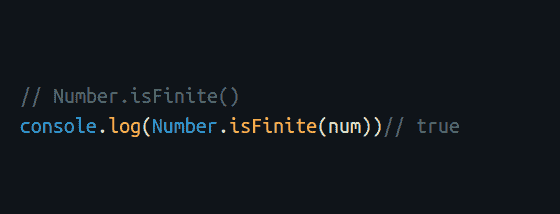

### **浏览器支持**

除了 Opera Mini 和 IE-11，其他主流浏览器几乎都支持新的数字方法。下图显示了支持:

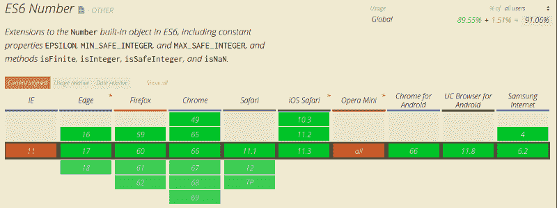

### 新的特定对象

JavaScript 附带了新的特定函数，允许我们编写更高性能的代码。以下是新的特定对象方法:

### 代理()对象

代理是 JavaScript 的一大补充。它为我们的代码创建了一个自定义行为。通过代理，您可以处理:

*   验证用户数据
*   数据校正
*   属性查找
*   作业
*   列举
*   函数调用

在这里查看代理的其他用途及其方法[。](https://developer.mozilla.org/en-US/docs/Web/JavaScript/Reference/Global_Objects/Proxy)

为了理解代理，我们要写两个例子。

**例 1:**

在这个例子中，我们在从用户那里获取数据时验证数据。我们将尝试定义一个未定义错误的行为。

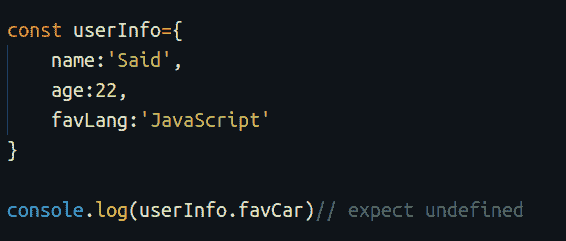

正如你在上面的例子中看到的，userInfo.favCar 返回`undefined`。如果我们想要处理这个错误消息，该怎么办？如果我们想为错误创建一个自定义行为，例如，显示另一条消息而不是 undefined，我们可以在这种情况下使用代理。

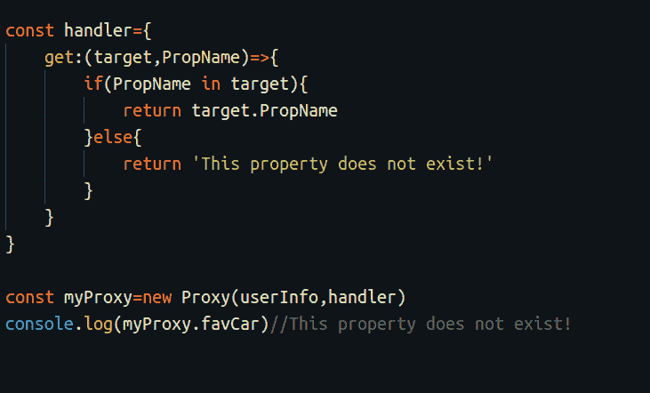

我们定义了一个新的代理，并给了它两个参数——对象和处理程序。处理程序运行一些验证代码，并检查对象中是否存在该属性。如果该属性存在，它将返回该属性。否则，它返回我们定义的消息，这被称为**属性查找。**

**例 2:**

在这个例子中，我们将使用 **set** 方法为对象中的特定值创建一个验证。

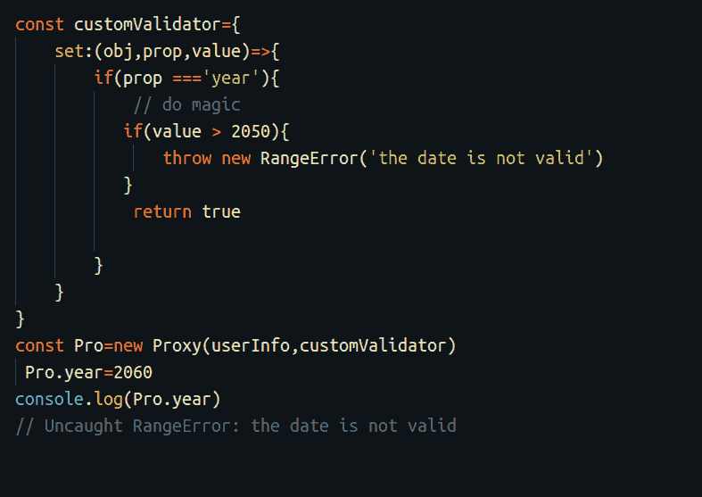

在这个例子中，我们可以验证数据类型并返回一个新的 TypeError()。这使得调试更加容易。你可以通过这篇[有帮助的文章](https://hackernoon.com/introducing-javascript-es6-proxies-1327419ab413)了解更多。

### **浏览器支持**

代理在所有主流浏览器上都很好用，如下图所示:

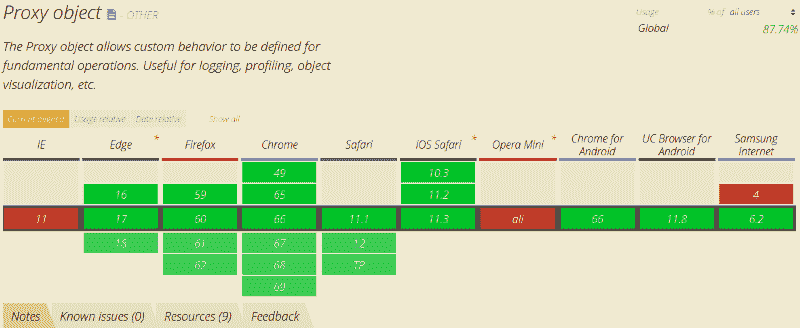

#### Set()对象

Set 对象是 JavaScript 中的一个新特性。它允许我们存储唯一的值。它有一堆你可以玩的方法。Object.add 方法允许您向对象添加新属性。Object.delete 从对象中移除属性。Object.clear 清除对象的所有属性。下面的例子解释了对象方法。

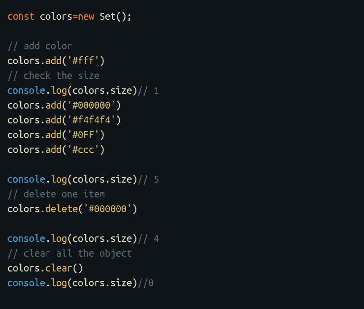

点击了解更多关于 Set()对象[的信息。](https://developer.mozilla.org/en-US/docs/Web/JavaScript/Reference/Global_Objects/Set)

### 包扎

我们刚刚介绍了 JavaScript 引入的新的内置方法。有了这些新的强大特性，我不再在代码中使用旧的语法和方法。新方法允许您以优雅的方式编写熟练且高性能的 JavaScript 代码。

你可以查看我的关于新的 ES6 语法的文章来更新你的 JavaScript 技能。

> 你可以在 T [witter](https://twitter.com/SaidHYN?lang=en) 和 [Instagram](https://www.instagram.com/saidhappy6/) 上找到我

***往期文章:***

*   [JavaScript ES6 —写得更少，做得更多](https://medium.freecodecamp.org/write-less-do-more-with-javascript-es6-5fd4a8e50ee2)
*   [通过建立一个登陆网站在 30 分钟内学会自举 4](https://medium.freecodecamp.org/learn-bootstrap-4-in-30-minute-by-building-a-landing-page-website-guide-for-beginners-f64e03833f33)
*   [Angular 6 及其新特性，三分钟内全部讲解完毕](https://medium.freecodecamp.org/angular-what-is-the-new-briefly-e6837348dd3a)
*   [如何使用 Vue.js 中的路由创建更好的用户体验](https://medium.freecodecamp.org/how-to-use-routing-in-vue-js-to-create-a-better-user-experience-98d225bbcdd9)
*   下面是用 JavaScript 发出 HTTP 请求的最流行的方法
*   [学习如何在 20 分钟内创建你的第一个 Angular 应用程序](https://medium.freecodecamp.org/learn-how-to-create-your-first-angular-app-in-20-min-146201d9b5a7)