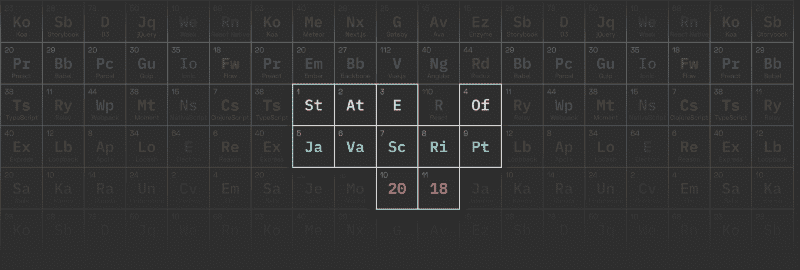
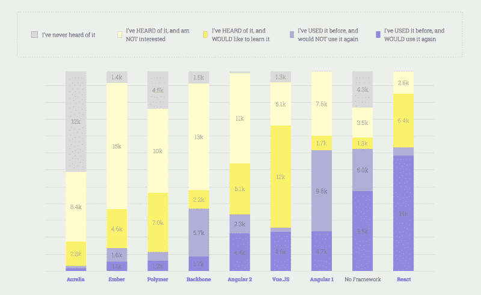
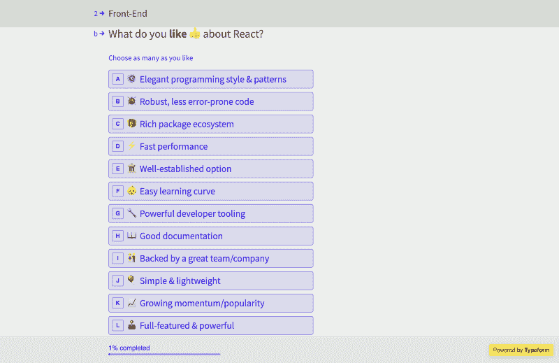

# 就拿 JavaScript 2018 年状态调查来说吧！

> 原文：<https://www.freecodecamp.org/news/take-the-state-of-javascript-2018-survey-c43be2fcaa9/>

萨沙·格里菲

# 就拿 JavaScript 2018 年状态调查来说吧！

#### 就像圣诞节或流感一样，JavaScript 状况调查每年都会回来。但与这些不同的是，这是值得期待的事情！

#### ➡️ [现在参加调查](https://stateofjs.com/)

如果您不熟悉，这个调查涵盖了 JavaScript 的所有内容，并试图回答两个主要问题:

*   开发人员最感兴趣的新兴工具是什么？
*   哪些可靠的技术是开发人员最满意的？

这两者同样重要:您希望与最新的库保持同步，以避免落后，但是您也不希望将赌注压在一个新的、未经验证的解决方案上。

[2017 Front-end Results](https://2017.stateofjs.com/2017/front-end/results)

你一定要看看去年的结果，看看我们收集了哪些数据。凭借超过 20，000 个条目，我们成功地捕捉到了生态系统中的一大块。我们希望这次能做得更好！

### 更细致的问题

今年的主要变化是我们在调查中增加了一些额外的逻辑:如果你提到使用过某个特定的图书馆，我们会问一个后续的问题来了解你喜欢(或不喜欢)它的什么:

我们希望这能帮助我们获得更多关于*为什么*一些技术受欢迎的粒度数据。

### Bye Bye CSS

随着生态系统趋向于使用 JavaScript 做任何事情，CSS 成为过去的遗物，我们决定可以安全地删除调查中的 CSS 部分。

…

开个玩笑！当然，CSS 和以前一样与 web 开发相关，但是我们不想让调查时间太长，所以我们必须做出一些艰难的选择。最后，我们决定删除所有与 CSS 库相关的问题。

但是谁知道呢，CSS 也许有一天会有自己的调查！

### 新图书馆

当然，我们已经调整了作为答案提供的默认选项，以反映生态系统的当前状态。

总的来说，没有太多大的变化，我们大部分删除了去年最不受欢迎的选项，并用用户提交的每个部分的“其他选项”类别的顶级结果来取代它们。

今年的一些新成员包括 [Preact](https://preactjs.com/) 、[故事书](https://storybook.js.org/)和 [Next.js](https://nextjs.org/) 等等。

### 结果呢

结果应该会在 11 月中旬出来，事实上我会在 11 月 9 日在巴黎的 Dot JS 上给出一个预览。如果你在的话，过来打个招呼！

如果这看起来像是一个漫长的等待，那是因为我们想给自己留下足够的时间来查看数据，并找出展示数据的最佳方式。毕竟我们一年只有一次机会把它做好！

我想我们已经谈了所有的事情，不是吗？我没有忘记任何事情，是吗？

哦耶！

### ？进行调查！？