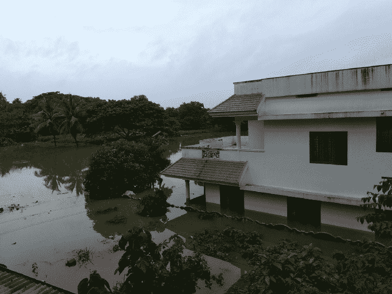

# 我如何利用众包来帮助喀拉拉邦的洪水救援行动。

> 原文：<https://www.freecodecamp.org/news/how-i-used-crowdsourcing-to-help-kerala-floods-rescue-operations-12dc97c9a24b/>

作者:阿尔纳·班萨尔

# 我如何利用众包来帮助喀拉拉邦的洪水救援行动。

#### 一夜之间，我建立了一个网站，让人们发现紧急请求

2018 年 8 月，[洪水](https://youtu.be/hzDDYwwDJ1E?t=23s)摧毁了喀拉拉邦。六分之一的人口受到直接影响。该州遭受了价值 100 万 3B 的财产损失.

我是阿纳夫，18 岁，来自班加罗尔，今年三月毕业。当洪水发生时，我遇到了[喀拉拉邦救援项目](https://github.com/IEEEKeralaSection/rescuekerala/)。这是一场志愿者开发者的运动，他们利用网络解决与喀拉拉邦洪水相关的技术挑战。

网站提供了重要的服务。它收集受害者的求助请求。它帮助志愿者和救援人员找到他们，并找到救援营地。它为救灾部队提供了可视化效果。

当我在 GitHub 和 Slack 上探索这个项目时，我发现了一个我觉得可以解决的特定问题。

### 太多请求

在百年一遇的大洪水之后，有大量的求助请求。

每次刷新救援网站上的 API 端点时，我都会看到新的请求到达。当我第一次发现它的时候，我花了将近半个小时来阅读人们的请求。

它们令人苦恼。关于老人、病人和受伤者、孕妇和婴儿的请求。一些报道称建筑物濒临倒塌或洪水上涨。有些人住在别处，无法联系到喀拉拉邦的亲戚。

但是令人苦恼的是，这些请求似乎不是即时的，或者几乎没有数据。

这些只是英文的。我看不懂用马拉雅拉姆语(喀拉拉邦的语言)写的请求。

这让我想知道:请求是如何被优先化的？我四处打听了一下。果然，人们说这是一个真正的问题。

### 理解数据

我想到了两种方法来判断请求的紧急程度。

#### 自然语言处理

像“紧急”、“婴儿”、“怀孕”或“被困”这样的词表示紧急情况，可以用来对请求进行分类。

但是这些数据有几个问题:请求是用英语和马拉雅拉姆语写的。有时，马拉雅拉姆语是用英语字母表写的。

许多都是匆忙写成的。

有人建议在应用自然语言处理之前，先将请求翻译成英文。但是翻译是有损耗的，我确信这是行不通的。

最后，我觉得紧迫性在很大程度上是与环境相关的。NLP 会处理好吗？现有的情感分析可以告诉你文本是积极的、消极的、快乐的还是悲伤的。但它不能衡量紧急程度。

也没有时间开发新的模型。尤其是考虑到语言问题。

#### 众包

我确信人们会自愿花些时间来确认紧急请求。

他们能理解计算机不擅长的暗示紧急情况的信息。

我想象了一个网站，可以获取并显示来自救援网站的请求。志愿者将按照从*不紧急*到*紧急(*值 0 到 3)的等级来评定紧急程度，并选择垃圾邮件(–1)。如果他们不懂这门语言，他们可以跳过请求。

所以我开始工作。

### 履行

我首先想到的是在 keralarescue.in 中构建众包功能

这个项目是开源的。许多人在同一个平台上构建独立但相互关联的工具。对我来说把它融入进去是有意义的。

但是我有些担心:

1.  我不确定这个想法是否可行。我不想在许多人依赖的平台上留下沉重的负担。
2.  该平台是用 Django 编写的，使用 PostgreSQL。我对这些不太熟悉，也不想尝试学习。
3.  审查系统会妨碍快速迭代。

所以我决定独立于主平台创建我的工具。

如果成功了，我会让他们合并我的数据。如果失败了呢？呃。

#### 夜战

已经是凌晨 1 点左右了。我设定了一个目标，要在五个小时内建立起我的网站，这样当人们醒来时它就准备好了。

我的想法是使用 keralarescue.in 中的 API 端点来显示帮助请求。当然我在我那端缓存了，免得给主网站增加负担。

我开始开发这个平台。我从创建数据模型开始。然后，我研究了函数和 API 端点。最后开始了前端的工作。出于快速原型开发的原因，我的堆栈包括 Firebase 和 VueJS。

我计划用[威尔逊置信区间](https://en.wikipedia.org/wiki/Binomial_proportion_confidence_interval#Wilson_score_interval)来评估分数。(用于 Reddit 上的[信心排序)它们是简单平均值的改进，因为它们占了评级的数量。](https://medium.com/hacking-and-gonzo/how-reddit-ranking-algorithms-work-ef111e33d0d9)

但是我很着急，所以我决定以后再实现这个。没有数据，这没有多大用处。

“简单”是陈词滥调。但是我发现它很有效。当我去掉复杂性时，事情似乎有所改善。我编写了简单的数据模型。我放弃了 reCAPTCHA 和身份验证，假设我不会吸引恶意用户。

到早上 8 点左右，我的原型就做好了。我已经准备好睡着了。我在 GitHub 上发布了一个链接，然后就上床睡觉了，此时谷歌分析的第一次浏览量已经出现了。

我很容易入睡。

### 让人们参与进来

我有用户。

当我中午醒来时，我先检查了分析。大约 30 次访问。我现在有两个在线用户。来自喀拉拉邦。*哇哇*。

反馈是积极的。我收集了相当多的数据。一天来，我不断改进我的平台。

*   我放弃了垃圾邮件选项。我了解到人们不确定哪些请求是垃圾邮件。许多人缺少信息。这些可能是来自赶时间的人或者不擅长技术的人的完全有效的请求。
*   我实现了威尔逊评分。我创建了一个 API 端点，它根据目前收集的所有用户评级返回 0 到 1 之间的置信度值。这个想法是让 keralarescue.in 使用这个端点来定期更新它的数据集。该值可用于排序和查找最紧急的请求
*   我添加了一个页面来显示紧急请求。我想让这个工具尽快派上用场。

下午 4 点左右，我决定在 Slack 和 Github 上公布。

这被证明是一个转折点，在接下来的几个小时里，该网站有 20-30 名用户在线。他们来自印度各地，也来自美国。喀拉拉邦的用户继续工作到深夜，在凌晨 2 点整理请求。

我注意到人们对请求评分的速度比我预期的要慢。

第二天晚上，我会知道为什么。

#### 分流小组

到第二天，我已经完成了大部分开发工作。很多人开始联系我。他们喜欢我的项目——尤其是简单的界面。

晚上，我在 Twitter 上收到了一个叫 Nishanth 的人发来的 DM，询问我的网站是否可以用来对请求进行分类。我们接到一个电话，我描述了人群如何帮助决定请求的紧急程度。

他把我加入了 WhatsApp 上的百人群。事实证明，这些伟大的人一直在以一种完全不同的方式使用我的网站。

他们主动给请求者打电话，了解他们的最新情况。他们不是根据文本内容，而是根据与受影响的人的实际对话来评定紧急程度。 *WOAH。*

我意识到我的数据库包含了比我想象的更有价值的信息。我们直接帮助志愿者接触受害者。感谢我工作的信息不断涌入我的手机。

### 丢失数据源

回到主项目，人们正在为一个大事件做准备。喀拉拉邦政府将公开宣布救援网站。预计交通会很拥挤。

主网站提供了很多功能。请求、捐赠、救济营、志愿者协调、公告的热图，你明白了要点。

我对开发运营团队产生了极大的尊重，因为当网站流量达到一定程度时，他们通宵工作来扩展它。

一切似乎都在工作，除了一件事:**他们关闭了我所依赖的 API 端点。**

现在，我知道我使用的端点无法扩展。它一次返回所有请求。在它的生命即将结束时，它返回一个 10 MB 的数据集。它是为开发而设计的，而不是用于生产。

幸运的是，我的站点已经有了一个缓存机制，所以它仍然可以运行。

我和团队取得了联系。他们在建造一个替代品。但是他们还有很多东西要建，所以我尽量不去催促。

我的站点继续运行，没有出现任何问题，分诊组(此时有多个)继续运行，尽管没有新的数据。

### 新功能？

此时，我开始思考改进的方法。

当替代路线可用时，直接的问题是大量新数据的涌入。我还能做哪些改进？

我想通了一些特性。

*   **基于时间的分组**:分配一定比例的用户专门处理最新的请求。同样，将用户分配到较旧请求的部分。
*   [**布鲁姆过滤器**](https://www.jasondavies.com/bloomfilter/) **:** 它们是测试集合成员关系的一种空间有效的方式。我可以在很多事情上使用 bloom filters:确保我们用尽了所有请求，并限制重复访问。
*   **状态更新**:我可以为人们建立一个功能来更新请求的状态。这是一个微不足道的建设，人们要求它。但是在主平台上工作的人告诉我他们已经在建一个了。
*   Websockets: 当新的请求到达时，我可以实时地把它们传送到网站上。结合状态更新和时间分组，我们可以在请求到达时获得详细的信息。

我有很多相互竞争的想法，我不确定哪些能及时实现才是有用的。

### 总结

API 端点第二天返回。现在它被分页，一次返回 300 个请求。我很快编写了一个脚本，使用新的 API 下载和维护本地缓存。

我收到的电话和信息数量创下新高。以前从未被雇佣过，这是一个新领域。在主平台上工作的开发人员联系了我。他们致力于整合众包数据——紧急等级和我们正在收集的状态更新。

当这一天结束时，分诊组的人感觉到了变化。

他们呼叫的大多数受害者报告最近被解救。事实证明，地面救援任务已经开始。

这是个好消息。大约凌晨 5 点，我接到了尼桑特的电话。他与监督救援行动的政府官员保持联系。我们把网站上的数据和电子表格打包，然后交给他们。

当我写这篇文章的时候，洪水受害者已经被救出并运送到救济营地。新的挑战涉及难民营之间的后勤和来自全国各地的援助。

### 课程

*   简单:许多人给我发消息说他们喜欢我的网站。我不是设计师，但我保持 UX 简洁的决定帮助人们更快地加入进来。
*   **计算很便宜:**所有这些都托管在谷歌云平台上。它花了我不到一美元，包括在我的免费等级信用。如果我知道它有多便宜，我会构建一个后端很重的应用程序。
*   **旋转**:我希望我已经完全旋转到一个详细的分类平台。志愿者们想出了一个临时的解决方案，但事后看来，我更愿意发布具有这些特性的平台。
*   网络很重要:人们想要帮忙。最初的 30 人小组在两天内增长到 230 人，因为人们会打电话给他们的朋友和熟人。来自喀拉拉邦、印度其他地方和世界各地的人们加入了进来。

我见过很多了不起的人。我学到了很多，包括技术和其他方面。通过这一切，最不可思议的感觉是和成千上万的其他人在同一页上。

如果我的工作值得一篇文章，那么我参与的这个项目值得一本书。

对我来说，我正在与参与救灾的人们接触，学习他们的经验和专业知识。

关于我:我在间隔年钻研密码经济学。十年级的时候，我在学校主持一次黑客马拉松时学会了 web 开发技能。

我正考虑在此基础上开发一个项目，但要结合我和我的朋友们从那以后获得的许多其他见解。

*   来自伤检分类小组的志愿者安·托马斯在这里写下了她的经历
*   *感谢 Harikrishnan 博士、Nishanth 博士、Ajit Chandran、Prasad Pillai，他们帮助组织了分流小组*