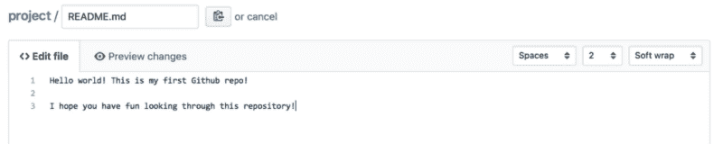
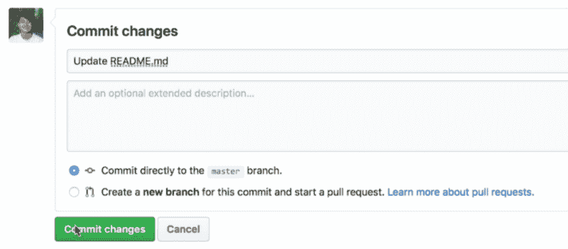
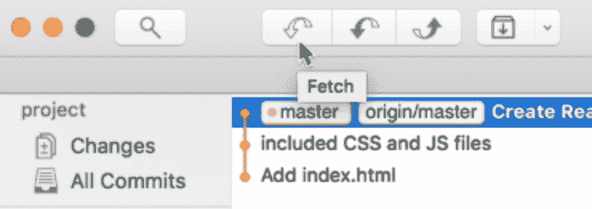
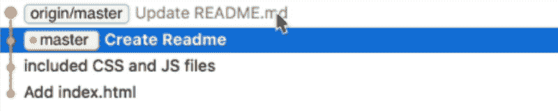
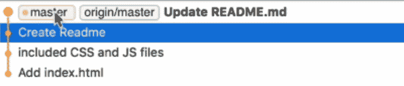

# 如何从 Git 远程存储库中提取

> 原文：<https://www.freecodecamp.org/news/how-to-pull-from-a-git-remote-repository-b9fabb6b3c9d/>

注意:这是 Git 初学者系列的第四个视频。[在这里看第一个视频](https://zellwk.com/blog/setting-up-git)。

当您对本地存储库进行更改时，您可以将更改推送到 Git 远程存储库。同样，当远程发生变化时，您可以将变化拉回您的本地存储库。

今天，您将学习如何将数据从远程设备拉回到存储库。

### 对遥控器进行更改

通常，处理同一项目的另一个人会对遥控器进行更改。他们在自己的计算机上修改代码，然后将代码推送到远程存储库。

一旦远程存储库发生变化，您可以将其拉回本地存储库以获得更新的版本。

这是标准的工作流程。

但是，由于我是一个人在做这个项目，我将向您展示如何直接在 GitHub 上更改远程存储库。一旦完成，我们就从那里撤出。

### 直接更改 GitHub 存储库

假设我们想要更改`README.md`文本。

为此，您可以单击自述文件旁边的铅笔图标。这将把您带到一个编辑器，您可以在其中更改文本。

完成后，向下滚动到底部，写一条提交消息。你可以点击绿色按钮直接在 GitHub 上提交修改。

项目将被更新。

### 获取更改

Fork 和其他 Git 客户端可以向您展示对远程存储库的更改。他们通过一个名为 Git Fetch 的命令来实现。

你可以通过点击向下的空箭头来自己取数据。它是左上角最左边的箭头按钮

Fetch 检查远程存储库是否有任何更改。就像一个邮件客户端说你有三封邮件要看。

一旦获取完成，您可以在 Git 历史中看到`origin/master`正在进行`update README.md`提交。`update README.md`提交比我们本地的主分支提前一个提交。

在侧边栏上，你可以看到我们的主分支旁边的数字 1，以及一个向下的箭头。这告诉我们，我们的分支比远程操作晚一次提交。

### 拉动变化

要更新您的本地分支机构，您可以单击“拉”按钮。下拉按钮是左上角的实心向下箭头。是取和推之间的那个。

当您单击“拉”时，您将能够选择您想要拉的分支。因为我们之前已经跟踪过它，所以您可以通过再次单击 pull 来直接拉动主分支。

当您将分支从远程拉到本地存储库时，您会看到`master`与`origin/master`移动到相同的提交。

### 包扎

Fetch 检查远程存储库中是否有任何更改。

“拉”将变更从远程存储库带到您的本地存储库。

感谢阅读。这篇文章对你有什么帮助吗？如果你有，[我希望你能考虑分享它](http://twitter.com/share?text=Pulling%20from%20a%20Git%20remote%20by%20@zellwk%20?%20&url=https://zellwk.com/blog/pulling-from-a-git-remote/&hashtags=)。你可能会帮助别人。谢谢大家！

这篇文章最初发布在[我的博客](https://zellwk.com/blog/pulling-from-a-git-remote/)。如果你想要更多的文章来帮助你成为一个更好的前端开发者，注册我的[时事通讯](https://zellwk.com/)。