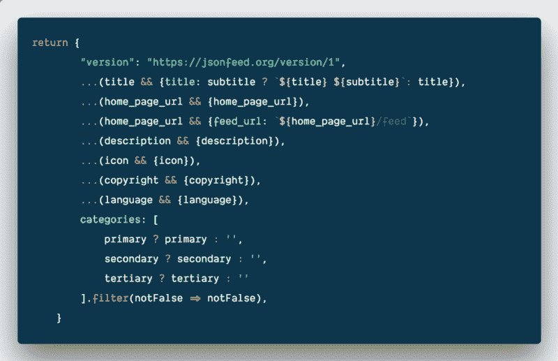

# 如何使用 ES6 在 JavaScript 中有条件地构建对象

> 原文：<https://www.freecodecamp.org/news/how-to-conditionally-build-an-object-in-javascript-with-es6-e2c49022c448/>

by Knut Melvær

# 如何使用 ES6 在 JavaScript 中有条件地构建对象



在数据源之间移动用户生成的数据通常需要您检查字段是否有值。然后在此基础上构建输出。这就是如何使用 JavaScript 中的一些 ES6 特性来更简洁地实现它。

自从 [Sanity.io](https://sanity.io) (我工作的地方)发起[语法](https://syntax.fm/show/068/design-tips-for-developers)以来，我一直在修补 [CLIs](https://github.com/sanity-io/podcast-to-sanity) 、 [Express 和无服务器功能中播客的 RSS 提要。](https://github.com/sanity-io/Syntax)这涉及到解析和构建包含大量字段和信息的复杂对象。因为您处理的是来自不同来源的用户生成的数据，所以不能保证这些字段总是被填充。有些字段也是可选的。并且您不希望在 RSS XML 或 [JSON 提要](https://jsonfeed.org)中输出没有值的标签。

之前我会通过在一个对象上应用新的键来处理这个问题，就像这样:

这并不完全顺利(但它是可行的)，如果你有很多字段，你很快就会有很多`if-`语句。我还可以做一些漂亮的事情，比如循环对象键等等。这意味着代码有点复杂，你也不知道数据对象是什么。

然而，ES6 中的新语法再次拯救了我们。我发现了一种模式，可以将代码改写成这样:

这个函数有几个特性。第一种是 [**参数对象析构**](https://www.youtube.com/watch?v=-vR3a11Wzt0) ，如果您想处理函数中的大量参数，这是一个很好的模式。所以代替这种模式:

```
function episodeParser(data) {  const id = data.id  const title = data.title  // and so on...}
```

你写道:

```
function({id, title}) {  // and so on...}
```

这也是避免函数中有多个参数的好方法。还要注意对象析构的`description = ‘No summary’`部分。这就是我们所说的参数默认。这意味着如果`description`未定义，它将被定义为字符串`No summary`作为后备。

第二种是三个圆点 [**展开句法**](https://developer.mozilla.org/en-US/docs/Web/JavaScript/Reference/Operators/Spread_syntax) ( `...`)。它用于在条件为真时“解开”对象(这就是`&&`的作用):

```
{  id: 'some-id',  ...(true && { optionalField: 'something'})}
```

```
// is the same as
```

```
{  id: 'some-id',  optionalField: 'something'}
```

您最终得到的是一个简洁明了的函数，它也很容易测试。使用`&&`操作符的一个重要警告是数字 0 将被认为是`false`。所以你必须注意你的数据类型。

如果我们将该函数付诸实施，它看起来会像这样:

你可以在我们为 [express.js](https://github.com/sanity-io/Syntax/blob/master/routeHandlers/rss.js) 和 [netlify lambdas](https://github.com/sanity-io/Syntax/blob/master/functions/rss.js) 实现的播客提要中看到它的作用。如果你想亲自尝试 Sanity.io 的这些实现，你可以去[sanity.io/freecodecamp](https://sanity.io/freecodecamp?utm_source=freecodecamp&utm_medium=blog&utm_campaign=jq)获得一个升级的免费开发者计划。✨

最初发表于 [www.sanity.io](https://www.sanity.io/blog/how-to-conditionally-build-an-object-in-es6) 。