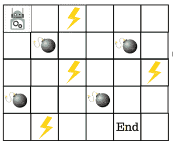
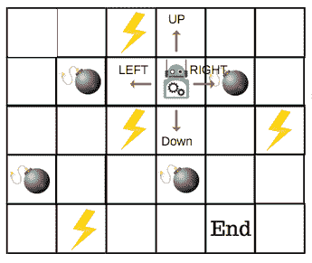
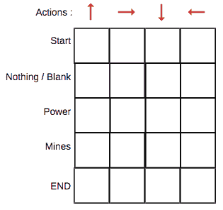
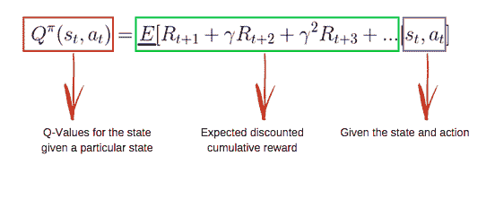
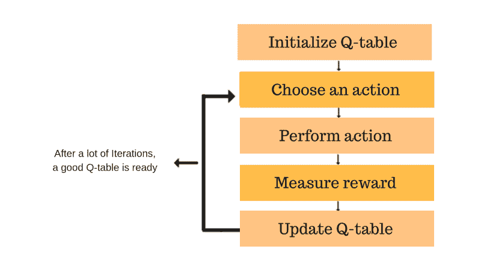
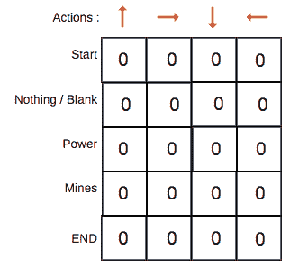
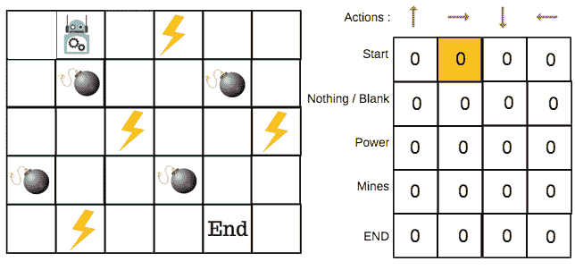
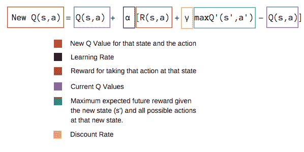
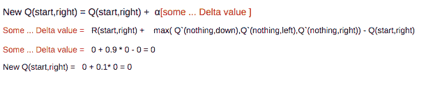

# Q 学习导论:强化学习

> 原文：<https://www.freecodecamp.org/news/an-introduction-to-q-learning-reinforcement-learning-14ac0b4493cc/>

通过 ADL

# Q 学习导论:强化学习

Photo by [Daniel Cheung](https://unsplash.com/@danielkcheung?utm_source=medium&utm_medium=referral) on [Unsplash](https://unsplash.com?utm_source=medium&utm_medium=referral).

本文是我的“深度强化学习”系列的第二部分。完整系列将在[媒体](https://medium.com/@alamba093)和[我的 YouTube 频道](https://www.youtube.com/channel/UCRkxhh51YKqpn2gaUI3MXjg)的视频中提供。

在[系列的第一部分](https://medium.freecodecamp.org/a-brief-introduction-to-reinforcement-learning-7799af5840db)中，我们学习了强化学习的**基础**。

Q-learning 是强化学习中一种基于值的学习算法。在本文中，我们将了解 Q-Learning 及其细节:

*   什么是 Q-Learning？
*   Q 学习背后的数学
*   使用 python 实现

### q-Learning——一个简单的概述

假设一个**机器人**要穿过一个**迷宫**并到达终点。还有**地雷**，机器人一次只能移动一块瓷砖。如果机器人踩到地雷，机器人就死了。机器人必须在尽可能短的时间内到达终点。

评分/奖励系统如下:

1.  机器人每走一步减 1 分。这样做是为了让机器人走最短的路径，尽可能快地到达目标。
2.  如果机器人踩到地雷，点数损失 100，游戏结束。
3.  如果机器人得到力量⚡️，它得到 1 点。
4.  如果机器人到达终点目标，机器人得到 100 分。

现在，显而易见的问题是:**我们如何训练一个机器人以最短的路径到达最终目标而不踩到地雷？**

那么，我们如何解决这个问题呢？

### Q 表简介

Q-Table 只是一个简单的查找表的花哨名称，在该表中，我们计算每个状态下行动的最大预期未来回报。基本上，这张表将指导我们在每个状态下的最佳行动。

在每个非边缘牌上将有四个数量的动作。当机器人处于某一状态时，它可以上下左右移动。

因此，让我们在 Q 表中模拟这种环境。

在 Q 表中，列是动作，行是状态。

每个 Q-table 分数将是机器人在该状态下采取行动时将获得的最大预期未来奖励。这是一个迭代过程，因为我们需要在每次迭代中改进 Q 表。

但是问题是:

*   我们如何计算 Q 表的值？
*   这些值是可用的还是预定义的？

为了学习 Q 表的每个值，我们使用 **Q 学习算法。**

### 数学:Q 学习算法

#### q 函数

**Q 函数**使用贝尔曼方程并接受两个输入:状态( **s** )和动作( **a** )。

使用上面的函数，我们得到表格中单元格的值 **Q** 。

当我们开始时，Q 表中的所有值都是零。

有一个更新值的迭代过程。当我们开始探索环境**，**时，Q 函数通过不断更新表中的 Q 值，为我们提供了越来越好的近似值。

现在，让我们了解更新是如何发生的。

### 介绍 Q 学习算法过程

每个彩色方框代表一个步骤。让我们详细了解这些步骤。

#### **步骤 1:初始化 Q 表**

我们将首先构建一个 Q 表。有 n 列，其中 n=动作的数量。有 m 行，其中 m=状态数。我们将把值初始化为 0。

在我们的机器人例子中，我们有四个动作(a=4)和五个状态(s=5)。因此，我们将构建一个四列五行的表格。

#### **步骤 2 和 3:选择并执行一个动作**

这些步骤的组合在不确定的时间内完成。这意味着这个步骤会一直运行，直到我们停止训练，或者训练循环按照代码中的定义停止。

我们将基于 Q 表在状态中选择一个动作。但是，如前所述，当剧集开始时，每个 Q 值都是 0。

所以现在探索和开发权衡的概念开始发挥作用。[本文有更多细节](https://medium.freecodecamp.org/a-brief-introduction-to-reinforcement-learning-7799af5840db)。

我们将使用一种叫做**ε贪婪策略**的东西。

开始时，ε比率会更高。机器人将探索环境并随机选择行动。这背后的逻辑是机器人对环境一无所知。

随着机器人探索环境，ε速率降低，机器人开始利用环境。

在探索过程中，机器人在估计 Q 值时逐渐变得更加自信。

**以机器人为例，有四个动作可以从**中选择:上、下、左、右。我们现在开始训练——我们的机器人对环境一无所知。所以机器人选择了一个随机的动作，比如说右。

现在，我们可以使用贝尔曼方程更新位于起点并向右移动的 Q 值。

#### **步骤 4 和 5:评估**

现在我们已经采取了一项行动，并观察到了一个结果和奖励。我们需要更新函数 Q(s，a)。

在机器人游戏的情况下，重申得分/奖励结构是:

*   **功率** = +1
*   **地雷** = -100
*   **结束** = +100

我们会一遍又一遍地重复这个过程，直到学习停止。这样，Q 表将被更新。

### Q 学习的 Python 实现

概念和代码实现在我的视频里[解释过。](https://www.youtube.com/watch?v=yefGGgz20tY)

订阅我的 YouTube 频道更多 AI 视频: [**ADL**](https://goo.gl/u72j6u) 。

### 最后，让我们回顾一下

*   Q-Learning 是一种基于值的强化学习算法，用于使用 Q 函数来寻找最优的动作选择策略。
*   我们的目标是最大化价值函数 q。
*   Q 表帮助我们找到每个状态的最佳行动。
*   它有助于通过选择所有可能行动中的最佳行动来最大化预期回报。
*   Q(state，action)得出该行为在该状态下的预期未来回报。
*   可以使用 Q-Learning 来估计该函数，Q-Learning 使用 **Bellman 方程迭代地更新 Q(s，a)。**
*   最初，我们探索环境并更新 Q 表。当 Q 表准备好时，代理将开始利用环境并开始采取更好的行动。

**下次我们将研究一个深度 Q 学习的例子**。

在那之前，享受 AI？。

**重要**:如前所述，本文是我的“深度强化学习”系列的第二部分。完整系列将在[媒体](https://medium.com/@alamba093)的文章和[我的 YouTube 频道](https://www.youtube.com/channel/UCRkxhh51YKqpn2gaUI3MXjg)的视频中提供。

如果你喜欢我的文章，请点击？帮助我保持写文章的动力。请在 M **edium** 和其他社交媒体上关注我:

如果您有任何问题，请在下面的评论中或在 [**Twitter**](https://twitter.com/I_AM_ADL) 上告诉我。

订阅[我的 YouTube 频道](https://goo.gl/u72j6u)获取更多科技视频。