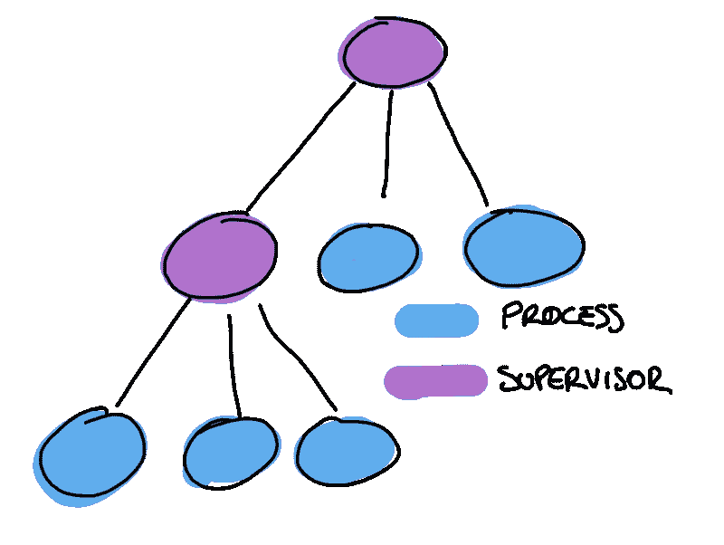
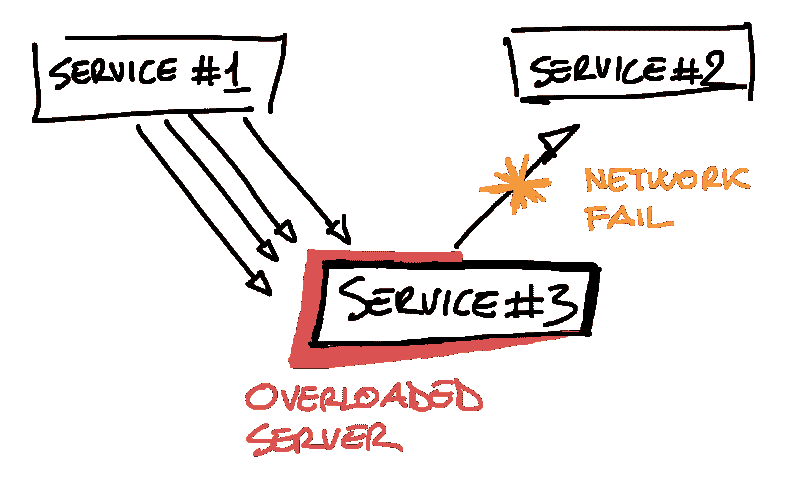
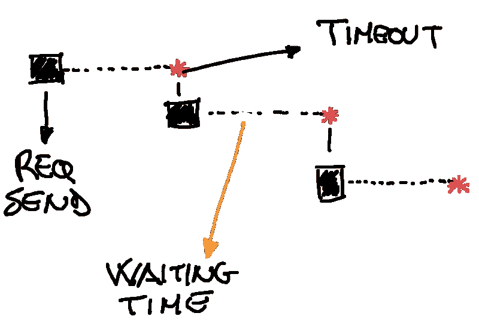
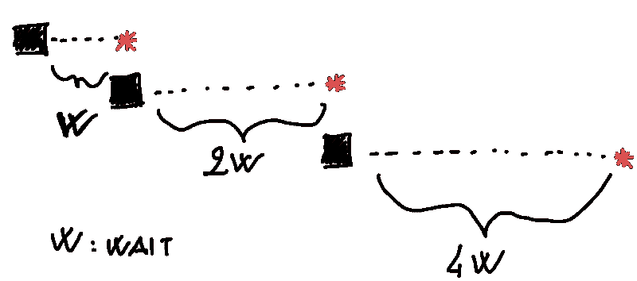
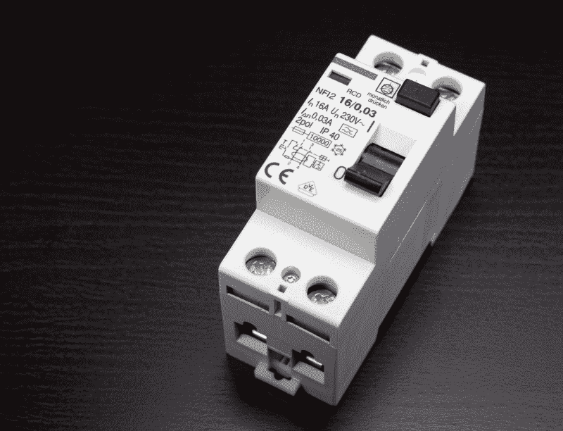

# 如何打造坚如磐石的 app

> 原文：<https://www.freecodecamp.org/news/how-to-build-a-rock-solid-app-29dffe7875d2/>

#### 不同应用程序设计选项概述

当我们设计软件时，我们不断地考虑错误案例。错误对我们设计和构建解决方案的方式有着巨大的影响。事实上，以至于有一种哲学叫做[让它崩溃](http://wiki.c2.com/?LetItCrash)。

**让它崩溃**是 Erlang 处理故障的方式，让应用程序崩溃，并允许管理程序从干净的状态重新启动崩溃的进程。



Supervisors restart the crashed process

错误可能无处不在，您的应用程序增长得越多，您需要控制的故障点就越多。外部服务调用、发送电子邮件、数据库查询都是可能失败的操作。

#### 失败的种类

故障可能有不同的起因，这会对您的服务可用性产生不同的影响。想象一下这样一个场景，我们运行了太多的 SQL 查询，数据库服务器将要抑制应用程序。在这种情况下，我们可以重试查询，或者在代码中添加一个 catch 来识别失败的查询，并向用户提供合理的响应。

这种错误被称为**暂时性错误，**这意味着数据库服务器暂时过载，但很快就会恢复。

**瞬时错误**与应用中的任何问题无关。它们通常是由外部条件引起的，如网络故障、服务器过载或服务速率限制。因此，客户端可以安全地忽略它，过一会儿重试失败的操作。

这些错误在云原生应用程序中更为常见，因为这些应用程序被分成不同的服务，并部署在通过网络通信的不同服务器上。



#### 识别瞬时错误

瞬时错误通常可以自动检测到。我们可以通过检查传输层元数据(例如 HTTP 错误、网络错误、超时)或当错误被明确标记为暂时错误(例如速率限制)时识别错误。

#### 处理错误

出现错误时，我们可以采取不同的措施。一种简单的方法是重试请求、API 调用或查询。

尽管这种解决方案在很多情况下可能是好的，但在很多情况下，它会导致应用程序的性能下降。

让我们以网络故障为例。无限期地重试对断开连接的服务的一些 API 调用将导致连续的网络超时，并且应用程序将长时间等待响应。



在进行复杂的实现之前，让我们评估一下“重试”选项的利弊。

**优点**

*   琐碎的实现。
*   无状态(每个重试请求都是隔离的，不需要任何额外的信息)。

**CONS**

*   对于负载较重的应用程序，调用者会不断地向降级的服务器发送请求，从而导致拒绝服务。
*   在服务器恢复之前无法提供响应。

这个简单的重试策略可以被认为是解决这个问题的第一个方法。对于低流量的应用来说，这是可行的，但是如果你有一个更复杂的架构，这肯定是不够的。

因此，让我们讨论一种更具弹性的方法。

#### 从 IEEE 窃取一个想法

可靠应用程序之旅的下一站是避免浪费时间，并使应用程序响应更快。指数补偿算法可能是这项工作的合适工具。

*指数补偿*的概念直接来自于[以太网](https://en.m.wikipedia.org/wiki/Exponential_backoff#Example_exponential_backoff_algorithm)网络协议(IEEE 802.3)，它被用于数据包冲突解决。

出于我们的目的，指数回退可以用来避免在超时调用之间浪费时间，或者避免用无法解决的连续请求流来打击过载的服务器。

分组冲突的二进制指数补偿可以在以下定义的帮助下恢复:

> 在*c*冲突之后，选择 0 和 2*c* - 1 之间的随机时隙数。对于第一次冲突，每个发送方将等待 0 或 1 个时隙。第二次冲突后，发送方将等待 0 到 3 个时隙。第三次冲突后，发送方将等待 0 到 7 个时隙(包括 0 和 7)，依此类推。随着重传尝试次数的增加，延迟的可能性也呈指数增长- [指数补偿-维基百科](https://en.m.wikipedia.org/wiki/Exponential_backoff)



这种算法可以很快适应许多用例。下面的例子是一个 PHP 消息处理程序类，它以指数形式等待来自 API 端点的响应。

```
<?php
/**
 * Assume that we're using a message bus which is able to
 * retry failed messages with a custom retry delay.
 */
class FetchCarMessageHandler
{
  public function handle(Message $msg)
  {
    try {
      $id = (int)$msg->getContent();
      $cars = $client->get('/car/'.$id);

      return Result::success($cars);
    } catch (TimeoutException $e) {
      $lastBackoff = $msg->getLastBackoff();
      // The infrastructure layer will automagically retry the message after XYZ seconds
      return Result::retryAfter($lastBackoff * 2, $msg);
    }
  }
}
```

#### 重试与指数回退

前两种策略都是次优的。它们保证您最终能够生成一个响应返回给客户端，但是它们依赖于不断调用外部服务，直到收到一个成功的响应。

我们可能很幸运，在几次重试后收到响应，或者我们可能陷入重试-等待-重试-等待…无限循环，永远收不到响应。你知道，墨菲定律永远存在:“任何可能出错的事情都会出错”

正如您所想象的，扩展面向服务的基础设施，在出现故障的情况下不断重试对相关服务的请求，是应用程序崩溃的最佳方法。

我们需要一个更强有力的战略来保持基础设施的弹性。

#### 电子产品可能会帮助我们



[Source: https://pixabay.com/en/circuit-breakers-rcds-fault-current-1167327/](https://pixabay.com/en/circuit-breakers-rcds-fault-current-1167327/)

在连续出错的情况下，容易做的事情是清楚的。我们不想循环并重试调用外部服务。关键是我们将**停止**这样做，从电子学中引入**断路器**的概念。

#### 从电子学到计算机科学

断路器是将受保护的调用包装到外部服务的组件，可以通过检查服务健康状况来监控响应。就像电子元件一样，软件断路器可以**打开**或**关闭**。一个**打开**状态意味着电路后面的服务关闭，一个**关闭**状态意味着服务开启。

因此，断路器可以自主控制服务状态，并决定**断开**或**闭合**电路，以便在断开连接或服务器过载的情况下，客户端停止发送新的连接，降级的服务可以使用更多资源来恢复健康状态。

在**开路**的情况下，我们可以决定用回退响应来快速响应客户。例如，缓存数据、默认数据或任何对特定应用程序有意义的数据。

让我们看一个来自电子商务世界的真实例子。我们将使用断路器方法来保护产品列表 API 调用。

```
<?php
class CircuitBreaker
{
  private $maxFailures;
  private $service;
  private $redisClient;

  public function __construct(int $maxFailures, callable $service)
  {
    $this->maxFailures = $maxFailures;
    $this->service = $service;
    $this->redisClient = new RedisClient();
  }
  private function isUp(string $key)
  {
    return (int)$this->redisClient->get($key) < $this->maxFailures;
  }
  private function fail(string $key, int $ttl)
  {
    $this->redisClient->incr($key, 1);
    $this->redisClient->expire($key, $ttl);
  }

  public function __invoke()
  {
    [$arguments, $defaultResponse] = func_get_args();
    $key = md5($arguments);
    if (!$this->isUp($key)) {
        return $defaultResponse;
    }
    try {
      $result = call_user_func_array($this->service, $arguments);

      return $result;
    } catch (\Throwable $e) {
      $this->fail($key, 10);

      return $defaultResponse;
    }
  }
}
```

断路器将透明地处理所有错误，并在 API 调用失败时显示默认响应。它还允许定义最大重试次数，以避免太多失败的呼叫。

在这种情况下，保护第三方服务 API 调用是一项非常简单的任务:我们只需要提供回调和允许的最大失败次数，之后**断路器**将打开 10 秒，默认响应将返回给客户端，如下例所示。

```
<?php
$productListing = new CircuitBreaker(
    10, 
    function($searchKey) {
        // $result is given from the api call
        return $result;
    }
);
$productsToShow = $productListing(['t-shirt'], []);
```

#### 结论

无论你是在设计 SOA、微服务还是云原生应用，你都应该准备好以正确的方式应对失败。从你启动应用的那天起，错误和失败就在同一个房间里。

下面是一些构建真正坚如磐石的应用程序的著名策略:

*   [https://docs . Microsoft . com/en-us/azure/architecture/patterns/retry](https://docs.microsoft.com/en-us/azure/architecture/patterns/retry)
*   [https://en.m.wikipedia.org/wiki/Exponential_backoff](https://en.m.wikipedia.org/wiki/Exponential_backoff)
*   [https://martinfowler.com/bliki/CircuitBreaker.html](https://martinfowler.com/bliki/CircuitBreaker.html)