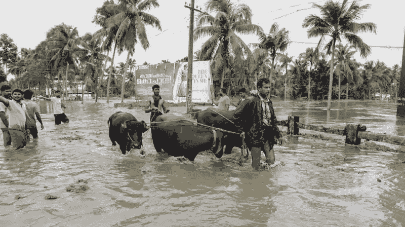
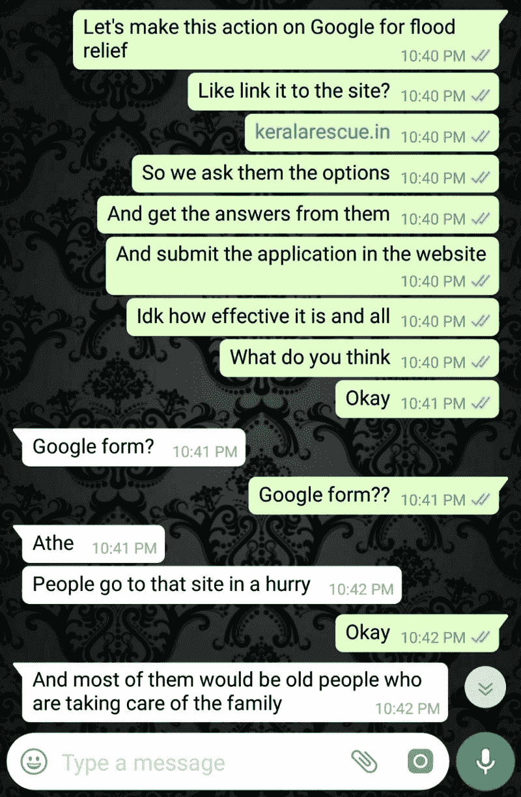
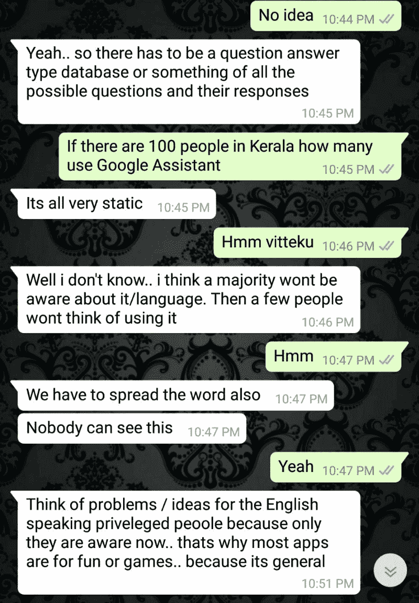
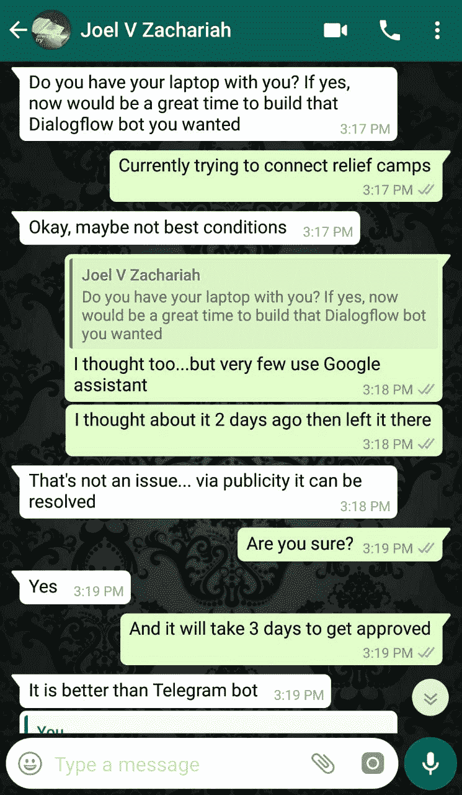
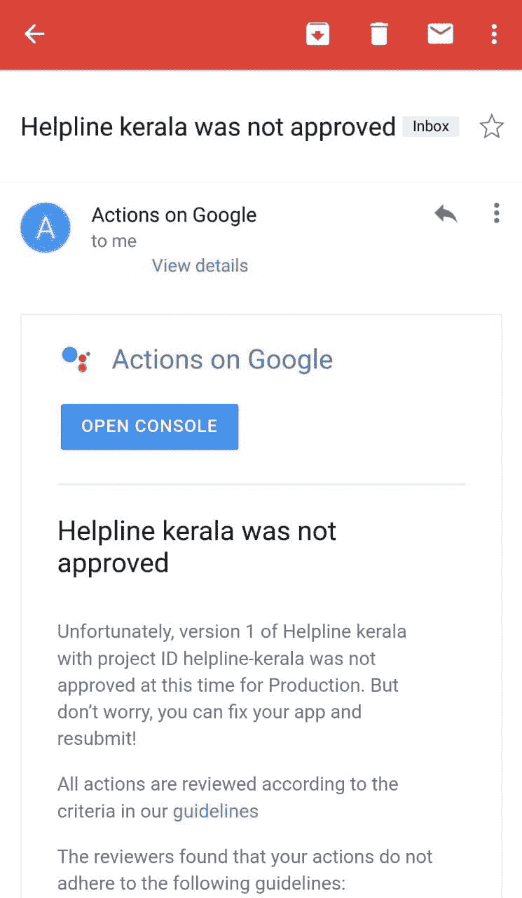
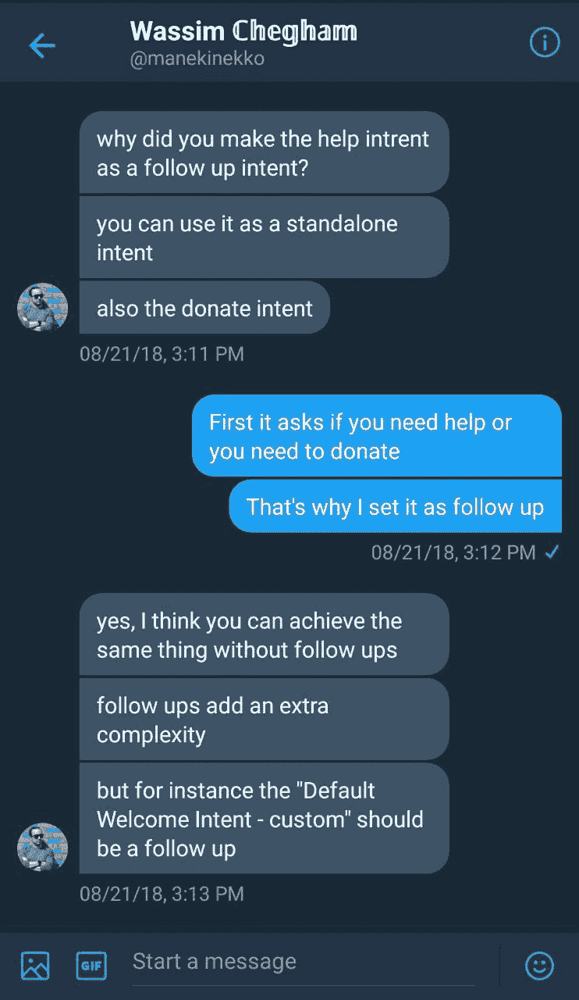
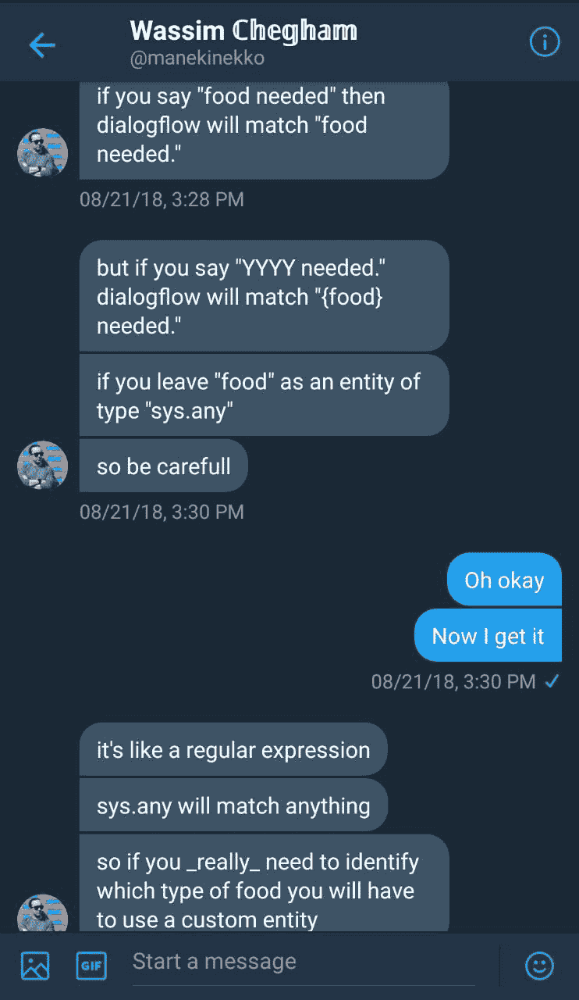
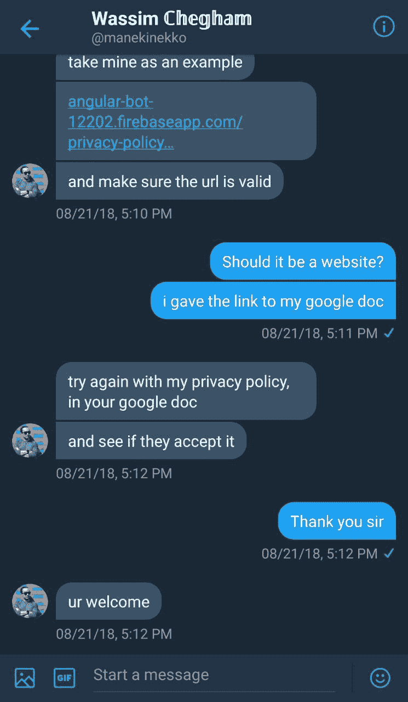
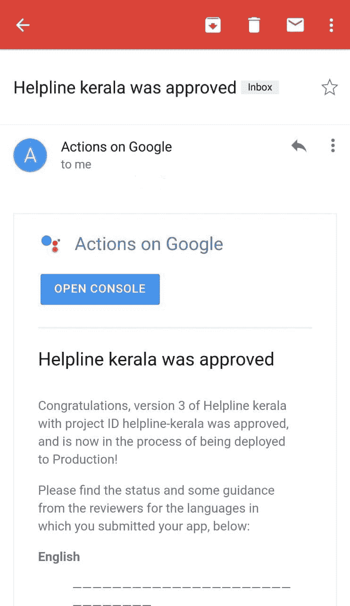

# 我是如何建立喀拉拉邦求助热线并为洪灾救援捐款的

> 原文：<https://www.freecodecamp.org/news/helpline-kerala-aog-my-contribution-to-flood-relief-kerala-4b2d55b42b8f/>

作者:法尔哈·卡里姆

# 我是如何建立喀拉拉邦求助热线并为洪灾救援捐款的

Image [source](https://www.hindustantimes.com/india-news/kerala-received-164-more-rains-in-august-42-more-during-the-entire-monsoon-season-imd/story-id4oZjMh0kkwcoy4z1pdwO.html)

2018 年 8 月，由于季风季节异常高的降雨量，严重的洪水影响了印度南部的喀拉拉邦。这是近一个世纪以来最严重的洪水。所有 14 个地区都处于红色警戒状态。

我一直想在谷歌上开发一个动作，所以我去了[网站](https://developers.google.com/actions/)，查看了由 [ActionsOnGoogle](https://twitter.com/ActionsOnGoogle) 创建的[代码实验室](https://developers.google.com/actions/codelabs/)。我从[曼迪·陈](https://www.freecodecamp.org/news/helpline-kerala-aog-my-contribution-to-flood-relief-kerala-4b2d55b42b8f/undefined)和[系统](https://www.freecodecamp.org/news/helpline-kerala-aog-my-contribution-to-flood-relief-kerala-4b2d55b42b8f/undefined)在线研讨会上了解了 codelabs。

他们举办了两次研讨会——你可以在这里和这里听他们的[。](https://zoom.us/recording/play/S6_gDt2Dse56QZN0XzXmp3dXSSugukGodRzTwBQOCuWNwin7xBaWGEASGFO07kWA?continueMode=true)

这两个在线研讨会都是由曼迪·陈策划和教授的。

我从这些资源中学到了大部分基础知识，它们帮助我建立了我的行动。我也会向所有想学习如何构建 codelabs 的人推荐 codelabs。

洪水期间，我碰巧住在阿卢瓦。你可以看我之前的[故事](https://medium.com/@farhakareem/how-floods-in-kerala-affected-me-4d1b0e3a7b57)来了解洪水对我的影响。

我有一个想法，想做一个动作，可以作为网站 keralarescue 的链接。我和几个朋友讨论了这个想法，我们考虑了不同的问题，如语言，使用谷歌助手的人数，以及他们可能的恐慌状态。这些问题使我无法进一步推进这个计划。

discussion about the action with my friends

后来，我加入了一个名为 *Ernakulam relief camps 的 Whats App 群组。*该活动旨在帮助各个救援营地的志愿者解决 Ernakulam 地区不同营地的过剩或未满足的需求。

这个小组后来每天都被大量寻求帮助和分享热线号码的信息淹没，有有效的也有无效的。起初，我在我 12 岁的堂兄 Adil AbdulKhader T1 的帮助下，开始在谷歌表单中对有效和无效信息进行分类。

但所有这些努力都白费了。然后，我决定分发一份谷歌表格，但似乎什么都不管用。

我已经告诉我的朋友乔尔·维兰拉姆·扎卡里亚我对开发一个行动的兴趣。他给我发信息，告诉我这是实施我的想法的最佳时机。

Joel’s message

我当时决定认真对待这个项目。因为我知道获得有效的热线号码有多困难，所以我决定我的行动将基于此。喀拉拉邦求助热线就是这样起步的！

Helpline Kerala

我开始收集不同资源的供应商的有效数量，然后决定把它们放在我的应用程序上。我用自己的基础知识搭建了这个 app。Adil AbdulKhader 帮助我获得了部署应用程序所需的图像。在我的朋友[阿达什·梅农](https://www.freecodecamp.org/news/helpline-kerala-aog-my-contribution-to-flood-relief-kerala-4b2d55b42b8f/undefined)的一点指导下，我们把它部署好了。

我的应用程序围绕两个部分:捐款和寻求帮助。所以对于捐赠部分，我问曼迪·陈，开发者是否可以要求支付捐款。她告诉我，它目前还不被支持，她将与团队分享这个想法。

Successfully Rejected!

我收到了一封电子邮件，详细解释了我的应用被拒的原因:

*   隐私策略 URL 不正确。
*   我的应用程序有时会不必要地让麦克风开着。

这是做得更好的巨大动力。我在推特上联系了 Wassim Chegham，他是谷歌行动的 GDE，并向他寻求帮助。他告诉我添加他为合作者，这样他就可以检查我的工作。他很快发现了我的问题所在:

*   当使用 sys.any 时，可以用任何单词替换它。
*   应该避免跟进意图，因为这会使我的用例更加复杂。

Guidance

他还从他的应用程序中向我提供了一个样本隐私政策。有了正确的指导，我能够发展我的行动，然后部署它。

第二天收到邮件说我的 app 通过了！

Approved!

这是我的行动演示，请随时查看:)

此外，你还可以在谷歌助手上通过“*与喀拉拉邦热线通话”来查看*我在这里提供了[的链接](https://assistant.google.com/services/a/uid/0000004adeb95783?hl=en) *。*

这绝对是一次美妙的经历！