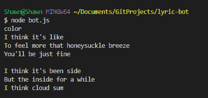
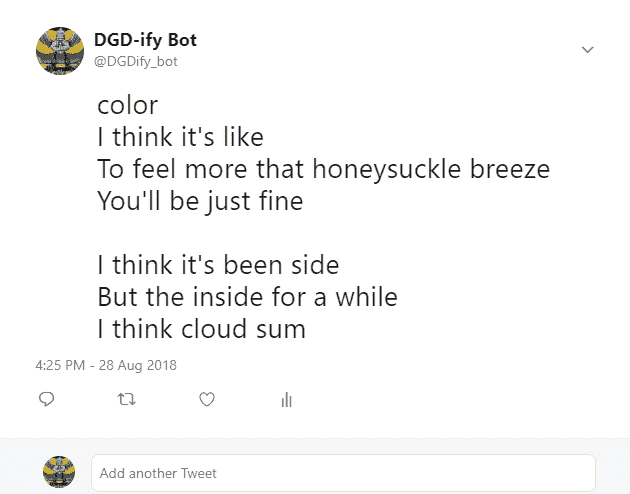

# 我如何建造一个可以生成歌词的推特机器人

> 原文：<https://www.freecodecamp.org/news/building-a-twitter-lyric-bot-12468255a4ee/>

肖恩·图博

# 我如何建造一个可以生成歌词的推特机器人


Photo by [israel palacio](https://unsplash.com/photos/Y20JJ_ddy9M?utm_source=unsplash&utm_medium=referral&utm_content=creditCopyText) on [Unsplash](https://unsplash.com/search/photos/music?utm_source=unsplash&utm_medium=referral&utm_content=creditCopyText)

在这篇文章中，我将回顾我是如何建立我的 Twitter 歌词机器人的，以及你将如何建立你自己的。

### 程序

这是我们必须设置的组件列表。

1.  Twitter 账户
2.  文本编辑器/IDE
3.  机器人
4.  Heroku 自动化

### **设置新的 Twitter 应用程序**

要创建新的 Twitter 应用程序，请点击[这里](https://developer.twitter.com/en/apps)。你需要申请开发者权限。提交申请后，可能需要一段时间，但当你被接受时，Twitter 会通知你。

### **设置编辑器/IDE**

现在你需要设置你的编辑器。我的偏好是 VS 代码，所以我将使用它。

确保安装了 Git 和 Node。

继续将下面的 git 库克隆到您的计算机上。

```
git clone https://github.com/ShawnToubeau/lyric-bot.git
```

### 代码行走槽

bot 包含的 3 个主要文件是 bot.js、lyrics.txt 和. env。

**旁注**:您的项目克隆将不会包含. env 文件，因为。gitignore，因此我们将在文章的后面创建自己的！

#### bot.js

从 bot.js 开始，我们从导入 Twit、fs 和 dotenv 开始。

Twit 是一个支持 Twitter 开发者 API 的模块。

Fs 或文件系统是一个文件 I/O 模块，它允许我们与我们的 lyrics.txt 文件进行交互。

Dotenv 是一个模块，它读入存储在。环境文件。

```
const Twit = require('twit');
```

```
const fs = require('fs');
```

```
require('dotenv').config();
```

```
const order = 4; // length of each n-gram
```

```
let nGrams = {};
```

```
const Bot = new Twit({
```

```
 consumer_key: process.env.TWITTER_CONSUMER_KEY,
```

```
 consumer_secret: process.env.TWITTER_CONSUMER_SECRET,
```

```
 access_token: process.env.TWITTER_ACCESS_TOKEN,
```

```
 access_token_secret: process.env.TWITTER_ACCESS_TOKEN_SECRET
```

```
});
```

nGrams 是跟踪子串出现的对象，因此我们能够使用一个概率来随机生成我们自己的歌词。你可以在这里阅读更多关于他们的信息。

而机器人是…嗯...我们的机器人！我们需要定义一些变量来使它工作。使用 dotenv 模块，我们可以获取存储在。环境文件。

接下来，我们定义几个函数如下:

#### pickRandomStart()

```
function pickRandomStart(lyrics) {
```

```
 const random = Math.floor(Math.random()*lyrics.length)
```

```
 return lyrics.substring(random, random + order)
```

```
}
```

这选择了我们获取第一个 n 元语法的起点。

#### makeEngramModel()

```
function makeEngramModel(lyrics) {
```

```
 for (let i = 0; i < lyrics.length - order; i++) {
```

```
 const gram = lyrics.substring(i, i + order);
```

```
 if (!nGrams[gram]) {
```

```
 nGrams[gram] = [];
```

```
 }
```

```
 nGrams[gram].push(lyrics.charAt(i + order));
```

```
 }
```

```
}
```

这创建了一个模型，该模型跟踪从歌词中解析的所有 n 元语法的顺序和出现。通过使用出现的次数作为 n 元语法的概率，它允许我们以随机的顺序生成新的歌词。

#### 推文()

```
function tweet() {
```

```
 fs.readFile('lyrics.txt', 'utf8', function(error, lyrics) {
```

```
 if (error) {
```

```
 console.log(error.message);
```

```
 } else {
```

```
 makeEngramModel(lyrics);
```

```
 let currentGram = pickRandomStart(lyrics);
```

```
 // checks to see if the start of the tweet doesn't start
```

```
 // with punctuation or special characters and ends with a space
```

```
 while (!currentGram.match(/^[0-9a-zA-Z]+$/)) {
```

```
 currentGram = pickRandomStart(lyrics);
```

```
 }
```

```
 let tweet = currentGram;
```

```
 // runs until char limit is reached while finishing the last word it was on
```

```
 for (let j = 0; (j < 150) || (tweet.charAt(j).match(/^[0-9a-zA-Z]+$/)); j++) {
```

```
 const possibilities = nGrams[currentGram];
```

```
 const next = possibilities[Math.floor(Math.random()*possibilities.length)];
```

```
 tweet += next;
```

```
 const len = tweet.length;
```

```
 currentGram = tweet.substring(len-order, len);
```

```
 }
```

```
 console.log(tweet)
```

```
 Bot.post('statuses/update', {status: tweet}, function(error, tweet, response) {
```

```
 if (error) {
```

```
 console.log("Error making post. ", error.message);
```

```
 };
```

```
 });
```

```
 }
```

```
 });
```

```
}
```

最后但同样重要的是，这是与机器人交互的部分。它首先使用 fs 模块读入歌词，然后使用歌词变量创建 n-gram 模型。它选择一个随机的起始点作为第一个 n 元语法，这将是新歌词的开始。它执行检查以查看第一个 n-gram 是否只包含字母数字字符，因为这样它就有更大的机会开始更有意义的内容。

然后，它将随机选择的 n-gram 与添加到 tweet 变量的最后一个 n-gram 进行链接。它对至少 150 个字符这样做，并且像以前一样，执行检查以查看它是否将在字母数字 n-gram 上结束。如果它没有以字母数字 n-gram 结束，那么它将继续从模型开始链接，直到它结束。

最后，机器人发出 post 请求，将歌词作为 tweet 的有效载荷。

现在我们已经很好地了解了代码是如何工作的，运行下面的命令:

```
npm install
```

在 lyric-bot 项目文件夹中。

这将安装必要的模块()//并解释 npm install 的作用。

### 配置

现在，您需要将一组歌词复制到 lyrics.txt 文件中。

然后创建一个. env 文件。这将存储您的 Twitter API 令牌。

在新文件中，粘贴以下内容:

```
TWITTER_CONSUMER_KEY=
```

```
TWITTER_CONSUMER_SECRET=
```

```
TWITTER_ACCESS_TOKEN=
```

```
TWITTER_ACCESS_TOKEN_SECRET=
```

并在您的开发人员应用获得批准后，从应用的开发人员控制台复制相应的令牌。

是时候测试一下了！

类型

```
node bot.js
```

看一下控制台！



Lyric sample created from Dailily by Movements

当然，也可以看看 Twitter 账户:



The tweet sent from the bot to the Twitter API

### **哒哒！**

您现在有了一个可以发布新生成的歌词的 twitter 机器人！？

请稍等，我们仍然需要自动化它…

### Heroku 部署

转到[Heroku.com](http://heroku.com)并登录。如果您没有帐户，您可以创建一个免费的帐户！？

现在，在主仪表板中，通过单击 New->Create new app 创建一个新的应用程序。

输入可用名称，然后点按“创建应用程序”。

这是你的应用程序的主控制面板！

如果您向下滚动“部署”选项卡，您将看到“使用 Heroku Git 部署”的说明。按照这里的步骤操作，成功部署应用后，继续下一步。

### 自动化

转到“概述”选项卡，然后单击“配置附加组件”。然后，在附加搜索栏中，键入“Heroku Scheduler”并选择它。将弹出一个对话框，点击“Provision”。

添加完成后，您可以点击附加组件并创建这些名为“作业”的东西。作业本质上是由 Heroku Scheduler 执行的任务。

您需要单击“添加新作业”,然后会出现一个配置窗口。在命令选项中，键入以下内容:

```
node bot.js
```

并选择希望运行命令的频率。完成后，单击保存。

这样你就成功地部署了一个 Twitter 歌词机器人！？

### 承认

创建自定义文本的大部分代码都归功于丹尼尔·希夫曼。你可以在这里找到他的资料[！](https://shiffman.net/a2z/markov/)

我在这篇文章中使用的歌词数据是从一首名为《动作的黄花菜》的歌曲中采样的。

非常感谢[摩根·奥尔格罗夫-霍奇斯](https://twitter.com/morgansah)给了我反馈并纠正了我愚蠢的语法错误！？

在 [LinkedIn](https://www.linkedin.com/in/shawn-toubeau/) 上联系我，或者在 [Twitter](https://twitter.com/shawntoubeau) 上关注我！我喜欢结交新朋友？

shawn toubeau