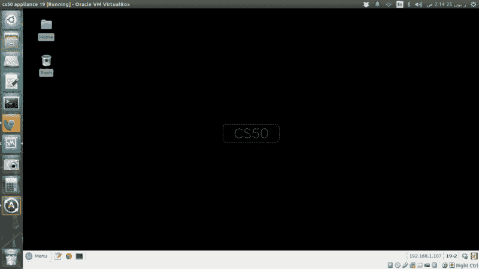
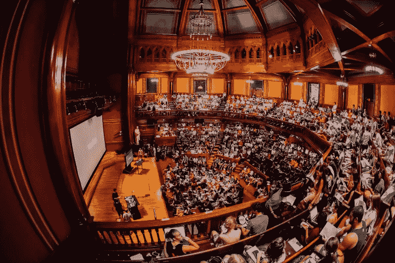
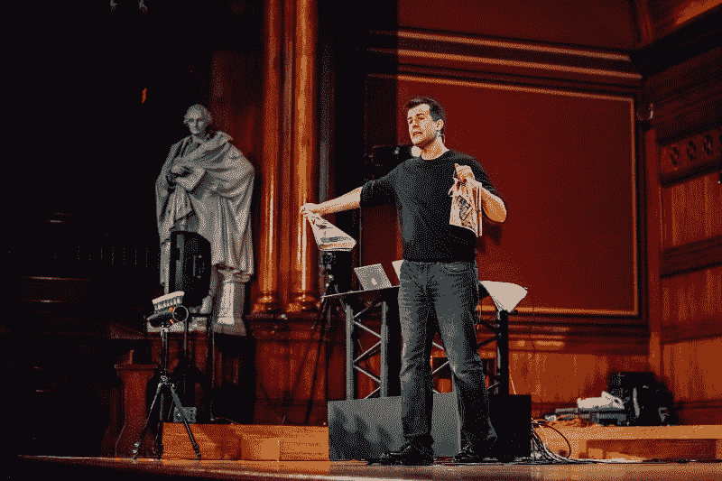
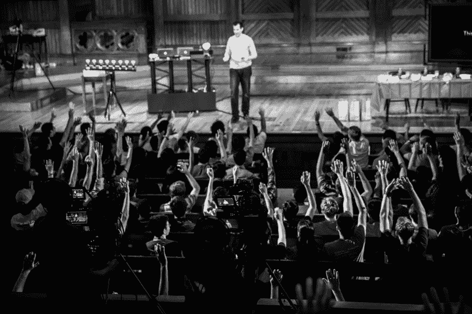
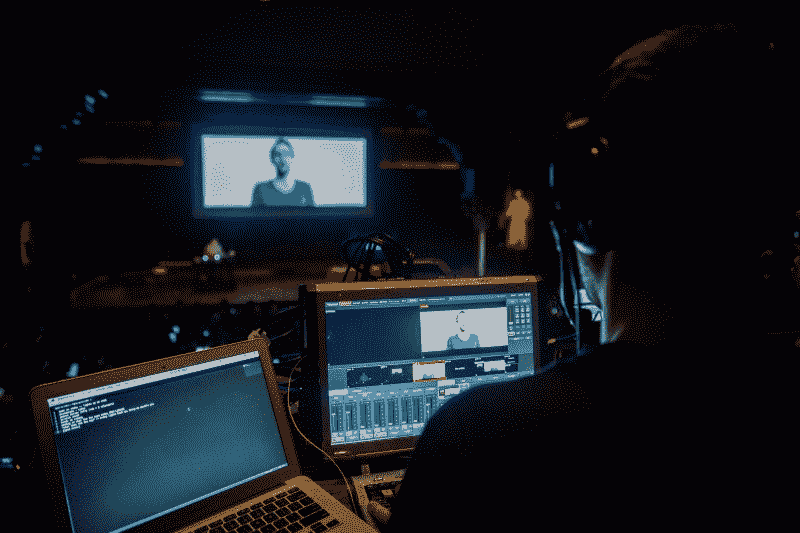
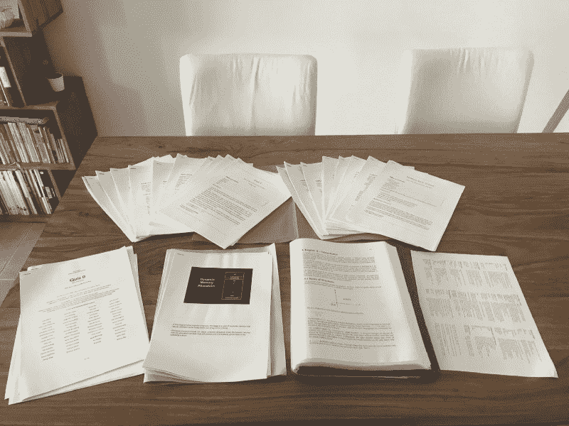

# 最佳 MOOC 奖颁给了…？

> 原文：<https://www.freecodecamp.org/news/and-the-award-for-the-best-mooc-goes-to-308604e5bf2a/>

由 jérémy brunet

# 最佳 MOOC 奖颁给了…？

…哈佛的 CS50！？？

过去 18 个月，我一直在为自己的教育科技初创公司 Peter 工作。

彼得是一个帮助法国 k-12 学生做作业的信使机器人。我们做了一些很棒的事情，一路上学到了很多关于教育的东西，但在这条路的尽头，它并没有成功。

从这次经历中，我现在知道在 EdTech 中打造一个好的产品有多难。或者继续构建与用户群体相关的东西。

萨尔·汗可能是教育技术领域最受欢迎的先驱。自 2006 年以来，他的可汗学院已经教了全世界数百万人。他的学院在 2014 年 2 月向我介绍了免费教育的奇迹(我迷上了数学、JavaScript…和宇宙学！).

然后，[扎克·西姆斯](https://www.freecodecamp.org/news/and-the-award-for-the-best-mooc-goes-to-308604e5bf2a/undefined)的 Codecademy 接手。在那里，我学到了许多流行的编程语言的基础。UX 是光滑的，使会议刺激和非常有效。

最后但并非最不重要的一点是，几周后我发现有成千上万的大规模开放在线课程(MOOCs)可供选择。

当时，我确信如果我采用其中的一些方法，我会成为一名伟大的开发人员。但是，事实证明我大错特错了。我非常失望，因为我期望在可汗学院和 Codecademy 获得同样的学习乐趣。

然而，来自哈佛大学的 CS50 从其他 MOOCs 中脱颖而出。CS50x 是全日制校内 CS50 课程的 MOOC 版本。用 CS50 课程学习计算机科学简直是一场地狱之旅。**他们的产品是我见过的最好的产品之一。**它将大量令人难忘的视频与独特的学习体验结合在一起。

熟悉 CS50 应该是 EdTech 每个创始人的必修课，我想每个人都可以从中获得重大启发。现在，我将分享我的想法、经验和对课程的分析。

### 神话需要？

从开始到结束，CS50 是疯狂的好。这是我进入教育科技世界后唯一一个让我保持动力的 MOOC。

CS50 教会了我一些让我非常兴奋的事情——编程——以一种更令人兴奋的方式。

在我开始学习编程语言之后，我的期望值非常高。过去的 6 个月里，我一直在惊奇地学习新技能。

我把 MOOCs 想象成教育技术的圣杯。我可以在一所大学学习一个学期，然后转到另一所大学学习别的东西。我认为教育的新时代已经到来，学习完全自由。

但是它还没有来。还没有。

许多出版商不认为他们的 MOOCs 是一种产品，UX 也不存在。当学生对内容失去兴趣时，他们就会退出。我去过几次。

以下是我收集的关于 MOOCs 的糟糕记忆(并非详尽无遗):

*   喜剧演员扮演老师？？
*   讲师用难以理解的英语讲授整个 MOOC？⁉️
*   暂停讲座来阅读代码和重新创建示例？？结果是，不知道教师在编写什么？？‍
*   绿色屏幕！？？
*   幽灵社区？？
*   第一周的作业在不到 5 分钟内完成…？✌️
*   第二周的作业不可能完成？⚰️
*   90 多分钟未经剪辑的家庭录像？？
*   装饰重建教室？？

有些可能看起来没那么糟糕，但如果持续 6 - 8 周(或更长时间)，那就相当乏味了。CS50 避免了这种错误，并专注于建立一个前所未有的学习体验。

CS50 是一场马拉松，以精彩的介绍开始。

### 第一个小时⏱

每一门 MOOC 乍一看都很有趣。但是对学生来说，学习经历有时会变得乏味和令人沮丧。

但是 CS50 学会了如何在最好的框架内发布引人入胜的教育内容。

注册后我要做的第一件事就是[安装 CS50 设备](https://sites.google.com/site/os161ubc/os161-installation/install-virtualbox-and-the-cs50-appliance)。教程很长，但对于我在课堂上的第一个小时来说，它是令人兴奋的！

CS50 设备由一台由 VMware 支持的虚拟机组成。

Every CS50 student received a free 1-year license key to run the appliance on VMware ?

该台式机包括:

*   用于编码的 Gedit
*   用于保存代码表的 Dropbox(在主文件夹中)
*   终端来运行代码
*   谷歌浏览器浏览网页并提交作业

我甚至还没写一行代码，也没看过第一堂课的第二部分，就已经被震撼了。

没有多少 MOOCs 能像 CS50 一样提供 UX 的沉浸感。

有时它有问题，但我总是很兴奋能和它一起工作。在我的笔记本电脑上启动 CS50 设备对我来说是一门计算机科学。

如今，CS50 设备已被弃用。他们已经用 CS50 IDE 取代了它。通过 MOOC 后，我试过，界面超赞。

CS50 的人们不断迭代以实现重大升级。这表明他们对自己的产品有多投入。

迈出这第一步后，我就该开始我的第一堂课了！

### 爆米花时间？

接下来是本课程最精彩的部分:视频！

在 CS50 中，您有 4 种类型的视频:

*   讲座:在哈佛大学桑德斯剧院现场录制
*   部分:哈佛大学现场录制的辅导课
*   短片:解释一个重要概念的短片
*   演练:给出问题集提示的短片

MOOCs 中的视频至关重要。他们构成了教学的主渠道。学生看着他们学习。

当 MOOC 未能把学生吸引到教室时，视频往往是罪魁祸首。但是，当 MOOC 成功地沟通了课堂体验，让学生感到他们是其中的一部分时，优秀的视频总是原因。

要提供摇滚明星般的体验，幕后必须有优秀的工作人员。

CS50 有 David J. Malan 教授、助教(TF)和许多其他没有人能看到的辅助人员。

SHOWTIME ?

### 马兰教授的教学风格

这是马兰教授对 CS50 目的的描述:

> “这门课的最终目标不是教你编程，不是教你 C、PHP、SQL 或课程描述中的任何单词和首字母缩略词，而是教你更有效地解决问题，也就是说，更有条理、更有算法地思考。”David J. Malan [在 2015 年第 0 周讲座](https://www.youtube.com/watch?v=zFenJJtAEzE&t=5m56s)中介绍 CS50。

这造成了巨大的差异。CS50 将教你如何编码——这是对 C 的一个很好的介绍——但更重要的是，它将挑战你的逻辑。

所有的视频都有特定的用途。你不能用一节课代替一节课，因为它们是互补的。你可以通过观看短片来学习一些关于编程的东西，但是你会错过这门课的重点。

可以说，讲课是为了培养学生的思维。

**马兰教授花时间解释如何用逻辑思考，并证明这对编程是多么有益。**

他有时会运行一些不起作用的代码，这些代码是他讲课中最精彩的部分。当一个意想不到的错误出现时，我看到剧院和他一起笑了。然后，他会用相关的问题来挑战他的逻辑，并在最后尝试一些修正来调试他的代码。

他总是以他的口头禅开始他的演讲:

> 这是 CS50！？

就在那之后，他继续说“这是第 n 周…”然后他的课开始了。而且是真的秀！

他用充满活力的故事打动了观众。他有他的标志性表达(“引擎盖下”，“在一天结束时”)。看 5 分钟他的第一堂课就足以熟悉他的教学。

马兰教授不只是讲课。他现场表演来证明他的观点。这有助于学生记住计算机科学中的一个关键概念。

Memorable moment of week #0 lecture to explain algorithms ?

他经常要求学生和他一起上台完成各种挑战。这些时刻看起来既有教育意义又有娱乐性！

最有趣的 MOOC 之一是“花生酱和果冻演示”。CS50 的助教 Rob 和 Malan 教授一起上台演示了什么是伪代码:

从那以后，没有人会忘记伪代码是什么。？？？

**每次马兰教授让学生上台，我屏幕后面都超级羡慕。**

One picture can speak a thousand words.

### 课程结构和亮点

课程最精彩的部分之一？马兰教授主持每一次 CS50 讲座，他每次都做得很好。？

每周有两次讲座，他投入的强度从未下降。他的讲座很快成为我最喜欢的课堂时刻。

到了第三周，我发现自己疯狂地观看每周讲座。同样的病毒效应也影响了切片。

部分是我必看的，原因有二。首先，听完讲座后，我需要进一步的解释。但是第二个原因是我的助教 Allison。

像马兰教授一样，艾莉森带着充沛的精力、良好的氛围和大量的手势进行教学。每个部分的长度都超过一个小时，但对我来说集中注意力从来都不是问题。她的流动是自然的，她与教室互动，在这里我又一次感到融入其中。

艾莉森有标志性的表情(“额外的荣誉！”，“大家好吗？”)这样就很容易适应这个部分。她也对课堂表现出很大的支持。她一周又一周地重复她最喜欢的小贴士来帮助我们完成本周的习题集。

她最有用的建议是什么？“纸和笔”和“睡觉！！！!"

伪代码和深夜困在 pset 上睡觉不止一次救了我。

艾利森并不是员工中唯一伟大的 TF。Zamyla 在 pset 演练中表现出色。Rob 的短裤和短裤也很棒(不过，没有什么比他的花生酱和果冻三明治更棒的了！).

每个学生都有他或她最喜欢的 TF。

但是伟大的主持人不能完成所有的魔术。要办好节目，你需要更多的人。

#### 技术

剧透提醒:教官后面不是绿屏！

CS50 的设置和他们为录制视频所做的技术努力让我着迷。

View from the monitoring booth ?

马兰教授尽可能精心制作最好的视频。

摄制组像专业人员一样工作，输出完美无瑕。他们尽可能为学生提供最舒适的观看体验。

但是雇佣一个摄制组，拥有一个宏伟的剧院，拥有一副谷歌眼镜并不是教书的必备条件。这里非常重要的是给观众提供一个真正的原创学习体验。

想想可汗学院。[萨尔汗创作一个视频需要多少钱？](https://www.quora.com/What-software-does-Khan-Academy-use-to-record-their-lectures)

这不是钱的问题，而是风格的问题，而是一个教师如何致力于教育学生并取得好成绩的问题。对于马兰教授来说，这意味着像专业人士一样拍摄和编辑视频。对于萨尔汗来说，[就是在黑屏上录音，边教边用不同的颜色在上面写字。](https://www.youtube.com/watch?v=Ohu-5sVux28)

他的视频和 CS50 中的一样强大:你需要 10 秒钟来理解关掉声音后发生了什么。

在第 11 秒，你会想打开声音来了解更多。

相比之下，有人盯着绿色墙壁上的摄像头并不能营造一个很好的学习环境。看着不舒服，几分钟后就索然无味。

这类视频对 MOOCs 来说是致命的，可以说，它们扼杀了参与，让课堂变得无聊。

一旦我的 pset 完成，我高兴有两个原因。第一是做了一些让我引以为豪的有挑战性的事情。第二次是观看两个新的讲座和一个新的部分！

### Pset 1 -作业 0？

CS50 打乱了一种传统的教学方式:家庭作业。

当我在学习 CS50 的时候，我是这样组织我的一周的:

*   观看讲座和部分？
*   发现 pset？
*   读一周笔记？
*   求解 pset？
*   复读？

From top to bottom, left to right: lectures notes (Week #0 to #3 missing), psets, quizzes, shorts notes, a book about C programming and a GDB cheat sheet ?

我喜欢尽快发现我的 pset，试图估计我需要经历多少麻烦。这对我来说是一个有用的策略。

但是等等…什么时候“作业”变成了令人兴奋的事情？！

读一读马兰教授在大二时决定“踏进一间名为 CS50 的教室”后对 psets 的评论:

> “就在那时，我终于意识到，天哪，家庭作业其实也很有趣。事实上，我和那些孩子一样，在周五晚上 psets 发布的时候，我会回到自己的房间，一头扎进晚上的 psets。”David J. Malan [在 2015 年第 0 周讲座](https://www.youtube.com/watch?v=zFenJJtAEzE&t=3m12s)中介绍 CS50。

是的，你没看错。

我从 CS50 中学到的一切都是通过完成令人兴奋的挑战。

[编码一个暴力破解算法破译密码](https://cdn.cs50.net/2014/fall/psets/2/hacker2/hacker2.html)有多激进？或者编写[一个程序来恢复受损的图片](https://cdn.cs50.net/2014/fall/psets/4/hacker4/hacker4.html#recover)就像电视节目中法医专家做的那样？

Psets 很有趣，因为它们要求你做一些值得你花时间去做的事情。他们向我证明了我的想法是正确的，因为我运行了自己的程序，让我大吃一惊。

所以在服用 CS50 两周后，我就能暴力破解密码了。有多少 MOOCs 能在两周之后做到这一点？

这远远超出了我的预期，我觉得我是一个血腥的黑客！？

psets 可能非常具有挑战性(我的？？？三部曲:PSE[T4/](https://cdn.cs50.net/2014/fall/psets/4/hacker4/hacker4.html)PSE[T5/](https://cdn.cs50.net/2014/fall/psets/5/pset5/pset5.html)PSE[T6)b](https://cdn.cs50.net/2014/fall/psets/6/pset6/pset6.html)但是奖励是独一无二的。它们是两个系列的 psets:标准&黑客版。我选择了后者(pset #4 之前可用),只是为了更深入地了解 mad 挑战。

社区版主(对 curiouswiki，Cliff B，Kareem 和其他人大喊！)在 Slack 上，Reddit 或者 Stack Exchange 从来没有把我一个人留在暗处。许多学生也很活跃，看到这么多人团结在一起真是太好了。

笔记也很珍贵。工作人员负责撰写每次讲座的文字记录。除了视频之外，我过去常常一遍又一遍地阅读这些笔记，并对它们进行注释，以破解我的 psets。

### 最后的想法？

参加 CS50 是我做过的最好的决定之一。

CS50 不仅仅是一门拓宽编码技能的课程。感谢丰富的学习路径([让我想起了可用的 64 个字幕，我不是在开玩笑！](http://cdn.cs50.net/2014/fall/lectures/0/w/lang/))，CS50 让我变成了一个快速学习者。但最重要的是，《CS50》展示了我认为教育应该永远是什么样子。

如果我 10 年前遇到 CS50，我会满怀激情地投身计算机科学。

CS50 有助于修复教育。像可汗学院或 Codecademy 这样的地方也有。它们都表明教育可以是有趣的、迷人的和有益的。

如果有更多的 MOOCs 像 CS50 一样伟大，它将帮助许多人找到最有成就感的研究。

？如果你喜欢我的故事，那就滚吧！也对教育技术感兴趣？点击订阅按钮，确保不要错过我的下一个故事。欢迎在下面发表评论或者在推特上给我留言？