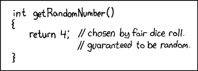
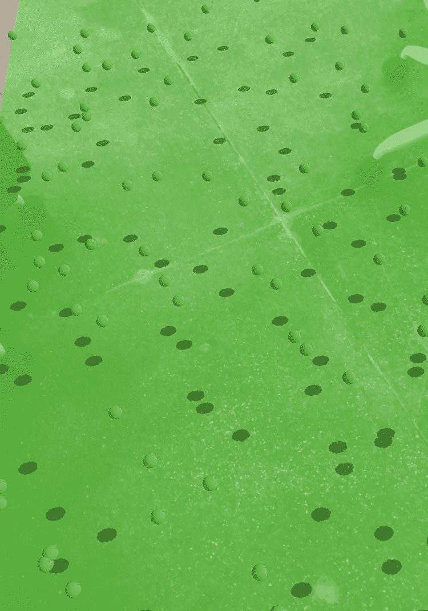
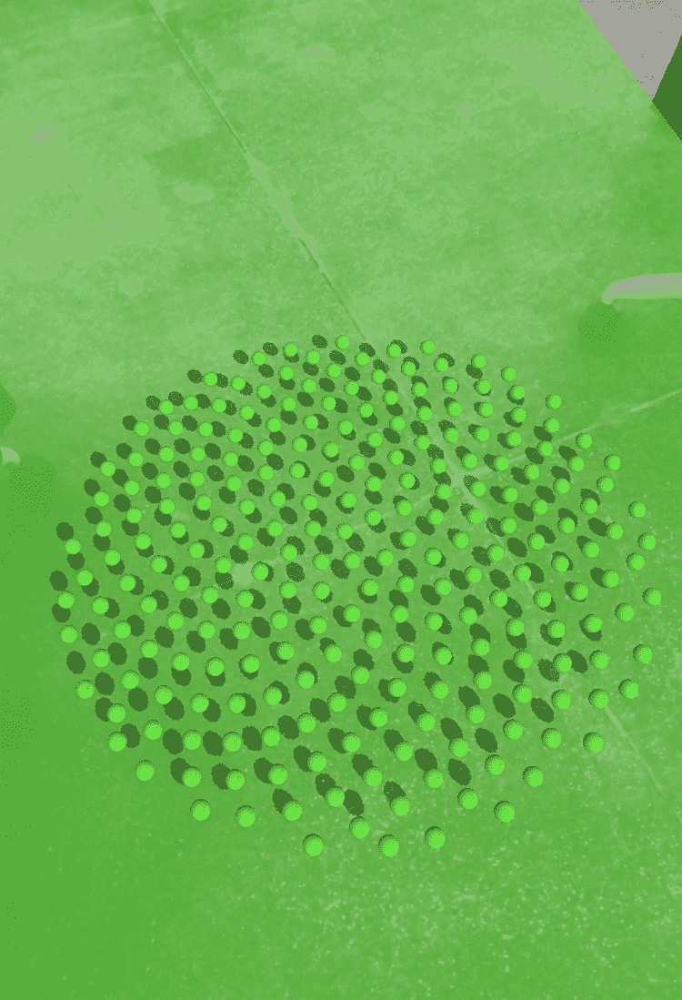
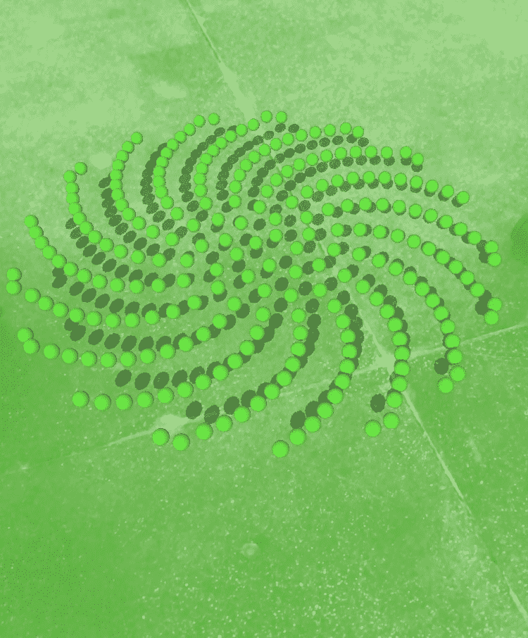
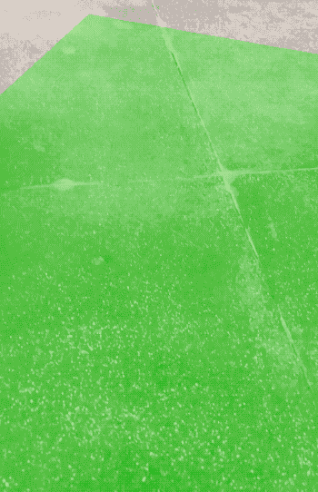

# 如何在 Swift 和 ARKit 中可视化随机分布算法

> 原文：<https://www.freecodecamp.org/news/visualizing-random-distribution-algorithms-in-swift-and-arkit-4e05f502755b/>

丹·威辛斯基

# 如何在 Swift 和 ARKit 中可视化随机分布算法

[https://xkcd.com/221/](https://xkcd.com/221/)

### 森林中的一棵树

我最近在做一个原型，我需要在 3D 空间放置大量的物体。这是一个 AR 项目，想法是这些物体将以随机的方式放置在你的周围，当它们从天空落下时分散在你的周围。

这带来了一些问题。首先，我们不知道用户当前的周围环境，所以我们必须将掉落物品的半径限制在我们可以基于位置或其他因素配置的范围内。

接下来，我们知道，除非采取特定的预防措施，否则内置的随机生成器不会非常随机。

最后，使用随机生成器生成点，无论多么随机，都会导致聚类，其中许多生成的点可能会落在彼此靠近的区域中，并留下没有任何点的点。没有人想要秃顶:相信我，我知道。

有许多方法可以实现随机平均分布。像任何称职的开发人员一样，我发现有几个简单的实现很好地满足了我们的目的。让我们检查每一个，并使用 ARKit 和 SceneKit 在 Swift 中实现它们。

### 掷骰子！

在我们找到“好”的算法之前，我们应该看看仅仅使用随机数来放置我们的点会得到什么。在这个过程中，我们将把我们的应用程序放在一起，并用它来测试相同表单中的其他实现。

让我们创建我们的应用程序，并在适当的地方得到一些基本的东西。打开 Xcode，使用增强现实应用程序模板创建一个新项目。构建并运行应用程序，以确保一切正常，并且在运行应用程序时，您会看到默认船只出现在您的手机前面。

接下来，我们将建立我们的项目，就像我们为我的 ARKit 系列中的第一个教程所做的那样。遵循该教程中的步骤，唯一的区别是场景文件的名称。我们不把它命名为**悬浮场景**，而是命名为`**MainScene**`。按照教程中的描述添加渲染代理，并遵循创建点击手势识别器的**额外学分**部分。

在这一点上，项目几乎准备好了，但是我们没有(也不需要)在那个教程中引用的`addSphere` 方法。相反，我们将开始创建我们的算法生成器。

创建一个名为`**PointGenerator.swift**`的文件。在这里，我们将放置我们算法的多次迭代。让我们从随机数点生成器开始。我们将创建一个我们的算法将遵守的协议，使得稍后在我们的源代码中切换算法变得容易。

我们的协议很简单。给定要生成的点数和限制点数的宽度和长度，返回一个点数组:

我们的`RandomPointGenerator`将遵循这个类并输出我们的第一组结果:

这里的代码很简单。我们迭代并创建位于宽度和长度限制内的点，将点放置在这些限制的中点的两侧。我们将创建的点添加到一个数组中，然后简单地返回这些点。

创建一个从`SCNNode`派生的名为`Visualizer`的类。这个类将作为保存对象的容器，我们将把这些对象放到世界中以可视化点集。目前，我们将在算法生成的每个点上创建小球体。

我们的班级应该是这样的:

好了，现在我们准备创建我们的点。让我们回到我们的`MainScene`类，添加一个名为`createPointField`的方法，它接受一个`SCNVector3`位置:

当我们点击屏幕时，我们将从我们的`ViewController` 调用它。让我们使用我们的`didTapScreen`方法，让我们之前创建球体的部分(在第一个教程中)看起来像下面这样:

构建并运行，现在我们已经实现了第一个算法。

Random placement of points. Not great.

请注意球体是如何聚集在某些点上的。这正是我们想要避免的。

我不会详细描述每个算法，但我会提供一些网站的链接，这些网站提供了很多信息，并给了我在 Swift 和 AR 中实现的灵感。

#### 泊松抽样和米切尔最佳候选

我们需要一种替代随机数生成器的算法，它返回一组相互靠近的点，但不会比某个指定的最小距离更近。这就是**泊松圆盘采样**发挥作用的地方。有几种实现泊松-圆盘算法的方法。我们将在代码中实现的算法叫做**米切尔最佳候选**算法。它易于实现，运行速度快。

该算法背后的思想是放置点，并且当你放置它们时，检查它们是否满足离已经放置的点至少最小距离的要求。为此，在放置点时，通过查看附近点的距离来采样点。如果没有满足最低要求的点，则放置新点，否则，尝试寻找另一个位置。你可以在这里阅读更多关于算法[的内容。](https://bost.ocks.org/mike/algorithms/)

为了实现，我们将创建我们的`**PointGenerator**`协议的另一个实现:

让我们回到我们的`MainScene`类，注释掉随机生成器行，并将这些新行添加到:

再次运行应用程序，让我们看看我们的结果。

Poisson-disc using Mitchell’s best candidate method

好多了！没有大的集群或贫瘠的地区。现在我们可以用它在世界上放置物品了。该算法的其他用途包括在运行时动态生成纹理或噪声生成器。

我们在这个实现中得到了我们需要的东西，我们将在以后使用它。但是，如果我们想要有一点不同的东西，我们需要在一个圆形的边界内均匀分布呢？这就是葵花籽算法的用武之地。

### 额外学分

#### 葵花籽算法

纵观历史，我们已经发现了自然界的数学模式。在自然界中被模仿的许多模式中，一个有趣的特征是植物中存在斐波那契数列。这些特征在叶子、种子和花瓣排列的螺旋图案中显现出来。对这些模式的研究被称为**叶序**。下面的算法实现了其中一个螺旋的数学模型。你可以在这里找到更多信息[，在这里](https://thatsmaths.com/2014/06/05/sunflowers-and-fibonacci-models-of-efficiency/)找到[。](https://www.popmath.org.uk/rpamaths/rpampages/sunflower.html)

让我们回到我们的`PointGenerator`文件并创建我们的新实现:

你会注意到这里我们忽略了传入的**宽度**和**高度**参数。这是因为我们不是将点限制在一个区域内，而是以螺旋的方式均匀地分布这些点，直到我们用完所有的点。

改变传递给`sunflower`方法的参数中的`alpha`可以控制边界边缘点的粒度。也就是说，我们可以通过控制点的分布来使边界更平滑或更粗糙。上面的代码使用了一个偏高的`2`的`alpha`，从而产生了一个更加均匀的边界。

我们再来看看我们的`MainScene`，把前面的算法注释掉。让我们添加一个调用来获得我们的`Sunflower`模式生成点:

让我们再次运行我们的应用程序，看看我们得到了什么。

Sunflower Algorithm

如你所见，我们有一个模仿向日葵拿种子方式的图案。我们还可以将一个有趣的变化应用到算法中，在这个堆栈溢出[问题](https://stackoverflow.com/questions/28567166/uniformly-distribute-x-points-inside-a-circle)中的一个注释中有详细描述。

通过将`theta`改为方位，评论者将算法变成了测地线形式。

将我们代码中的`theta`行改为:

让我们再次运行我们的算法，看看它是什么样子。

Sunflower Algorithm with spiral pattern

酷！现在我们有了螺旋形的图案。

说到螺旋，让我们看看最后一个算法。

### 沃格尔螺旋

这里我们有另一个密切相关的算法，它也使用斐波那契数列和[黄金角度](https://en.wikipedia.org/wiki/Golden_angle)。你可以在这里和阅读更多关于沃格尔螺旋[的内容。](https://www.codeproject.com/Articles/1221341/The-Vogel-Spiral-Phenomenon)

让我们实现它，然后我们将调整它，看看它如何影响结果。

在我们的`PointGenerator`类中，添加这个算法的实现。

该算法与葵花籽算法一样，也忽略了**宽度**和**高度**参数。

让我们用新的调用替换以前的算法。

让我们试一试，看看我们会得到什么。

Vogel Spiral

不错！现在，让我们尝试这个算法的不同变体。通过改变公式，我们可以得到不同的螺旋结构。将`it`声明更改为以下行:

运行它，看看我们得到了什么。

Vogel spiral, looking like the Sunflower

那个螺旋现在看起来像我们的向日葵螺旋的翻转版本，更新了`theta`。有意思！

让我们用下面的公式来试试:

Vogel spirals

类似于第一种算法，但螺旋是分开的。非常酷的东西！

我们现在已经运行了 4 种不同的算法，包括不太好的严格随机数布局。然而，每一种在我们的工具箱中都有一席之地，它们可以用来满足各种需求。

### 额外学分，第二部分

如果我们没有用我们刚刚学到的东西做一些很酷的事情，这就不是我的文章了，不是吗？

从 Sketchfab 或 Turbosquid 等 3D 模型商店下载一些树模型。根据需要将它们转换为 Collada (DAE)格式，并添加到您的项目中。当你把它们放到你的场景中时，你可能需要调整它们的大小到合适的比例，但是当你使用它们的时候你就知道了。确保使用低多边形模型，因为我们正在讨论实例化几十个甚至几百个对象实例。

让我们创建一个从`**SceneObject**`派生的`Tree`类(我们在之前的教程中创建了这个类)。我们会让它从我们已经添加到我们的应用程序中加载一个随机的树。我们利用了在之前的教程中添加的随机便利函数。

下面是我的`Tree`类的样子:

让我们使用 Mitchell 算法，将我们想要生成的模型(点)数量减少到 60 个。根据模型中多边形的数量，这可能会太大。我从一组不同的模型开始，花了一段时间放置 20 个模型。从低水平开始，逐步提高。对于我使用的模型，我可以更高，但 60 足够密集。

在我们的`Visualizer`代码中，让我们改变我们的`Tree`创建来动画放大一点。

在我的例子中，对于我使用的模型，我必须将它们缩小一点，以使它们达到一个合理的大小，这就是 0.45 的来源。我还降低了一点位置，使他们躺在地平面上。您可以根据自己的情况调整这些数字。

建造和运行，现在我们几乎不费吹灰之力就创建了一个快乐的小森林。

Our happy little forest

希望你喜欢这个小实验。欢迎在评论区展示你的作品！

Daniel Wyszynski 是一名开发人员，他在更多的平台和语言上工作过，尽管他不愿意承认。他相信产品能够创造令人难忘的用户体验。对于丹来说，用户是第一位的，平台是第二位的。在[媒体](https://medium.com/@AbovegroundDan)或[推特](https://twitter.com/AbovegroundDan)上关注丹，了解他的更多信息。还可以看看 [s23NYC: Engineering](https://medium.com/s23nyc-tech) 博客，这里发布了许多耐克数字创新团队的精彩内容。

*作者注:观点是我自己的，不代表我雇主的观点*