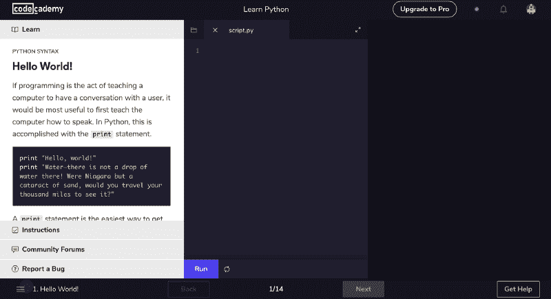
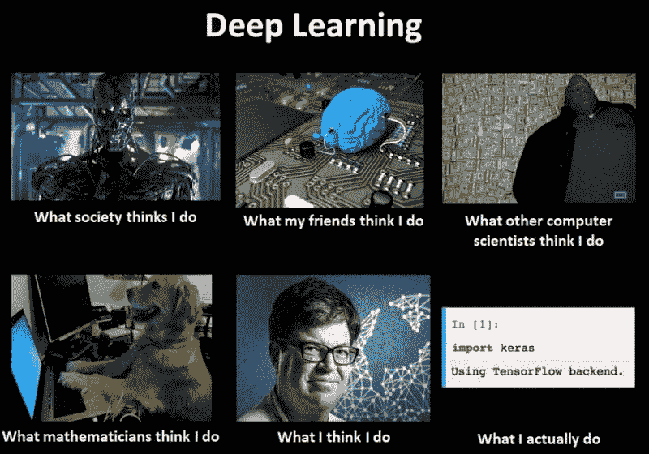
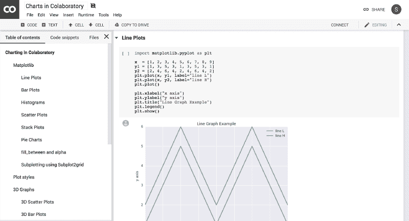
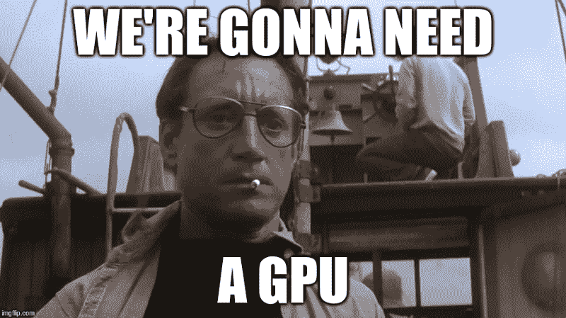
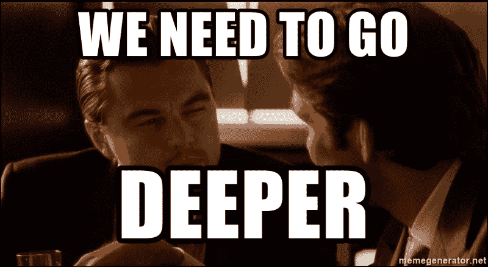
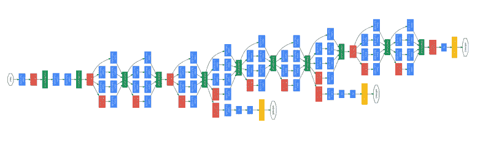

# 不完整的深度学习指南

> 原文：<https://www.freecodecamp.org/news/the-incomplete-deep-learning-guide-2cc510cb23ee/>

从自动驾驶汽车到 Alpha Go 再到语言翻译，如今深度学习似乎无处不在。虽然关于炒作是否合理的争论仍在继续，但过去几年来，学术界和工业界对深度学习的兴趣迅速增加。

随着这个话题受到如此多的关注，最近越来越多的信息被发布，从各种 MOOCs 到书籍到 YouTube 频道。有了这么大量的资源在手，学习深度学习从来没有比现在更好的时机了。

然而，这种容易获得的材料的流入的副作用是选择超载。成千上万的资源，哪些是值得看的？

受 Haseeb Qureshi 关于学习区块链开发的优秀[指南](https://medium.freecodecamp.org/the-authoritative-guide-to-blockchain-development-855ab65b58bc)的启发，这是我尝试分享我在整个旅程中发现的资源。由于我计划用更新和更好的信息不断更新这个指南(通过[这个 GitHub Repo](https://github.com/sannykim/deep-learning-guide) )，我认为这个进行中的工作是一个**不完整的指南**。

到目前为止，本指南中的所有资源都是免费的，这要感谢它们的作者。

**目标受众**

*   任何想要更深入地研究这个主题，在这个领域寻找职业生涯，或者渴望获得对深度学习的理论理解的人

**本文目标**

*   在资源的海洋中给出一个概述和方向感
*   为学习深度学习理论和发展提供清晰而有用的途径
*   就如何最大化你的学习体验给出一些实用的建议

**概要**

本指南的结构如下:

*   第一阶段:先决条件
*   **第二阶段**:深度学习基础
*   第三阶段:创造一些东西
*   第四阶段:潜得更深
*   **阶段 X** :不断学习

你的学习需要多长时间取决于许多因素，比如你的奉献精神、背景和时间承诺。根据你的背景和你想学的东西，你可以随意跳到本指南的任何部分。我下面概述的线性发展正是我发现对自己有用的途径。

### **第一阶段:先决条件**

让我从一开始就说清楚。你需要的先决条件取决于你打算追求的目标。你在深度学习中进行研究所需的基础将与你成为从业者所需的东西不同(当然，两者并不相互排斥)。

无论你是否还没有任何编码知识，或者你已经是 R 方面的专家，我仍然建议获得 Python 的工作知识，因为那里的大部分深度学习资源都要求你了解 Python。

#### **编码**

虽然 Codecademy 是从头开始编写代码的好方法，但麻省理工学院的 6.0001 课程是对计算机科学世界不可思议的介绍。哈佛大学臭名昭著的 CS 入门课程 CS50 也是如此，但 CS50 对 Python 的关注较少。对于喜欢阅读的人来说，交互式在线书籍*如何像计算机科学家一样思考*是一个不错的选择。

*   [带读数 6.0001](https://www.youtube.com/watch?v=ytpJdnlu9ug&list=PLUl4u3cNGP63WbdFxL8giv4yhgdMGaZNA)
*   [代码学院](https://www.codecademy.com/learn/learn-python)
*   [如何像计算机科学家一样思考](http://interactivepython.org/runestone/static/thinkcspy/index.html)
*   [哈佛 CS50](https://www.edx.org/course/cs50s-introduction-computer-science-harvardx-cs50x)

#### **数学**

如果你只是想将深度学习技术应用于你面临的问题，或者获得对深度学习的高层次理解，在大多数情况下，没有必要知道它的数学基础。但是，根据我的经验，在熟悉深度学习框架的理论基础后，使用深度学习框架会更容易理解，甚至更有回报。

对于这样的意图，微积分、线性代数和统计学的基础知识是极其有用的。幸运的是，网上有很多很棒的数学资源。

以下是你应该知道的最重要的概念:

1.  多元微积分

*   区别
*   链式法则
*   偏导数

2.线性代数

*   向量和矩阵的定义
*   矩阵运算和变换:加、减、乘、转置、求逆

3.统计与概率

*   像均值和标准差这样的基本概念
*   分布
*   抽样
*   贝叶斯定理

也就是说，在第二阶段的同时学习这些概念也是可能的，当你需要的时候就去查数学。

如果你想直接进入深度学习中使用的矩阵演算，看看特伦斯·帕尔和杰瑞米·霍华德的[深度学习所需的矩阵演算](https://arxiv.org/abs/1802.01528)。

**微积分**

对于微积分，我会在麻省理工开放式课程的讲座、伦纳德教授的讲座和可汗学院中选择。

麻省理工学院的讲座对于那些熟悉数学并寻求快速而严谨的微积分入门的人来说是很棒的。

伦纳德教授的讲座非常适合不太熟悉数学的人，因为他花时间以非常易懂的方式解释一切。

最后，我推荐可汗学院给那些需要复习或者想尽快了解概况的人。

*   [麻省理工学院 18.01 单变量微积分](https://www.youtube.com/watch?v=jbIQW0gkgxo&t=1s)
*   [伦纳德教授微积分 1](https://www.youtube.com/watch?v=fYyARMqiaag&list=PLF797E961509B4EB5)
*   [可汗学院微积分 1](https://www.khanacademy.org/math/calculus-1)

**线性代数**

对于线性代数，我非常喜欢斯特朗教授的系列讲座及其配套的线性代数书籍(麻省理工学院开放式课程)。如果你有兴趣在线性代数上花更多的时间，我会推荐麻省理工学院的讲座，但如果你只是想快速学习基础知识或复习，汗学院是完美的选择。

要想获得更多的动手编程方法，请查看 Rachel Thomas(来自 fast.ai)的计算线性代数课程。

*   [麻省理工学院 18.06 线性代数](https://www.youtube.com/watch?v=ZK3O402wf1c&list=PLE7DDD91010BC51F8)
*   [可汗学院线性代数](https://www.khanacademy.org/math/linear-algebra)
*   雷切尔·托马斯的计算线性代数

最后，斯坦福大学 CS229 课程的这篇[评论](http://cs229.stanford.edu/section/cs229-linalg.pdf)提供了一个你可以随时查阅的好参考。

对于微积分和线性代数来说，3Blue1Brown 的《微积分的本质》和《线性代数》系列都是很美的补充资料，可以更直观、形象地了解这门学科。

*   [3Blue1Brown 微积分精华](https://www.youtube.com/watch?v=WUvTyaaNkzM&list=PLZHQObOWTQDMsr9K-rj53DwVRMYO3t5Yr)
*   [3Blue1Brown 线性代数的本质](https://www.youtube.com/watch?v=kjBOesZCoqc&list=PLZHQObOWTQDPD3MizzM2xVFitgF8hE_ab)

**统计和概率**

哈佛大学所有的 Stats 110 讲座都在 YouTube 上，由 Joe Blitzstein 教授讲授。它从概率开始，涵盖了广泛的统计学介绍主题。练习题和内容有时很有挑战性，但它是最有趣的课程之一。

除了哈佛的课程，汗学院和布兰登·福尔茨在 YouTube 上也有一些高质量的材料。

*   [哈佛统计 110](https://www.youtube.com/watch?v=KbB0FjPg0mw&list=PL2SOU6wwxB0uwwH80KTQ6ht66KWxbzTIo)
*   [可汗学院统计&概率](https://www.khanacademy.org/math/statistics-probability)
*   [布兰登·福尔茨统计 101](https://www.youtube.com/user/BCFoltz/videos)

与线性代数类似，斯坦福的 CS229 课程也提供了一个很好的概率论回顾，你可以用它作为参考。

### **第二阶段:深度学习基础知识**

[Image Source](https://www.kdnuggets.com/2017/08/first-steps-learning-deep-learning-image-classification-keras.html)

随着在线免费深度学习资源的过剩，选择的悖论变得尤为明显。我该选哪些，哪些才是最适合我的，哪里学的最多？

#### **MOOCs**

与学习理论同样重要的是实践你的新知识，这就是为什么我最喜欢选择吴恩达的 [*deeplearning.ai*](https://www.coursera.org/specializations/deep-learning) (更理论化)和杰瑞米·霍华德和瑞秋·托马斯的 [*fast.ai*](http://course.fast.ai/) (更实用)混合的 MOOCs。

吴恩达擅长解释深度学习背后的基本理论，而 fast.ai 则更专注于亲自动手编写代码。有了 deeplearning.ai 的理论基础，杰瑞米·霍华德的代码和解释变得直观了很多，而 fast.ai 的编码部分对于将你的理论知识根深蒂固地融入实践理解有着超级大的帮助。

由于 deeplearning.ai 由五门课程组成，fast.ai 由两部分组成，所以我会按照以下方式组织我的学习:

1.  看 Deep Learning.ai 的课程讲座一、二、四、五
2.  拿 Fast.ai 第一部
3.  观看 Deeplearning.ai 课程三
4.  可选:接受 deeplearning.ai 任务
5.  重复步骤 1-4 或进入第三阶段

我首先跳过 deeplearning.ai 作业的原因是，我发现 fast.ai 的编码示例和作业比 deeplearning.ai 作业实用得多。

如果你想重复 deeplearning.ai 课程材料(即重复强化记忆)，那么就试试作业。与使用 PyTorch 和自己的 fastai 库的 fast.ai 不同，他们主要使用 Keras。所以，这是一个熟悉另一个深度学习框架的好机会。

Fast.ai 第 2 部分涉及非常高级的主题，需要很好地掌握理论以及深度学习的编码方面，这就是为什么我会把它放在本指南的第四阶段。

**提示 *:*** 你可以在 Coursera 上免费观看 deeplearning.ai 视频，但需要购买专精才能做作业。如果你负担不起 coursera 专业化费用，申请[奖学金](https://learner.coursera.help/hc/en-us/articles/209819033-Apply-for-Financial-Aid)！

对于喜欢看书的人来说，迈克尔·尼尔森出版了一本关于深度学习的免费介绍书，其中也包含了 Python 中的编码示例。

要真正利用 fast.ai，你需要一个 GPU。但幸运的是，谷歌提供了一个类似于 Jupyter 笔记本的环境，名为[谷歌合作实验室](https://colab.research.google.com/)，提供免费的 GPU 访问。有人已经做了一个关于如何使用 Colab 进行 Fast.ai 的教程。所以，看看这里的。Kaggle 也开始在他们的[内核](https://www.kaggle.com/dansbecker/running-kaggle-kernels-with-a-gpu)上提供对免费 Nvidia K80 GPU 的访问。

Google Colaboratory

AWS 还为学生提供高达 100 美元的学分(取决于您的大学是否是他们项目的一部分)，您可以将这些学分用于他们的 GPU 实例。

#### **补充性非 Mooc 材料**

不要只依赖一种信息手段。我推荐你把看视频和编码阅读结合起来。

**YouTube**

就像他的微积分和线性代数系列一样，3Blue1Brown 给出了一个关于神经网络的最直观的解释。Computer Phile 和 Brandon 也对深度学习做出了很好的解释，每个人的角度都略有不同。最后，sentdex 非常有用，因为他可以立即将概念转化为代码。

*   [3 蓝色 1 棕色神经网络](https://www.youtube.com/playlist?list=PLZHQObOWTQDNU6R1_67000Dx_ZCJB-3pi)
*   [计算机亲神经网络](https://www.youtube.com/playlist?list=PLzH6n4zXuckoezZuZPnXXbvN-9jMFV0qh)
*   [Brandon Rohrer 神经网络](https://www.youtube.com/watch?v=ILsA4nyG7I0)
*   [实用机器学习 sendex](https://www.youtube.com/watch?v=OGxgnH8y2NM&list=PLQVvvaa0QuDfKTOs3Keq_kaG2P55YRn5v)

**适合初学者的博客**

博客也是一种重复新获得的知识、探索新想法或深入某个主题的非凡方式。

[distilt . pub](https://distill.pub/)是我所知道的深度学习领域及其他领域最好的博客之一。它的编辑处理诸如[特征可视化](https://distill.pub/2017/feature-visualization/)或[势头](https://distill.pub/2017/momentum/)等主题的方式简单明了、充满活力且引人入胜。

虽然不再更新，[安德烈·卡帕西的旧博客](http://karpathy.github.io/)有一些经典文章，比如 [RNNs](http://karpathy.github.io/2015/05/21/rnn-effectiveness/) 之类的，值得一看。

最后，像 FreeCodeCamp 和 Towards Data Science 这样的媒体出版物会定期发布从[强化学习](https://simoninithomas.github.io/Deep_reinforcement_learning_Course/)到[异议检测](https://towardsdatascience.com/deep-learning-for-object-detection-a-comprehensive-review-73930816d8d9)的有趣帖子。

**编码**

熟悉代码！知道如何绘制图表、处理杂乱的数据和进行科学计算在深度学习中至关重要，这就是 Numpy 或 Matplotlib 等库被普遍使用的原因。所以，练习和使用这些工具肯定会在这个过程中帮助你。

Jupyter 笔记型电脑

*   [介绍、设置和演练](https://www.youtube.com/watch?v=HW29067qVWk)
*   [DataCamp 综合 Jupyter 笔记本教程](https://www.datacamp.com/community/tutorials/tutorial-jupyter-notebook?utm_source=adwords_ppc&utm_campaignid=1366776656&utm_adgroupid=57448230227&utm_device=c&utm_keyword=&utm_matchtype=b&utm_network=g&utm_adpostion=1t1&utm_creative=265681164941&utm_targetid=aud-364780883969:dsa-429603003980&utm_loc_interest_ms=&utm_loc_physical_ms=9042585&gclid=Cj0KCQjwxtPYBRD6ARIsAKs1XJ4XsOoAhoDXVUIxahP5aX2Ign1X8w1IKQ3RSAvfwnzh9m6rSPLMX1waAs3NEALw_wcB)

Jupyter 笔记本可以是一个很好的工具，但肯定有一些缺点。看看乔尔·格鲁的信息丰富且充满迷因的演讲 [*我不喜欢笔记本*](https://docs.google.com/presentation/d/1n2RlMdmv1p25Xy5thJUhkKGvjtV-dkAIsUXP-AL4ffI/preview?slide=id.g362da58057_0_1) 去意识到那些陷阱。

Numpy

*   [斯坦福 CS231 Numpy 教程](http://cs231n.github.io/python-numpy-tutorial/)
*   [DataCamp Numpy 教程](https://www.datacamp.com/community/tutorials/python-numpy-tutorial)

熊猫

*   [数据学院数据分析熊猫综合教程系列](https://www.youtube.com/watch?v=yzIMircGU5I&list=PL5-da3qGB5ICCsgW1MxlZ0Hq8LL5U3u9y)
*   [关于熊猫的代码基础短教程系列](https://www.youtube.com/watch?v=CmorAWRsCAw&list=PLeo1K3hjS3uuASpe-1LjfG5f14Bnozjwy)

Scikit-learn

*   [数据学校 scikit-learn 教程系列](https://www.youtube.com/watch?v=elojMnjn4kk&list=PL5-da3qGB5ICeMbQuqbbCOQWcS6OYBr5A)

Matplotlib

*   [Sentdex Matplotlib 系列](https://www.youtube.com/watch?v=q7Bo_J8x_dw&list=PLQVvvaa0QuDfefDfXb9Yf0la1fPDKluPF)
*   [Matplotlib 视频教程](https://www.youtube.com/watch?v=b3lK639ymu4&list=PLNmACol6lYY5aGQtxghQTq0bHXYoIMORy)

如果你被某个概念或代码片段卡住了，就去谷歌一下吧！答案的质量会有很大差异，但是像 Quora、Stackoverflow 或者 PyTorch 的优秀论坛这样的网站肯定是你可以利用的资源。当你对一个新话题完全不知所措时，Reddit 有时也会提供很好的解释，如 [ELI5](https://www.reddit.com/r/explainlikeimfive/) (像我五岁一样解释我)。

### **第三阶段** : **创造东西**

[Image Source](https://theaijournal.com/2018/05/03/pytorch-for-computer-vision-2-gpu-in-deep-learning-do-you-need-one/)

虽然在参加 fast.ai 课程时，你肯定应该摆弄代码并将其用于外部数据集/问题，但我认为实现自己的项目也很重要。deeplearning.ai 课程 III 是一个关于如何构建和执行机器学习项目的优秀指南。

#### **集思广益**

从你刚刚获得的知识中对你来说可行的头脑风暴想法开始，查看公开可用的数据集，并思考你可能希望通过深度学习解决的问题。看看这些[项目](https://github.com/NirantK/awesome-project-ideas)来点灵感吧！

#### **或使用 Kaggle**

否则，开始一个项目的一个简单方法是参加 [Kaggle 竞赛](https://www.kaggle.com/competitions)(当前或过去)或探索他们的大量[开放数据集](https://www.kaggle.com/datasets)。

Kaggle 提供了一个进入 ML 社区的绝佳途径。人们分享内核(他们对给定问题的演练)并积极讨论想法，你可以从中学习。比赛结束后，当团队开始在论坛上发布他们的解决方案时，这变得特别有趣，这通常涉及到创造性的比赛方法。

#### **选择一个框架**

无论你觉得什么深度学习框架最舒服，选一个吧！我会选择 PyTorch 或 Keras，因为它们都比较容易上手，而且有一个非常活跃的社区。

#### **反映**

在完成你的项目后，花一天左右的时间来思考你已经取得了什么，你已经学到了什么，以及你将来可以改进的地方。这也是你写第一篇博文的最佳时机！认为自己理解了某件事是一回事，把它传达给其他人是另一回事。

Quincy Larson，FreeCodeCamp 的创始人，就如何写一篇技术博客文章做了一个非常有用的介绍。

### **第四阶段:潜入更深的地方**

Fun Fact: The authors of the original Inception Network used this meme in their official paper as a source of inspiration! | [Image Source](https://knowyourmeme.com/memes/we-need-to-go-deeper)

现在你已经建立了一些基本的深度学习知识，并且经历了你的第一次实践经验，是时候深入了！

从现在开始，你可以做很多事情。但我要做的第一件事是浏览 Fast.ai 第 2 部分[编码人员的前沿深度学习](http://course.fast.ai/part2.html)。顾名思义，你将在深度学习中学习一些前沿的东西:从 GANs 到神经翻译到超级分辨率！该课程将为您概述当前深度学习领域的一些最热门话题，重点关注计算机视觉和自然语言处理(NLP)。我特别欣赏这门课，因为杰瑞米·霍华德不仅给出了非常清晰的解释，而且还深入研究了实现这些想法所需的代码。

在 fast.ai 之后，你可以做一些事情:

*   深入研究一个主题，如计算机视觉、自然语言处理或强化学习
*   阅读论文和/或重新实现论文中的想法
*   在深度学习方面做更多的项目和/或获得工作经验
*   关注博客，收听播客，了解最新动态

#### **深潜**

**计算机视觉**

继续你的计算机视觉道路的最好地方绝对是斯坦福的 CS231n 课程，也叫*视觉识别的卷积神经网络*。他们不仅在网上有所有的讲座视频，而且他们的网站还提供[课程笔记](http://cs231n.github.io/)和[作业](http://cs231n.stanford.edu/2017/syllabus.html)！Fast.ai 第二部分和 deeplearning.ai 将为课程奠定良好的基础，因为 CS231n 将在 CNN 和相关主题背后的理论方面走得更远。

虽然两个版本涵盖了几乎相同的主题，这也意味着*选择你更喜欢哪个版本的教学风格*，但最终的讲座略有不同。例如，2017 年加入了一个关于生成模型的讲座，2016 年有一个杰夫·迪恩关于谷歌深度学习的客座讲座。如果你想了解深度学习兴起之前的计算机视觉，中佛罗里达大学(UCF)从 2012 年开始开设了一门计算机视觉课程，讲授 SIFT 特征等概念。

*   [斯坦福 CS231n (2017)](https://www.youtube.com/watch?v=vT1JzLTH4G4&list=PLC1qU-LWwrF64f4QKQT-Vg5Wr4qEE1Zxk)
*   [斯坦福 CS231n (2016)](https://www.youtube.com/watch?v=NfnWJUyUJYU&list=PLkt2uSq6rBVctENoVBg1TpCC7OQi31AlC)
*   [UCF 计算机视觉(2012 年](https://www.youtube.com/watch?v=715uLCHt4jE&list=PLd3hlSJsX_ImKP68wfKZJVIPTd8Ie5u-9)

**自然语言处理**

斯坦福大学有一门相当广泛的课程，名为 CS224n *自然语言处理与深度学习*，与 CS231n 类似，它不仅上传了讲座视频，还开设了一个方便的网站，上面有[讲座幻灯片、作业、作业解决方案](http://web.stanford.edu/class/cs224n/syllabus.html)，甚至还有学生的[课堂项目](http://web.stanford.edu/class/cs224n/reports.html)！

牛津和 DeepMind 合作也有一个非常好的关于 NLP 的系列讲座。虽然它有一个有用的 GitHub 知识库，里面有幻灯片和进一步阅读的链接，但是它缺少斯坦福 CS224 的作业部分。这些课程在一定程度上有重叠，但还没有到不值得两个课程都看的程度。

*   [深度学习的斯坦福 NLP(2017)](https://www.youtube.com/watch?v=OQQ-W_63UgQ&list=PL3FW7Lu3i5Jsnh1rnUwq_TcylNr7EkRe6)
*   [采用 DeepMind 的牛津自然语言处理深度学习(2017)](https://www.youtube.com/watch?v=RP3tZFcC2e8&list=PL613dYIGMXoZBtZhbyiBqb0QtgK6oJbpm)

**通用深度学习**

对于那些仍然不确定深度学习中什么最让他们兴奋的人，卡耐基梅隆大学(CMU)有一门关于深度学习中*主题的课程，该课程介绍了从受限玻尔兹曼机器到深度强化学习的广泛主题。牛津也有深度学习课程，可以让你对在 deeplearning.ai 和 fast.ai 中学到的概念有更牢固的数学把握，意思是正则化或优化之类的东西。*

一本可以在任何深度学习领域帮助你的书是*伊恩·古德菲勒等人的深度学习书*，这是我所知道的关于深度学习理论最全面的书。牛津大学的 NLP 课程等课程也使用这本书作为补充材料。

同样值得注意的是，NIPS 或 ICML 等顶级研究会议传播最先进的深度学习论文，定期发布他们的主题演讲和教程视频。

*   [深度学习课程 CMU 专题(2017)](https://www.youtube.com/watch?v=fDlOQrLX8Hs&list=PLpIxOj-HnDsOSL__Buy7_UEVQkyfhHapa)
*   [牛津深度学习课程(2015)](https://www.youtube.com/watch?v=PlhFWT7vAEw&list=PLjK8ddCbDMphIMSXn-w1IjyYpHU3DaUYw)
*   [Ian good fellow 等人的深度学习书籍](https://www.deeplearningbook.org/)
*   [NIPS](https://nips.cc/Conferences/2017/Videos)(2017)[ICML](https://icml.cc/Conferences/2017/Videos)(2017)[ICLR](https://www.facebook.com/pg/iclr.cc/videos/)(2018)会议视频

**强化学习**

由于强化学习(RL)既不是 deeplearning.ai 也不是 fast.ai 所涵盖的，所以我会首先观看 Arxiv Insight 的 RL 简介和 Jacob Schrum 的 RL 视频，这些视频对该主题的解释非常容易理解。然后去看看 Andrej Karpathy 关于深度强化学习的博客文章，并阅读吴恩达博士论文的第 1-2 章(根据 Berkeley 的 CS 294 网站的建议)。之后，大卫·西尔弗的深度思维课程将为你过渡到伯克利的深度思维课程打下坚实的基础。

或者，在伯克利有一个深度 RL 训练营，在蒙特利尔学习算法研究所有一个 RL 暑期学校，有像 Pieter Abbeel 和 Richard Sutton 这样的演讲者。后者还与人合著了一本关于 RL 的介绍性教科书，目前可以公开获得其第二版草稿(第 3 章和第 4 章是 CS294 的预读材料)。

此外，Udacity 有一个神话般的 [GitHub repo](https://github.com/udacity/deep-reinforcement-learning) ，里面有教程、项目和一份来自他们*付费*深度 RL 课程的备忘单。最近发布的另一个资源是 Thomas Simonini 正在进行的深度 RL 课程，该课程非常易于学习和实践其编码方法。

*   [Arxiv Insight 的 RL 介绍视频](https://www.youtube.com/watch?v=JgvyzIkgxF0)
*   [Jacob Schrum 对 RL 的介绍](https://www.youtube.com/watch?v=3T5eCou2erg&list=PLWi7UcbOD_0u1eUjmF59XW2TGHWdkHjnS)
*   [Andrej Karpathy 关于深度强化学习的博客文章](http://karpathy.github.io/2016/05/31/rl/)
*   [吴恩达博士论文关于马尔可夫决策过程的第 1-2 章](http://rll.berkeley.edu/deeprlcoursesp17/docs/ng-thesis.pdf)
*   [大卫·西尔弗的强化学习课程](https://www.youtube.com/watch?v=2pWv7GOvuf0&list=PLzuuYNsE1EZAXYR4FJ75jcJseBmo4KQ9-)
*   [伯克利 CS294 深度强化学习课程(2017](http://rll.berkeley.edu/deeprlcoursesp17/) )
*   [伯克利 CS294 深度强化学习(2018 年，持续进行中)](http://rail.eecs.berkeley.edu/deeprlcourse/)
*   [强化学习:导论(书稿，2018)](http://incompleteideas.net/book/bookdraft2018jan1.pdf)
*   [伯克利深度 RL 训练营(2017)](https://www.youtube.com/watch?v=qaMdN6LS9rA&list=PLAdk-EyP1ND8MqJEJnSvaoUShrAWYe51U)
*   [MILA 强化学习暑期学校(2017 年](https://mila.quebec/en/cours/deep-learning-summer-school-2017/)
*   [Udacity Deep RL GitHub Repo](https://github.com/udacity/deep-reinforcement-learning)
*   [托马斯·西蒙尼尼的深度 RL 课程](https://simoninithomas.github.io/Deep_reinforcement_learning_Course/)

**机器学习(不一定是深度学习)**

了解深度学习之前的各种机器学习想法当然有价值。无论是逻辑回归还是异常检测，吴恩达的经典机器学习课程都是一个很好的起点。如果你想要一门数学上更严谨的课程，加州理工学院有一门极好的 MOOC，它更有理论基础。Ng 教授也正在写一本关于 ML 最佳实践的书，你可以看到他草稿的前几章。

*   [吴恩达的机器学习教程(2012)](https://www.coursera.org/learn/machine-learning)
*   [加州理工学院 CS156 机器学习课程(2012)](http://work.caltech.edu/telecourse.html)
*   [机器学习向往书作者吴恩达](http://www.mlyearning.org/)

**自动驾驶汽车**

自动驾驶汽车是深度学习最有趣的应用领域之一。所以，令人惊讶的是，麻省理工学院开设了自己的这门课程。该课程将向您广泛介绍感知和运动规划等主题，并为您提供来自行业专家(如 Aurora 的联合创始人)的见解。

如果你对自动驾驶的计算机视觉部分更感兴趣，来自苏黎世联邦理工学院和马克斯·普朗克智能系统研究所的一些研究人员已经就该主题撰写了一份广泛的调查报告。此外，ICCV 上传了 8 部分教程系列的幻灯片，其中有一些关于传感器融合和定位的有用信息。

关于项目，我想看看乌达城的*付费*自动驾驶汽车纳米学位项目，你可以在 GitHub 上*免费*找到。乌达城一贯提供奖学金。例如,[去年与 Lyft 合作开设了“自动驾驶汽车入门”课程。所以，也要注意这一点！](https://www.udacity.com/scholarships/lyft)

*   [麻省理工学院自动驾驶汽车课程(2018)](https://www.youtube.com/watch?v=-6INDaLcuJY&list=PLrAXtmErZgOeiKm4sgNOknGvNjby9efdf)
*   [自动驾驶汽车的计算机视觉:问题、数据集和最新技术(2017 年)](https://arxiv.org/pdf/1704.05519.pdf)
*   [ICCV 自动驾驶计算机视觉教程(2015)](https://sites.google.com/site/cvadtutorial15/materials)
*   [Udacity 自动驾驶汽车项目创意](https://github.com/ndrplz/self-driving-car)

#### **加强你对基本概念的理解**

你会不断遇到基本概念，如损失、正则化、优化、激活函数和梯度下降，因此获得对它们的直觉是至关重要的。两篇文章很好地阐述了梯度下降和反向传播:

*   [塞巴斯蒂安·鲁德梯度下降博客文章](http://ruder.io/optimizing-gradient-descent/)
*   CS231n 反向传播

**阅读论文**

虽然 Arxiv 在快速和开放地传播深度学习研究思想方面至关重要，但随着该平台上论文的涌入，它可能会很快变得势不可挡。

出于这个原因，安德烈·卡帕西开发了 Arxiv Sanity ，这个工具可以让你根据自己的喜好过滤和跟踪论文。

这里只是最近几年的几篇开创性论文，从对深度学习的轨迹产生了巨大影响的 ImageNet 论文(AlexNet、VGG、InceptionNet、ResNet)开始。

*   [AlexNet](https://papers.nips.cc/paper/4824-imagenet-classification-with-deep-convolutional-neural-networks.pdf) (2012 年)、[【vgg】](https://arxiv.org/abs/1409.1556)(2014 年)、(2014 年)、 [ResNet](https://arxiv.org/abs/1512.03385) (2015 年)
*   [生成性对抗网络(2014)](https://arxiv.org/abs/1406.2661)
*   [Yolo 天体探测论文(2015)](https://arxiv.org/abs/1506.02640)
*   [用深度强化学习玩雅达利(2013)](https://arxiv.org/pdf/1312.5602.pdf)

Original InceptionNet Architecture | [Image Source](http://joelouismarino.github.io/images/blog_images/blog_googlenet_keras/googlenet_diagram.png)

**YouTube 频道**

*Arxiv Insights、**co emperium*和 *Yannic Kilcher* 是最不被看好的关于深度学习的 YouTube 频道，它们对自动编码器和注意力有一些最清晰的解释。

另一个应该提到的 YouTube 频道是 *Lex Fridman，* who 是麻省理工学院自驾课程的主要讲师。他还教授麻省理工学院的人工通用智能课程，该课程有一些关于元学习、意识和智能的精彩讲座。

最后，这样的 YouTube 列表不能遗漏 Siraj 的竞争对手 T1。有人恨他，有人爱他。这真的取决于你更喜欢什么，你想从这样的视频中得到什么。对我来说，我不太认同他的教学方式，但我很欣赏他发布的各种内容和他提供的娱乐价值。

*   [Arxiv 洞察](https://www.youtube.com/channel/UCNIkB2IeJ-6AmZv7bQ1oBYg/videos)
*   [共温区](https://www.youtube.com/channel/UC5_6ZD6s8klmMu9TXEB_1IA/videos)
*   扬尼克·基尔彻
*   [Lex Fridman](https://www.youtube.com/user/lexfridman)
*   [Siraj 对手](https://www.youtube.com/channel/UCWN3xxRkmTPmbKwht9FuE5A/featured)

**播客**

播客是一种很好的方式来听取不同人对不同话题的看法。我最喜欢的两个产生大量深度学习相关内容的播客是 ML & AI (TWiML & AI)中的*会说话的机器*和*。例如，在 2018 年 ICML 上听一听说话机器最近的[播客](https://www.thetalkingmachines.com/episodes/icml-2018-jennifer-dy)或者 TWiML 的[播客](https://twimlai.com/twiml-talk-176-openai-five-with-christy-dennison/)和 OpenAI Five 的 Christy Dennison！*

*   [说话的机器](https://www.thetalkingmachines.com/)
*   [本周在 ML &艾](https://twimlai.com/)

[**OpenAI Five 与 Christy Dennison-TWiML Talk # 176**](https://twimlai.com/twiml-talk-176-openai-five-with-christy-dennison/)
[*今天我们请到了 OpenAI 的机器学习工程师 Christy Dennison。自从今年早些时候加入 open ai…*twimlai.com](https://twimlai.com/twiml-talk-176-openai-five-with-christy-dennison/)

**博客**

如前所述，我是*distilt . pub、*和的超级粉丝，其编辑之一*克里斯·奥拉*在他的个人博客上也有一些其他高质量的帖子。

另一个真正有前途的博客是 *The Gradient* ，它提供了最新研究发现的精心编写的清晰概述以及对该领域未来的展望。Sebastian Ruder 是 Gradient 的撰稿人之一，和 Chris Olah 一样，他的博客也有一些很棒的内容，特别是 NLP 相关的主题。最后一个博客并不是真正的博客，而是一个特定论文的学习计划中心，如 AlphaGo Zero 或 InfoGans。

对于这些主题中的每一个，*深度优先学习*都发布了课程，让你学习论文的核心思想。

*   [distilt . pub](https://distill.pub/)
*   [克里斯奥拉](http://colah.github.io/)
*   [坡度](https://thegradient.pub/)
*   [Sebastian Ruder](http://ruder.io/#open)
*   [深度优先学习](http://www.depthfirstlearning.com/)

#### **研究请求**

如果你想开始自己的研究，这里有一些其他人要求研究的主题的提示。

*   [Sebastian Ruder NLP](http://ruder.io/requests-for-research/)
*   [OpenAI 强化学习](https://blog.openai.com/requests-for-research-2/)
*   [艾开网](https://ai-on.org/)

#### **保持最新状态**

信不信由你，但了解深度学习进展的最佳方式之一是 Twitter。成千上万的研究人员使用这个平台来分享他们的出版物，讨论想法并与社区互动。

值得在 Twitter 上关注的一些人:

*   哈德曼鲁
*   [杰瑞米·霍华德](https://twitter.com/jeremyphoward)
*   雷切尔·托马斯
*   [Sebastian Ruder](https://twitter.com/seb_ruder)
*   [费李非](https://twitter.com/drfeifei)
*   [气味](https://twitter.com/Smerity)
*   [弗朗索瓦·乔列特](https://twitter.com/fchollet)

### **第十阶段:继续学习**

这个领域变化很快，所以继续学习，享受这个过程。

#### **GitHub 回购**

由于上述指南是我目前喜欢的资源的快照，它肯定会在未来几年中发生变化和发展。所以，为了在将来更新这个指南，从其他人那里获得更好的信息和更多的反馈，我创建了这个 GitHub Repo 。

请随意向指南投稿并发送请求！