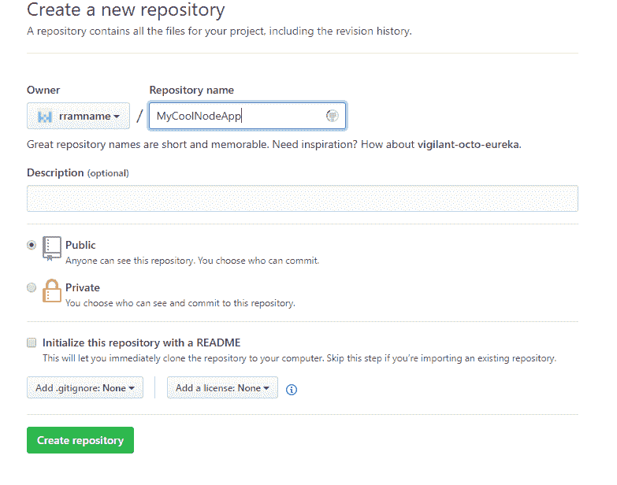
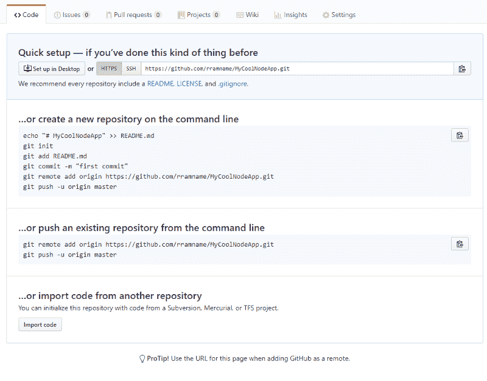
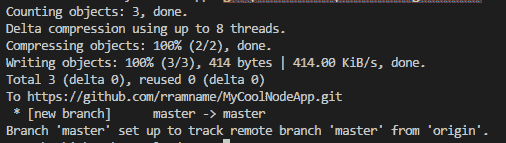
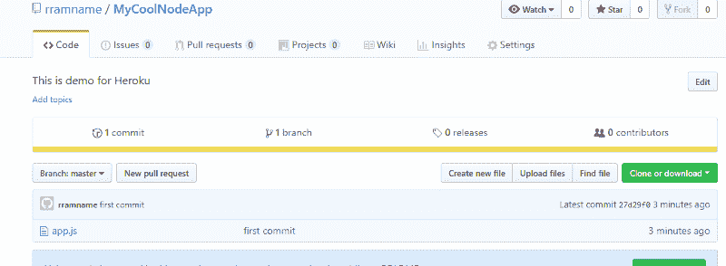
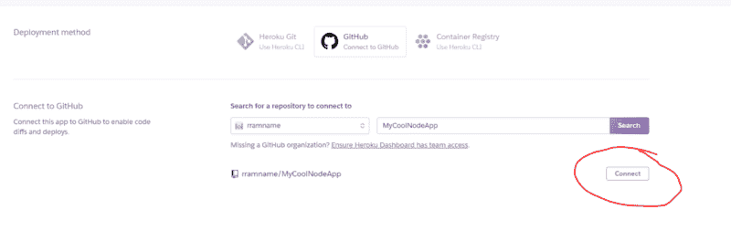
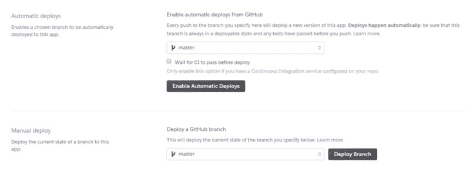
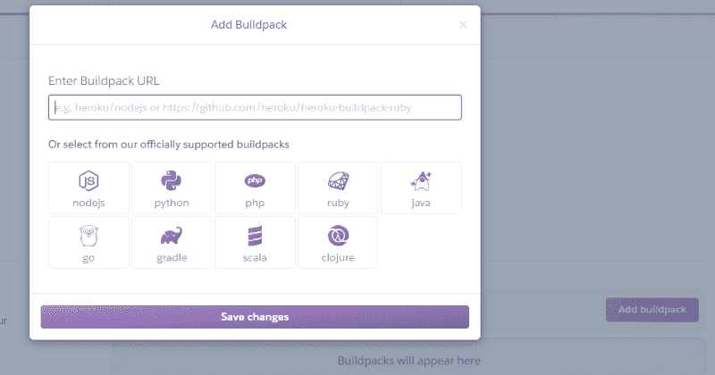
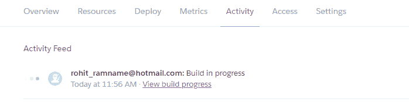
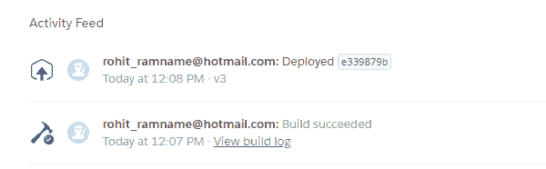
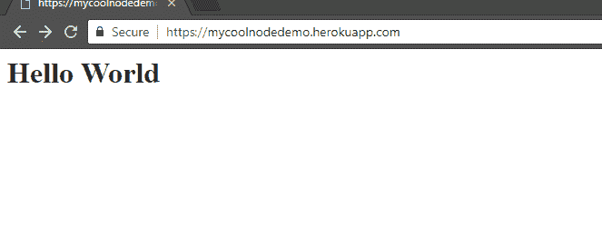

# 如何从 Github 向 Heroku 部署 NodeJS 应用程序(无需在您的机器上安装 Heroku)

> 原文：<https://www.freecodecamp.org/news/how-to-deploy-a-nodejs-app-to-heroku-from-github-without-installing-heroku-on-your-machine-433bec770efe/>

作者 rohit rawname

# 如何从 Github 向 Heroku 部署 NodeJS 应用程序(无需在您的机器上安装 Heroku)


putting your application in the cloud

作为一名 web 开发人员，没有什么比能够向全世界展示(和炫耀)自己的工作更令人满意的了。不仅仅是通过 Twitter 上的图片或视频，而是让他们真正与它互动——特别是如果你正在从事一些很酷的副业项目或申请一个职位。

幸运的是，现在有了所有的云提供商，分享你的工作是必须的，也是你旅程中的一个基本步骤。

在这个演示中，我们将了解如何将您的 cool NodeJS 应用程序部署到 Heroku。到这个演示结束时，我们将有一个基本的 Hello World 应用程序运行在公共域上，任何人都可以访问。

对于这个演示，我假设您的机器上安装了 Node。如果没有，你可以从[Nodejs.org](https://nodejs.org/en/)网站下载。步骤很简单，很容易在网上找到。

您还需要一个 GitHub 帐户来在线托管我们的代码。如果您没有帐户，您可以在[Github.com](https://github.com/)上免费创建一个。有了免费账户，你可以创建无限的公共存储库。我们将使用 Git 版本控制系统来将我们的更改推送到 Github

### **第一步:创建最酷应用**

现在，让我们创建您一直在考虑的那个很酷的 Node 应用程序。

在你的本地机器上创建一个文件夹，并给它起一个名字(你自己选择的)，比如说 MyCoolApp。

添加一个名为 package.json 的文件，并粘贴以下内容。这个文件是我们软件包的基本信息。(这也可以通过键入命令 npm init 并接受所有默认设置来创建。)

```
{
  "name": "coolnodeapp",
  "version": "1.0.0",
  "description": "node app ",
  "main": "app.js",
  "scripts": {
  "start": "node app.js"
},
  "repository": {
  "type": "git",
  "url": ""
},
  "author": "",
  "license": "ISC",
  "bugs": {
  "url": ""
},
  "homepage": ""
}
```

package.json

需要注意的一个非常重要的变化是这一行:

```
"start": "node app.js"
```

部署完成后，Heroku 将运行这个命令来启动您的应用程序。

添加文件 app.js，并粘贴以下代码。这将是我们应用的起点。

```
const http = require('http');
const port = process.env.PORT || 3000

const server = http.createServer((req, res) => {
  res.statusCode = 200;
  res.setHeader('Content-Type', 'text/html');
  res.end('<h1>Hello World</h1>');
});

server.listen(port,() => {
  console.log(`Server running at port `+port);
});
```

app.js

这段代码基本上是在本地服务器上打开一个端口，为一些 HTML 提供服务。

请注意这里的**最重要的**代码块:

```
const port = process.env.PORT || 3000
```

当您想要将应用程序部署到云中时，这是非常重要的。应用服务器在云上的一个随机端口上启动。如果您像所有入门指南中一样硬编码一个端口号，并部署到云，则特定的端口号可能不可用。应用程序永远不会启动。所以最好获取云实例分配的端口号，启动 HTTP 服务器。

保存文件并在命令提示符窗口(在文件夹中打开)中运行以下命令:

```
node app.js
```

这样，Node 将启动服务器并显示以下消息:


现在，如果我们在浏览器中打开 [http://localhost:3000/](http://localhost:3000/) ,我们会看到:


酷！我们刚刚创建了一个基本的 NodeJs 应用程序。

### **第二步:推送至 GitHub**

现在想把我们的代码上传到 GitHub。这样，我们将能够在任何地方编辑我们的代码，并且将提交的更改立即部署到云中。

让我们通过点击 New Repository 在 [GitHub](https://github.com/) 上创建一个资源库。

给它一个名称和一些描述，然后单击 Create repository:



GitHub 会创建一个库，并给你一些可以在本地运行的命令，这样你就可以用你的 GitHub 库克隆你的本地文件夹。



在命令提示符下，按此顺序运行以下命令。

1.  在根级别初始化 Git 存储库:

```
git init
```

2.将所有文件添加到本地 Git (staging)中。注意最后一个点:

```
git add . 
```

3.将您的更改提交到本地 Git:

```
git commit -m “first commit”
```

4.链接到您的 GitHub 库。(请将 URL 更改为指向您的存储库。)

```
git remote add origin https://github.com/rramname/MyCoolNodeApp.git
```

5.推动你的改变:

```
git push — set-upstream origin master
```

您应该会在命令提示符下看到如下消息。



现在，如果您打开 GitHub 并刷新存储库，您应该能够看到代码。



### **第三步:部署到 Heroku**

现在有趣的事情来了，你幸存下来的原因是:部署。

如果您没有 Heroku 帐户，您可以通过填写此[简单表格](https://signup.heroku.com/login)来开立一个免费帐户。(在这里，你不需要提供信用卡信息:)


一旦你准备好你的帐户，用你的凭证登录。

点击右上角的新建，选择“创建新应用”。

为应用程序命名(该名称将包含在应用程序的公共 URL 中)，然后单击创建应用程序。

此步骤将带您进入应用程序的仪表盘。打开部署选项卡，滚动到“部署方法”部分。

选择 GitHub 作为方法。

它将显示一个“连接到 GitHub”选项，我们可以在这里提供我们的 GitHub 库。如果你是第一次这么做，Heroku 会要求允许你访问你的 GitHub 账户。

在这里，您可以搜索您的 GitHub 存储库并点击 connect:



如果它能够找到并连接到 GitHub 存储库，部署部分将会显示，您可以选择是自动部署(一旦更改被推送到 GitHub，Heroku 将会获取并部署它们)还是手动部署。



点按“启用自动部署”(因为这对演示应用程序来说开销更小:)。如果需要，您也可以选择 GitHub 分支，但是对于这个演示，我们将从主分支进行部署。

现在我们需要告诉 Heroku 我们的 app 是 NodeJs app。为此，我们需要重新构建 NodeJs。

打开设置选项卡，找到构建包并点击**“添加构建包”。**



从选项中选择 **nodejs** 并点击保存更改。

现在，返回到 Deploy 选项卡，单击底部的 **Deploy Branch** 。

Heroku 将获取代码并托管它。打开“活动”选项卡，您可以看到进度:



就是这样！

打开**设置**选项卡，向下滚动到**域和证书**部分。在这里，您可以看到刚刚部署的应用程序的 URL。将该 URL 复制并粘贴到浏览器中……哇！！



我们刚刚创建了自己的 web 应用程序，可以通过互联网访问。

太好了！

请继续与他人分享！

主持愉快:)