# 我的第一个 Python 项目:如何将杂乱无章的文本文件转换成整洁的 CSV 文件

> 原文：<https://www.freecodecamp.org/news/my-first-python-project-converting-a-disorganized-text-file-into-a-neatly-structured-csv-file-21f4c6af502d/>

所以我决定学 Python。原来这种计算机编程语言并没有那么难(嗯，直到我得到这个项目！:P)。

几秒钟之内，我就爱上了它简单明了的语法和书写时的自动缩进。当我了解到像列表、元组和字典这样的数据结构可以用一行代码动态地创建和初始化时，我被迷住了。

此外，无论是否使用索引，都可以访问这些文件中保存的值。这使得代码可读性很高，因为索引被自己选择的英语单词所代替。

好了，关于语言已经说得够多了。让我告诉你这个项目需要什么。

我哥哥给了我这个项目。他偶然发现了一个包含数千字的文本文件。许多单词有着几乎相同的意思。每个单词都有自己的定义，旁边还有一个例句，但是条理不太清楚。单词和句子之间有空格和换行符。这些词遗漏了一些方面。下面是我正在谈论的文本文件的片段:

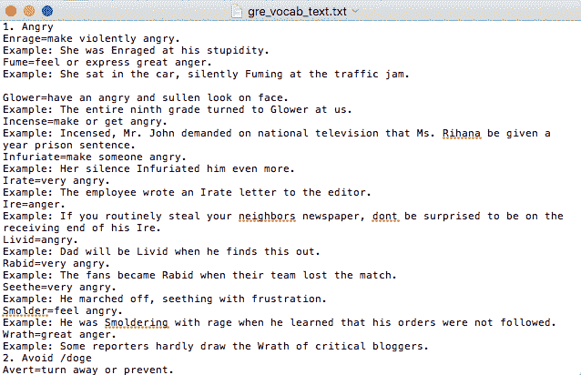

Here, ‘Glower’ is preceded by a newline whereas others are not

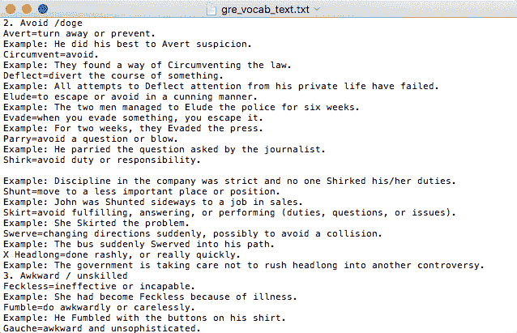

Here, the example of ‘Shirk’ is preceded by a newline

他希望文本方面是统一的。为此，他需要我在一个主题旁边整齐地分类所有相似意思的单词。他告诉我，这可以通过将文本中的所有数据捕获到以下格式的字典中来实现:

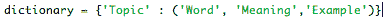

‘Topic’ is the key and the rest are the key’s value. The format gets slightly trickier to maintain as each topic contains multiple words

然后将它们写入 CSV(逗号分隔值)文件。

他问我是否可以把这个作为我的第一个项目，因为我已经学会了基本原理。我很高兴能理解其中的逻辑，所以我立刻同意了。当被问及截止日期时，他给了我两天的时间来完成。

唉，我花了双倍的时间来努力调试写好的代码。坦率地说，如果不是我的兄弟短暂地来到我的房间查看进度，并在我写条件时暗示我所做的错误假设，我注定要永远完成这个项目

我首先在程序中创建一些小任务，我试图在构建整个程序之前完成这些任务。这些问题如下所列:

#### 1.形成一个正则表达式来匹配一个数字和它旁边的单词。

我检查了文本文件，注意到每个主题(这里称为“关键字”)前面都有一个数字。因此，我写了几行代码来创建模式的正则表达式(正则表达式——提取文本的强大工具),如下所示:

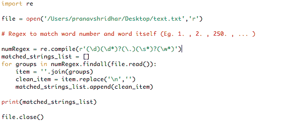

The above code finds matches as per the regex and adds it to a list of strings.

然而，当我运行这个程序时，我得到了一个错误，确切地说是 UnicodeDecodeError，这意味着我不能访问这个文本文件。我在 https://stackoverflow.com 查了一下，找了很久都没找到，我哥哥来了，找到了解决办法。错误纠正如下:

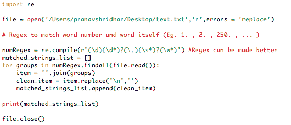

Funny, how a single line — “errors = ‘replace’ ” did the job

尽管如此，我还是没有得到想要的输出。这是因为一些键在文本中有斜杠('/')或空格(')，我的正则表达式无法匹配。我想以后改进正则表达式，所以在它旁边写了一个评论。

#### 2.从文本文件中获取字符串形式的行列表

为此，我只写了一行代码，幸运的是，没有出现任何错误。

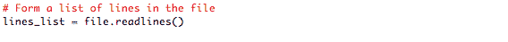

Sometimes, all you need is 1 line of code!

然而，我得到了一份不洁名单。它包含换行符(' \n ')和空格(')，然后我试图将列表细化如下:

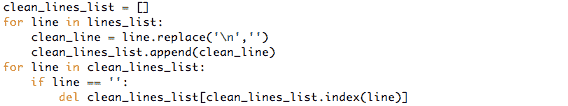

First ‘for’ loop replace ‘\n’ with ‘’ and the second one deletes ‘’, thus giving a clean list.

#### 3.分别提取单词、意思和例句，并将它们添加到相应的列表中。

这是迄今为止最难做到的部分，因为它涉及到正确的逻辑和模式识别的正确判断。

有趣的是，在浏览文本文件时，我注意到了更多的模式。每个单词在同一行中都有它的意思，用“=”号隔开。此外，每个示例前面都有“:”符号和“example”关键字。

我想到了再次使用 regex。我发现了一个更好的替代解决方案，根据符号的位置对行(现在是列表中的一个字符串)进行切片。切片是 python 中另一个很酷的特性。我写的代码如下:

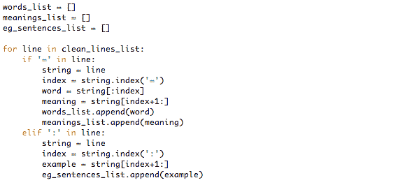

Slicing collects two indexes and extracts the string between them

上面的代码读起来几乎像英语。对于清理列表中的每一行，它检查它是否有一个“=”或“:”符号。如果是，则找到符号的索引，并相应地进行切片。

在第一个' if '中' = '之前的部分存储在变量' word '中，之后的部分存储在' meaning '中。类似地，对于第二个“if”(在本例中为“elif-else if”)，在“:”之后的部分存储在“example”中。并且在每次迭代之后，单词、意思和例句被存储在相应的列表中。通过这种方式，可以提取整个数据。

到目前为止一切顺利。但是，我注意到提取是以这样一种方式完成的，即特定键的每个单词(及其方面)都必须累积在一起作为该键的一个值。这意味着需要在一个元组中存储每个单词、意思和例子。每个元组将被存储在一个单独的列表中，该列表将自身表示为特定键的值。这描述如下:

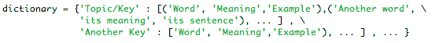

The format for storing all data as one single value for a particular key

为此，我计划将每个关键字的每个单词、意思和句子收集到一个单独的列表中，该列表由另一个列表(比如 key-list)包围。同样，图片会更精确地告诉你:

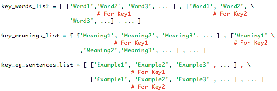

A separate list of words for each key and similarly for meanings and examples

为此，我在为切片编写的代码中添加了以下代码:

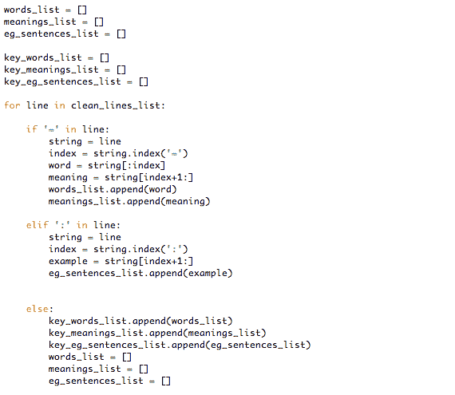

Doing the right things isn’t always easy and what looks easy isn’t always right!

不幸的是，这段代码的逻辑(else 部分)是错误的。我错误地认为文本中只存在两个条件(' = '和':')。有许多我没有注意到的例外。我最终浪费了几个小时来调试逻辑中可能的错误。我假设完整的文本文件遵循相同的模式。但事实并非如此。

由于无法取得进展，我进入了程序的下一部分。我想在完成其他部分后，我可以从我哥哥那里得到一些帮助。:P

> 未完待续…

#### 4.使用 Zip 函数和参数解包为键创建值。

在这一点上，我并不完全确定在实现了上面的列表配置之后我会做什么。在我哥哥的一次技术讲座中，我了解了“Zip”函数和“参数解包”,它实际上压缩了传递给它的列表，就像这样:

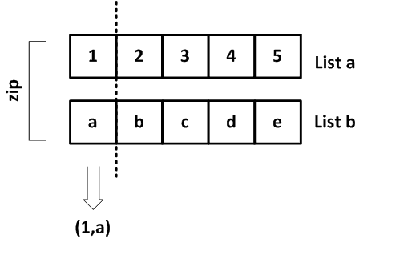

Zip Function in Python

所以我想我可以以某种方式结合这两个特点，以达到预期的结果。经过一段时间的反复尝试，测试功能和虚拟列表，我成功了。我为这个任务创建了一个单独的文件(beta ),其片段如下:

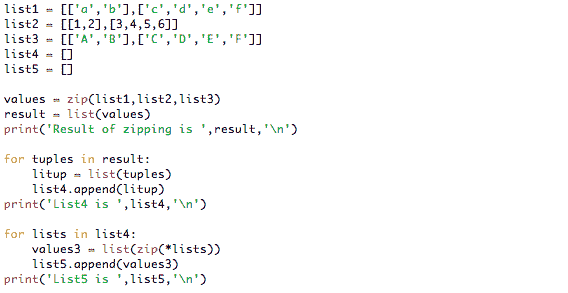

This fragment of code worked flawlessly! :)

通过查看输出，可以了解上面代码的工作原理:

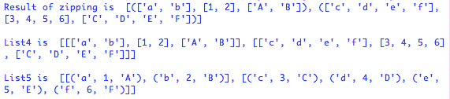

List5 is the required final output

zip()函数压缩相应的列表或列表中的值，并将它们封装在一个元组中。然后，列表中的元组被转换成列表，以便解包和进一步压缩。最后，获得期望的输出。

这次代码成功了，我感到轻松多了。我很高兴我可以操纵将要提取的数据，并将其塑造成所需的格式。我将代码复制到我正在处理的主文件中，并相应地修改了变量名。现在剩下要做的就是给字典中的键赋值(当然还有提取部分！).

#### 5.为字典中的键赋值。

为此，在对代码进行了一些实验后，我想到了这个解决方案:

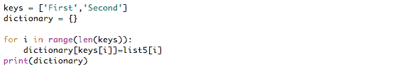

这产生了如下期望的输出:

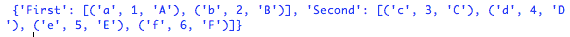

This output is based on the beta file containing both prior and current fragments of code.

程序差不多完成了。主要问题在于数据提取部分。

> …从第 3 节继续

经过一小时又一小时的调试，我越来越沮丧，为什么这该死的东西不工作。我打电话给我哥哥，他给了我一个微妙的提示，告诉我在定义条件循环和 if-else 子句时所做的假设。我们仔细检查了文本文件，注意到一些单词在两行而不是一行中有例子。

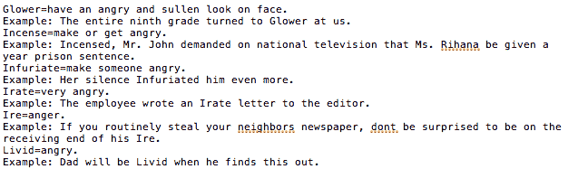

Here, the example sentences for ‘Incense’ and ‘Ire’ takes up two lines instead of one.

根据我的代码逻辑，由于第二行中没有':'符号(也没有' = '符号)，所以该行中的内容不会被视为示例的一部分。因此，该语句将使最后一个“else”部分为真，并执行其中编写的代码。考虑到这一切，我修改了代码如下:

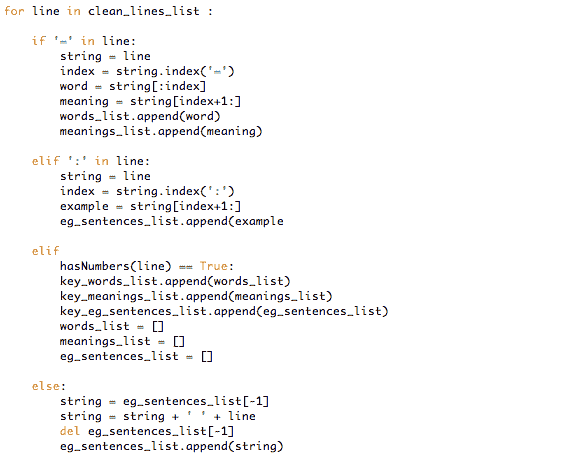

Modification — inserted another ‘elif’ condition and rewrote code for the ‘else’ part

这里，hasNumbers()是一个函数，它检查给定的行中是否有数字。我是这样定义的:

这样做的目的是，如果所有其他条件都不满足，它将收集示例的第二行，将其与第一行合并，然后像以前一样将其添加到相应的列表中。

令我失望的是，这没有工作，而是显示一个错误，即指数超出范围。我目瞪口呆，因为在我看来，每一行代码在逻辑上都是正确的。

经过几个小时的疯狂，我的兄弟向我展示了一种方法来获取错误发生的行号。编程的主要技能之一是调试程序的能力，正确检查可能的错误并保持连续的流程。

有趣的是，下面的代码添加报告错误发生在文本文件的第 1750 行左右。

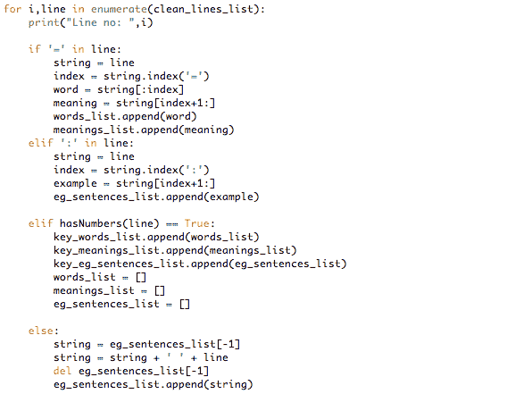

The Enumerate Function adds a counter to an iterable enabling easy debugging by checking the line number where the error occurred.

这意味着程序运行良好，直到那个行号，我的代码是正确的！问题出在我错误的假设上，也出在文本文件上，因为它的异质性。

这一次，我注意到一些键没有按它们的编号排列，这导致了逻辑流程中的问题。我通过进一步修改代码纠正了这些错误，如下所示:

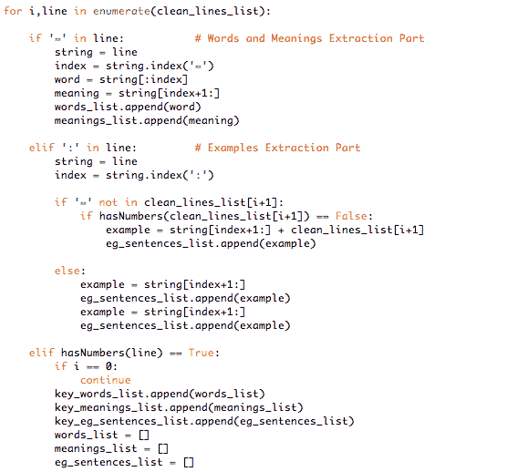

This too worked well for a while but then snap!

这在文本文件的第 4428 行之前工作得很好，但是在那之后就崩溃了。我检查了文本文件本身的行号，但是没有多大帮助。然后我意识到，令我高兴的是，这一定是最后一句了。整个程序工作在干净的列表上，没有换行符和空格。我打印了干净列表的最后一行，并与文本文件的最后一行进行了比较。他们匹配了！

我非常高兴知道这一点，因为这意味着该计划将执行到最后。它崩溃的唯一原因是，在最后一句话之后，所有代码都没有意义。我的条件语句被设计成每次都检查下一行和当前行。由于最后一行之后没有行，所以崩溃了。

所以我写了一行额外的代码来掩盖这一点:

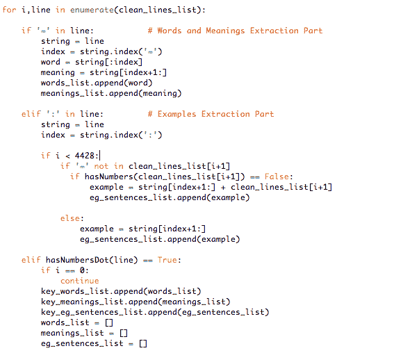

现在一切正常。终于！现在我所要做的就是将这些键分配给相应的值，就这样！这一刻我休息了一下，考虑到我的项目终于结束了。稍后我会添加一些最后的润色。

但是在休息之前，我决定将每个代码都放在不同的函数中，以便让代码看起来整洁。我已经很难上下浏览代码行了。所以做了这个之后我决定休息一下。

然而，这样做之后，程序开始给出可变范围错误。我意识到这是因为在函数内部声明的变量不能从函数外部直接调用，因为它们在本地名称空间中。由于那个蹩脚的错误，我不愿意做进一步的修改，所以我决定回到我从一开始就绞尽脑汁的代码。

然而，令我完全不相信的是，这个程序并没有像以前一样工作。其实根本没用！我根本想不出原因(现在也想不出！).那天剩下的时间里，我极度沮丧。这就像是在入睡前经历了一场噩梦！

幸运而神奇的是，在我做了一些仔细的修改后，代码第二天就工作了。我确保在那之后我做了许多测试版文件(为了每一个改动),以避免这种不必要的混乱。

又过了几个小时，我终于能够完成我的程序了(但直到我花了整整 4 天)。我又做了一些改动，比如:

I)将“hasNumbers”函数修改为“hasNumbersDot”函数，并排除我在程序中前面创建的正则表达式。这更有效地匹配了键，因为它没有假设，因此没有例外。它的代码如下:

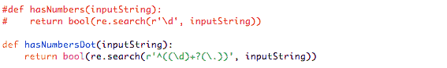

This returns ‘True’ if it matches lines containing a number and a word at the beginning of the line instead of the previous one which would match the same anywhere in the line.

ii)替换正则表达式条件和用于从干净列表获得密钥的代码。

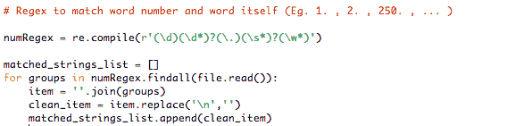

Replaced this with the below code

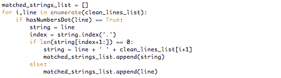

This is much more efficient than the previous one as it makes use of the already defined ‘hasNumbersDot’ function. Also, it matched the full line (full key)

iii)组合“示例提取”部分中的“如果”条件

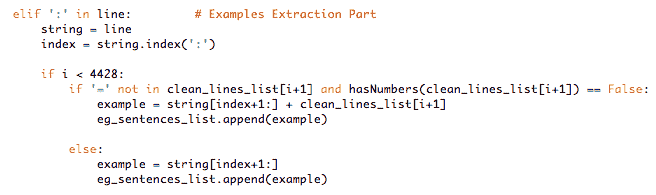

Prior to this modification, the last example sentence could not be extracted from each key

iv)具体化用于字典键分配的代码

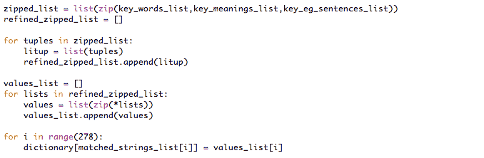

此外，经过反复试验，我能够将获得的数据转换成结构精美的 CSV 文件:

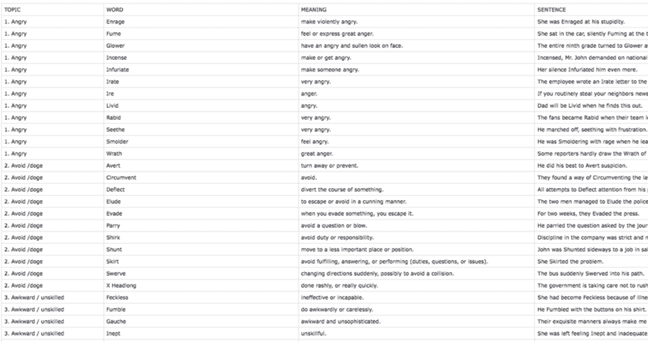

Code for obtaining CSV file

> 你可以在我的[个人资料](https://github.com/pranavmodx)上查看我的 github 库，查看该程序的完整代码，包括文本文件和 csv 文件。

总的来说，这是一次很棒的经历。我从这个项目中学到了很多。我也对自己的技术更有信心了。尽管发生了一些不幸的事件(编程涉及到这样的事情:P)，我最终还是能够完成给定的任务。

最后一件事！最近，我遇到了一个关于调试阶段的搞笑迷因，它与我的经历如此相关，以至于我忍不住要分享。无红利

感谢您一直坚持到这里(即使您跳过了大部分来查看最终结果:P)。