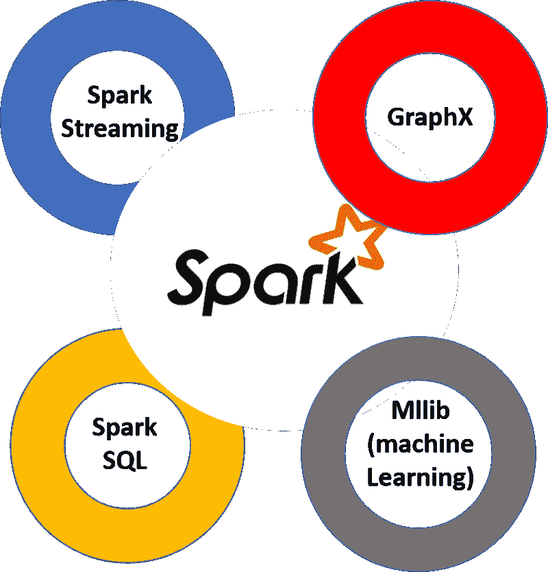

# 如何为您的 Jupyter 笔记本电脑设置 PySpark

> 原文：<https://www.freecodecamp.org/news/how-to-set-up-pyspark-for-your-jupyter-notebook-7399dd3cb389/>

作者:Tirthajyoti Sarkar

# 如何为你的木星笔记本设置 pyspark

Apache Spark 是数据科学领域最热门的框架之一。它实现了将大数据和机器学习结合在一起的潜力。这是因为:

*   由于内存操作，Spark 速度很快(比传统的 [Hadoop MapReduce](https://www.tutorialspoint.com/hadoop/hadoop_mapreduce.htm) 快 100 倍)。
*   它提供健壮的、分布式的、容错的数据对象(称为 [RDDs](https://www.tutorialspoint.com/apache_spark/apache_spark_rdd.htm)