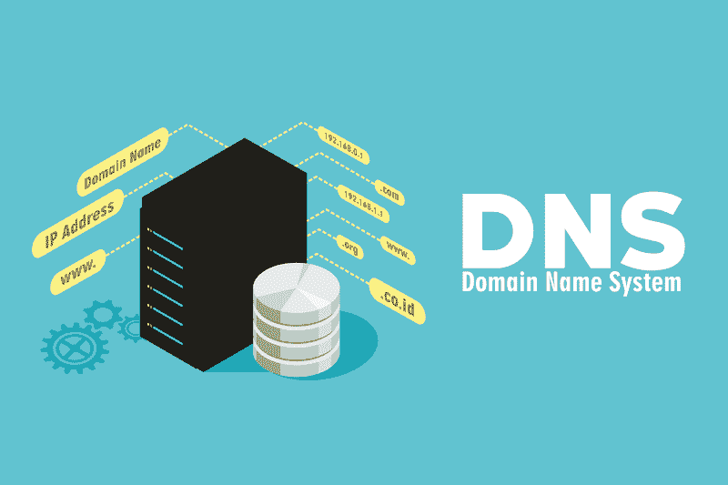
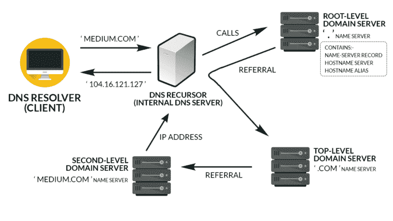
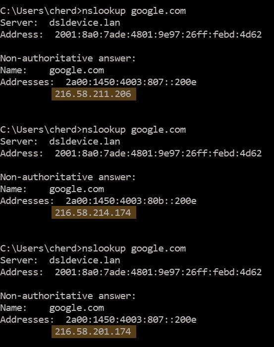

# HTTP 简介:域名系统服务器

> 原文：<https://www.freecodecamp.org/news/an-introduction-to-http-domain-name-system-servers-b3e7060eca98/>

切尔·唐

# HTTP 简介:域名系统服务器

#### DNS 是如何工作的，为什么它很重要？

### 概观

在整个系列中，我们将解决一些基本问题，例如:

*   DNS 是如何工作的？你来了！]
*   [网络堆栈，OSI 模型](https://medium.freecodecamp.org/an-introduction-to-http-understanding-the-open-systems-interconnection-model-9dd06233d30e)
*   HTTP 方法和格式
*   客户身份
*   基本/摘要认证
*   HTTPS 使用 SSL/TLS

### 什么是 HTTP？

超文本传输协议(HTTP)是由 Tim Berners Lee 爵士在 1989 年设计的协议。它构成了网页如何从 web 服务器通信到客户端浏览器的基础。

Sir Tim Berners Lee, the Father of World Wide Web. Photo courtesy of [CNET](https://www.cnet.com/pictures/images-berners-lee-and-the-dawn-of-the-web/)

### DNS 服务器

输入域名后是否立即建立到网页的连接，如`medium.com`？**肯定不是！**

与我们不同，机器通过 *IP 地址*来识别网页的位置。这些数字串，如`104.16.121.127`，对机器来说更友好，尤其是因为网络上有数百万的域名。

域名系统(DNS)在整个 HTTP 请求过程中起着至关重要的作用，因为它允许我们在每次访问网站时通过键入简单的域名`www.medium.com`而不是`104.16.121.127`来调用网页。

如果没有 DNS，你的大脑就会充满数字，试图记住你使用的每个网站的 IP 地址。

Flow of DNS Resolution, maintained by a distributed database system

既然我们知道每次输入域名时都会请求一个 IP 地址，那么让我们看看这个请求在哪里搜索正确的 IP 地址。

#### 本地缓存

缓存是一个内存块，用于临时存储很有可能再次使用的数据。首先发生的是 DNS 解析器(位于您的计算机中)将检查浏览器的缓存，然后是计算机的 DNS 缓存。如果你最近访问过该网站，它会在系统中缓存 IP 地址。

在这种情况下，浏览器可以立即调用 IP 地址来检索网页！

这里需要注意的一点是，每个缓存都有一个截止日期，称为*“生存时间”设置。*该设置决定了访问网站时缓存可以保存多长时间。我们将在后面讨论它是如何工作的。

#### dns 前体

如果在本地缓存中找不到 IP 地址，它将向 DNS 递归器请求。DNS 递归程序通常是您的互联网服务提供商(ISP)的 DNS 服务器。

这些内部 DNS 服务器具有来自其客户端最近访问过的网站的缓存。同样，如果在这里找不到 IP 地址，它将被传递到下一个域服务器。

#### 根级域服务器

根级域服务器(RLDS)，有时也称为“.”名称服务器只是请求的*看门人*。它读取请求并定位要重定向到的适当的域服务器。

因此，它在重定向到下一层域服务器方面起着重要的作用。它们分散在世界各地，以防止恶意攻击以 RLDS 为目标而导致万维网瘫痪。

#### 顶级域服务器

顶级域名服务器(TLDS)是以特定域名后缀如`.com`、`.org`或`.io`结尾的域名服务器。在被 RLDS 传递下去之后，这一层的工作方式与第二个看门人相同。它接受请求，并通过其 DNS 服务器将请求重定向到最后一站，即二级域服务器。

域名的数量呈指数增长。RLDS 不可能存储或重定向如此大量的 IP 地址。因此，它被重定向到 TLDS，以分散所需的处理能力和内存。

#### 二级域服务器

这一层是存储关于域的所有信息的地方，是可访问的。该 DNS 服务器通常由负责托管您的网站的机构所有。

因此，对该域的记录的请求被发送到该 DNS 服务器。它返回 IP 地址，以及其他重要信息，如它所在的服务器和它的别名。

#### 成功！

浏览器现在接收 IP 地址。它使用 TCP/IP 与主机服务器建立连接，并通过 HTTP 检索网页。我们将在第二部分中讨论这个问题。

### “生存时间”设置

DNS 记录有一个生存时间(TTL)设置。这决定了任何域服务器可以缓存记录的时间。

缓存很重要。它减少了页面的加载时间，因为每次请求域名时都必须重新获取 DNS 信息。因此，高 TTL 将允许 DNS 记录在更长的时间内保持有效。这使得网页加载速度更快。

那为什么不是所有的 DNS 记录都有一个高的 TTL 呢？

拥有一个高 TTL，这意味着访问者不会立即看到 DNS 的变化。访问者只能在 DNS 记录过期后看到更改。

例如，如果我们要改变这个网页的主机，并有一个高的 TTL，这些变化不会立即出现在访问者的浏览器。这可能会导致链接断开，用户无法访问网页。

### 主机名-IP 地址关系

所以一个 IP 地址对应一个域名？

答案是肯定的，也是否定的。可以是，但不一定是一对一的关系。

#### 单个主机名，多个 IP 地址

一个主机名(如`www.google.com`)可以对应多个 IP 地址，以平衡服务器上的负载，因为在任何给定的时间点都会有大量用户访问同一网页。

DNS 服务器使用“循环”方法，这样所有的 IP 地址都被平等地利用。

#### 多个主机名，单个 IP 地址

这样做的目的可能是为了推荐链接。例如，搜索`amazon.com/products/pc`将显示电脑的产品屏幕。虽然`amazon.com/products/pc?user=cherdon`也将显示相同的网页，但任何购买都会告诉亚马逊我是推荐人，允许我从中获得佣金。

公司经常购买链接到同一网页的多个域名。例如，`google.com`和`google.net`会把你链接到同一个搜索引擎网页。

### 结论

DNS 服务器非常重要，因为它在用户友好的域名下存储机器友好的 IP 地址的数据库。现在我们已经了解了 DNS 服务器如何在分布式数据库中协同工作，让我们来探索如何使用第二部分中的 IP 地址建立与主机服务器的连接！

嗨！我是[雪儿唐](https://www.freecodecamp.org/news/an-introduction-to-http-domain-name-system-servers-b3e7060eca98/undefined)，目前在攻读数据科学专业。我是[律师助理机器人](https://www.linkedin.com/company/paralegal-bot/)的首席技术官，你可以在下面找到我的网站。感谢阅读！

[**被激怒；**](https://www.piqued.co)
[*优质内容我们为难以把握的概念提供最好的内容。我们去过那里，和你有同样的感受……*www.piqued.co](https://www.piqued.co)