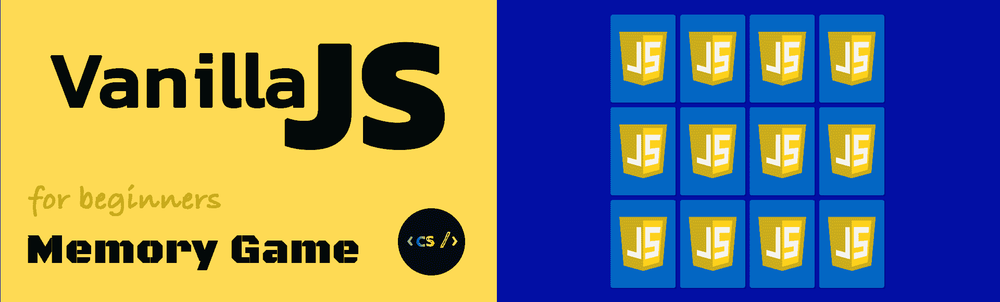
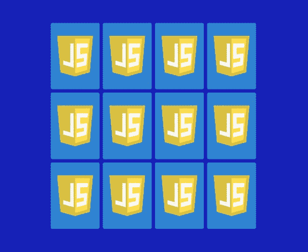
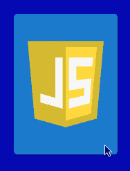
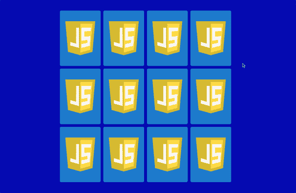
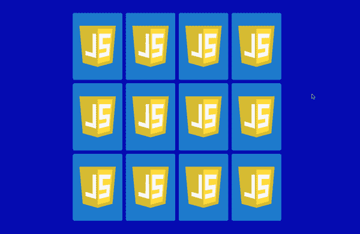

# 普通 JavaScript 中的内存游戏

> 原文：<https://www.freecodecamp.org/news/vanilla-javascript-tutorial-build-a-memory-game-in-30-minutes-e542c4447eae/>

作者玛丽娜·费雷拉



# 普通 JavaScript 中的内存游戏

#### 30 分钟搭建记忆游戏学习 JS、CSS、HTML！

本教程解释了一些基本的 HTML5、CSS3 和 JavaScript 概念。我们将讨论数据属性、定位、透视、转换、flexbox、事件处理、超时和边界。你不需要有太多的编程知识。如果你知道 HTML，CSS，JS 是干什么用的，那就绰绰有余了！

*   ？演示:M [记忆游戏项目](https://marina-ferreira.github.io/memory-game/)

### 文件结构

让我们开始在终端中创建文件:

```
? mkdir memory-game ? cd memory-game ? touch index.html styles.css scripts.js ? mkdir img 
```

### `HTML`

`The initial template linking both `css`和`js`文件。`

`The game has 12 cards. Each card consists of a container `div`名为`.memory-card`，里面有两个`img`元素。第一个代表卡`front-face`，第二个代表卡`back-face`。`


`You can download the assets for this project at: [Memory Game Repo](https://github.com/code-sketch/memory-game).`

`The set of cards will be wrapped in a `section`容器元素。最终结果:`

### `CSS`

`We will use a simple but yet very useful reset, applied to all items:`

属性包括填充和边框值到元素的总宽度和高度，所以我们可以跳过数学。

`By setting [display: flex](https://marina-ferreira.github.io/tutorials/css/flexbox/#introduction) to the `body`和`margin: auto`到`.memory-game`容器，它将垂直和水平居中。`

``.memory-game`也会是一个`flex-container`。默认情况下，项目被设置为缩小宽度以适应容器。通过将[柔性缠绕](https://marina-ferreira.github.io/tutorials/css/flexbox/#flex-wrap)设置为`wrap` , `flex-items`根据其尺寸沿多条线缠绕。`

`Each card `width`和`height`是用 [calc()](https://developer.mozilla.org/en-US/docs/Web/CSS/calc) CSS 函数计算出来的。让我们通过将`width`设置为`25%`并将`height`设置为`33.333%`并从`margin`减去`10px`来制作三行，每行四张卡。`

`To position `.memory-card`孩子，让我们加上`position: relative`这样我们就可以相对于它绝对地定位孩子。`

`The property `position: absolute`设置为`front-face`和`back-face`，将从原始位置移除元素，并将它们堆叠在一起。`

`The template should be looking like this:`



每次点击元素时都会触发伪类。它将对其大小应用. 2s 过渡:



### `Flip Card`

`To flip the card when clicked, a class `flip`被添加到元素中。为此，让我们用`document.querySelectorAll`选择所有的`memory-card`元素。然后用`forEach`遍历它们，并附加一个事件监听器。每次一张卡被点击`flipCard`功能就会被触发。`this`变量代表被点击的卡片。该函数访问元素的`classList`并切换`flip`类:`

`In the CSS the `flip`类旋转卡片 180 度:`

`To produce the 3D flip effect, we will add the [perspective](https://developer.mozilla.org/en-US/docs/Web/CSS/perspective) property to `.memory-game`。该属性设置对象在`z`平面中离用户有多远。值越低，透视效果越大。为了一个微妙的效果，让我们应用`1000px` :`

`To the `.memory-card`元素让我们添加`transform-style: preserve-3d`，将它们放置在父元素中创建的 3D 空间中，而不是将其展平到`z = 0`平面([变换风格](https://developer.mozilla.org/en-US/docs/Web/CSS/transform-style))。`

`Now, a transition has to be applied to the `transform`产生运动效果的属性:`

`So, we got the card to 3D flip, yay! But why isn’t the card face showing up? Right now, both `.front-face`和`.back-face`相互叠加，因为它们是绝对定位的。每个元素都有一个`back face`，它是其`front face`的镜像。属性[背面可见性](https://developer.mozilla.org/en-US/docs/Web/CSS/backface-visibility)默认为`visible`，所以当我们翻牌时，我们得到的是 JS 徽章背面。`


`To reveal the image underneath it, let’s apply `backface-visibility: hidden`到`.front-face`和`.back-face`。`

`If we refresh the page and flip a card, it’s gone!`


`Since we’ve hidden both images back face, there is nothing in the other side. So now we have to turn the `.front-face` 180 度:`

`And now, there’s the desired flip effect!`


### `Match card`

`Now that we have flipping cards, let’s handle the matching logic.`

`When we click the first card, it needs to wait until another card is flipped. The variables `hasFlippedCard`和`flippedCard`将管理翻转状态。如果没有翻牌，`hasFlippedCard`被设置为`true`，`flippedCard`被设置为被点击的牌。让我们也将`toggle`方法切换到`add` :`

`So now, when the user clicks the second card, we will fall into the else block in our condition. We will check to see if it’s a match. In order to do that, let’s identify each card.`

`Whenever we feel like adding extra information to HTML elements, we can make use of [data attributes](https://developer.mozilla.org/en-US/docs/Learn/HTML/Howto/Use_data_attributes). By using the following syntax: `data-*`，其中，`*`可以是任意单词，该属性将被插入到元素的 dataset 属性中。所以，我们给每张卡加一个`data-framework`:`

`So now we can check for a match by accessing both cards dataset. Let’s extract the matching logic to its own method `checkForMatch()`并且还将`hasFlippedCard`设置回假。在匹配的情况下，`disableCards()`被调用，两张卡上的事件监听器被分离，以防止进一步翻转。否则，`unflipCards()`将在 1500 毫秒的超时后将两张卡都退回，这将删除`.flip`类别:`

`Putting all together:`

`A more elegant way of writing the matching condition is to use a [ternary operator](https://developer.mozilla.org/en-US/docs/Web/JavaScript/Reference/Operators/Conditional_Operator). It’s composed by three blocks. The first block is the condition to be evaluated. The second block is executed if the condition returns true, otherwise the executed block is the third:`

### `Lock Board`

`So now that we have the matching logic covered, we need to lock the board. We lock the board to avoid two sets of cards being turned at the same time, otherwise the flipping will fail.`



`Let’s declare a `lockBoard`可变。当玩家点击第二张牌时，`lockBoard`将被设置为`true`,条件`if (lockBoard) return;`将防止在隐藏或匹配`牌之前翻转任何牌

### `Same Card Click`

`The is still the case where the player can click twice on the same card. The matching condition would evaluate to true, removing the event listener from that card.`



如果是肯定的，则返回。

`The `firstCard`和`secondCard`变量需要在每一轮后重置，所以让我们提取到一个新的方法`resetBoard()`。让我们把`hasFlippedCard = false;`和`lockBoard = false`也放在那里。es6 [析构赋值](https://developer.mozilla.org/en-US/docs/Web/JavaScript/Reference/Operators/Destructuring_assignment) `[var1, var2] = ['value1', 'value2']`，允许我们保持代码超级短:`

`The new method will be called both from `disableCards()`和`unflipCards()` :`

### `Shuffling`

`Our game looks pretty good, but there is no fun if the cards are not shuffled, so let’s take care of that now.`

`When `display: flex`是在容器上声明的，`flex-items`按以下层次排列:*组*和*源*顺序。每个组由保存正整数或负整数的 [order](https://marina-ferreira.github.io/tutorials/css/flexbox/#order) 属性定义。默认情况下，每个`flex-item`都将其`order`属性设置为`0`，这意味着它们都属于同一个组，并且将按照源顺序进行布局。如果有多个组，元素首先按组的升序排列。`

`There is 12 cards in the game, so we will iterate through them, generate a random number between 0 and 12 and assign it to the flex-item `order`属性:`

`In order to invoke the `shuffle`函数，让它成为一个[立即被调用的函数表达式(life)](https://developer.mozilla.org/en-US/docs/Glossary/IIFE)，这意味着它将在声明后立即执行自己。脚本应该是这样的:`

`And that’s all folks!`

`You can also find a video explanation at ? C[ode Sketch Channel.](https://www.youtube.com/watch?v=eMhiMsEC9Uk&list=PLLX1I3KXZ-YH-woTgiCfONMya39-Ty8qw)`

### `References`

*   `[Marina Ferreira — Flexbox Fundamentals](https://marina-ferreira.github.io/tutorials/css/flexbox/)`
*   `[MDN Web Docs — Main Axis](https://developer.mozilla.org/en-US/docs/Glossary/Main_Axis)`
*   `[MDN Web Docs — Cross Axis](https://developer.mozilla.org/en-US/docs/Glossary/Cross_Axis)`
*   `[MDN Web Docs — calc](https://developer.mozilla.org/en-US/docs/Web/CSS/calc)`
*   `[MDN Web Docs — perspective](https://developer.mozilla.org/en-US/docs/Web/CSS/perspective)`
*   `[MDN Web Docs — transform-style](https://developer.mozilla.org/en-US/docs/Web/CSS/transform-style)`
*   `[MDN Web Docs — backface-visibility](https://developer.mozilla.org/en-US/docs/Web/CSS/backface-visibility)`
*   `[MDN Web Docs — Using data attributes](https://developer.mozilla.org/en-US/docs/Learn/HTML/Howto/Use_data_attributes)`
*   `[MDN Web Docs — order](https://developer.mozilla.org/en-US/docs/Web/CSS/CSS_Flexible_Box_Layout/Ordering_Flex_Items)`
*   `[MDN Web Docs — IIFE](https://developer.mozilla.org/en-US/docs/Glossary/IIFE)`
*   `[MDN Web Docs — ternary operator](https://developer.mozilla.org/en-US/docs/Web/JavaScript/Reference/Operators/Conditional_Operator)`
*   `[MDN Web Docs — destructuring assignment](https://developer.mozilla.org/en-US/docs/Web/JavaScript/Reference/Operators/Destructuring_assignment)`

`*Originally published at [marina-ferreira.github.io](https://marina-ferreira.github.io/tutorials/js/memory-game/).*`