# 如何使用 AI、AR 和 WebGL 着色器来帮助视障人士

> 原文：<https://www.freecodecamp.org/news/how-you-can-use-ai-ar-and-webgl-shaders-to-assist-the-visually-impaired-3df5bdf3b3e2/>

由丹路

# 如何使用 AI、AR 和 WebGL 着色器来帮助视障人士

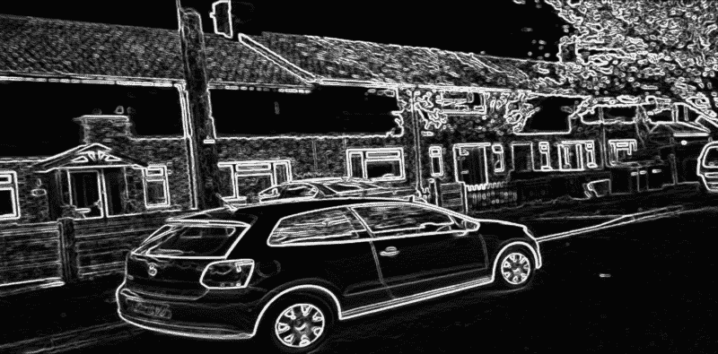

今天，世界上大约有 4%的人有视力障碍。像在房间里简单导航或在街上行走这样的任务给他们带来了每天都要面对的真实危险。基于当前技术的解决方案太难获得或难以使用。

作为大学作业的一部分，我们([我自己](https://twitter.com/Dan_Ruta)、[路易](https://twitter.com/LouisJordan)和[汤姆](https://www.instagram.com/thomas.j.fox96/))设计并实现了一个新的解决方案。我们使用可配置的 WebGL 着色器来实时增强用户周围的视频。我们以 AR/VR 格式渲染输出，具有边缘检测和颜色调整等效果。后来，我们还增加了色盲模拟，供设计师使用。我们还增加了一些 AI 实验。

我们在最初的研究论文中做了更深入的文献综述。ACM 出版了一个更短的两页版本[在这里](https://dl.acm.org/citation.cfm?id=3196319&dl=ACM&coll=DL&preflayout=flat)。本文更多地关注所使用的技术，以及一些进一步的用途和实验，如人工智能集成。

我们在对现有解决方案的研究中发现，一种流行的方法是使用边缘检测来检测环境中的障碍物。大多数解决方案在可用性或硬件可访问性和便携性方面都有所欠缺。

我们能想到的给用户反馈的最直观的方法是通过使用虚拟现实耳机。虽然这意味着该系统对视力严重受损的人没有帮助，但对那些部分失明的人来说，尤其是对那些视力模糊的人来说，这将是一个更直观的系统。

#### 边缘检测

边缘等特征检测最好使用 2D 卷积来完成，甚至用于深度学习([卷积神经网络](http://cs231n.github.io/convolutional-networks/))。简而言之，这些是图像数据网格(像素)与内核/过滤器中的权重的点积。在边缘检测中，当像素值与过滤器值对齐时，输出较高(更白),表示边缘。

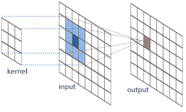

This is done for every pixel. - [Image credit](http://jeanvitor.com/convolution-parallel-algorithm-python/)

边缘检测过滤器有几个可用选项。我们包括的配置有 Frei-chen，以及 Sobel 的 3x3 和 5x5 变体。他们每个人都达到了相同的目标，但略有不同。例如，3x3 Sobel 滤镜比 5x5 滤镜更清晰，但包含更多来自织物等纹理的噪声:

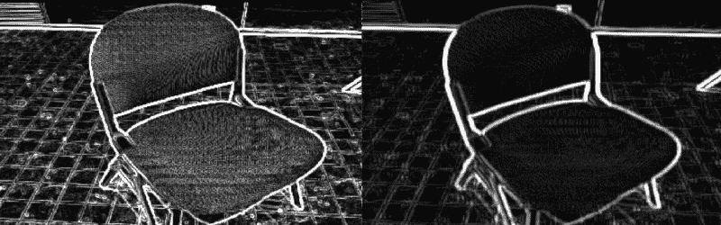

Left: 3x3, Right: 5x5

#### 网络平台

我们选择 web 作为平台的主要原因是它的广泛可用性，以及对几乎所有移动设备的兼容性。与原生应用相比，它还受益于更容易的访问。然而，这种权衡带来了一些问题，主要是用户需要采取的必要设置步骤:

1.  确保网络连接
2.  导航到网页
3.  将设备调至横向模式
4.  配置效果
5.  启用 VR 模式
6.  激活全屏模式(通过点击屏幕)
7.  将手机插入虚拟现实耳机

为了避免非技术用户感到困惑，我们创建了一个 PWA ( [progressive web app](https://developers.google.com/web/progressive-web-apps/) )网站，允许用户将其保存到他们的 Android 主屏幕上。这确保它总是在正确的页面上启动，强制打开横向模式，应用程序总是全屏，并且不依赖于网络连接。

#### 表演

由于非常昂贵的卷积运算，早期的 JavaScript 原型无法达到我们 60fps 的目标。我们怀疑瓶颈是 JavaScript 本身。我们尝试了 WebAssembly 版本。最终的原型运行得更慢。这很可能是由于在 WebAssembly 代码之间来回传递视频帧数据的开销。

因此，我们转向了 WebGL 着色器。着色器非常棒，因为它们在纹理(视频馈送)像素上对一点代码(着色器)进行了极端的并行处理。为了保持高性能，同时保持高水平的定制，随着配置的变化，着色器代码必须在运行时拼接在一起并重新编译，但通过这一点，我们成功地保持在 60fps 所需的 16.7 毫秒帧预算内。

#### 反馈

我们进行了一些用户测试。我们测试了一些基本任务，如导航，并收集了一些定性反馈。这包括对用户界面的调整，建议添加一个选项来配置边缘和表面的颜色，以及一个关于视野(FoV)太低的评论。

两个软件改进建议都得到了应用。由于相机硬件的限制，FoV 不是可以通过软件修复的东西。然而，我们设法找到了一种廉价的手机相机鱼眼镜头来解决这个问题。镜片以光学方式扩大了视野，而不是数字方式。

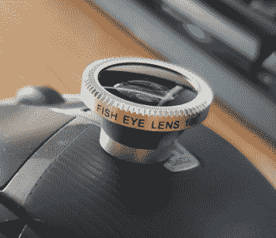

Fish-eye lens

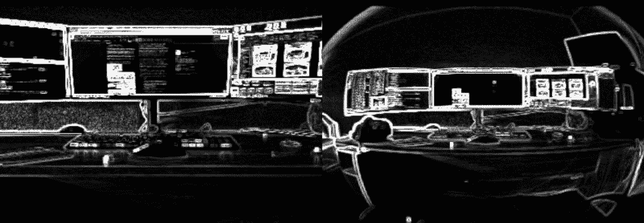

Left: no lens, Right: with lens

除此之外，该系统超出了最初的预期，但在阅读文本方面有所欠缺。这是因为每个字符有两组边。尽管引入了更多的噪声，低光性能也是可用的。

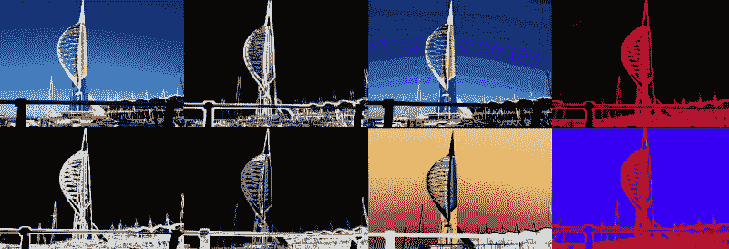

Some shader effect configuration examples

我们包括的一些其他配置是效果的半径、强度和颜色反转。

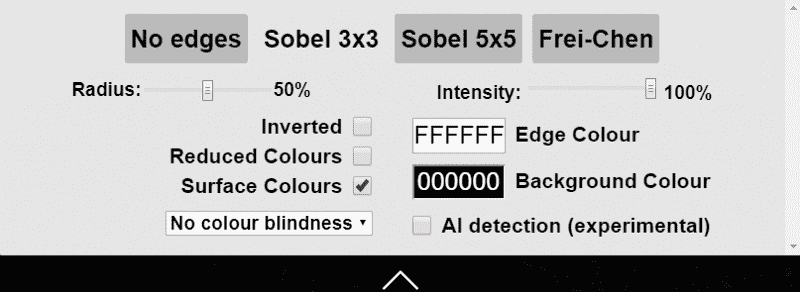

The options menu

#### 其他使用案例

我们的想法是添加着色器效果来模拟各种类型的色盲，为设计师提供一种简单的方法来检测他们产品中与色盲相关的可访问性问题，无论是软件还是其他。

使用这里找到的 RGB 比率值，并关闭边缘检测，我们能够通过着色器中额外的可切换组件添加所有主要类型色盲的基本模拟。

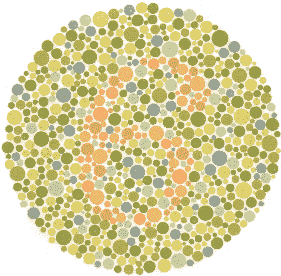

Ishihara test - [Image Credit](http://www.colour-blindness.com/colour-blindness-tests/ishihara-colour-test-plates/)

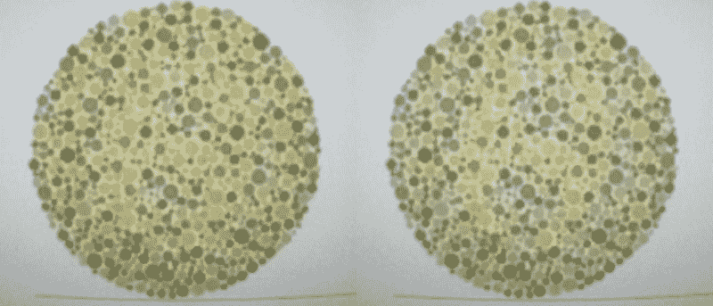

**(Left)** Normal **(Right)** Deuteranopia filter

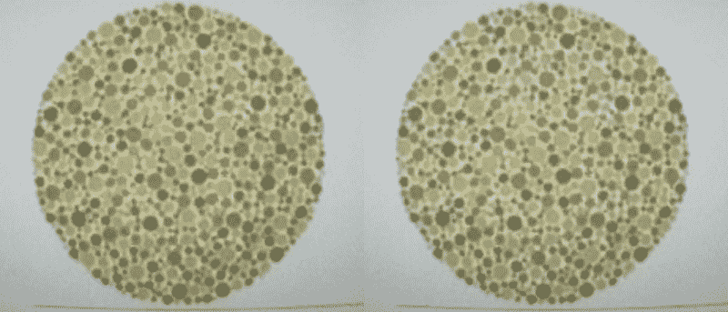

**(Left)** Normal **(Right)** Protanopia filter

#### 人工智能与未来工作

虽然这是一个实验，但仍处于非常早期的阶段，更高级别的物体检测可以使用 [tensorflowjs](https://js.tensorflow.org/) 和 [tfjs-yolo-tiny](https://github.com/ModelDepot/tfjs-yolo-tiny) 来完成，这是 [tiny-yolo](https://pjreddie.com/darknet/yolo/) 的 tensorflowjs 端口，是 yolo 物体检测模型的更小更快的版本。

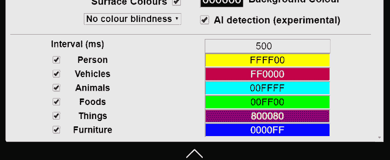

The current categories

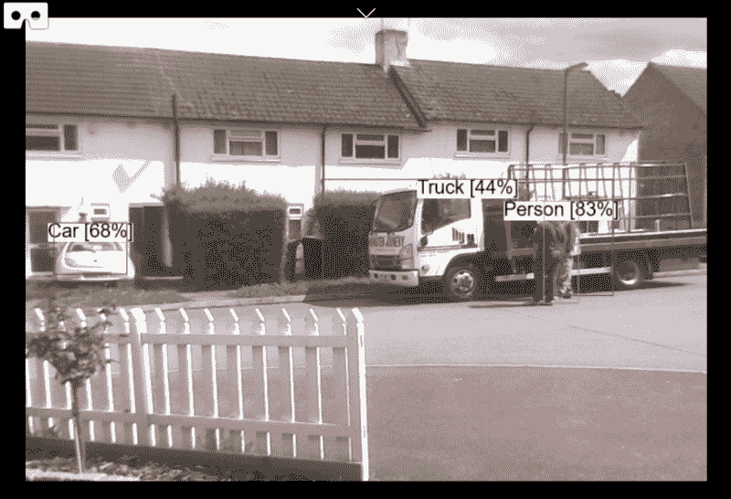

Example inference, using a laptop. Requires a decent GPU, to work.

下一步是让实例分段在浏览器中工作，使用类似于 [mask rcnn](https://github.com/matterport/Mask_RCNN) 的东西(不过，它可能需要更小，比如 tiny-yolo)，并将其添加到 WebSight，用颜色遮罩而不是标签框来突出显示项目。

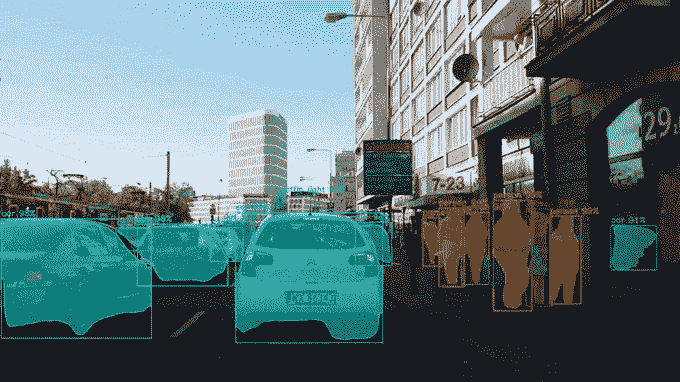

Goals — [Source](https://github.com/matterport/Mask_RCNN#4k-video-demo-by-karol-majek)

GitHub 回购在这里[是](https://github.com/DanRuta/WebSight)，在 https://websight.danruta.co.uk 的[可以找到现场演示。请注意，除非苹果在浏览器中提供对相机 API 的支持，否则它可能无法在苹果手机上运行。](https://websight.danruta.co.uk)

当然，我也从中获得了一些额外的乐趣。能够实时编辑你周围看到的东西打开了一个充满机会的世界。

比如用一个[矩阵着色器](https://websight.danruta.co.uk/#matrix)，你就能感受到那种。

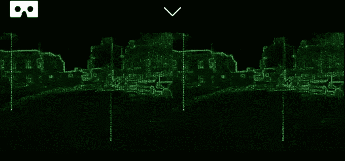

Everything is drawn using green digits, not lines

或者你只是喜欢看世界燃烧。

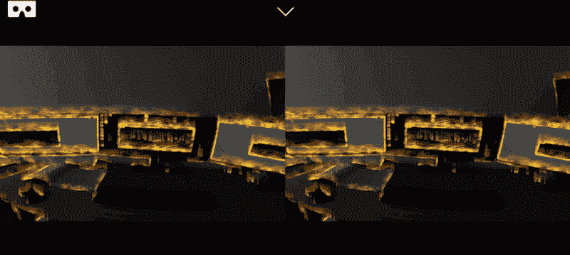

Playing: [Billy Joel — We Didn’t Start the Fire](https://www.youtube.com/watch?v=eFTLKWw542g)

你可以在这里给我发更多关于着色器的想法:@DanRuta