# 强化学习简介

> 原文：<https://www.freecodecamp.org/news/a-brief-introduction-to-reinforcement-learning-7799af5840db/>

通过 ADL

强化学习是机器学习的一个方面，其中代理通过执行某些动作并观察它从这些动作中获得的回报/结果来学习在环境中的行为。

随着机器人手臂操作的进步，谷歌 Deep Mind 击败了一名职业阿尔法围棋选手，最近 OpenAI 团队击败了一名职业 DOTA 选手，强化学习领域近年来真的爆发了。

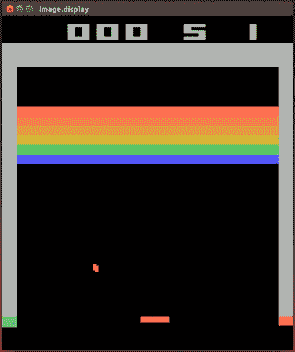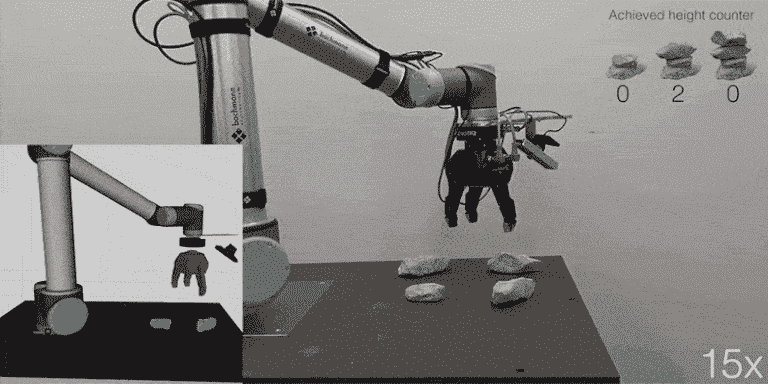

Examples

在本文中，我们将讨论:

*   什么是强化学习及其本质，如奖励、任务等
*   强化学习的 3 种分类

#### 什么是强化学习？

让我们以一个例子开始解释——假设有一个小婴儿开始学习如何走路。

让我们把这个例子分成两部分:

#### 1.**婴儿开始行走并成功到达沙发**

因为沙发是最终目标，婴儿和父母都很高兴。

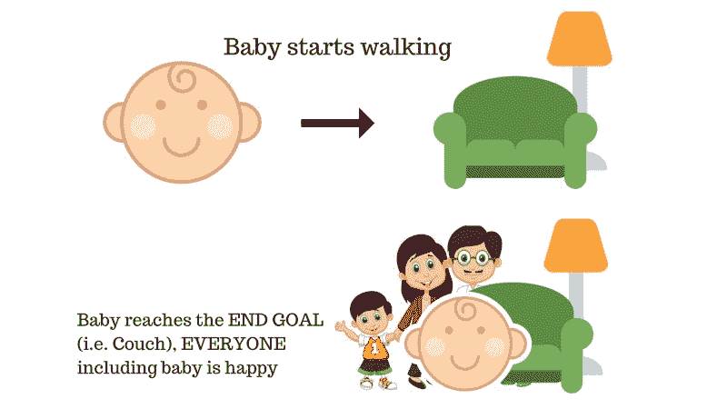

所以，婴儿是快乐的，并得到父母的赞赏。是正面的——宝宝感觉很好*(正面奖励+n)。*

#### 2.婴儿开始走路，由于中间有障碍物而摔倒，受到擦伤。

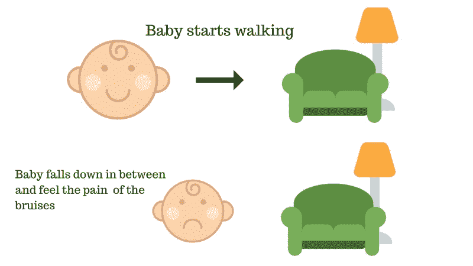

哎哟！婴儿受伤了，很痛苦。是负的——宝宝哭*(负奖励-n)。*

这就是我们人类学习的方式——不断摸索。强化学习在概念上是相同的，但它是一种通过行动学习的计算方法。

### 强化学习

假设我们的强化学习代理正在学习玩马里奥作为例子。强化学习过程可以被建模为如下工作的迭代循环:

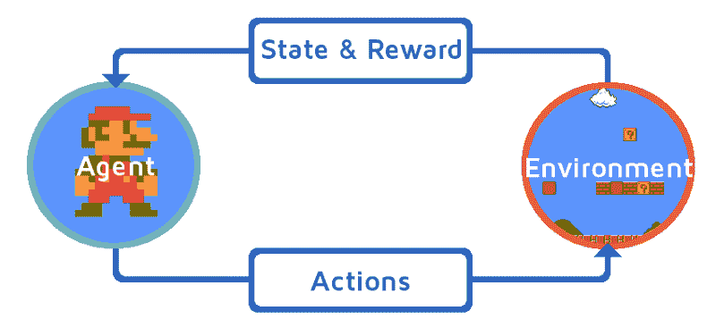

*   RL 代理从**环境**即马里奥接收**状态的** ⁰
*   基于那个**状态 S⁰，**RL 代理采取**动作 A** ⁰，比方说——我们的 rl 代理向右移动。最初，这是随机的。
*   现在，环境处于新的状态 **S** (来自马里奥或游戏引擎的新框架)
*   环境给 RL 代理一些奖励 R 。它很可能给出+1，因为代理还没有死。

这个 RL 循环一直持续到我们死了或者到达目的地，它不断输出一系列的**状态、动作和奖励。**

我们 RL 代理的基本目标是最大化回报。

### 回报最大化

RL 代理基本上基于报酬最大化的假设工作。这就是为什么强化学习应该有尽可能好的行动，以使回报最大化。

每一时间步的相应行动的累积奖励写为:

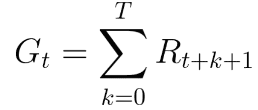

然而，当总结所有的奖励时，事情并不是这样进行的。

让我们详细地理解这一点:

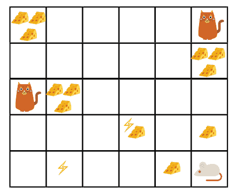

假设我们的 RL 代理(机器老鼠)在一个迷宫里，里面有**奶酪、电击和猫**。目标是在被猫吃掉或触电之前吃掉最大量的奶酪。

吃我们附近的奶酪而不是吃靠近猫或电击的奶酪似乎是显而易见的，因为我们越靠近电击或猫，死亡的危险就越大。这样一来，猫或者电击附近的奖励，哪怕再大(奶酪多)也会打折扣。这样做是因为不确定因素。

有道理，对吧？

#### **奖励折扣是这样工作的:**

我们定义一个叫做**γ**的贴现率。它应该介于 0 和 1 之间。伽玛越大，折扣越小，反之亦然。

因此，我们的累积预期(贴现)回报是:

Cumulative expected rewards

### 强化学习中的任务及其类型

任务是强化学习问题的一个实例。我们基本上有两种类型的任务:**连续的和间断的。**

#### 连续任务

这些是永远持续的任务类型。例如，进行自动外汇/股票交易的 RL 代理。

Photo by [Chris Liverani](https://unsplash.com/@chrisliverani?utm_source=medium&utm_medium=referral) on [Unsplash](https://unsplash.com?utm_source=medium&utm_medium=referral)

在这种情况下，主体必须学会如何选择最佳行动，同时与环境互动。没有起点和终点状态。

RL 代理必须保持运行，直到我们决定手动停止它。

#### 偶发性任务

在这种情况下，我们有一个起点和一个终点**称为终端状态。这就创建了一个片段**:一个状态列表(S)，动作列表(A)，奖励列表(R)。

举个的例子**，**在玩一个*反恐精英*的游戏，在这个游戏中，我们要么射杀对手，要么被他们杀死。我们把他们都拍下来，完成这一集，否则我们就被杀了。所以，完成剧集只有两种情况。

### 勘探与开采权衡

强化学习中有一个重要的概念，即探索和利用的权衡。探索就是寻找更多关于环境的信息，而开发就是利用已知的信息来获得最大的回报。

**现实生活例子:**说你每天都去同一个餐厅。你基本上是在**剥削。**但另一方面，如果你每次去任何一家餐馆之前都搜索新餐馆，那么这就是**探索**。探索对于寻找可能比近期回报更高的未来回报非常重要。

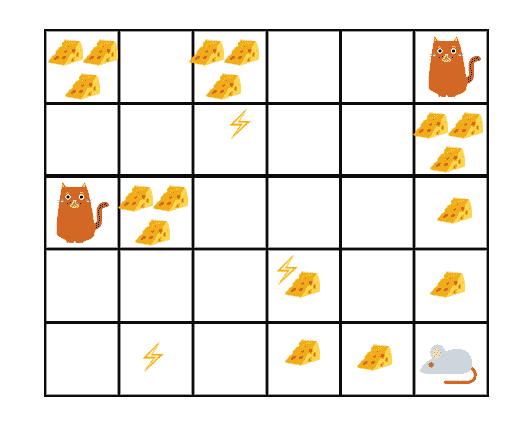

在上面的游戏中，我们的机器老鼠可以拥有大量的小奶酪(每个+0.5)。但是在迷宫的顶端有一大笔奶酪(+100)。因此，如果我们只关注最近的奖励，我们的机器老鼠永远也不会够到那一大块奶酪——它只会剥削。

但是，如果机器老鼠做一点点探索，它可以找到大奖励，即大奶酪。

这是**勘探和开采权衡的基本概念。**

### 强化学习的方法

现在让我们了解解决强化学习问题的方法。基本上有 3 种方法，但在本文中我们将只采用 2 种主要方法:

#### 1.基于政策的方法

在基于策略的强化学习中，我们有一个需要优化的策略。该策略基本上定义了代理的行为方式:

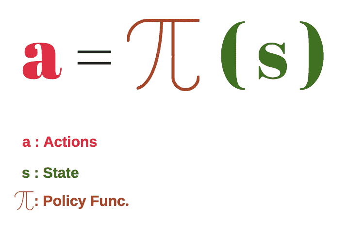

我们学习一个策略函数，它帮助我们将每个状态映射到最佳动作。

深入到策略，我们进一步将策略分为两种类型:

*   **确定性**:处于给定状态的策略将总是返回相同的动作(a)。**它的意思是，它被预映射为 S=(s) ➡ A=(a)。**
*   **随机**:给出不同行为的概率分布**。即随机政策➡ p( A = a | S = s )**

#### 2.基于价值

在基于价值的 RL 中，智能体的目标是优化价值函数 *V(s)* ，它被定义为一个告诉我们智能体在每个状态下应该获得的最大预期未来回报的函数。

每个状态的值是 RL 代理在未来可以从特定状态收集的奖励的总量。

代理将使用上述值函数来选择每一步要选择的状态。代理将总是选择具有最大值的状态。

在下面的例子中，我们看到在每一步中，我们将取最大值来实现我们的目标:1 **➡** 3 **➡** 4 **➡ 6** 等等…

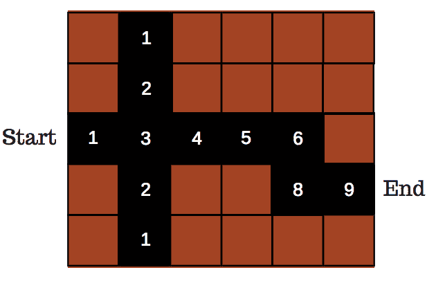

Maze

### 乒乓游戏——直观的案例研究

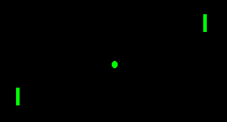

让我们举一个打乒乓球的真实例子。本案例研究将向您介绍**强化学习如何工作的直觉**。我们不会在这个例子中深入讨论细节，但是在下一篇文章中我们肯定会深入探讨。

假设我们教我们的 RL 代理玩乒乓游戏。

基本上，我们将游戏框架(新状态)输入到 RL 算法中，并让算法决定何处上升或下降。这个网络被称为**策略网络，**，我们将在下一篇文章中讨论。

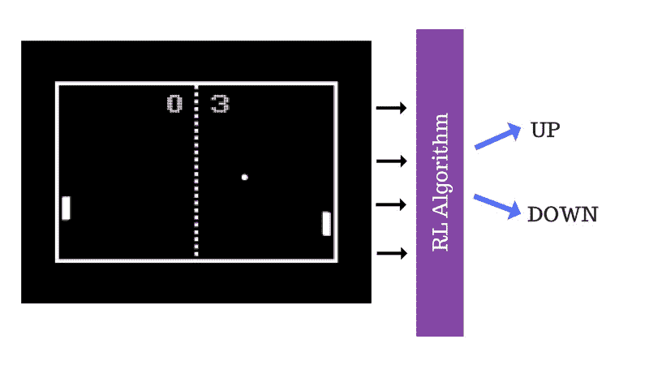

用来训练这个算法的方法叫做**策略梯度**。我们从游戏引擎输入随机帧，算法产生一个随机输出，给出一个奖励，然后反馈给算法/网络。这是一个**的迭代过程。**

我们将在下一篇文章中更详细地讨论**政策梯度**。

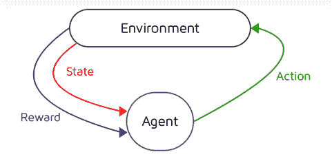

Environment = Game Engine and Agent = RL Agent

在游戏的上下文中，分数板充当对代理的奖励或反馈。每当代理倾向于得分+1 时，它理解它所采取的行动在该状态下已经足够好了。

现在，我们将训练代理玩乒乓球游戏。首先，我们将把一堆游戏框架**(状态)**输入到网络/算法中，让算法决定行动。代理人的最初行动显然会很糟糕，但我们的代理人有时会足够幸运地获得一分，这可能是一个随机事件。但是由于这个幸运的随机事件，它得到了一个奖励，这有助于代理人理解这一系列的行为足够好来获得奖励。

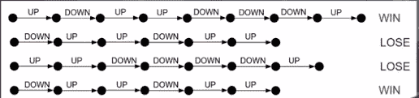

Results during the training

所以，在未来，代理人很可能采取能获得回报的行动，而不是不能获得回报的行动。直觉上，RL 代理倾向于玩这个游戏。

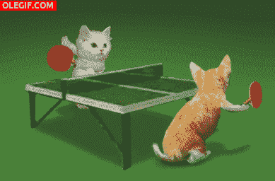

Source: OLEGIF.com

#### 限制

在代理的训练过程中，当一个代理丢失一个情节时，该算法将放弃或降低采取该情节中存在的所有一系列动作的可能性。

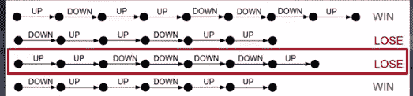

Red Demarcation Shows all the action Taken in a losing episode

但是，如果代理从这一集的开始就表现得很好，但是仅仅因为最后两个动作，代理输掉了游戏，那么放弃所有的动作是没有意义的。相反，如果我们只删除导致损失的最后两个操作，这是有意义的。

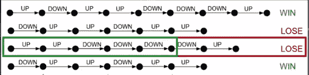

Green Demarcation shows all the action which where correct and Red Demarcation are the action Which Should be removed.

这被称为**信用分配问题。**这个问题的出现是因为**稀疏的奖励设置。**也就是说，我们不是每走一步都得到奖励，而是在一集结束时得到奖励。因此，代理人需要了解哪些行为是正确的，哪些实际行为导致了游戏失败。

因此，由于 RL 中这种稀疏的奖励设置，该算法是非常样本低效的。这意味着为了训练代理人，必须输入大量的训练样本。但事实是，由于环境的复杂性，稀疏奖励设置在许多情况下会失败。

所以，有一个叫做**奖励塑造**的东西用来解决这个问题。但是同样，奖励形式也有一些限制，因为我们需要为每个游戏设计一个定制的奖励函数。

#### 结束语

今天，强化学习是一个令人兴奋的研究领域。该领域已经取得了重大进展，深度强化学习就是其中之一。

我们将在接下来的文章中讨论深度强化学习。这篇文章涵盖了很多概念。请花点时间了解强化学习的基本概念。

但是，我想提一下，强化并不是一个秘密的黑匣子。无论我们今天在强化学习领域看到什么样的进步，都是聪明人日以继夜研究特定应用的结果。

下一次我们将研究一个 Q-learning agent，还将涉及一些强化学习的基础知识。

直到，然后享受 AI？…

> **重要提示**:本文是深度强化学习系列的第一部分，完整系列将在[媒体](https://medium.com/@alamba093)上以文本可读形式提供，并在[YouTube 上我的频道](https://www.youtube.com/channel/UCRkxhh51YKqpn2gaUI3MXjg)上以视频解释形式提供。

为了更深入、更直观地理解强化学习，我建议您观看下面的视频:

订阅我的 YouTube 频道更多 AI 视频: [**ADL**](https://goo.gl/u72j6u) 。

*如果你喜欢我的文章，请点击**？答**我仍然有动力写东西，请在媒体&上跟随我*

如果你有任何问题，请在下面的评论中或者 [**Twitter**](https://twitter.com/I_AM_ADL) 告诉我。订阅我的 YouTube 频道获取更多科技视频: [**ADL**](https://goo.gl/u72j6u) 。