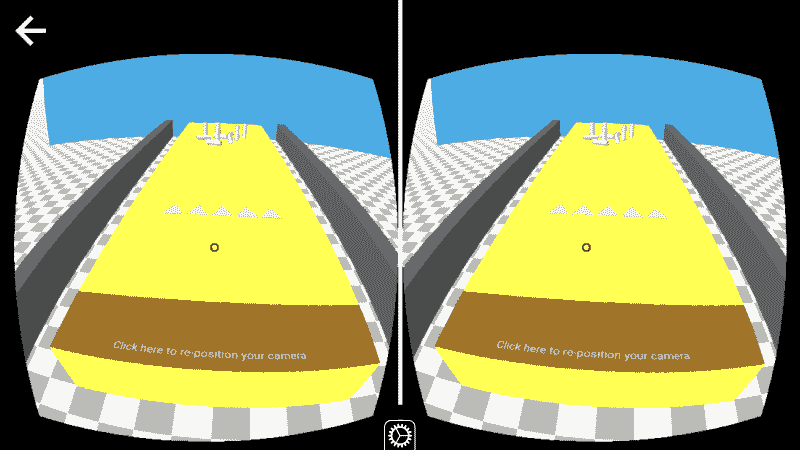

# 用 A-Frame、PubNub 和 WebVR 构建一个基于浏览器的多人虚拟现实游戏

> 原文：<https://www.freecodecamp.org/news/build-a-multiplayer-browser-based-vr-game-with-a-frame-pubnub-and-webvr-b7de33ba088/>

作者:Namratha Subramanya

# 用 A-Frame、PubNub 和 WebVR 构建一个基于浏览器的多人虚拟现实游戏

技术的进步使得虚拟现实(VR)比以往任何时候都更加身临其境，更加实惠。这种沉浸式环境可以类似于真实世界。或者它可以是幻想的，创造一种在普通现实中不可能的体验。

更好的是，如今高质量的 VR 设备价格低廉。随着谷歌 Cardboard、三星 Gear VR、Oculus Rift 和 HTC Vive 等一系列智能手机兼容的虚拟现实头戴设备的出现，虚拟现实正在成为下一件大事。

在本教程中，我们将利用这一点，使用 A-Frame、PubNub、Glitch 和 WebVR 构建一个实时的多人虚拟现实游戏。

完整的 GitHub 代码库可以在这里找到。

### 网络虚拟现实

[WebVR](https://webvr.info/) 是一个开放的规范，使得在你的浏览器中体验 VR 成为可能。它是一个 JavaScript 浏览器 API，充当 VR 硬件的接口。WebVR 是跨平台的，可以在任何支持 VR 的浏览器上开发、查看和分享 VR 内容。有了 WebVR，你只需点击一个链接，就可以打开浏览器进入 VR。直接用 WebVR 工作，需要 JavaScript 和 WebGL 的知识。

### a 形框架

[A-Frame](https://aframe.io/) 是一个基于 WebVR API 构建的虚拟现实框架。它使用 WebVR API 来访问 VR 头戴式设备传感器数据(位置、方向),以转换相机并将内容直接呈现给 VR 头戴式设备。A-Frame 是一个开放的社区项目，使用 WebVR API 以及 HTML、CSS、JavaScript 和 three . js。A-Frame 旨在提供高度沉浸式和交互式的 VR 内容，具有类似原生的性能。同时，A-Frame 希望每个人都能够参与 VR 内容创作。A-Frame 支持所有主流耳机及其控制器。

### 小故障

[Glitch](https://glitch.com/~aframe) 提供在线代码编辑器，可即时部署和托管网站。编辑器支持前端和后端代码以及多个文件和目录。Glitch 允许您重新混合(即复制)现有的项目，使它们成为我们自己的项目，并立即托管和部署更改，让每个人都可以看到。Firefox Nightly 允许你使用调试控制台调试 VR 内容。

### 游戏环境

#### a 框架物理系统

`aframe-physics-system`是一个中间件，它初始化物理引擎，并公开 A-Frame 组件供我们应用于实体。当我们使用其`static-body`或`dynamic-body`组件时，`aframe-physics-system`会创建一个`Cannon.Body`实例，并将其附加到我们的 A 帧实体上，因此在每一帧上，它都会调整实体的位置、旋转等。来匹配尸体。

#### 球

`<a-sphe` re >原始创建一个球形。你可以定义它的半径颜色和位置。因为`se of aframe-physics-`系统，球可以转化为具有一定质量的动力体。

#### 保龄球线

ox >创建诸如盒子、立方体或墙壁等形状。你可以创建一个长方形的盒子，然后在上面放上球瓶和球，做成一个保龄球道。

#### 腿

`<a-cylind` er >图元用于创建管和曲面。这些圆柱体可以在游戏中用作保龄球瓶。确保定义圆柱体的半径、高度、位置和质量。

#### 轨道

每次你扔球时，球不会朝同一个方向滚动。您可以为球的滚动定义任意数量的轨迹，并且该轨迹可以反过来定义方向。这个游戏有 5 个轨道，球在这些轨道上的运动由 5 个三角形或者说保龄球道上的指针控制。

#### 环境

场景由元素`<a-sce` ne >表示。场景是全局根对象，所有实体都包含在场景中。对象的摩擦、恢复和迭代次数分别设置为 0.001、0.3 和 30。

A-Frame 有一个资产管理系统，允许我们将资产放在一个地方，并预加载和缓存资产以获得更好的性能。我们将这些资产放在`<a-asse` ts >内。

缩放组件定义实体的收缩、拉伸或倾斜变换。可以使用“缩放”组件将一个长方体变换为保龄球道后面的一面墙。

在类似的行中，可以使用 scale 组件将一个框转换为一个附加到墙上的按钮。`<a-te` xt >可以将文本添加到您的虚拟环境中。

`<a-b` ox >也可以用来建造保龄球道旁边的边界。

### 游戏

#### 滚球

如前所述，球可以在保龄球道上滚动 5 个假想的轨迹。这可以通过使用>上的`<a-animati`来实现。动画可以附加在 A 帧 th `rough <a-a` nimation >元素中，方法是将其作为要制作动画的实体的子元素。

现在，您可以将球的这些动画与 5 个指针绑定在一起，这样每次单击其中一个三角形时，动画都会开始。这可以通过编写一个组件来实现。我们可以在 JavaScript 中注册组件，并从 DOM 中声明性地使用它。组件是可配置的、可重用的和可共享的。

#### 销子掉落

当一个质量为 17.5 的动态物体滚向 10 个质量为 1.25 的动态物体时，它们中的一些会掉下来。每次击倒后，人们可以数出倒下的瓶数。我们可以在动画结束时检查大头针的位置。如果大头针的任何旋转的 x 值不等于 0 或-0，那么这意味着大头针不是直立的。通过计算躺着的瓶的数量，你可以计算出球员的得分。

上面一行捕获了一个大头针的旋转属性的 x 值。这样，您可以获取所有大头针的旋转属性的 x 值，并将其保存到一个数组中。现在您可以遍历数组，检查每个值并递增`strike`计数器。

#### 新游戏

玩家可以在任何时间点通过点击墙上的新游戏按钮开始新游戏。它会自动刷新游戏。

#### 移动摄像机

你可以在游戏过程中的任何时候移动相机。在这里，我选择在球员每次滚球时移动摄像机，以便更好地观察下落的球瓶。

### PubNub

在不到 1/4 秒的延迟下，PubNub 可以在多个 VR 设备之间流畅地发布和订阅消息。让我们把这个单人游戏转换成双人游戏。

你现在必须初始化你的 PubNub 键。[注册一个 PubNub 账户](https://admin.pubnub.com/#/register/?utm_source=Syndication&utm_medium=Medium&utm_campaign=SYN-CY18-Q3-Medium-Aug-17)并在[管理面板](https://admin.pubnub.com/#/register?utm_source=Syndication&utm_medium=Medium&utm_campaign=SYN-CY18-Q3-Medium-Aug-17)中创建一个项目。

#### 决定转弯

每个玩家有两次机会。玩家开关每开两枪就打开一次。所以在每两次拍摄之后，PubNub 可以通知另一个用户他们可以取得控制权。在这个游戏中，每次轮到玩家时，保龄球道上会出现 5 个三角形指针。当没有轮到他们时，5 个三角形指针被隐藏。

没轮到你的时候把指针藏起来。在这里，我没有隐藏，而是将位置设置为 0。

轮到你时，使指针表面回到保龄球道。通过这样做，你将再次控制轨道。

#### 击倒后复制销的状态

在每次击倒后，您可以捕获被击倒的瓶子的位置，并使用 PubNub 将其发送给其他用户。通过这样做，您可以在其他玩家的屏幕上复制一个玩家的屏幕。在下面的代码中，您可以看到 pin 1 的位置和旋转值是使用 PubNub 传递给其他播放器的。在类似的行中，您可以通过 PubNub 发送所有大头针的旋转和位置值。

#### 在静态和动态物体之间切换

之前我们使用`aframe-physics-system`将 A 帧物体转换成动态物体。当玩家没有滚动球，只是复制另一个玩家的屏幕时，球不应该是一个动态体，以避免额外的球瓶掉落。

当轮到当前玩家时，dynamics 被设置为 true，并添加`dynamic-body`属性。

当没有轮到玩家时，dynamics 被设置为 false，并且`dynamic-body`属性被移除。

#### 玩家 2

一旦你在玩家 1 的屏幕上通过 PubNub 发布完数据，你就可以通过订阅 PubNub 的频道来读取数据。

当 PubNub 接收到与倒下的瓶的位置和旋转相关的数据时，您可以将玩家 2 屏幕上瓶的属性设置为与玩家 1 相同的值，从而使两个屏幕完全相同。

### 结论

恭喜你！每次你在玩家 1 的屏幕上滚动球，你可以看到玩家 2 的屏幕复制所有的动作。现在，您可以通过将玩家 2 的数据发布回玩家 1 来恢复这一点，并将您的游戏转换为功能齐全的双人游戏。它也可以转换成多人游戏。快乐的虚拟现实游戏！

**[完整的 GitHub 代码库可以在这里找到](https://github.com/namrathasubramanya/VR-Bowling-game)。**

*最初发表于[www.pubnub.com](https://www.pubnub.com/blog/build-multiplayer-browser-based-vr-game-aframe-webvr/?utm_source=Syndication&utm_medium=Medium&utm_campaign=SYN-CY18-Q3-Medium-Aug-17)。*