# 如何使用 Cognito、API Gateway 和 Lambda 保护 AWS 上的微服务

> 原文：<https://www.freecodecamp.org/news/how-to-secure-microservices-on-aws-with-cognito-api-gateway-and-lambda-4bfaa7a6583c/>


let me in! ([Giphy](https://media.giphy.com/media/3o6gb3kkXfLvdKEZs4/giphy.gif))

处理 auth 是痛苦的。但是大多数应用程序需要对用户进行身份验证，并控制他们可以访问哪些资源。微服务虽然越来越受欢迎，但也会增加复杂性。你需要保护*用户的动作*和服务之间的交互*。*

AWS 为微服务架构提供了一些很好的构建模块。但就像宜家的家具一样，你必须自己组装。另外说明书也不是很好。

我们将构建一个简单的应用程序，并配置 AWS 来验证用户和保护微服务。

### TL；博士(给不耐烦的人)

**工作演示:**[https://auth-api-demo.firebaseapp.com/](https://auth-api-demo.firebaseapp.com/)(用户:`demouser`密码:`demoPASS123)`

**GitHub 回购**:【https://github.com/csepulv/auth-api-demo T2

**基本用例/假设:**有两组资源— **a)** 需要*认证的*用户的资源和 **b)** 不需要的资源。

我们将使用

*   AWS [Lambda](https://docs.aws.amazon.com/lambda/latest/dg/welcome.html) 、 [API Gateway](https://docs.aws.amazon.com/apigateway/latest/developerguide/welcome.html) 和 [Cognito](https://aws.amazon.com/cognito/dev-resources/)
*   Claudia.js (用于构建我们的 API)
*   [反应](https://reactjs.org/)(针对我们的网络客户端)

对于那些读到最后的人来说，有些好东西。

现在，关于细节。

### 概念应用模型

演示应用程序实现了以下模型。


*   用户登录应用程序并获得一个身份验证令牌
*   AWS 使用这个令牌来验证身份并授权用户对受保护资源的请求
*   应用程序网关在用户和应用程序资源之间创建了一个虚拟的*壕沟*

### AWS 服务

如果你是 AWS 新手，有官方的 [AWS 入门](https://aws.amazon.com/getting-started/)门户。还有，Udemy 有免费课程， [AWS 要领](https://www.udemy.com/aws-essentials/)。

您将需要访问 AWS 帐户。您可以注册 AWS [免费等级](https://aws.amazon.com/free/)。

#### 自动气象站λ

虽然 [EC2](https://aws.amazon.com/ec2/) 是最受欢迎的 AWS 选项之一，但我认为[λ](https://docs.aws.amazon.com/lambda/latest/dg/welcome.html)更适合微服务。EC2 实例是虚拟机。从操作系统到它运行的所有软件，一切都由你负责。Lambda 是一个[功能即服务](https://martinfowler.com/articles/serverless.html)模型。没有服务器供应或部署；您编写您的服务逻辑。

更多信息，请参考 [AWS Lambda 文档](https://docs.aws.amazon.com/lambda/latest/dg/welcome.html)。

但是兰姆达斯有一个问题。应用程序用户无法直接接触到它们。Lambda 需要调用 Lambda 函数的触发器。这可以是一个排队的消息，或者在我们的例子中，是一个 API 网关请求。

#### AWS API 网关

API 网关为您的应用程序服务提供了一条护城河。它可以记录用户活动、验证请求并执行使用策略(如速率限制)。( [AWS API 网关文档](https://docs.aws.amazon.com/apigateway/latest/developerguide/welcome.html)是一个很好的参考。)

#### AWS Cognito

[AWS Cognito](https://aws.amazon.com/cognito/dev-resources/) 是一项用户管理、认证和访问控制服务。不幸的是，所有的特性和配置有时会令人困惑。(好像安全和认证很容易。？)我们将关注 Cognito 的核心元素来保护我们的 API。

### 应用程序和环境设置

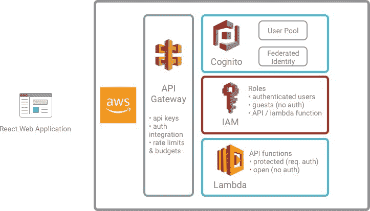

App Elements

我们的演示应用程序的配方是:

1.  在 AWS Cognito 中，创建一个用户池(带有一个客户端应用程序)和一个联合身份池。
2.  在 AWS API 网关中，创建使用计划和 API 密钥
3.  使用 Claudia JS，构建并部署一个简单的基于 AWS Lambda 的 API。
4.  更新 AWS IAM 角色以授予经过身份验证的用户对受保护的 API 方法的访问权限
5.  使用`create-react-app`创建一个单页应用程序(SPA)。它将使用 AWS Cognito 并发出签名(和认证)的 API 请求

详细的 AWS 设置在演示 GitHub repo 的`[aws-setup.md](https://github.com/csepulv/auth-api-demo/blob/master/docs/aws-setup.md)`中。我们将强调设置的各个方面，并解释工作原理。

#### AWS Cognito

**用户池、客户端应用和域名**

我们将使用默认值创建一个用户池。详情和截图:

*   [用户池](https://github.com/csepulv/auth-api-demo/blob/master/docs/aws-setup.md#user-pool)
*   [客户端应用](https://github.com/csepulv/auth-api-demo/blob/master/docs/aws-setup.md#app-client-settings)
*   [域名](https://github.com/csepulv/auth-api-demo/blob/master/docs/aws-setup.md#domain-name)

**联合身份池**

我们既需要用户池又需要联合身份池，这可能有点令人困惑。在这篇[帖子](https://codeburst.io/the-difference-between-aws-cognito-userpools-and-federated-identities-9b47571795d4)中，Ashan Fernando 有一个很好的解释。简单地说，

*   *用户池*为用户提供对应用程序的访问。这就像服务，如[认证 0](https://auth0.io) 。
*   一个*联合身份池*提供对 AWS 资源的访问。

通过组合这两个池，我们的应用程序可以对用户进行身份验证，AWS 将分配[临时凭证](https://docs.aws.amazon.com/IAM/latest/UserGuide/id_credentials_temp_request.html)。这些凭证允许用户访问 AWS 资源。在身份池中配置的 IAM 角色指定临时凭据的权限。

详细的联合身份池设置是这里的。

#### AWS API 网关

我建议为我们的 API 创建一个使用计划。虽然不是必需的，但这是一个很好的实践，因为如果不小心的话，AWS 成本可能会“流失”。我们将创建一个名为`api-auth-demo`的 [**使用计划**](https://docs.aws.amazon.com/apigateway/latest/developerguide/api-gateway-api-usage-plans.html) ，并为 API 调用设置一个节流和突发速率以及每日配额。我们还将创建一个 API 键，web 客户端应用程序将使用它。(完整的设置细节是[这里是](https://github.com/csepulv/auth-api-demo/blob/master/docs/aws-setup.md#api-gateway)。)

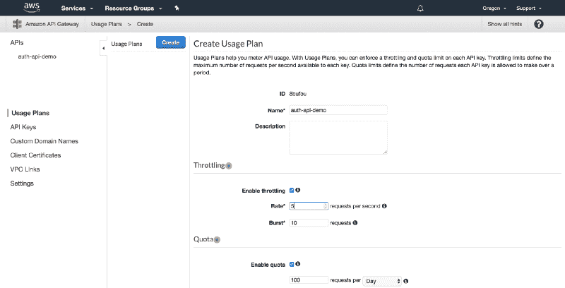

rate limits and quota

我们已经完成了 AWS 的大部分设置。我们现在将编写 Lambda 函数，然后构建 React web 应用程序。

### AWS Lambda 和 Claudia JS

我们将使用 Node.js 编写我们的 Lambda 函数。(注意，[无服务器](https://serverless.com/)框架提供了类似的功能。)

我们的例子只需要一个简单的 API。我们将创建两个 API 方法(即非常简单的微服务):一个用于认证用户，一个用于访客。

我们将使用 [Claudia API 构建器](https://claudiajs.com/claudia-api-builder.html)，它让多条路径映射到一个 lambda。路由机制类似于 [Express.js](https://expressjs.com/en/guide/routing.html) 等框架中的路由。

```
 const ApiBuilder = require("claudia-api-builder");
const api = new ApiBuilder();

api.get("/no-auth",request => {
    return {message: "Open for All!"};
  },
  { apiKeyRequired: true }
);

api.get("/require-auth", request => {
    return {message: "You're past the velvet rope!"};
  },
  { apiKeyRequired: true, authorizationType: "AWS_IAM" }
);

module.exports = api;
view rawapi.js hosted with ❤ by GitHub
```

我们将使用 Claudia.js [命令行](https://github.com/claudiajs/claudia/blob/master/docs/create.md)将 API 部署到 AWS。

```
claudia create --region us-west-2  --api-module api --name auth-api-demo
```

注意:对`api.js`的任何更改都需要重新部署。使用`claudia update...`

**API 密钥和授权**

在`api.js`中，`{apiKeyRequired: true}`表示 API 请求需要一个 API 密钥。`{authorizationType: 'AWS_IAM'}`使用 [AWS IAM](https://aws.amazon.com/iam/) 配置 API 网关授权。底层的认证机制并不明显。 [AWS 文档](https://docs.aws.amazon.com/apigateway/latest/developerguide/apigateway-integrate-with-cognito.html)概述了该方法，但总结如下:

*   当用户登录时，Cognito 将为临时凭证颁发令牌(通过 [STS](https://docs.aws.amazon.com/IAM/latest/UserGuide/id_credentials_temp.html) 获得)。
*   对于受保护的资源，应用程序需要使用这些凭据对请求进行签名
*   AWS 解码并验证签名
*   如果签名有效，API 网关将发送请求

还有其他可用的授权方法。Claudia.js [文档](https://github.com/claudiajs/claudia-api-builder/blob/master/docs/authorization.md)概述了如何指定其他方法。(对应的 AWS 文档在这里是。)

#### 已验证用户的 AWS IAM 角色

我们需要为经过身份验证的用户编辑 IAM 角色的权限。我们需要允许调用我们创建的 API 网关方法。

我们需要 API 网关的 ARN。转到 API 网关控制台，找到 API 网关资源/方法。

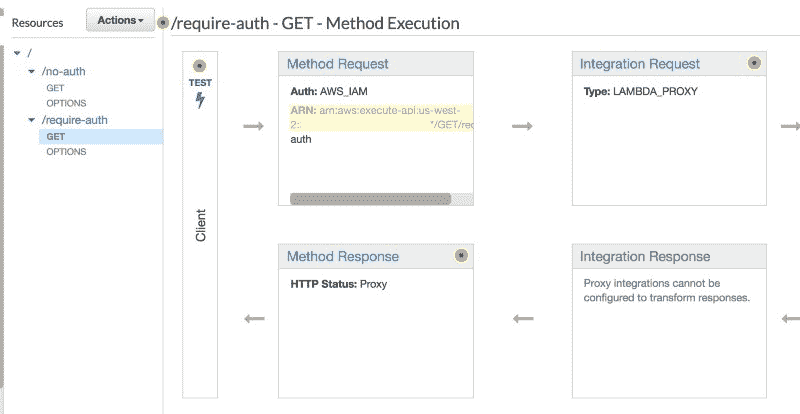

ARN (shown highlighted)

*   复制 ARN
*   转到 IAM 控制台，找到在 Cognito 联合身份池设置期间创建的*认证角色*
*   添加如下所示的*内联策略*

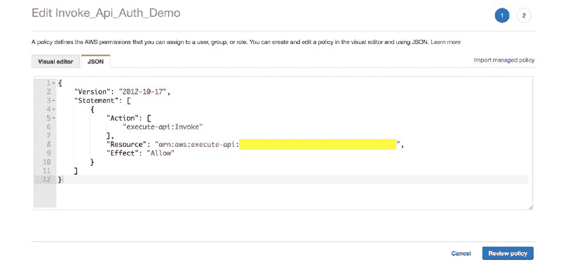

enter ARN copied from the API Gateway resource (in highlighted area)

*   在策略中为 API 网关资源指定复制的 ARN。

经过身份验证的用户现在可以调用我们受保护的 API 方法。

### 服务对服务访问控制

Cognito 设置将允许用户调用 API 方法。但是这个方法调用是 Lambda 函数的触发器。Lambda 函数在不同 IAM 角色的上下文中执行。它不再是直接的用户请求，而是 AWS 服务到服务的交互。IAM 角色为此交互提供访问控制。

克劳迪娅。JS 为 Lambda 函数创建了 IAM 角色。(您也可以手动创建此角色，并将其标识符指定给 Claudia。JS 通过`--role`参数。这里的[是](https://github.com/claudiajs/claudia/blob/master/docs/create.md)的详细内容。)

如果我们的 Lambda 函数需要访问其他 AWS 资源，我们将需要更新 Lambda 的 IAM 角色并提供这些特权。例如，这可能是一个 [RDS](https://aws.amazon.com/rds/) 数据库。

AWS 一直使用 IAM 来配置服务对服务的访问控制。这是一个开发良好并且[有据可查的](https://docs.aws.amazon.com/IAM/latest/UserGuide/id_roles.html)模型。它可能是微服务之间(AWS 内)访问控制的主要机制。有些情况下，您可能需要增加或替换它，但我会从 IAM 开始。

我们现在可以为我们的用户构建 web 应用程序了。

### 反应 Web 应用程序

我打算建立一个[反应](https://reactjs.org/)单页 web 应用程序(SPA)。一个 [Vue.js](https://vuejs.org/) 或 [Angular](https://angularjs.org/) 应用程序也可以工作。对于客户端应用程序，有两个重要的组件: [AWS Amplify](https://aws-amplify.github.io/amplify-js/index.html) 和`[aws4](https://www.npmjs.com/package/aws4)`模块。

AWS Amplify 提供了与 AWS Cognito 的轻松集成。`aws4`是一个使用 [AWS 请求签名版本 4](https://docs.aws.amazon.com/general/latest/gr/signature-version-4.html) 签署 AWS 请求的流行库。AWS 使用受保护资源的签名请求(即授权用户请求)。

回到 web 客户端，我们将使用`[create-react-app](https://github.com/facebook/create-react-app)`。我不会概述这些步骤，因为它们在`create-react-app`主页上有很好的记录，并且有许多在线教程。(我甚至写过一个[几个](https://medium.freecodecamp.org/how-to-build-animated-microinteractions-in-react-aab1cb9fe7c8)。)

对于认证，我们需要做一些状态管理。示例应用程序没有使用任何框架，但在实际应用程序中，我建议使用 [Mobx](https://mobx.js.org/) (或 [Redux](https://redux.js.org/) )。)

在演示应用程序中，`auth-store.js`管理用户认证状态。这包括用户的身份验证状态和凭证。这些是用来

*   为认证用户和访客用户呈现不同的组件和样式
*   签署受保护 API 方法的请求

虽然 AWS Amplify 管理着 AWS Cognito 集成的大部分工作，但我们还有一些工作要做。

**从 AWS 放大器确定授权状态**

AWS Amplify 的文档在某些方面很好，但在其他方面有所欠缺。我建议阅读 Amplify 文档的[认证部分](https://aws-amplify.github.io/amplify-js/media/authentication_guide)。这描述了与 Cognito 交互的`Auth`组件。

然而，仍然有一些方面文档没有清楚地说明。AWS Amplify 不容易知道认证状态。(这里的[是对这种复杂性的讨论](https://github.com/aws-amplify/amplify-js/issues/159#issuecomment-374028468)。)Amplify 异步配置自己，没有回调。但是有一个`aws-amplify`类可以帮忙。

`aws-amplify`模块中的`[Hub](https://github.com/aws-amplify/amplify-js/blob/master/docs/media/hub_guide.md)`类的行为就像一个事件发射器。我们关心两个事件:`configured`和`cognitoHostedUI`。

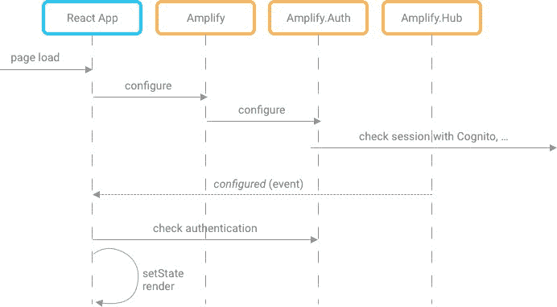

page load / configure sequence

在 AWS Amplify 配置了`Auth`组件后，它会发出`configured`事件。然后，我们的应用程序可以查询当前用户的身份验证状态。例如，这在加载应用程序时非常有用。

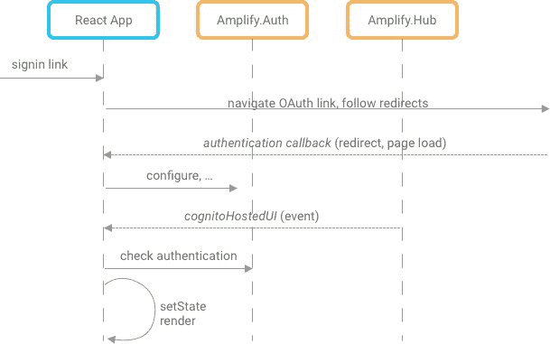

login / authenticated state change sequence

在使用应用程序时，我们需要知道身份验证状态是否发生了变化。有一个`sign-in`事件，但它不是我们想要的事件，因为我们的演示应用程序使用了 [OAuth 和 Cognito 托管的 UI](https://aws-amplify.github.io/amplify-js/media/authentication_guide#using-amazon-cognito-hosted-ui) 。`sign-in`事件用于自定义登录/注册屏幕或使用内置 Amplify React UI 时。对于 OAuth，Amplify 在一个完整的 OAuth 登录流程之后调度`cognitoHostedUI`事件。

**签名请求**

当前用户将拥有 AWS Cognito 颁发的证书。这些包含一个*访问 id* 、一个*秘密密钥*和一个*会话密钥*。这些都可以通过调用`aws-amplify`中的`Auth.currentCredentials()`来获得。对于 IAM 授权的 API 方法，您需要使用 [AWS V4 请求签名](https://docs.aws.amazon.com/general/latest/gr/signature-version-4.html)对请求进行*签名。谢天谢地，`[aws4](https://www.npmjs.com/package/aws4)`模块处理了生成这些签名的复杂性。*

在`[api-client.js](https://github.com/csepulv/auth-api-demo/blob/master/web-ui/src/api-client.js)`，

```
 import aws4 from "aws4";

const apiHost = process.env.REACT_APP_API_HOST;
const apiKey = process.env.REACT_APP_API_KEY;
const region = process.env.REACT_APP_REGION;

export async function authenticatedCall(authStore) {
  const opts = {
    method: "GET",
    service: "execute-api",
    region: region,
    path: "/latest/require-auth",
    host: apiHost,
    headers: { "x-api-key": apiKey },
    url: `https://${apiHost}/latest/require-auth`
  };
  const credentials = await authStore.getCredentials();
  const { accessKeyId, secretAccessKey, sessionToken } = credentials;
  const request = aws4.sign(opts, {
    accessKeyId,
    secretAccessKey,
    sessionToken
  });
  delete request.headers.Host;
  const response = await fetch(opts.url, {
    headers: request.headers
  });
  if (response.ok) {
    return await response.json();
  } else return { message: response.statusText };
}

export async function noAuthCall(authStore) {
  const response = await fetch(`https://${apiHost}/latest/no-auth`, {
    headers: { "x-api-key": apiKey }
  });
  return await response.json();
}
view rawapi-client.js hosted with ❤ by GitHub
```

#### 演示

我们终于可以运行`npm start`运行 app 了！当我们第一次到达应用程序时，我们是一个来宾(未经身份验证的用户)。也可以去[https://auth-api-demo.firebaseapp.com/](https://auth-api-demo.firebaseapp.com/)试试看。

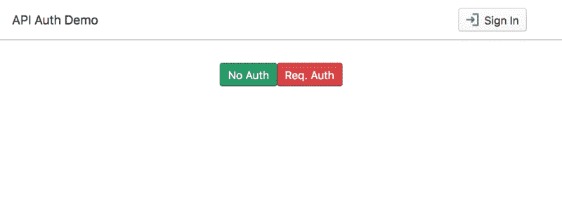

我们可以访问未受保护的方法。

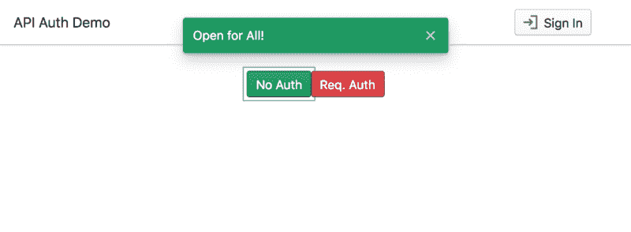

auth is not required

但是如果我们试图访问一个受保护的资源，它将会失败。

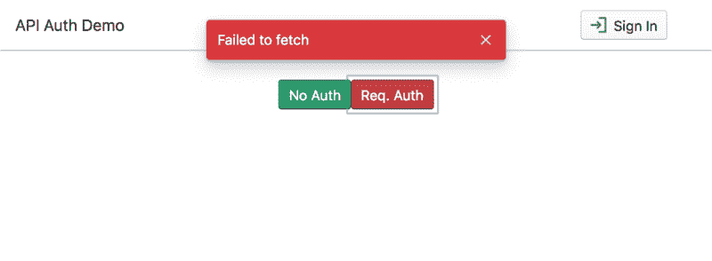

not authenticated

但是如果我们登录，我们可以访问受保护的资源。

点击**登录**，使用`demouser`，密码`demoPASS123`。

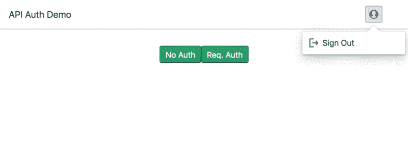

after sign in — buttons reflect an authenticated state

我们现在可以点击`Req. Auth`按钮来访问一个受保护的 API 方法。

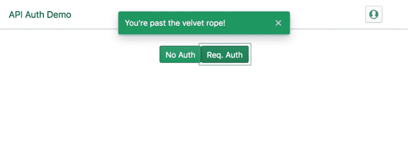

咻！我们必须配置多种服务并消化大量信息。但是我们现在有了一个应用程序，它是在 AWS 上认证微服务的模型。


[Giphy](https://giphy.com/gifs/reese-witherspoon-y4OKEc5NuPDwY)

### 现在怎么办？

本文的方法在 AWS 上是“全包”的。这是一个经过深思熟虑的选择，以展示各种 AWS 部件如何组合在一起解决一个共同的需求，即 auth。在这篇文章中有方法的替代品，我在这里概述了几个。

对于那些陪我到最后的人，我有一些离别礼物。

*   在[演示报告](https://github.com/csepulv/auth-api-demo)中，有一个用于自动化 AWS 设置的[脚本](https://github.com/csepulv/auth-api-demo/blob/master/scripts/create-resources.js)。它的[自述文件](https://github.com/csepulv/auth-api-demo/blob/master/scripts/README.md)有运行它的细节。
*   `[resources-cheatsheet.md](https://github.com/csepulv/auth-api-demo/blob/master/docs/resource-cheatsheet.md)`有相关 AWS、Claudia.js 等的具体链接。文档。

感谢阅读！