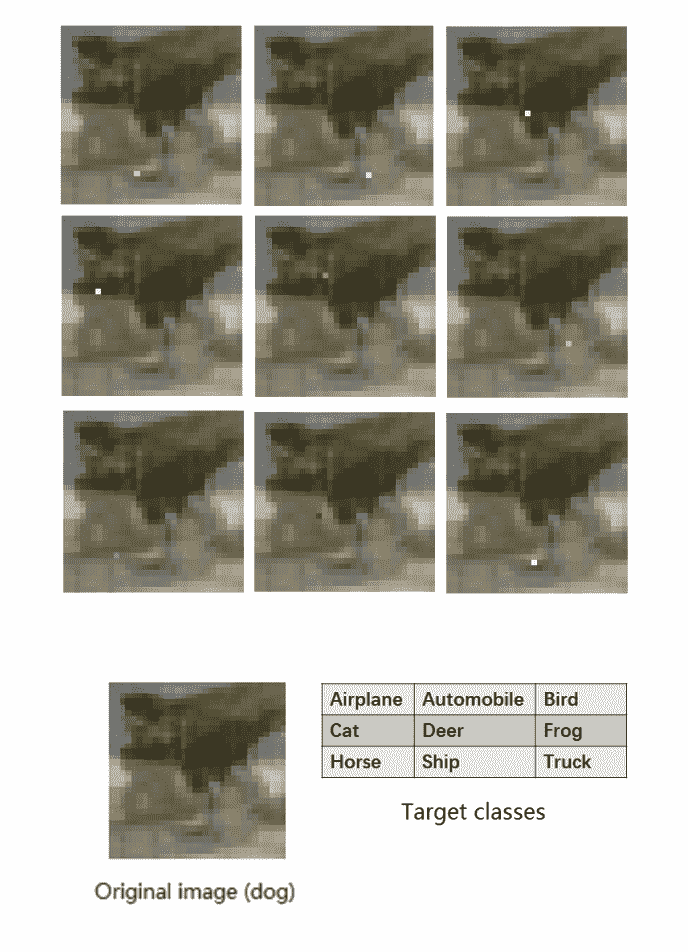
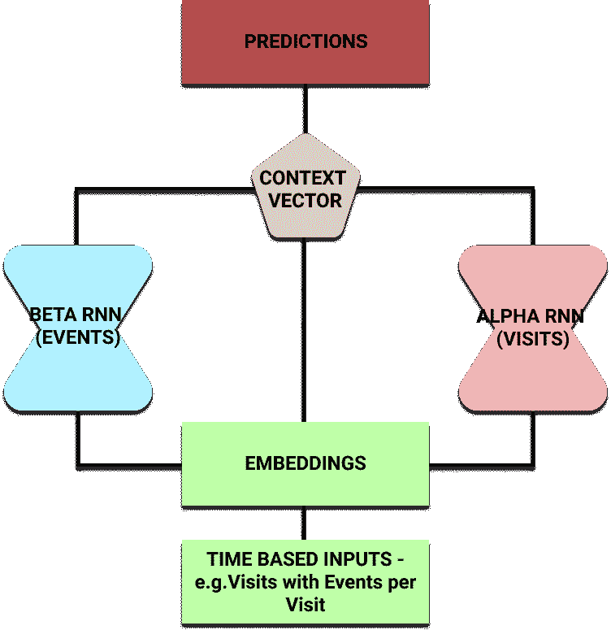
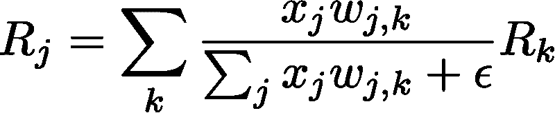

# 介绍可解释的人工智能，以及我们为什么需要它

> 原文：<https://www.freecodecamp.org/news/an-introduction-to-explainable-ai-and-why-we-need-it-a326417dd000/>

帕特里克·费里斯

# 介绍可解释的人工智能，以及我们为什么需要它

The Black Box - a metaphor that represents the unknown inner mechanics of functions like neural networks

神经网络(及其所有亚型)正越来越多地被用于构建能够在无数不同环境下进行预测和分类的程序。

例子包括使用递归神经网络的[机器翻译](https://arxiv.org/pdf/1806.08730.pdf)，以及使用卷积神经网络的[图像分类](https://papers.nips.cc/paper/4824-imagenet-classification-with-deep-convolutional-neural-networks.pdf)。谷歌 DeepMind 发布的研究引发了人们对[强化学习](https://arxiv.org/pdf/1312.5602.pdf)的兴趣。

所有这些方法都推进了许多领域，并产生了可以提高生产率和效率的可用模型。

然而，**我们并不真正知道它们是如何工作的**。

今年我有幸参加了[知识发现和数据挖掘](http://www.kdd.org/kdd2018/) (KDD)大会。在我参加的演讲中，有两个主要的研究领域似乎在很多人的脑海里:

*   首先，找到一个有意义的图形结构的表示，并输入到神经网络中。来自 DeepMind 的 Oriol Vinyals 做了一个关于他们的[信息传递神经网络](https://arxiv.org/pdf/1704.01212.pdf)的演讲。
*   第二个领域，也是本文的重点，是可解释的人工智能模型。当我们为神经网络开发更新、更具创新性的应用时，“它们是如何工作的”这个问题就出现了变得越来越重要。

#### 为什么需要可解释的模型？

神经网络不是绝对可靠的。

除了过度拟合和欠拟合的问题，我们已经开发了许多工具(如放弃或增加数据大小)来抵消，神经网络以一种不透明的方式运行。

我们真的不知道他们为什么做出这样的选择。随着模型变得越来越复杂，产生模型的可解释版本的任务变得更加困难。

以[一个像素攻击](https://arxiv.org/pdf/1710.08864.pdf)为例(点击此处查看一个很棒的[视频](https://www.youtube.com/watch?v=SA4YEAWVpbk))。这是通过使用分析 CNN 并应用差分进化(算法进化类的成员)的复杂方法来实现的。

与限制目标函数可微的其他优化策略不同，这种方法使用迭代进化算法来产生更好的解决方案。具体来说，对于这种单像素攻击，唯一需要的信息是类别标签的概率。

From [One pixel attack for fooling deep neural networks](https://arxiv.org/pdf/1710.08864.pdf) by Jiawei Su et al.

愚弄这些神经网络的相对容易程度令人担忧。除此之外，还有一个更系统性的问题:信任神经网络。

最好的例子是在医学领域。假设你正在建立一个神经网络(或任何黑盒模型)来帮助预测给定患者记录的心脏病。

当你训练和测试你的模型时，你得到一个很好的准确度和一个令人信服的正面预测值。你把它带给临床医生，他们同意这似乎是一个强大的模型。

但他们会犹豫是否使用它，因为你(或模型)无法回答这个简单的问题:“你为什么预测这个人更有可能患心脏病？”

对于希望了解模型工作方式以帮助他们改善服务的临床医生来说，缺乏透明度是一个问题。对于希望得到这种预测的具体原因的病人来说，这也是一个问题。

从伦理上讲，如果你的唯一推理是“黑匣子告诉我的”，那么告诉病人他们有更高的患病概率是正确的吗？卫生保健既是对病人的同情，也是科学。

近年来，可解释的人工智能领域有所发展，这一趋势看起来将继续下去。

以下是研究人员和机器学习专家在寻找模型时探索的一些有趣和创新的途径，这些模型不仅表现良好，而且可以告诉你他们为什么做出选择。

#### 反向时间注意模型(RETAIN)

RETAIN 模型是由 [Edward Choi 等人在佐治亚理工学院开发的](https://arxiv.org/pdf/1608.05745.pdf)它的引入是为了帮助医生理解为什么一个模型预测患者有心力衰竭的风险。

The RETAIN Recurrent Neural Network Model makes use of Attention Mechanisms to improve interpretability

这个想法是，给定患者的医院就诊记录，其中也包含就诊事件，他们可以预测心力衰竭的风险。

研究人员将输入分成两个递归神经网络。这让他们可以使用各自的[注意力机制](http://www.wildml.com/2016/01/attention-and-memory-in-deep-learning-and-nlp/)来理解神经网络关注的是什么。

一旦经过训练，该模型可以预测病人的风险。但是它也可以利用 alpha 和 beta 参数来输出哪些医院访问(以及访问中的哪些事件)影响了它的选择。

#### 局部可解释的模型不可知解释(LIME)

另一种已经相当普遍使用的方法是[石灰](https://arxiv.org/pdf/1602.04938.pdf)。

这是一个事后模型——它在决策做出后提供了对决策的解释。这意味着它不是一个纯粹的“玻璃盒子”，从头到尾都是透明的模型(如决策树)。

这种方法的主要优点之一是它是模型不可知的。它可以应用于任何模型，以产生对其预测的解释。

这种方法背后的关键概念是干扰输入，并观察这样做如何影响模型的输出。这使我们能够构建一个模型关注哪些输入并使用这些输入进行预测的画面。

例如，想象某种用于图像分类的 CNN。使用石灰模型产生解释有四个主要步骤:

*   从普通图像开始，使用黑盒模型来生成类别的概率分布。
*   然后以某种方式干扰输入。对于图像，这可以通过将像素涂成灰色来隐藏像素。现在通过黑盒模型运行这些，看看它最初预测的类别的概率如何变化。
*   使用一个可解释的(通常是线性的)模型，如扰动和概率数据集上的决策树，提取解释变化的关键特征。该模型是局部加权的，这意味着我们更关心与我们使用的原始图像最相似的扰动。
*   输出权重最大的要素(在我们的例子中是像素)作为我们的解释。

#### 逐层相关性传播(LRP)

这种[方法](https://arxiv.org/pdf/1604.00825.pdf)使用了相关性重新分配和保存的思想。

我们从一个输入(比如说，一个图像)和它的分类概率开始。然后，反向工作，将其重新分配给所有输入(在本例中为像素)。

从一层到另一层的重新分配过程相当简单。

Don’t be scared — this equation is just weighting relevances based on neuron activation and weight connnection

在上面的等式中，每一项代表以下思想:

*   `x_j`——层 *l* 中神经元 *j* 的激活值
*   `w_j,k`——层 *l* 的神经元 *j* 与层 *l + 1* 的神经元 *k* 之间连接的权重
*   `R_j` —层 *l* 中每个神经元的相关性得分
*   `R_k`—*l+1 层*中每个神经元的相关性得分

ε只是一个小值，以防止被零除。

如您所见，我们可以逆向工作，以确定各个输入的相关性。此外，我们可以按照相关性的顺序对它们进行排序。这让我们提取一个有意义的输入子集，作为最有用或最有力的预测。

#### 接下来呢？

上述产生可解释模型的方法决不是穷尽的。它们是研究人员试图从黑盒模型中产生可解释预测的一些方法的样本。

希望这篇文章也能阐明为什么它是如此重要的研究领域。我们需要继续研究这些方法，并开发新的方法，以便机器学习能够以安全可信的方式惠及尽可能多的领域。

如果你发现自己想要更多的论文和领域来阅读，尝试以下一些。

*   [DeepMind](http://proceedings.mlr.press/v80/kim18d/kim18d.pdf) 对概念激活向量的研究，以及来自 Victoria Krakovna 在神经信息处理系统(NIPS)会议上的讲话的[幻灯片](http://s.interpretable.ml/nips_interpretable_ml_2017_victoria_Krakovna.pdf)。
*   Dung Huk Park 等人的一篇关于测量可解释模型的数据集的论文。
*   [压轴 Doshi-维勒兹](https://www.seas.harvard.edu/directory/finale)和[后金](https://beenkim.github.io/)的[纸](https://arxiv.org/pdf/1702.08608.pdf)在球场上一般

人工智能不应该成为我们盲目追随的强大神灵。但是我们也不应该忘记它和它可能带来的有益的洞察力。理想情况下，我们将构建灵活且可解释的模型，这些模型可以与专家及其领域知识合作，为每个人提供更光明的未来。