# freeCodeCamp 在旧金山的 GitHub 举办了一场免费的黑客马拉松(同时也是一场在线黑客马拉松)

> 原文：<https://www.freecodecamp.org/news/freecodecamp-is-hosting-a-free-hackathon-at-github-in-san-francisco-and-an-online-hackathon-too-2078088df278/>

注意:门票现已售完，报名截止。如果你在 11 月 1 日之前申请了门票，检查你的电子邮件收件箱，你应该会收到一封昆西·拉森发来的电子邮件，链接到你的门票。

11 月 3 日，数百人将聚集在旧金山市中心，参加 2018 年 freeCodeCamp JAMstack 黑客马拉松比赛。

你也应该来！

如果你不能去旧金山，也不要担心——我们会有一个在线版本的黑客马拉松，并有自己的一套奖品。

是的，黑客马拉松是完全免费的。

freeCodeCamp 将与 Netlify 合作举办此次活动，作为 2018 年 JAMstack _ conf】的一部分。如果您也想参加会议，您可以使用折扣代码“freecodecamp100 ”,享受 100 美元的折扣。

## 什么是黑客马拉松？

黑客马拉松是一项活动，人们加入团队，一起编写代码，然后展示他们构建的项目。他们通常只持续一两天，并经常涉及评审和奖品。

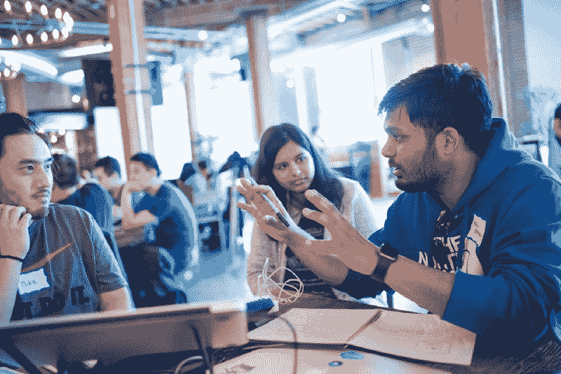

A photo from a recent React-focused hackathon held at GitHub. Photo by [Real World React](https://www.realworldreact.com/).

## 什么是 JAMstack？

JAMstack 是构建 web 应用程序的一种简单方式。JAM 代表 JavaScript、API 和标记(HTML 和 CSS)。

如果您已经构建了 freeCodeCamp 课程中的一些项目，那么您已经在使用 JAMstack 了。

JAMstack 与 LAMP 和 MEAN 等其他 web 开发堆栈的主要区别在于:您使用 API，而不是使用 web 服务器后端。

## 这个活动是为我准备的吗？

如果你想交朋友，建立一个项目，并获得两天的编码实践，那么是的——它适合你。

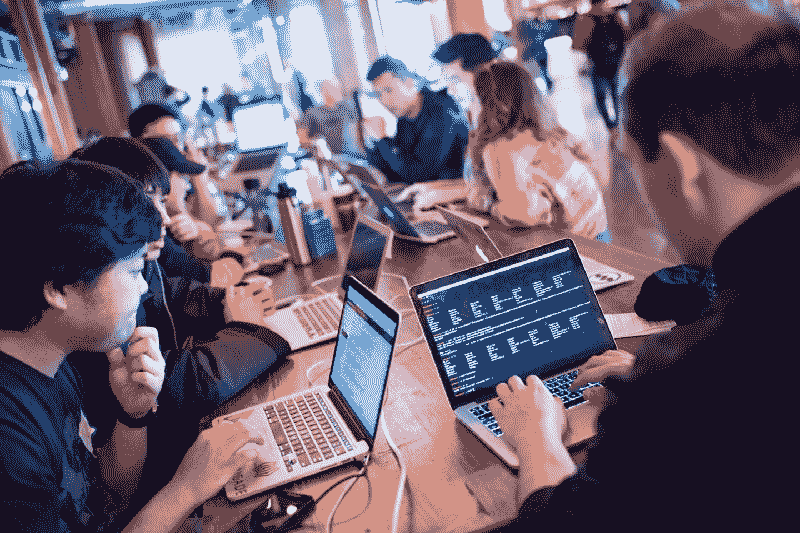

A photo from a recent React-focused hackathon held at GitHub. Photo by [Real World React](https://www.realworldreact.com/).

我们欢迎各种技能水平的人——甚至是几个月前才开始编码的人。如果你以前没有参加过黑客马拉松，这将是你第一次参加黑客马拉松。

而且会有吃的。很多食物。

### 旧金山市中心这样的大型活动怎么可能完全免费？

大多数黑客马拉松都有 API 赞助商，他们希望提高开发者对他们的 API 的认识。这些 API 赞助商中的许多也将为最大限度利用其 API 的团队设立自己的奖项。他们可能还会有开发者在活动中回答你关于他们的 API 的问题，并帮助你将其集成到你的 web 应用中。

### 我的公司有一个甜蜜的 API。我们能赞助吗？

当然啦！向[sponsors@jamstackconf.com](mailto:sponsors@jamstackconf.com)发送赞助咨询。

### 在线黑客马拉松怎么样？

去旧金山旅游可能会很贵，而且获得美国签证可能会很痛苦。因此，我们还举办了 2018 年 freeCodeCamp JAMstack 黑客马拉松的在线版本。它将在同一天发生。

在线黑客马拉松团队将争夺他们自己的一套奖品。他们可以通过我们的聊天室和我们在 freeCodeCamp YouTube 频道上的活动直播与评委、导师和其他黑客马拉松团队互动。

### 旧金山黑客马拉松怎么样？

我们将于 11 月 3 日周六上午 9 点在 GitHub 的旧金山总部(88 Colin P Kelly Jr 街)开始。我们会编码到晚上 9 点，然后回家睡觉。然后我们将在周日早上 9 点重新开始，并在周日晚上 9 点结束。

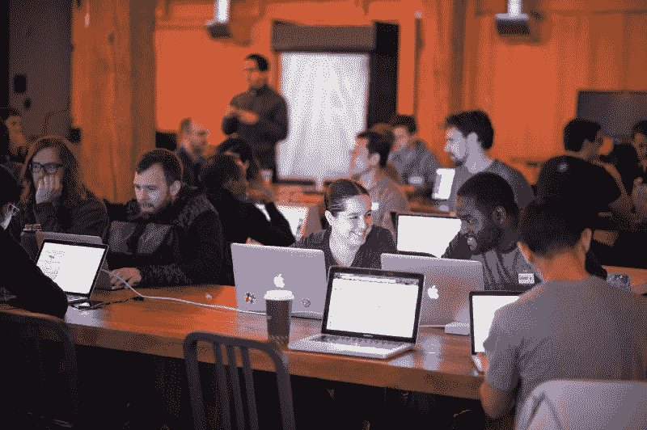

A photo from a recent React-focused hackathon held at GitHub. Photo by [Real World React](https://www.realworldreact.com/).

你只需要一台笔记本电脑和一张票就可以参加了。

## 如何获得免费机票

我们希望每个人在活动开始时就准备好编码。因此，为了获得现场或在线黑客马拉松的门票，你需要花几分钟时间来确保你的笔记本电脑设置正确。

下面的教程将带您安装 Git 和 Node.js，并将“hello world”jam stack 应用程序部署到 web。

这个过程是完全免费的，你不需要信用卡或任何东西。接下来的几分钟，您将在笔记本电脑上安装一些工具，并在 GitHub 和 Netlify 上创建一个帐户。

你可以跳过已经完成的任何步骤，但是你需要在 Netlify 上安装一个“hello world”应用程序，以便申请免费门票。

完成本教程后，您可以提交“hello world”应用程序的 URL 来申请免费门票。

我们的门票数量有限，我们预计活动将会爆满，所以我建议您尽快申请。

## 如何让您的第一个 JAMstack web 应用程序上线

本教程将适用于 Mac、Linux 和 Windows。

如果你用的是 Windows，我推荐用 Windows 的新 [Linux Bash Shell](https://www.howtogeek.com/249966/how-to-install-and-use-the-linux-bash-shell-on-windows-10/) 。

**注意:**在计算机上配置所有这些东西时，您可能会遇到与操作系统相关的问题。如果你被卡住了，通读[这个论坛帖子](https://forum.freecodecamp.org/t/freecodecamp-2018-jamstack-hackathon-at-github-in-san-francisco-on-october-27-28/221604)，如果你仍然被卡住了，通过回复帖子寻求帮助。

### 步骤 1:安装 Git

Git 是一个强大的版本控制工具，大多数主要的开源项目，包括 freeCodeCamp，都使用它来进行软件协作。

你可以[在这里](https://git-scm.com/download)下载并安装 Git。

### 步骤 2:安装 npm，节点的软件包管理器

你可以[在这里](https://nodejs.org/en/)下载安装 npm。

### 第三步:安装微软的开源代码编辑器 VS Code

你可以[在这里](https://code.visualstudio.com/download)下载安装 VS 代码。你可以使用任何你想要的代码编辑器，但是这是一个流行的免费编辑器。

### 步骤 4:安装 Gatsby.js

打开您的终端(在您的操作系统中可能称为 shell ),键入以下命令:

```
sudo npm install --global gatsby-cli
```

您需要输入您的系统密码，该密码应该与您用来将电脑从睡眠模式解锁的密码相同。

### 步骤 5:使用 Gatsby 创建你的 jam stack“hello world”应用程序

运行以下命令:

```
gatsby new gatsby-site
```

### 第六步:切换到你的应用目录，在你的电脑上运行它

运行以下命令:

```
cd gatsby-site && gatsby develop
```

现在在浏览器中打开一个新标签。在浏览器的地址栏中键入 localhost:8000。您应该会看到类似这样的内容:

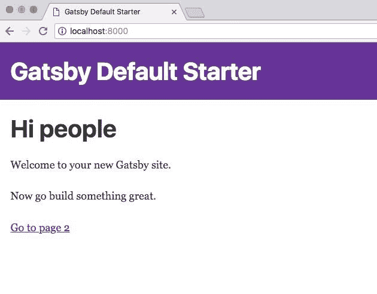

### 步骤 7:定制你的项目代码

在 VS 代码或任何你喜欢的代码编辑器中打开你的项目。

导航到 index.js 页面并自定义其 HTML。

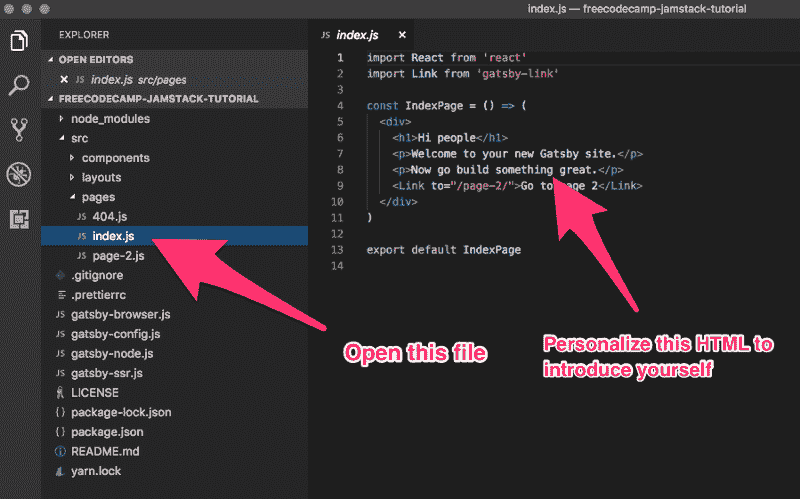

### 步骤 8:将你的代码提交给 Git

确保您位于终端的项目目录中，并键入以下命令来初始化 Git 存储库:

```
git init
```

然后通过运行以下命令转移 Gatsby 在第 5 步中创建的所有文件:

```
git add .
```

最后，用提交消息“first commit”将这些文件提交给 Git:

```
git commit --message "first commit"
```

### 步骤 9:创建一个 GitHub 账户

您可以在这里几分钟内创建一个免费的 GitHub 帐户。(选择“无限公共存储库”选项)。


检查您的电子邮件收件箱，以便验证您的 GitHub 帐户。

### 步骤 10:将你的 SSH 密钥添加到 GitHub。

SSH 密钥是一种从终端安全访问 GitHub 帐户的方式，无需使用用户名和密码进行身份验证。

在您的终端中运行以下命令来生成 SSH 密钥:

```
ssh-keygen
```

终端将提示您选择文件位置。只需按 enter 键接受默认的文件位置。如果终端告诉您，您过去已经生成了一个 SSH 密钥，请按“n ”,这样您就不会覆盖现有的密钥。

然后运行以下命令将您计算机的公共 SSH 密钥复制到您的剪贴板:

```
pbcopy < ~/.ssh/id_rsa.pub
```

然后[点击这里进入 GitHub](https://github.com/settings/ssh/new) 中的 SSH 密钥设置页面，粘贴进去。

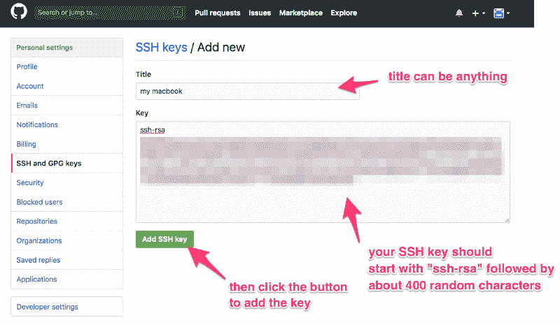

### 步骤 11:在 GitHub 上创建一个存储库

[点击此链接创建一个 GitHub 库](https://github.com/new)。你可以给它起任何你想要的名字，描述对我们的目的来说并不重要。只要你把这个公之于众，完全免费。

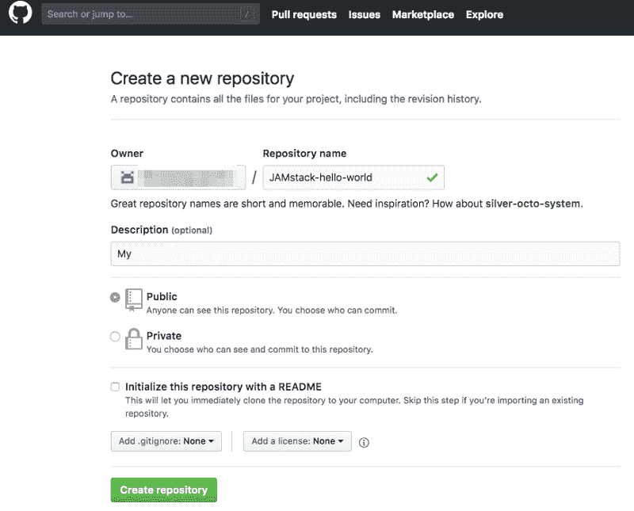

### 步骤 12:将你的 GitHub 库设置为本地 Git 项目的源，并将你的代码推送到 GitHub

一旦你完成了第 10 步，GitHub 应该会把你带到一个类似这样的页面，它有一个从命令行推送一个已有存储库的选项。

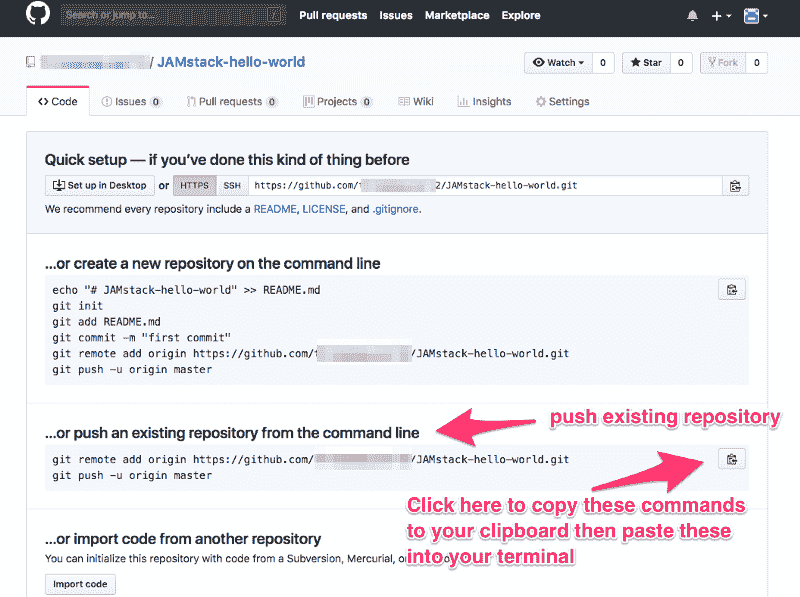

您可以单击剪贴板按钮将命令复制到剪贴板。然后回到您的终端，确保您仍然在项目的目录中。然后将这些命令粘贴到您的终端中。

### 第 13 步:创建一个网络账户

点击此链接进入 Netlify 的注册页面。然后使用您刚刚创建的 GitHub 帐户登录。

### 步骤#14:从你的 GitHub 库创建一个 Netlify 应用

现在[转到这里](https://app.netlify.com/start/repos)并选择 GitHub 作为您的 Git 提供者。

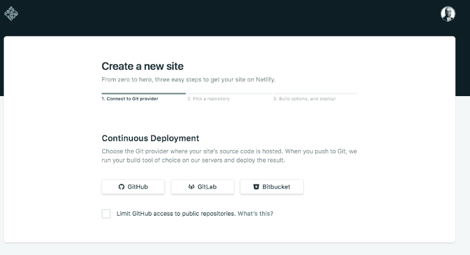

您现在应该看到几分钟前创建的 GitHub 存储库，并且能够选择它。

Netlify 的默认配置应该没问题。因此，您可以向下滚动并单击“部署站点”按钮。

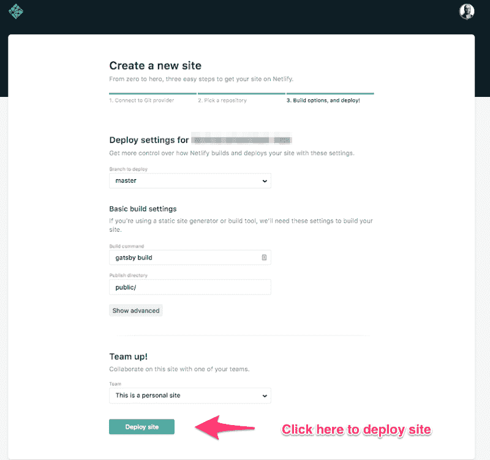

### 第 15 步:等待你的 web 应用程序构建完成，然后在互联网上访问它，记下它的公共 URL。

您可以单击自动生成的网络链接，在网上实时查看您的项目。

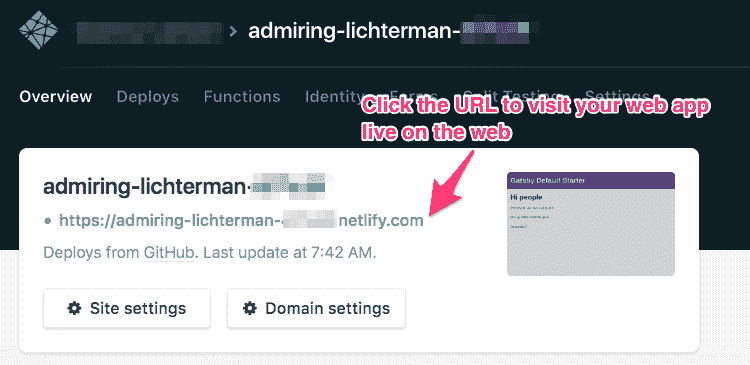

### 恭喜你！您的第一个 JAMstack web 应用程序现已在互联网上发布！

现在，您已经拥有了开始扩展和开发 JAMstack web 应用程序所需的所有组件。您可以在 VS Code 中打开您的代码库，进行编辑，将这些编辑提交给 Git，然后将它们推送到 GitHub。Netlify 可以自动构建应用程序并将其部署到 web 上。

但是现在，你已经准备好[申请你的免费 2018 freeCodeCamp jam stack Hackathon 入场券](https://freecodecamp.typeform.com/to/v4mc19)！

确保您拥有刚刚创建的 GitHub 存储库的 URL，以及刚刚创建的实时 JAMstack web 应用程序的 URL(Netlify 项目 URL)。然后[填写这张快速表格，申请一张免费票](https://freecodecamp.typeform.com/to/v4mc19)。

请务必在 Twitter 上关注 freeCodeCamp，我们也会在那里发布更新。期待在 2018 freeCodeCamp JAMstack 黑客马拉松上与您见面！