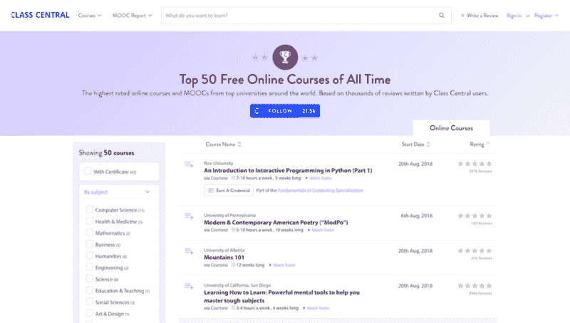

# 根据数据，50 个最好的免费在线大学课程

> 原文：<https://www.freecodecamp.org/news/top-50-free-online-courses-2018-e67d0da38e95/>

我又回来了，带来了有史以来最好的免费在线课程和大规模开放在线课程的最新列表。中央课堂[于 2016 年 7 月首次公布了 50 大 mooc](https://www.class-central.com/report/top-moocs/)，[于去年再次刷新](https://www.class-central.com/report/top-50-moocs-2017-edition/)。在这份名单的每一次迭代之间，大学和 MOOC 提供商都增加了几千门新课程，Class Central 用户也写了同样多的新评论。

现在有来自全球 800 多所大学的 10，000 多门 MOOCs。这可能会让全世界数百万以前从未上过网上课程的学习者望而生畏。

这就是为什么我根据 Class Central 用户写的**数千条评论**列出了有史以来*排名前 50 的 MOOCs】。*

在提供一份虽小但经过充分审核的课程清单时，我希望新学员在进入 MOOC 领域时不会不知所措。评论将有助于新学员判断一门课程是否适合他们，以及他们是否会有一个很好的初次体验。

#### 我们创建这个列表的方法

Class Central 有成千上万条用户写的评论，我们可以根据这些课程的贝叶斯平均评分对它们进行排序。

然后，我们删除了所有评论少于 35 条的课程(低门槛有助于较小的提供商在质量上竞争)，以及我们怀疑是否会再次提供的课程。如果一门课程有多个部分，我们只将第一部分列入前 50 名。

#### 最好的课程

随着新课程的增加和我们收到新的评论，前 50 名 MOOCs 将定期更新。更好的是，你还可以在专门的[收藏页面](https://www.class-central.com/collection/top-free-online-courses)上*关注*排名前 50 的 MOOCs(在标题下方寻找“关注前 50”按钮)。每当我们更新 50 大 MOOCs 榜单时，关注者都会收到通知。

*The [Top 50 MOOCs](https://www.class-central.com/collection/top-free-online-courses) collection page. Use the Follow button to be notified when the list gets updated.*

哦……如果你觉得你学过的某门课应该在这个列表上，但是没有，请[在中央课堂上找到这门课](https://www.class-central.com/search),并写一篇关于这门课的评论。

### Class Central 有史以来排名前 50 的免费在线课程

前 50 名里有很多常见的嫌疑人。想想像*学习如何学习*，哈佛的 *CS50x* ， *ModPo* ，Class Central 的[2016 年最佳在线课程](https://www.class-central.com/report/best-free-online-courses-2016/) — *在你的课堂上编码，现在！*以及课中央的[2017](https://www.class-central.com/report/best-free-online-courses-2017/)*最佳网络课程，Mindshift:突破学习障碍，发现自己隐藏的潜力。*

2018 年版中新增的一些课程包括:

1.  edX 上乔治敦大学的*量子力学为每个人*
2.  肌肉骨骼系统:老年保持活力的科学来自纽卡斯尔大学、谢菲尔德大学和利物浦大学的未来学习
3.  塔斯马尼亚大学的预防痴呆症课程有近 900 条评论，可以认为是另一门排名前 50 的课程*了解痴呆症*的续篇
4.  *制图，*来自 ESRI
5.  *演示技巧:在 Coursera 上设计托木斯克州立大学的演示幻灯片*。这是第一所进入中央班级前 50 名的俄罗斯大学。

前 50 名还包括一些知名人士的课程，比如迈克·布朗(又名“普鲁托基勒”)的*太阳系科学*和马丁·奥德斯基(Scala 的创始人)的*Scala 函数式编程原理*。

以下是前 50 名名单的简要总结:

1.  Coursera 是排名前 50 的顶级供应商，有 28 门课程，edX 排名第二，有 10 门课程
2.  斯坦福大学、宾夕法尼亚大学和开普敦大学各有三门课程排名前 50。
3.  该榜单包括来自 37 所大学、一家研究机构(圣达菲)和一家公司(ESRI)的课程，其中 16 所大学(去年为 22 所)位于美国
4.  世界上最受欢迎的 MOOC 的导师芭芭拉·奥克利(Barbara Oakley)和特里·塞伊诺夫斯基(Terry Sejnowski)有两门课程排名前 50。他们的新课程 *Mindshift* 加入*学习如何学习*进入前 50 名。

如果您想查看按评级排序的所有课程，请访问[前 50 名精选页面](https://www.class-central.com/collection/top-free-online-courses)。或者，您可以浏览以下课程。

### 技术(17 门课程)

[**Python 交互式编程入门(第一部分)**](https://www.class-central.com/course/coursera-an-introduction-to-interactive-programming-in-python-part-1-408)
*莱斯大学 via Coursera*
本课程旨在帮助很少或没有计算背景的学生学习构建简单交互式应用的基础知识。
★★★★([3078 收视率](https://www.class-central.com/course/coursera-an-introduction-to-interactive-programming-in-python-part-1-408#reviews))

[**为大家编程(Python 入门)**](https://www.class-central.com/course/coursera-programming-for-everybody-getting-started-with-python-4319)
*密歇根大学 via Coursera*
本课程旨在教大家使用 Python 进行计算机编程的基础知识。我们涵盖了如何从 Python 中的一系列简单指令构建程序的基础知识。这门课程没有先决条件，除了最简单的数学之外，它避开了所有内容。
★★★★([3760 收视率](https://www.class-central.com/course/coursera-programming-for-everybody-getting-started-with-python-4319#reviews))

[**机器学习**](https://www.class-central.com/course/coursera-machine-learning-835)
*斯坦福大学 via Coursera*
这门课程提供了机器学习、数据挖掘和统计模式识别的广泛介绍。
★★★★([335 收视率](https://www.class-central.com/course/coursera-machine-learning-835#reviews))

[**MATLAB 编程入门**](https://www.class-central.com/course/coursera-introduction-to-programming-with-matlab-3396)
*范德比尔特大学 via Coursera*
这门课程向以前经验很少甚至没有经验的人教授计算机编程。它使用称为 MATLAB 的编程系统和语言来这样做，因为它简单易学，功能多样，对工程师和其他专业人员非常有用。
★★★★([192 评分](https://www.class-central.com/course/coursera-introduction-to-programming-with-matlab-3396#reviews))

[**计算机科学与编程入门使用 Python**](https://www.class-central.com/course/edx-introduction-to-computer-science-and-programming-using-python-1341)
*麻省理工学院 via edX*
计算机科学作为一种工具的最新更新入门使用 Python 3.5 解决现实世界的分析问题。
★★★★☆ ( [118 收视率](https://www.class-central.com/course/edx-introduction-to-computer-science-and-programming-using-python-1341#reviews))

[**学会编程:基本面**](https://www.class-central.com/course/coursera-learn-to-program-the-fundamentals-385)
*多伦多大学 via Coursera*
每一次鼠标点击和触摸屏敲击的背后，都有一个让事情发生的计算机程序。本课程介绍了编程的基本构件，并教你如何使用 Python 语言编写有趣而有用的程序。
★★★★([102 评分](https://www.class-central.com/course/coursera-learn-to-program-the-fundamentals-385#reviews))

[**分析优势**](https://www.class-central.com/course/edx-the-analytics-edge-1623)
*麻省理工学院 via edX*
通过鼓舞人心的例子和故事，发现数据的力量，并使用分析为您的职业和生活提供优势。
★★★★([77 评分](https://www.class-central.com/course/edx-the-analytics-edge-1623#reviews))

[**CS50 的计算机科学入门**](https://www.class-central.com/course/edx-cs50-s-introduction-to-computer-science-442)
*哈佛大学 via edX*
这是 CS50x，哈佛大学对计算机科学的智力企业和编程艺术的入门，对专业和非专业的人都一样，不管有没有以前的编程经验。
★★★★([71 收视率](https://www.class-central.com/course/edx-cs50-s-introduction-to-computer-science-442#reviews))

[**面向音乐家和艺术家的机器学习**](https://www.class-central.com/course/kadenze-machine-learning-for-musicians-and-artists-3768)
*伦敦大学 via Kadenze*
在这门课程中，学生将学习基本的机器学习技术，这些技术可用于理解人类手势、音乐音频和其他实时数据。重点将放在学习算法、软件工具和最佳实践上，它们可以立即用于创建艺术领域的新实时系统。
★★★★([66 评分](https://www.class-central.com/course/kadenze-machine-learning-for-musicians-and-artists-3768#reviews))

[**Scala 中的函数式编程原理**](https://www.class-central.com/course/coursera-functional-programming-principles-in-scala-422)
*洛桑联邦理工学院 via Coursera*
在本课程中，您将发现函数式编程风格的元素，并学习如何在日常编程任务中有效地应用它们。
★★★★([64 收视率](https://www.class-central.com/course/coursera-functional-programming-principles-in-scala-422#reviews))

[**算法:设计与分析，第一部分**](https://www.class-central.com/course/coursera-algorithms-design-and-analysis-part-1-374)
*斯坦福大学 via Coursera*
算法是计算机科学的核心，该学科有无数的实际应用以及智力深度。这门课程是对至少有一点编程经验的学习者的算法介绍。
★★★★([64 收视率](https://www.class-central.com/course/coursera-algorithms-design-and-analysis-part-1-374#reviews))

[**算法，第一部分**](https://www.class-central.com/course/coursera-algorithms-part-i-339)
普林斯顿大学 via Coursera
本课程涵盖了每一个认真的程序员需要了解的关于算法和数据结构的基本信息，重点是 Java 实现的应用和科学性能分析。
★★★★([58 收视率](https://www.class-central.com/course/coursera-algorithms-part-i-339#reviews))

[**游戏化**](https://www.class-central.com/course/coursera-gamification-343)
*宾夕法尼亚大学 via Coursera*
本课程将教你游戏化的机制，为什么它有如此巨大的潜力，以及如何有效地利用它。
★★★★([55 评分](https://www.class-central.com/course/coursera-gamification-343#reviews))

[**密码学 I**](https://www.class-central.com/course/coursera-cryptography-i-616)
*斯坦福大学 via Coursera*
在这门课程中你将学习密码系统的内部工作原理，以及如何在现实应用中正确使用它们。
★★★★([49 收视率](https://www.class-central.com/course/coursera-cryptography-i-616#reviews))

[**深度学习与 TensorFlow 的创造性应用**](https://www.class-central.com/course/kadenze-creative-applications-of-deep-learning-with-tensorflow-6679)
*via kaden ze*
本课程向您介绍深度学习:构建人工智能算法的最先进方法。我们涵盖了深度学习的基本组件，它意味着什么，它是如何工作的，并开发了构建各种算法所需的代码，如深度卷积网络，变分自动编码器，生成对抗网络和递归神经网络。
★★★★([43 收视率](https://www.class-central.com/course/kadenze-creative-applications-of-deep-learning-with-tensorflow-6679#reviews))

[**Python for Data Science**](https://www.class-central.com/course/edx-python-for-data-science-8209)
*加州大学圣地亚哥分校 via edX*
学习使用强大的开源 Python 工具，包括 Pandas、Git 和 Matplotlib，来操作、分析和可视化复杂的数据集。
★★★★☆ ( [41 收视率](https://www.class-central.com/course/edx-python-for-data-science-8209#reviews))

[**在你的教室编码，现在！**](https://www.class-central.com/course/emma-coding-in-your-classroom-now-5652)
*【城市大学通过艾玛】*
这门课程雄心勃勃，简单易行。他有助于你通过编码将计算思想引入课堂，只使用直观有趣的活动直接向学生提出。
[36 分](https://www.class-central.com/course/emma-coding-in-your-classroom-now-5652#reviews)

### 人文学科(7)

 ***印度商学院 via Coursera*
本课程基于印度商学院和德克萨斯大学奥斯汀分校麦库姆斯商学院提供的获奖课程，由 Raj Raghunathan 教授(又名“快乐智能博士”)开发，从多个领域汲取内容，包括心理学、神经科学和行为决策理论，为过上快乐和满足的生活提供经过测试的实用方法。
★★★★([425 评分](https://www.class-central.com/course/coursera-a-life-of-happiness-and-fulfillment-2860#reviews))**

**[**【现代】&【ModPo】**](https://www.class-central.com/course/coursera-modern-contemporary-american-poetry-modpo-356)
*宾夕法尼亚大学 via Coursera*
ModPo 是对美国现当代诗歌的快节奏介绍，重点是实验诗歌，从艾米莉·狄金森和沃尔特·惠特曼至今。参与者(不需要有诗歌方面的经验)将学习如何阅读被认为“困难”的诗歌
★★★★([180 评分](https://www.class-central.com/course/coursera-modern-contemporary-american-poetry-modpo-356#reviews))**

**[**荷兰介绍**](https://www.class-central.com/course/futurelearn-introduction-to-dutch-3014)
*格罗宁根大学 via FutureLearn*
你打算不久后去荷兰旅游、工作或学习吗？这个免费的在线课程是完美的，如果你以前很少或没有荷兰语知识，但想掌握基础知识，以便在低地国家生存。
★★★★([72 收视率](https://www.class-central.com/course/futurelearn-introduction-to-dutch-3014#reviews))**

**[**基础西班牙语 2:更进一步**](https://www.class-central.com/course/edx-basic-spanish-2-one-step-further-8672)
Universitat politècnica de valència via edX
该课程专为英语使用者设计，在经历内容呈现、理解和制作等阶段后，提供多种练习。
★★★★([59 收视率](https://www.class-central.com/course/edx-basic-spanish-2-one-step-further-8672#reviews))**

**[**清华汉语:与 13 亿人开始对话**](https://www.class-central.com/course/edx-tsinghua-chinese-start-talking-with-1-3-billion-people-5426)
*清华大学 via edX*
这门汉语入门课程将强调普通话国家日常生活的基本语言技能。
★★★★([53 收视率](https://www.class-central.com/course/edx-tsinghua-chinese-start-talking-with-1-3-billion-people-5426#reviews))**

**[**莎士比亚至关重要**](https://www.class-central.com/course/edx-shakespeare-matters-8731)
*阿德莱德大学 via edX*
在这门入门课程中，你将学习莎士比亚如何在他的戏剧中运用情感，他的角色如何体验和操纵情感，以及戏剧的情感共鸣如何使他们与现代世界紧密相关。
★★★★([48 收视率](https://www.class-central.com/course/edx-shakespeare-matters-8731#reviews))**

**[**日常生活的道德观**](https://www.class-central.com/course/coursera-moralities-of-everyday-life-911)
*耶鲁大学 via Coursera*
我们该如何解释善良与残忍？我们的是非感从何而来？为什么人们在道德问题上经常意见不一？这门课程探索了我们道德生活的心理学基础。
★★★★([37 收视率](https://www.class-central.com/course/coursera-moralities-of-everyday-life-911#reviews))**

### **科学(14 门课程)**

**[**山脉 101**](https://www.class-central.com/course/coursera-mountains-101-7455)
*阿尔伯塔大学 via Coursera*
山脉 101 是对山脉世界的广泛而综合的概述。这门 12 节课的课程涵盖了一个跨学科的研究领域，重点是加拿大阿尔伯塔省和世界各地山区的物理、生物和人文层面。
★★★★([293 评分](https://www.class-central.com/course/coursera-mountains-101-7455#reviews))**

**[**什么是头脑？**](https://www.class-central.com/course/futurelearn-what-is-a-mind-3314)
*开普敦大学 via FutureLearn*
这个免费的在线课程将汇集对大脑如何工作感兴趣的学习者和实践者。它的目的是在传统的对立方法之间建立理解心灵的桥梁。
★★★★([125 评分](https://www.class-central.com/course/futurelearn-what-is-a-mind-3314#reviews))**

**[**工程力学入门**](https://www.class-central.com/course/coursera-introduction-to-engineering-mechanics-564)
*佐治亚理工学院 via Coursera*
本课程是学习和应用解决工程力学问题所需原理的入门课程。在这门课中，你将会用到以前学过的基础数学和物理课程中的概念。本课程强调静态平衡问题的建模和分析，重点是现实世界的工程应用和问题解决。
★★★★([119 收视率](https://www.class-central.com/course/coursera-introduction-to-engineering-mechanics-564#reviews))**

**[**动力系统与混沌简介**](https://www.class-central.com/course/complexity-explorer-introduction-to-dynamical-systems-and-chaos-1182)
*圣达菲学院 via 复杂性探索者*
在这门课程中，你将获得动力系统的现代研究简介，这是应用数学的跨学科领域，研究随时间变化的系统。涵盖的主题包括:相空间、分叉、混沌、蝴蝶效应、奇怪的吸引子和模式形成。
★★★★([84 收视率](https://www.class-central.com/course/complexity-explorer-introduction-to-dynamical-systems-and-chaos-1182#reviews))**

**[**复杂性简介**](https://www.class-central.com/course/complexity-explorer-introduction-to-complexity-557)
*圣达菲学院 via Complexity Explorer*
在本课程中，您将了解动力系统的现代研究，这是应用数学的跨学科领域，研究随时间变化的系统。涵盖的主题包括:相空间、分叉、混沌、蝴蝶效应、奇怪的吸引子和模式形成。
★★★★([88 收视率](https://www.class-central.com/course/complexity-explorer-introduction-to-complexity-557#reviews))**

**[**灭绝:过去和现在**](https://www.class-central.com/course/futurelearn-extinctions-past-and-present-8004)
*开普敦大学 via FutureLearn*
这门免费的在线课程探索了地球上的生命是如何被遥远过去的五次大灭绝事件塑造的。目前，生物多样性正面临危机，今天有可能发生第六次灭绝事件。
★★★★([73 评分](https://www.class-central.com/course/futurelearn-extinctions-past-and-present-8004#reviews))**

**[**模型思维**](https://www.class-central.com/course/coursera-model-thinking-317)
*密歇根大学 via Coursera*
我们生活在一个复杂的世界里，有各种各样的人、公司和政府，他们的行为聚集在一起产生新奇的、意想不到的现象。我们看到政治暴动、市场崩溃和一系列永无止境的社会趋势。我们如何理解它？模特。
★★★★([63 收视率](https://www.class-central.com/course/coursera-model-thinking-317#reviews))**

** ***乔治城大学 via edX*
量子力学是一门为期四周的 MOOC 课程，教授量子力学的基本思想，除了开平方之外，不需要复杂的数学(你可以使用计算器来完成)。q
★★★★([54 评分](https://www.class-central.com/course/edx-quantum-mechanics-for-everyone-8284#reviews)****

****[**微积分一**](https://www.class-central.com/course/coursera-calculus-one-563)
俄亥俄州立大学 via Coursera
本课程是对微积分的第一次友好介绍，适合以前从未见过这门学科的人，或者看过一些微积分但想复习概念并练习应用这些概念解决问题的人。
★★★★([47 收视率](https://www.class-central.com/course/coursera-calculus-one-563#reviews))****

****[**日常思维的科学**](https://www.class-central.com/course/edx-the-science-of-everyday-thinking-1332)
*昆士兰大学 via edX*
学习如何更好地思考，更好地辩论，更好地选择。
★★★★([42 收视率](https://www.class-central.com/course/edx-the-science-of-everyday-thinking-1332#reviews))****

****[**太阳系的科学**](https://www.class-central.com/course/coursera-the-science-of-the-solar-system-1813)
*加州理工学院 via Coursera*
了解当前探索太阳系背后的科学。利用物理学、化学、生物学和地质学的原理来了解火星的最新情况，理解外太阳系，思考太阳系以外的行星，并在我们的邻居和更远的地方寻找可居住性。
★★★★([39 收视率](https://www.class-central.com/course/coursera-the-science-of-the-solar-system-1813#reviews))****

****[**制图学**](https://www.class-central.com/course/cartography-8812)
*Esri*
曾经，只有制图员制作地图。今天任何人都可以。尽管如此，制图师可以教人们制作更好的地图，就像厨师可以告诉人们如何做更好的饭菜一样。在经验丰富的制图师的指导和使用 ArcGIS Pro 的实际动手练习下，您将成为一名更聪明的地图制作者，准备好超越默认设置并制作更好的地图。
★★★★([38 收视率](https://www.class-central.com/course/cartography-8812#reviews))****

****[**欧盟政策与实施:让欧洲运转起来！**](https://www.class-central.com/course/coursera-eu-policy-and-implementation-making-europe-work-7408)
*莱顿大学 via Coursera*
在这门课程中，我们学习欧盟政策是如何制定的，以及政策是如何传递给成员国并由包括地区和地方政府在内的各种权力机构实施的。
★★★★([36 评分](https://www.class-central.com/course/coursera-eu-policy-and-implementation-making-europe-work-7408#reviews))****

****[**医学神经科学**](https://www.class-central.com/course/coursera-medical-neuroscience-384)
*杜克大学 via Coursera*
这门在线课程旨在包括神经生理学和临床神经解剖学中的所有核心概念，这些概念将在医学院的大多数第一年神经科学课程中出现。
★★★★([35 收视率](https://www.class-central.com/course/coursera-medical-neuroscience-384#reviews))****

### ****商务(6 门课程)****

****[**学会如何学习:强大的心智工具帮助你掌握棘手的学科**](https://www.class-central.com/course/coursera-learning-how-to-learn-powerful-mental-tools-to-help-you-master-tough-subjects-2161)
*加州大学圣地亚哥分校 via Coursera*
这门课程让你轻松接触到艺术、音乐、文学、数学、科学、体育和许多其他学科的专家所使用的无价的学习技巧。我们将了解大脑如何使用两种非常不同的学习模式，以及它如何封装(“组块”)信息。
★★★★([4968 收视率](https://www.class-central.com/course/coursera-learning-how-to-learn-powerful-mental-tools-to-help-you-master-tough-subjects-2161#reviews))****

****[**Mindshift:突破学习障碍，发现自己隐藏的潜力**](https://www.class-central.com/course/coursera-mindshift-break-through-obstacles-to-learning-and-discover-your-hidden-potential-8289)
*麦克马斯特大学 via Coursera*
Mindshift 旨在帮助你在当今快节奏的学习环境中提升事业和生活。无论你的年龄或阶段如何，Mindshift 都会教你一些基本知识，比如如何最大限度地利用在线学习和 MOOCs，如何寻找导师并与他们合作，避免职业生涯(和灾难)以及生活中普遍规律的秘密，以及选择性忽视对一般能力的价值等见解。
★★★★([1737 收视率](https://www.class-central.com/course/coursera-mindshift-break-through-obstacles-to-learning-and-discover-your-hidden-potential-8289#reviews))****

****[**数字世界中的营销**](https://www.class-central.com/course/coursera-marketing-in-a-digital-world-2750)
*伊利诺伊大学厄巴纳-香槟分校 via Coursera*
本课程探讨了互联网、智能手机和 3D 打印等数字工具如何通过将权力平衡从企业转移到消费者，彻底改变营销世界。
★★★★([163 评分](https://www.class-central.com/course/coursera-marketing-in-a-digital-world-2750#reviews))****

****[**学习**](https://www.class-central.com/course/coursera-aprender-4631)
*墨西哥国立自治大学通过跑步*
了解自己的学习过程相关资源和成绩水平？培养学习越来越好的技能感兴趣吗？
[106 分](https://www.class-central.com/course/coursera-aprender-4631#reviews)****

****保持正念的生活
*莫纳什大学 via FutureLearn*
在过去的几年里，人们对正念的兴趣大增。这并不奇怪:正念技巧可以改善你的沟通技巧、人际关系和情绪健康。但不是每个人都知道如何在日常生活中应用正念。
★★★★([82 收视率](https://www.class-central.com/course/futurelearn-maintaining-a-mindful-life-9078#reviews))****

****[**演示技巧:设计演示幻灯片**](https://www.class-central.com/course/coursera-presentation-skills-designing-presentation-slides-9643)
*托木斯克国立大学 via Coursera*
本课程的目标是通过为学习者配备一套工具来创建简单、清晰、美观的幻灯片，从而改善演讲者的演示。课程涵盖通用设计原则、模板、颜色、字体、幻灯片排版、照片和象形图的使用、构图规则以及创建清晰而有意义的图表的方法。
★★★★([42 收视率](https://www.class-central.com/course/coursera-presentation-skills-designing-presentation-slides-9643#reviews))****

### ****健康与医学(6 门课程)****

****[**了解痴呆症**](https://www.class-central.com/course/understanding-dementia-981)
*塔斯马尼亚大学*
这是一门关于痴呆症的课程，涉及广泛的主题，包括基础脑解剖、病理学、痴呆症研究、风险因素、症状、诊断、医疗管理、痴呆症生活、进展和分期、缓解、行为和治疗方法。
★★★★([1419 收视率](https://www.class-central.com/course/understanding-dementia-981#reviews))****

****[**预防痴呆症**](https://www.class-central.com/course/preventing-dementia-6565)
*塔斯马尼亚大学*
随着世界人口的老龄化，痴呆症作为 21 世纪的公共健康问题迫在眉睫。有可能改变你患痴呆症的风险吗？很大一部分风险与高龄和遗传风险因素有关，但最新研究表明，有一些可改变的风险因素可能会降低你对痴呆症的易感性。预防痴呆症 MOOC 调查了关于痴呆症预防的最佳证据，吸引了一系列全球专家。
★★★★([894 收视率](https://www.class-central.com/course/preventing-dementia-6565#reviews))****

****[**了解临床研究:统计数据背后**](https://www.class-central.com/course/coursera-understanding-clinical-research-behind-the-statistics-5037)
*开普敦大学 via Coursera*
如果你只是对正确理解已发表的文献感兴趣，或者如果你正着手进行自己的研究，本课程是你的第一步。它提供了一个简单的入口来解释普通的统计概念，而不进入本质的数学公式。能够解释和理解这些概念是开始进入临床文献世界的最佳方式。
★★★★([183 评分](https://www.class-central.com/course/coursera-understanding-clinical-research-behind-the-statistics-5037#reviews))****

**** ***莫纳什大学 via FutureLearn*
学习正念技巧，以减少压力，提高你的幸福感和工作/学习成绩。
★★★★([63 收视率](https://www.class-central.com/course/futurelearn-mindfulness-for-wellbeing-and-peak-performance-3714#reviews))******

******[**肌肉骨骼系统:老年保持活力的科学**](https://www.class-central.com/course/futurelearn-the-musculoskeletal-system-the-science-of-staying-active-into-old-age-6738)
*纽卡斯尔大学、利物浦大学和谢菲尔德大学 via FutureLearn*
本课程专为患者、护理人员和过着积极生活的人设计，希望了解他们的生活方式可能如何影响他们的长期健康。它也可能启发你学习或研究肌肉骨骼老化。不需要以前的生物学经验。
★★★★([55 评分](https://www.class-central.com/course/futurelearn-the-musculoskeletal-system-the-science-of-staying-active-into-old-age-6738#reviews))******

****[**生命体征:了解身体在告诉我们什么**](https://www.class-central.com/course/coursera-vital-signs-understanding-what-the-body-is-telling-us-1887)
*宾夕法尼亚大学 via Coursera*
生命体征——心率、血压、体温、呼吸频率和疼痛——传达了关于人体生理状态的重要信息。在这六个部分的课程中，我们将探索生命体征背后的解剖学和生理学，以便您对身体功能有一个系统、完整的了解。
★★★★([40 收视率](https://www.class-central.com/course/coursera-vital-signs-understanding-what-the-body-is-telling-us-1887#reviews))****