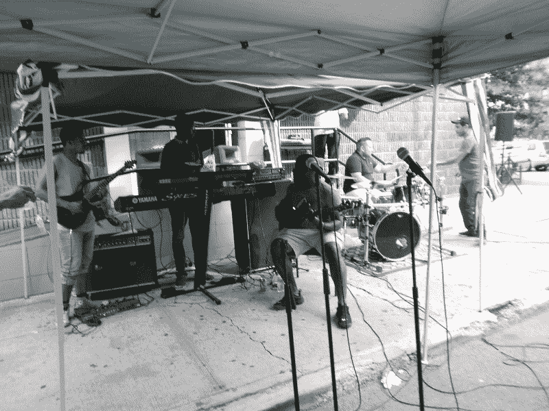
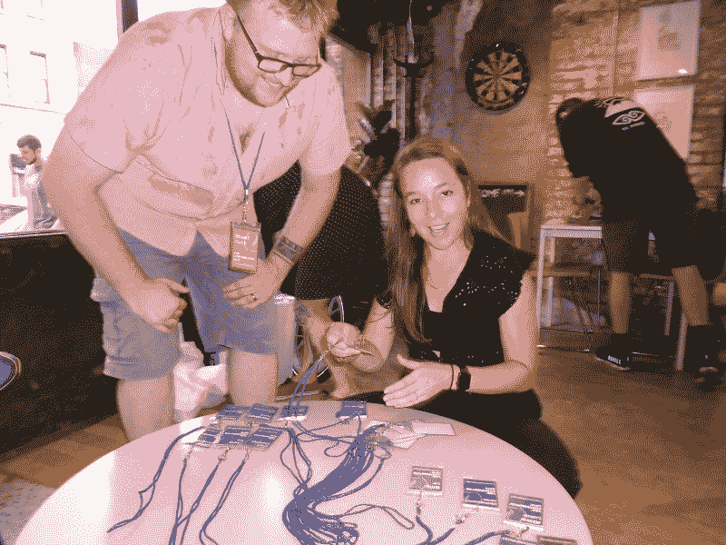
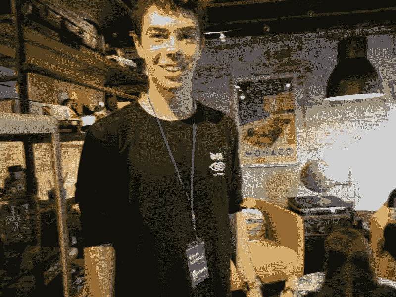
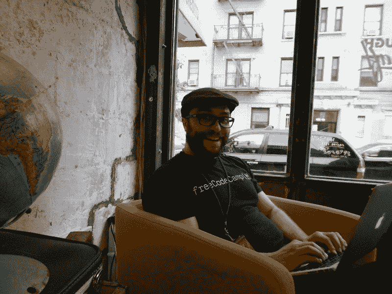
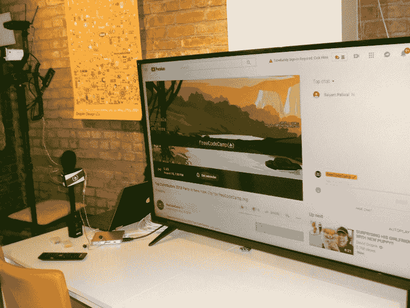
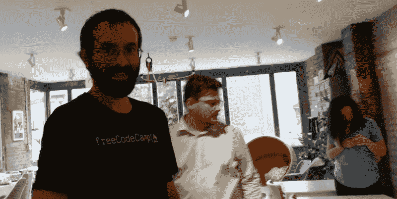
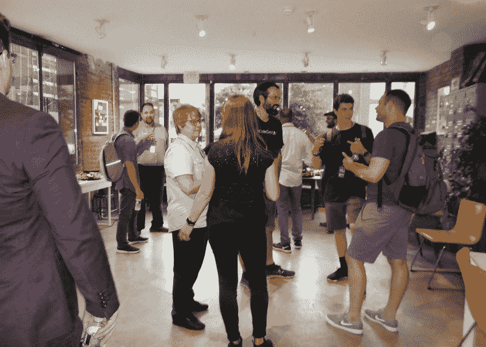
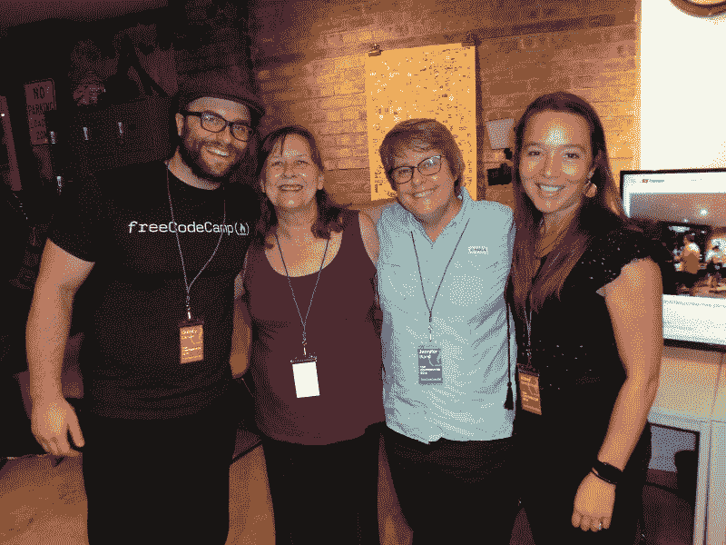

# 我到达了纽约，在我的外展旅程中与自由代码营一起庆祝

> 原文：<https://www.freecodecamp.org/news/how-i-escaped-to-nyc-and-celebrated-with-freecodecamp-on-my-outreachy-journey-22946d5af21e/>

托尼·肖特斯维

# 我到达了纽约，在我的外展旅程中与自由代码营一起庆祝

The music was staged on the block just before the freeCodeCamp party site

我很自豪被选为 [freeCodeCamp](https://www.freecodecamp.org/news/how-i-escaped-to-nyc-and-celebrated-with-freecodecamp-on-my-outreachy-journey-22946d5af21e/undefined) 的 [2018 年度最佳贡献者](https://medium.freecodecamp.org/announcing-our-freecodecamp-2018-top-contributor-award-winners-861da08a77e1)之一，并被邀请参加在纽约举行的庆祝活动。我也非常感谢[外展](https://www.outreachy.org/)赞助我的旅行，这样作为一名外展实习生，我可以参加这个令人敬畏的活动。

我前一天晚上很晚才到达，第二天一早就离开了。所以，我只想和你分享 2018 年 8 月 18 日星期六发生的事情——在纽约布鲁克林。

我这次访问的计划之一包括与我的一位自由健康导师进行一次现场会面。遗憾的是，在我短暂的访问期间，他没能与我取得联系——但我很高兴地说，他现在感觉好多了。所以，我在附近逛了逛，为派对做准备。

该活动在布鲁克林胡珀街举行。我本来要早一点到达，以协助筹备聚会。我坐了一趟 Lyft 到达那里，提前了大约半个小时。因为我不知道这个地区——我的司机也不知道——我有点担心在等着见其他人的时候去哪里玩。

然而，这些担心是没有根据的，事实证明，没有任何问题…

#### 一个预备派对！

我的司机向左转，停了下来。他说“我不能再往前走了，但是你可以走到这个街区的尽头，它就在街对面”。他被街区派对拦住了！乐队听起来不错，孩子们在笑着玩，食物闻起来也很棒。然后一位女士宣布“棉花糖最后一次召唤”，并给了我一根免费的粉红色棉花糖！

太棒了！我一边吃着我的点心，一边听着美妙的音乐，等待着其他人的到来。他们开始搬帐篷，拆桌子，所以我决定去附近的其他地方看看。

#### 会面

当我穿过街道时，我看到另外两位顶级贡献者[格温·法拉第](https://twitter.com/gwen_faraday)和[马特·波特](https://twitter.com/askmp)在会场前聊天。格温写了一些我喜欢读的文章(查看她最近的一篇关于我用来自学区块链开发的[资源](https://medium.freecodecamp.org/the-resources-i-used-to-teach-myself-blockchain-development-1fccada9b92b))，所以我很高兴能见到她。

马特让我们在 YouTube 频道上看起来很棒。这个频道几乎为每个层次的任何人提供一切。

然后这辆车停了下来，上面有昆西·拉森、T2、阿比·雷恩梅尔、T4、博·卡恩斯、斯图尔特·泰勒。

昆西·拉森是自由代码营的创始人，也是我最初参与其中的原因。他也是我在媒介平台上的导师。

此外，他还创建了顶级贡献者名单，将我们聚集在一起参加派对！谢谢昆西？

Abbey 为我们的 freeCodeCamp 媒体出版物和[播客](https://freecodecamp.libsyn.com/)管理内容。和她一起工作很棒。她让我们所有的志愿者编辑保持一致，并迅速回答作者或关于文章的问题。我喜欢她对我文章的反馈。

Beau [教](https://www.youtube.com/channel/UC8butISFwT-Wl7EV0hUK0BQ/playlists?shelf_id=11&sort=dd&view=50) JavaScript(还有很多其他东西！)在 YouTube 频道上。如果你在学习编码的过程中迷路了，这是一个很好的去处。

斯图尔特来自英国，目前居住在爱尔兰。我喜欢听他的声音。他在我们的 beta 课程平台上工作，并编写了 [freeCodeCamp 指南](https://guide.freecodecamp.org/)。

我们都步行到几个街区外的当地商店去为聚会买一些额外的用品。这是一个叙旧和联系的好机会。

当我们回到草图的时候，我们看到帐篷和椅子已经被移动，创造了一个小型的音乐会区域，在那里举行了街区聚会。我们今晚会有很棒的音乐！

#### 安装

我们见到了经理艾莉森·祖洛，他带我们四处参观，准备开始工作。我们的 Python 教练[伊森·阿罗伍德](https://twitter.com/arrowoodtech)及时赶来帮忙。

Stuart was helping Abigail prepare the badge table

Ethan had a willing smile for everyone who asked for his help during set up

Quincy was in his corner preparing

Ready to go Live!

It’s almost Party Time!

#### 派对时间！

现在，客人们开始陆续到达，而且活力四射！

The guests are arriving!

我很高兴见到约翰尼·比泽尔，他是我的编程英雄，因为他在论坛上的帮助——他让我的井字游戏停止作弊。如果没有他，我可能要花好几年才能拿到前端证书。

Bill Sourour 是另一位我喜欢与之共事的作家。我最喜欢他的作品是[运行时不要做。在设计时做](https://medium.freecodecamp.org/dont-do-it-at-runtime-do-it-at-design-time-c4f59d1775e4)。

格雷格·史密斯和 T2【Auriel les lie 是自由代码营[论坛](https://forum.freecodecamp.org/)的出色版主。他们用简单的英语解释和积极的态度为我们迷路的露营者提供指导。

杰西·魏格尔很有幽默感。他在 [YouTube](https://www.youtube.com/user/JesseandBek) 上向我们展示了他的编程乐趣和不幸。

也认识了很多学习小组长。与他们交谈令人着迷，对他们正在做的事情非常兴奋。

我的第一个营员英雄 Rafael Rodriguez 也在纽约。他是我最先追随并寻求指导的人之一。他的代码非常流畅，逻辑也很有道理。我觉得如果我的项目能像他的一样好，一样易读，我就可以做任何事情。我很高兴见到他，但完全张口结舌。晚上晚些时候，我确实设法和他聊了一会儿。

詹妮弗·布兰德是我们编辑团队的另一名成员。我们不确定她能不能来，所以见到她我很激动。

The attending freeCodeCamp Editing Team — Quincy, me, Jennifer and Abbey

聚会进行时，昆西特意去见了每个人。我们中的一些人接受了现场直播采访。

浓缩视频可以在这里看到:

我的面试是 15:21 到 18:58。我们讨论了我是如何作为一名编辑加入 freeCodeCamp 的，我的基本编辑时间表是如何工作的，以及我作为一名 freeCodeCamp 编辑学到的经验如何帮助我成为一名外联实习生。昆西和我完全同意外展是一个伟大的组织。但是我不知道它是否是 Mozilla 的一部分…

**注:**我后来发现，虽然 Outreachy 为那些想与 Mozilla 合作的人提供了一个很好的机会，就像我与 LibreHealth 合作一样，但它实际上是母公司[软件自由保护协会](https://sfconservancy.org/)的子机构。

我确实知道，外联活动在帮助女性和代表性不足的个人找到带薪实习和在科技行业工作方面发挥了重要作用。如果你还没有，并且有兴趣，注册加入他们的公告列表。新的会议将于 9 月 10 日开始。

#### 反光

对于每一个想学习编程、获得认证并在科技行业工作的人来说， [freeCodeCamp](https://www.freecodecamp.org/) 是一个适合的地方。课程很好，视频很棒，论坛和聊天室很有帮助，媒体出版物总是有内容丰富的文章。

在聚会期间，我收到了我丈夫的一条短信。上面写着“我加入了 freeCodeCamp。只差 1408 个编码挑战了！”耶，我带来了一辆新的野营车！？

我没想到会因为做自己喜欢的事情而获得荣誉。我很感激这个奖项，也很荣幸能在这里旅行。我遇到了一些我的第一个也是最伟大的英雄。被认出是我真好，“哦，你是吕慧仪·柯德斯！”

看到一个在线免费开源教育社区所包含的一切，并见到一些让它变得有价值的人，这是令人惊讶的。

谢谢你和我一起来到纽约。下次当我准备结束实习时，我们将继续我们的拓展之旅。

#### 以前的文章

*   [我是如何战胜困难成为一名外展实习生的](https://medium.freecodecamp.org/how-i-beat-the-odds-and-became-an-outreachy-intern-9a92f47cb44e)
*   我的外展实习从今天开始！以下是我到目前为止所做的和学到的。
*   [我拓展之旅的下一步:码头工人、大挑战和小胜利](https://medium.freecodecamp.org/the-next-steps-on-my-outreachy-journey-docker-big-challenges-and-small-victories-2c3a2dd2277a)
*   [在我的旅程中，每一步都带来新的东西](https://medium.freecodecamp.org/every-step-brings-something-new-on-my-outreachy-journey-e7c0f7adf2ea)
*   [我的外展旅程中的特殊时刻](https://medium.freecodecamp.org/special-moments-on-my-outreachy-journey-78db1ff11ef4)
*   [我是如何在我的拓展旅程中尽可能多地吸收知识的](https://medium.freecodecamp.org/how-ive-absorbed-as-much-as-i-m-able-on-my-outreachy-journey-3e350c9e0362)