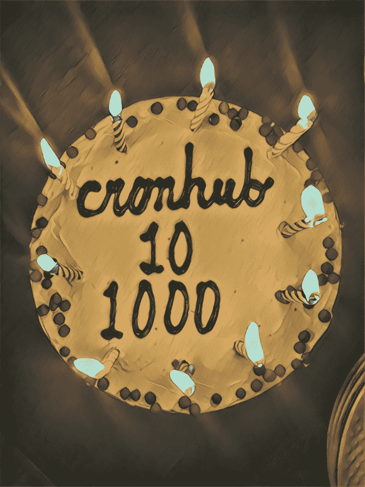
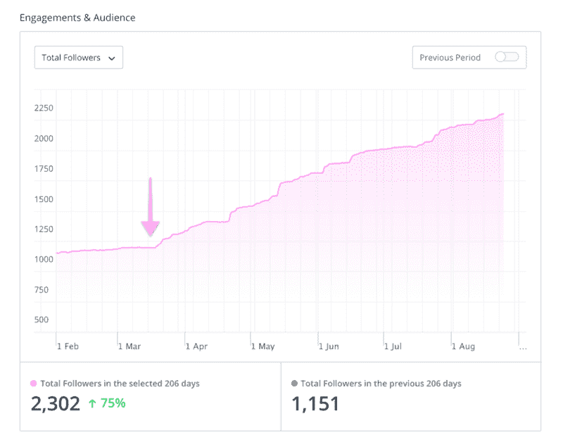
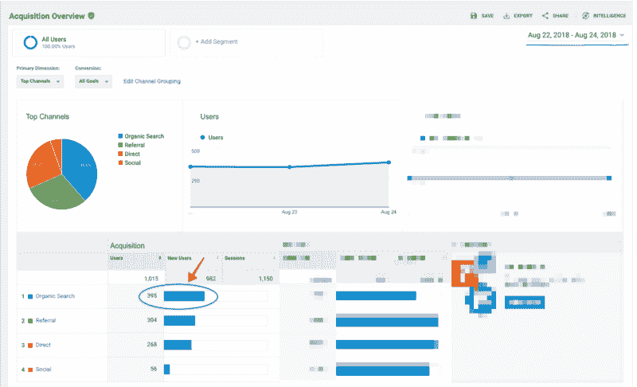
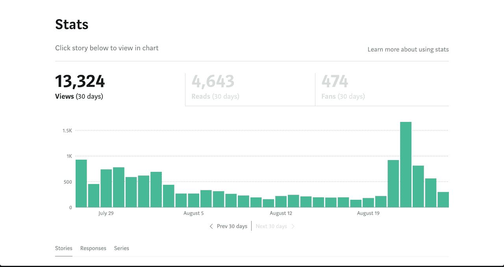

# 我是如何为我的副业项目找到前 10 个客户的，我从他们身上学到了什么

> 原文：<https://www.freecodecamp.org/news/how-i-acquired-my-first-10-customers-for-my-side-project-c4ee892a70a2/>

作者:蒂格兰·哈科比安

# 我是如何为我的副业项目找到前 10 个客户的，我从他们身上学到了什么

My friends got me a cake to celebrate Cronhub’s 10th customer and 1000th user :)

我的名字是 [Tigran](http://www.tigranhakobyan.com/) ，我 29 岁，我是 [Cronhub](http://www.cronhub.io/) 的创造者。这是一个兼职项目，因为我也是 [Buffer](http://www.buffer.com/) 的全职远程工程师。

在过去的 5 个月里，我一直在把 Cronhub 打造成一个有利可图的副业。Cronhub 是一个面向开发者的 cron 监控工具。如果您的任何计划作业失败或运行时间超出预期，它会进行监视并向您发出警报。

过去，我曾分享过一篇关于我如何在全职工作时启动 Cronhub 的文章。今天我写的是一个在发布后很长一段时间里我一直想知道的话题。在早期阶段，寻找第一批客户可能是每个产品制造商面临的最大挑战。这解释了为什么这么多人好奇别人是如何设法找到他们的第一个客户并阅读他们的故事的。

在这篇文章中，我想分享我在启动副业项目后获得第一批付费客户的故事和经历。这是一次充满欢乐和挑战的有趣旅程。我希望通过阅读我的故事，我可以对这个过程有所启发，并激励其他开发人员找到自己的道路。

### 开发 Cronhub

拥有一份全职工作，同时试图建立一个在线业务是一个挑战。最大的挑战是非常有条理地安排你的时间，不要让自己精疲力竭。除了我在 Buffer 的全职工作，我通常在 Cronhub 上工作 1-2 小时，周末可能工作 5-6 小时。

我试着每天睡 8 个小时，否则第二天我会觉得很累，这会影响我的工作效率。当然，有些日子我会情绪低落，但我知道这只是暂时的，我必须等待迷雾散去。尽管 Cronhub 只是一个副业，我还是花了很多精力来区分任务的优先级。我把我所有的任务分成两大类。

1.  改善产品并让客户满意的任务(产品工作)
2.  通过提高网站知名度来吸引更多访问者的任务(营销工作)

还有另一个方面改进了产品的激活，比如创建和激活 Cronhub 监视器，但是为了简单起见，我把它放在产品桶中。这里的挑战是找到平衡两个水桶的最佳点。作为一名工程师，我自然更倾向于优先考虑更多的产品工作，但我故意练习克服这种偏见。

### 当前数字

目前，我每天有 7-10 个注册。大多数访问者来自我过去的博客文章，这些文章不一定是我的目标受众。然而，内容营销是我在 Cronhub 中使用的唯一营销渠道。没有冷冰冰的邮件或广告。这里有一些我认为分享起来会很有趣的指标。

#### 产品指标

*   Cronhub 有大约 1100 名注册用户
*   450 个活跃的监视器每天发出大约 130，000 次 pings。如果从外部作业或脚本(例如，您的每日数据库备份作业、每周摘要电子邮件作业)收到至少一次 ping，则监视器处于活动状态
*   仅在过去 3 周，Cronhub 就向我们的用户报告了大约 3000 个 cron 作业失败。失败原因可能是作业未能按计划运行，或者运行时间比预期长。

#### 财务指标

*   自[发布日](https://www.producthunt.com/posts/cronhub)以来的净收入为 710 美元(实际总收入减去任何费用、退款和争议)
*   试用转换率 83%(我希望这个数字最终会下降)
*   每月开支 57 美元

我的费用从发布日起就没有改变过，我计划尽可能保持低水平。我完全没有预料到的是，我看到几乎一半的客户选择了按年计费方案，而不是按月计费。我不知道我是否应该在这里做一些结论。当我获得更多客户和数据点时，如果我看到这种模式重复出现，我可能会这样做。

我非常自豪但仍计划改进的一点是 Cronhub 的 SEO 分数。看到我的大部分访问者来自有机搜索，特别是像 Cronhub 这样的早期产品，这真的很酷。我认为对我来说，继续关注 SEO 和提高有机增长是一个很好的证明。

除了基本的搜索引擎优化技术(如关键词、快速页面加载等)和在 Cronhub 的博客上写内容之外，我什么也没做过。稍后我会详细讨论这一点。

### 获得我的第一批客户

当我推出 Cronhub 时，我只能梦想拥有 10 个客户。现在当我在这里的时候，我似乎有太多的东西要讲。获得我的第一个付费客户对产品至关重要。我花了几个月的时间构建 MVP(最小可行产品),我想看看我努力工作的回报。此外，我认为拥有一个人们愿意为之付费的产品是验证你的想法和知道你正在做某事的一个很好的方式。

我非常幸运地让我的第一个客户在发布后的第二天注册了“[开发者(＄7)](https://cronhub.io/pricing)”计划。当时我在 Cronhub 上只有一个付费计划。收到有新客户的通知是一件特别的事情。它立刻提升了我的信心，把我的动力推到了屋顶。

后来，这位客户转向了商业计划，因为他和他的团队需要更多的显示器。然而，当他给我发电子邮件时，这个“商业”计划还处于“即将推出”的阶段。我告诉他我会在接下来的几天内给他升级，我做到了。我把它作为我的首要任务。第二周我就让他参与了商业计划。

对于商业计划，我必须从零开始建立团队成员的支持。这是值得的，因为我知道无论如何我必须支持 Cronhub 上的团队。Cronhub 主要是为开发团队构建的，所以团队邀请和管理支持是显而易见的。这只是时间问题。我手动升级了客户，并提供了商业计划的终身折扣。

我总是和我的第一个顾客保持联系。他非常乐于提供有价值的反馈。我的第一个客户来自产品搜索发布会。我花了两个星期才多了两个顾客，而且都是在同一个星期内来的。

推出后，访客数量下降，我不得不考虑推广 Cronhub 的方法。我真的没有在这里想太久，决定做我最喜欢的事情:写作。

我真的很喜欢写作。我认为写作是一种冥想的方式。它帮助我专注于一件事，而我的猴脑并不总是能做到这一点。我知道我可以写下我将 Cronhub 建设成一家在线企业的经历，从那以后我一直在做这件事。

写作帮助我扩大了我的受众，也帮助我营销 Cronhub。开始写作后，我也开始增加我的推特粉丝。下图展示了我开始定期写博客后，我的 Twitter 粉丝的变化。我想你能看到突破点！

I started writing regularly in March and you can see how my audience grew ever since

当我决定将内容作为我的主要营销渠道时，我用一个新的子域 [blog.cronhub.io](https://blog.cronhub.io/) 创建了一个博客。对于新博客，我的意图是挤出所有的搜索引擎优化的好处。因为我想提高 SEO 分数以获得更多的有机访问者，所以我花了一周左右的时间来优化 Cronhub 的 SEO。

你可以在网上找到很多关于基础知识的资源。我的网站优化和内容写作如何在 SEO 方面有所帮助的一个例子是来自 Google Analytics 的截图。它显示我在 8 月 23 日至 24 日的流量中几乎有 40%来自有机搜索。这个百分比每天都在 20% — 40%之间波动。我觉得很棒，我要保持高昂的精神。如果能知道 SaaS 产品的行业平均水平，那就太好了。

The Organic Search was the top acquisition channel for these days

我先在 Cronhub 的博客上发表我所有的文章，然后再在 Medium 和独立黑客上发表。独立黑客允许为你的文章设置一个有助于 SEO 的规范 URL，这很好。我对我的媒体文章做的一件事是试图让它们发表在流行的出版物上，如[自由代码营](https://medium.freecodecamp.org/)。这是一个很好的曝光机会，可以让很多观众听到你的声音。我强烈建议你试一试。这是一张显示我的帖子统计的快速 gif 图。

My medium states started to grow including the followers count after getting published on FreeCodeCamp

内容营销的一个缺点是非常耗时，但这是一个长期的游戏。这就像你现在为了更好的未来所做的投资。

我的预感是，我现在的文章大部分都是很多开发者在看的。问题是这些开发者是否会对 cron jobs 表现出兴趣。

举个例子，如果我必须写一篇关于 Kubernetes Cron Jobs 及其工作方式的文章，我希望我的大多数读者至少知道 Cron Jobs 是什么。我想缩小我的文章的范围，以更相关的开发者为目标。我最关心的不是访客的数量而是访客的类型。我有一些想法，很期待看到它们在未来的表现。

在第一个月内有了三个付费客户后，当我在五月初得到我的第一个年度“开发者”计划客户时，我非常兴奋。大约是在那个时候，我开始阅读和学习更多关于产品定价的知识。我对定价一无所知，但我渴望学习。

我与产品经理和比我更了解 SaaS 定价模式的人交谈过。(顺便说一句，我写了一整篇文章，分享我在定价方面的所有心得)。然后，我改变了我的定价表，增加了一个新的中间计划，叫做“启动”。它介于“开发者($7)”和“商业($49)”计划之间，因为我认为这两个计划之间的价格差距太大了。

我改变了价格，让我大吃一惊的是，我的下一个客户注册了年度“启动”计划。感觉真好。我觉得自己就像那个足球经理，他带了一个替补球员上场，而那个球员进了一个球。然后，我开始慢慢获取新客户，直到第一个甜蜜点，10 个付费客户。

然而，回过头来看，我确实花了将近 5 个月的时间才得到第一批 10 个客户。这是我作为一个单干的创始人，每周工作 10-15 个小时。

这是一个缓慢的旅程，当然，有时你会在几周的时间里没有一个新客户，你会因为缺乏动力而感觉很糟糕。但是我知道这些事情会过去的，我比以往任何时候都更兴奋能够有 100 个客户。

如果我回顾我过去的历程，我可以肯定地说，在这一进程中没有可以用来取得成功的普遍公式。然而，我相信耐心是最大的玩家。你要相信自己，要有耐心。

如果我能列出我学到的主要知识，它会是这样的；

*   一开始就关注核心产品和用户体验。
*   在早期不要花太多时间考虑你的定价。把定价想象成一个你可以不断迭代的特性。从 MVP 开始。
*   客户支持非常重要。做人，不做公司。与你的客户保持联系，并寻求反馈。
*   决定你的主要营销渠道是什么，并在早期关注它。
*   与你的观众分享你正在做的所有很酷的事情。人们真的对它们感兴趣。
*   寻求帮助和建议。人们一般都很好，希望你成功。

### 下一步是什么

我的下一个目标是从 10 到 100 个客户。今天我在 Twitter 上寻求建议，乔尔·加斯科因给了我一个很棒的回复。

我想与我的客户进行更多的交流，并围绕 Cronhub 为他们提供的价值调整我的营销策略。除了内容营销，我想创造更多激活率更高的获取渠道。找到适合市场的产品是我的最终目标。我希望我能很快到达那里。

顺便说一句，我非常兴奋地告诉大家，Cronhub 被 YC 的[创业学校](https://www.startupschool.org/)顾问团队录取了。这是一个为期 10 周的在线课程，你可以接触到一位导师和一个很棒的社区。我很高兴能在 Cronhub 上应用我所有的知识，并与您分享我的经验！请继续关注新的博客文章。

感谢您的阅读，如果您有问题，请在评论中告诉我。我很乐意分享更多。

如果你是一名使用 cron 作业或任何预定任务并需要监控的开发人员，那么我希望你能尝试一下 [Cronhub](https://cronhub.io/) 。知道你的想法对我来说很重要。谢了。

我还要感谢我的妻子阿尼帮我编辑这篇文章。❤️

*原载于[blog . cron hub . io](https://blog.cronhub.io/how-i-acquired-my-first-10-customers-for-cronhub/)2018 年 8 月 27 日。*