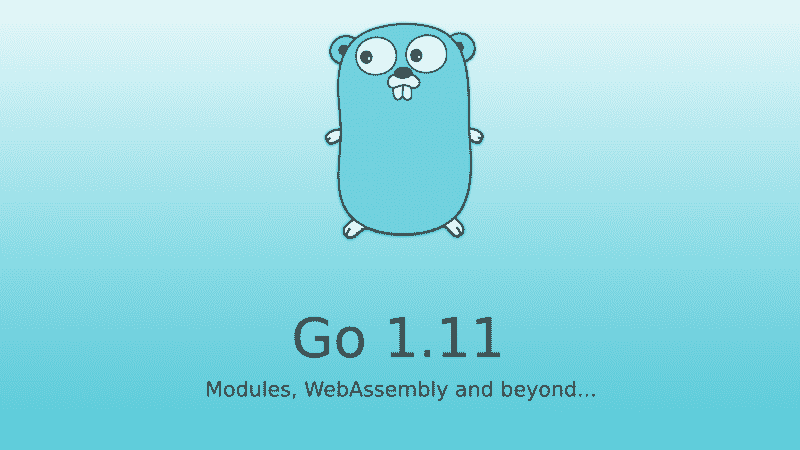

# 关于 1.11 版你需要知道的

> 原文：<https://www.freecodecamp.org/news/all-you-need-to-know-about-go-1-11-webassembly-modules-and-major-changes-df6a02108373/>

作者:Ridham Tarpara

# 关于 1.11 版你需要知道的



Go 1.11 于 2018 年 8 月 24 日落地。它引入了一些真正需要的工具和组件，比如版本化模块、WebAssembly 支持和调试改进。它也给核心包和性能/运行时带来了一些变化。

一如既往，该版本保持了 Go 1 [的兼容性承诺](https://golang.org/doc/go1compat.html)。所以几乎所有的 Go 程序在这次更新后都能像以前一样编译和运行。语言规范没有变化。

让我们来看看有什么新内容。

### **模块**

Go 1.11 包括对 Go 模块的实验性支持，包括一个新的模块感知`go get`命令。

利用新模块支持的最快方法是将您的存储库签出到目录**之外，**创建一个 go.mod 文件，并从该文件树中运行 go 命令。

让我们来演示一下。我使用的是功能强大的标准 Go 测试库。

让我们在我最喜欢的文件夹`~/proj/github`中克隆见证回购。

```
$ git clone https://github.com/stretchr/testify ~/proj/github/testify$ cd ~/proj/github/testify
```

现在，要从这里使用 Go 命令，您需要使用以下命令将这个 repo 初始化为一个模块:

```
go mod init github.com/stretchr/testify
```

其中`github.com/stretchr/testify`是您通常将该回购放在 Go src 文件夹下的位置。

这个命令将在文件夹的根目录下创建一个 go.mod 文件。在一个已经使用现有依赖管理工具如 godep、glide 或 dep 的项目中，`go mod init`还将添加与现有配置相匹配的 require 语句。

现在如果您打开`go.mod`文件，您可以看到模块名称的依赖列表。

```
$ vi go.mod
```

```
module github.com/stretchr/testify
```

```
require (    github.com/davecgh/go-spew v1.1.0    github.com/pmezard/go-difflib v1.0.0    github.com/stretchr/objx v0.1.0)
```

正如你会注意到的，这三个是见证的依赖项。这是作证的`Gopkg.toml`文件:

```
[prune] unused-packages = true non-go = true go-tests = true
```

```
[[constraint]] name = “github.com/davecgh/go-spew” version = “~1.1.0”
```

```
[[constraint]] name = “github.com/pmezard/go-difflib” version = “~1.0.0”
```

```
[[constraint]] name = “github.com/stretchr/objx” version = “~0.1.0”
```

现在模块已经初始化，您可以使用这个文件夹中的任何 Go 命令。

```
╭─ ~/proj/github/testify  ‹master*› ╰─$ go build                               go: finding github.com/davecgh/go-spew v1.1.0go: finding github.com/pmezard/go-difflib v1.0.0go: finding github.com/stretchr/objx v0.1.0go: downloading github.com/davecgh/go-spew v1.1.0go: downloading github.com/pmezard/go-difflib v1.0.0go: downloading github.com/stretchr/objx v0.1.0
```

```
╭─ ~/proj/github/testify  ‹master*› ╰─$ go test PASSok   github.com/stretchr/testify 0.001s
```

所以有了 Go 1.11 和模块，你可以在任何你喜欢的地方编写你的 Go 模块*，你不需要在你的`$GOPATH`的特定子目录中维护一个副本*。

### web 程序集

Go 1.11 给 WebAssembly 增加了一个实验端口。

> WebAssembly(缩写为 *Wasm* )是一种基于堆栈的虚拟机的二进制指令格式。Wasm 被设计为 C/C++/Rust 等高级语言编译的可移植目标，支持客户端和服务器应用程序在 web 上的部署。

现在我们可以在浏览器中运行 Go，反之亦然——我们可以轻松地在 Go 中运行 JavaScript。尽管这项功能还处于试验阶段，但它仍然非常有用。

这个小例子调用来自 Web:

**wasm-exec.html**

```
<!doctype html><!--Copyright 2018 The Go Authors. All rights reserved.Use of this source code is governed by a BSD-stylelicense that can be found in the LICENSE file.--><html>
```

```
<head>    <meta charset="utf-8">    <title>Go wasm</title></head>
```

```
<body>    <script src="wasm_exec.js"></script>    <script>        if (!WebAssembly.instantiateStreaming) { // polyfill            WebAssembly.instantiateStreaming = async (resp, importObject) => {                const source = await (await resp).arrayBuffer();                return await WebAssembly.instantiate(source, importObject);            };        }        const go = new Go();        let mod, inst;        WebAssembly.instantiateStreaming(fetch("test.wasm"), go.importObject).then((result) => {            mod = result.module;            inst = result.instance;            document.getElementById("runButton").disabled = false;        });        let printMessage // Our reference to the Go callback        let printMessageReceived // Our promise        let resolvePrintMessageReceived // Our promise resolver        function setPrintMessage(callback) {          printMessage = callback          resolvePrintMessageReceived()        }        async function run() {          console.clear()          // Create the Promise and store its resolve function          printMessageReceived = new Promise(resolve => {            resolvePrintMessageReceived = resolve          })          const run = go.run(inst) // Start the wasm binary          await printMessageReceived // Wait for the callback reception          printMessage('Hello Wasm!') // Invoke the callback          await run // Wait for the binary to terminate          inst = await WebAssembly.instantiate(mod, go.importObject) // reset instance        }    </script>
```

```
<button onClick="run();" id="runButton" disabled>Run</button></body>
```

```
</html>
```

**去打电话去**

```
package main
```

```
import (  "fmt"  "syscall/js")
```

```
var done = make(chan struct{})
```

```
func main() {  callback := js.NewCallback(printMessage)  defer callback.Release() // To defer the callback releasing is a good practice  setPrintMessage := js.Global().Get("setPrintMessage")  setPrintMessage.Invoke(callback)  <-done}
```

```
func printMessage(args []js.Value) {  message := args[0].String()  fmt.Println(message)  done <- struct{}{} // Notify printMessage has been called}
```

你可以在这里找到更多的例子[。这里有一个关于](https://github.com/nlepage/golang-wasm/blob/master/examples)[用 WebAssembly](https://www.youtube.com/watch?v=4kBvvk2Bzis&feature=youtu.be) 制作计算器的视频。

### **要考虑的其他变化**

*   因为 Go 模块支持在命令行操作中赋予符号`@`特殊含义，所以`go`命令现在不允许使用包含`@`符号的导入路径。
*   使用新的`runtime/trace`包的[用户注释 API](https://golang.org/pkg/runtime/trace/#hdr-User_annotation) ，用户可以在执行跟踪中记录应用程序级别的信息，并创建相关的 goroutines 组。`go` `tool` `trace`命令在跟踪视图和新用户任务/区域分析页面中可视化该信息。
*   运行时现在使用稀疏堆布局，因此对 Go 堆的大小不再有限制(以前的限制是 512GiB)。这也修复了混合 Go/C 二进制或用`-race`编译的二进制中罕见的“地址空间冲突”故障。
*   [时间](https://golang.org/pkg/time/):现在支持解析由符号和偏移量表示的时区。在以前的版本中，数字时区名称(如`+03`)被认为是无效的，当需要时区名称时，只接受三个字母的缩写(如`MST`)。
*   [文本/扫描仪](https://golang.org/pkg/text/scanner/):`[Scanner.Scan](https://golang.org/pkg/text/scanner/#Scanner.Scan)`方法现在返回`[RawString](https://golang.org/pkg/text/scanner/#RawString)`标记，而不是原始字符串文字的`[String](https://golang.org/pkg/text/scanner/#String)`。
*   有[密码](https://golang.org/pkg/crypto/)、[编码](https://golang.org/pkg/encoding/)、 [net/http](https://golang.org/pkg/net/http/) 、 [os](https://golang.org/pkg/os/) 、[运行时](https://golang.org/pkg/runtime/)、[同步](https://golang.org/pkg/sync/)、 [mime](https://golang.org/pkg/mime/) 等几个变化，你可以在这里读到[。](https://golang.org/doc/go1.11#library)

如果你喜欢这篇文章，请不要为我鼓掌——它对作者来说意义重大。如果你想阅读更多关于围棋、JavaScript、技术和创业公司的文章，请关注我。