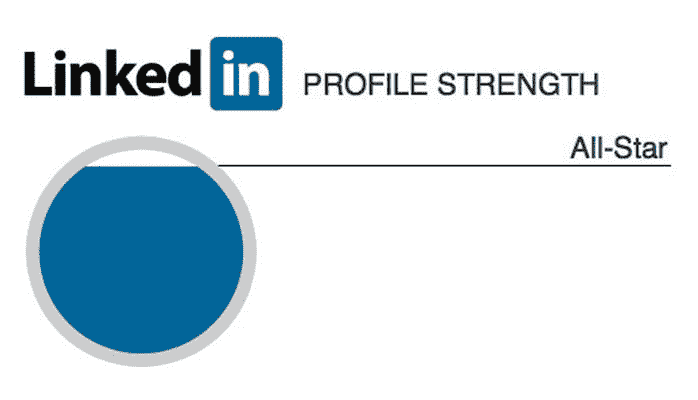
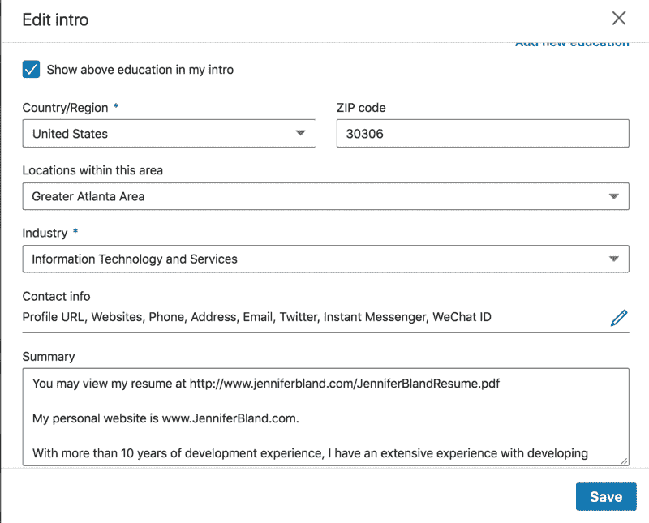

# 想在科技行业找份工作吗？以下是求职者如何利用顶级在线市场获得工作的方法。

> 原文：<https://www.freecodecamp.org/news/want-a-job-in-tech-here-is-how-to-use-the-top-online-marketplace-for-job-seekers-to-get-that-job-878391456a2/>

LinkedIn 是世界上最大的人才库，拥有 300 万个活跃的工作列表。让我来告诉你如何利用这个工作列表的宝库来找到你的第一份或者下一份科技工作。

### 为什么要用 LinkedIn？

招聘人员不会在 Pinterest、脸书或 Instagram 上找到你。相反，94%的招聘人员会使用 LinkedIn 来审查潜在的候选人。几乎一半的招聘人员只使用 LinkedIn 进行社交活动。

超过 20，000 家美国公司使用 LinkedIn 进行招聘。这些公司中的大多数将使用招聘人员来填补这些空缺职位。你想引起这些招聘人员的注意，因为他们可以把你的简历交到这些公司的招聘经理手中。

### 招聘人员如何使用 LinkedIn？

招聘人员使用名为 **LinkedIn Recruiter** 的产品来挖掘这个人才库，以填补 300 万个活跃的职位列表。

LinkedIn Recruiter 是一个工具，允许招聘人员寻找符合他们试图填补的职位的工作要求的候选人。以下是招聘人员从该产品中获得的一些好处:

#### 接触每个人

只有当用户是一级连接时，他们才能看到个人资料中的所有信息。如果联系人是二级连接，您可以看到的信息量会减少。对于第三级连接，您能看到的信息有限。

LinkedIn Recruiter 允许招聘人员访问 LinkedIn 上的人，而该网站的用户没有这些人。有了这个产品，招聘人员可以直接接触到 LinkedIn 上的每个人。

你不必主动联系招聘人员，让他们看到你的个人资料。相反，他们会看到这些信息。你只需要以一种方式构建你的个人资料，让他们更容易就空缺职位联系你。

#### 高级人员搜索

LinkedIn Recruiter 允许招聘人员使用 LinkedIn 强大的搜索工具来寻找最佳人选。此工具允许招聘人员根据以下条件搜索候选人:

*   位置
*   工业
*   当前位置
*   过去的职位
*   技能

### 成为领英全明星的 7 项要求

现在你已经了解了招聘人员可以使用 LinkedIn Recruiter 获得哪些资源，你需要改进你的个人资料，这样你就可以很容易地被寻找空缺职位的招聘人员找到。

LinkedIn 根据您的个人资料包含的信息，为您的个人资料提供不同的级别。最高级别是一个 LinkedIn 全明星。如果你达到了全明星级别的所有 7 个要求，你会发现自己在招聘人员的雷达上。以下是成为 LinkedIn 全明星的 7 个要求。

*   侧面照片
*   您的行业和位置
*   最新的当前位置
*   两个过去的职位
*   你的教育
*   你的技能
*   至少 50 个连接

#### 个人资料图片

LinkedIn 并没有规定你的个人资料图片中应该有什么，不应该有什么。无论如何，它应该是一些专业性质的东西。以下是一些非常糟糕的个人资料图片示例:

Examples of bad profile pictures

#### 行业和位置

当您编辑个人资料的顶部时，您可以输入您的当前位置和您工作的行业。您的位置由您提供的邮政编码定义。

如果你想搬到一个新的地方工作，一定要将该地区的邮政编码指定为你当前的所在地，而不是你当前居住的地方。

您将从下拉列表中选择您的行业。

#### 当前位置

下一步是输入你目前工作的职位。当您输入该职位时，您可以输入您在该公司所做工作的描述。

我建议你在描述你所做的工作时，使用与你想要的职位相关的关键词。原因是招聘人员会搜索选定的关键字。你要确保你的描述包括那些潜在的关键字。

#### 两个过去的职位

LinkedIn 要求你列出两个以前的工作职位，以满足全明星身份的要求。如果你想进入一个新的行业，列出过去不在这个行业的职位是可以的。

如果你是一名刚毕业的学生，或者之前没有两个职位的人，你可以列出一份你在学生时代做过兼职的工作来满足这个要求。

#### 教育

你必须为教育列出一些东西。如果你没有上过大学，那么你可以列出你的高中。如果你只完成了一个大专学位，然后列出那所大学。如果你只在一所大学完成了一两个学期，那么列出那所大学。如果你没有上过大学，那么你可以加入在线培训网站，如 FreeCodeCamp，CodeSchool，Udacity 等。

#### 你的技能(至少 3 项)

技能是招聘人员可以使用 LinkedIn Recruiter 搜索的另一个领域。我会建议你输入所有与你想找工作的技术领域相匹配的技能。

你可以选择订购这份清单。我会把你在工作中绝对需要的技能放在首位。将最重要的技能列在最前面的另一个原因是，当人们查看你的个人资料时，LinkedIn 会给他们一个选项来认可你的技能。他们只会看到列出的前四项技能。

#### 至少 50 个连接

你需要和至少 50 个人建立联系。如果你刚刚开始建立你的 LinkedIn 个人资料，要联系 50 个人似乎是不可能的。

如果你毕业于大学或高中，你可以在 LinkedIn 上搜索毕业于同一所学校的人。然后你可以联系他们，请他们与你联系。

你可以让你的家人成为你的联系人。你也可以请你的同事和朋友与你联系。

如果你还在努力寻找 50 个联系，那么搜索标题为“狮子”的人。LION 代表 LinkedIn Open Networker。狮子是领英用户，他明白拥有一个庞大的领英网络的力量。狮子会和 LinkedIn 上的几乎所有人联系，不管他们是否认识、信任甚至尊重这个人。你可以很容易地在 LinkedIn 上找到至少 50 只狮子，并与它们建立联系。

### 让招聘人员联系你

如果你符合全明星的所有要求，那么你的个人资料将会出现在招聘人员用 LinkedIn Recruiter 创建的搜索中。一旦他们的搜索返回你的资料，招聘人员会给你发邮件，看看你是否对他们试图填补的空缺感兴趣。

如果你感兴趣，回复招聘人员。招聘人员会收集你的简历并提交给公司的招聘经理。

这就是你如何利用 LinkedIn 获得你的第一份——或者下一份——科技工作。

#### 更多文章

以下是我写的一些你可能感兴趣的文章:

[**为什么公司文化对你的软件工程师生涯很重要**](https://medium.freecodecamp.org/why-company-culture-is-important-to-your-career-as-a-software-engineer-5a590bc44621)
[*公司文化的影响体现在公司实现目标的能力和生产力水平……*medium.freecodecamp.org](https://medium.freecodecamp.org/why-company-culture-is-important-to-your-career-as-a-software-engineer-5a590bc44621)[**如何用 jQuery 编写计算器程序**](https://medium.freecodecamp.org/programming-a-calculator-8263966a8019)
[*之前，我向你展示了如何使用 CSS border-radius 属性创建下面的计算器。现在我将向你们展示…*medium.freecodecamp.org](https://medium.freecodecamp.org/programming-a-calculator-8263966a8019)[**这里是你们可以用 FlexBox 做出的 5 种布局**](https://hackernoon.com/here-are-5-layouts-that-you-can-make-with-flexbox-6ca1e941f33d)
[*CSS 灵活的盒子布局——FlexBox——为设计者和…*hackernoon.com](https://hackernoon.com/here-are-5-layouts-that-you-can-make-with-flexbox-6ca1e941f33d)的设计和布局问题提供了一个简单的解决方案