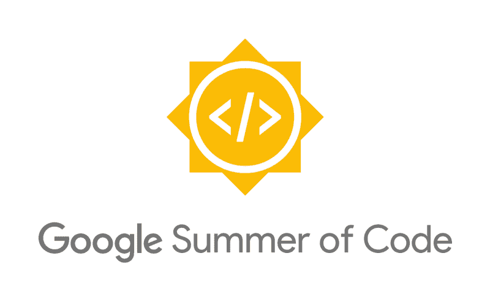
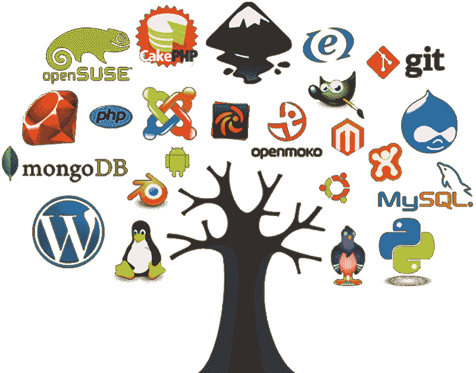
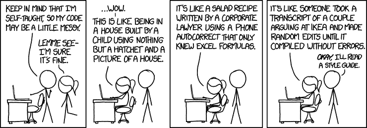
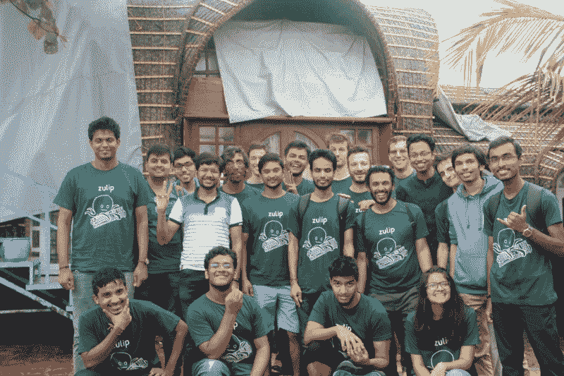

# 我在谷歌代码之夏的经历

> 原文：<https://www.freecodecamp.org/news/the-google-summer-of-code-experience-e9329da27c66/>

作者 Aswin G

# 我在谷歌代码之夏的经历

本文是我参与并完成 Google Summer of Code 2018(也称为 GSoC)的经历的快速总结。

### 什么是 GSoC？

Google Summer of Code 是 Google 组织的一个项目，旨在让学生开发者参与开源开发。顾名思义，它在每年夏天的四月到八月间举行。在那几个月里，被选中的学生在暑假期间为参加该活动的几个开源组织之一编写代码。

学生可以浏览参加活动的组织列表，其中大多数都有一个 **ideas** 页面，表明他们现有项目的哪一部分可以进行更多的工作。然后，学生可以向这些组织提交最多三份提案。计划书应该准确地描述你计划在这个夏天做什么，以及为什么你应该是做这件事的人。

然后，在一个月的漫长等待后，被选中的学生被宣布——在短暂的“社区结合”期后，他们可以开始编码。除了获得 GSoC 奖学金的证书之外，谷歌还通过向学生提供津贴来进一步激励学生的参与——根据你的所在地，从 6600 美元到 2400 美元不等——在印度是 2400 美元。

### 什么是开源组织？它们有多重要？

The best tools are often open source! (Image credit: [hackernoon](https://hackernoon.com/lessons-for-creating-good-open-source-software-1b7bbbc13b13))

开源组织在一个协作平台上有他们产品的代码，比如 GitHub。这里的想法是，直接为组织工作的核心团队将维护代码库(并且通常贡献最大块的代码)，而其他任何人都可以贡献代码，公开现有产品的问题，或者使用产品本身(通常是免费的)。

开放源码组织是自由和开放源码文化的支柱，这种文化提倡自由和开放源码软件，鼓励共享和合作，并试图通过消除资金限制使更多的人可以使用软件。一些最好的产品和工具都是开源的，尤其是在软件开发领域，从流行的 ide 到编程语言本身，几乎所有的东西都是开源的。

### 被选中

We all have to start somewhere! (Image credit: [xkcd](https://xkcd.com/))

最初，从我大一开始，我就计划在大学二年级结束时申请 GSoC 并利用这期间的时间磨练自己的技能，以便足够好地被选中。

出于好奇，我决定在提案提交截止日期前一周浏览 GSoC 组织列表，看看有什么样的项目。有趣的是，我发现了不少我觉得对我来说不太复杂的项目。

在短暂的“哦，我现在就可以试试这个”之后，我匆忙为三个不同的组织起草了三份提案，并在截止日期前提交了它们。我为开源生产力聊天应用程序 Zulip 提交的提案最终被接受了，该提案围绕改进 React 原生移动应用程序的 UI/UX 展开。

大多数组织选择以前为他们的代码库做出过贡献的学生，因为他们对这些学生能够产生的代码的质量有保证——而不是仅仅根据他们的提议进行选择。Zulip 提案指南明确要求学生提交指向他们以前对 Zulip 和其他开源组织的贡献的链接，这对我来说是一片空白。因此，我并不特别希望自己会被选中，但我还是决定尝试一下。

与组织成员的沟通对 GSoC 至关重要。有时你不得不寻找 IRC 频道或邮件列表来建立联系。Zulip 是一款聊天应用，为开发者提供了专用的聊天服务器。我在提案提交截止日期后跳上了它，并确保参与了那里的对话。我解决了一些小问题，向 GitHub 上的 Zulip mobile 存储库提交了一些 Pull 请求，根据代码审查更新了它们，并合并了它们。

当然，也有其他几个学生这样做，但当最终宣布选定的学生时，我的名字在名单上。这是我迄今为止取得的最大的成就，我非常开心。

### 编码周期

在 Zulip，我和这个奇妙而有帮助的社区度过了一段美好的编码时光。我的导师是两个以前的 GSoC 学生——以及仔细审查我的代码的管理员——他们耐心地解释我犯的错误，如果有的话，并帮助我塑造我的代码，以达到它被合并所需的标准。

作为 Zulip 成员的另一个令人愉快的额外福利是参加为期一周的 Zulip 成员聚会。亲身了解来自世界各地的程序员团队是令人惊讶的，这是一次让我感觉自己是社区一员的真实经历。

The week-long Zulip retreat was quite amazing!

简而言之，我可以肯定地说，在 GSoC 的三个月里，我的编码技能有所提高。我的 git-fu (GitHub 技能)——被限制在`add-commit-push` 的基本周期——首先显著提高。我被要求对提交进行重新排序、重新排序和拆分，以便让它们按照更有意义的顺序排列。

为一个组织和一个个人项目做贡献的最大区别是，这个组织的产品被世界上成千上万的人使用。现有的代码库是由其他人创建的，我所贡献的代码应该能够被将来可能从事这项工作的其他人所理解。

编写清晰的文档，构建符合标准的代码，并确保您的更改不会破坏其他任何东西，这是一次真正的教育经历——对于一个习惯于拆掉并匆忙重构大块代码来为新功能腾出空间，并且在此之前很少或根本不为我的爱好项目编写文档的人来说。

### 结论

谷歌代码之夏对学生来说是一个很好的机会，让他们从事一个真正重要的项目，并成倍地提高他们作为一名程序员的能力和在大型团队中工作的能力。当然，多赚 2400 美元也很好:)

展望未来，我将继续为 Zulip 做出贡献，并成为该社区的一员。我强烈建议任何对编码和自由/开源软件有热情的人在 GSoC'19 宣布的时候申请，因为这是一次值得记住的经历。