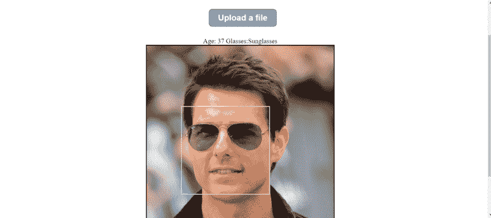
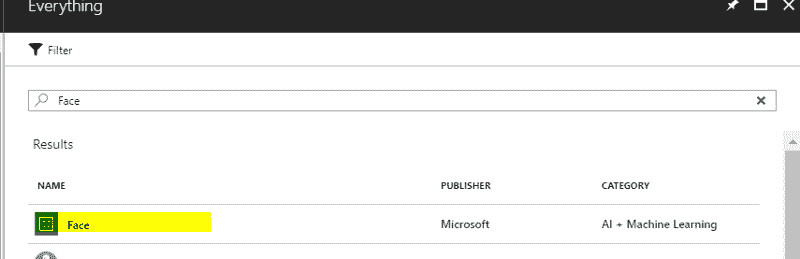
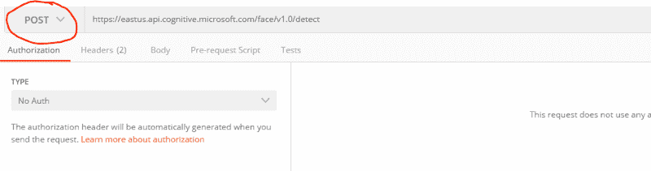
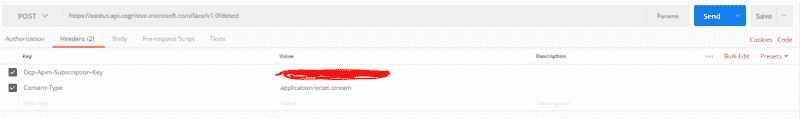
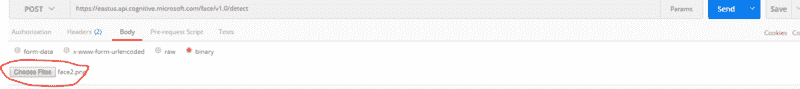

# 如何在您的应用中设置面部检测和特征识别

> 原文：<https://www.freecodecamp.org/news/how-you-can-set-up-face-detection-with-feature-identification-in-your-app-1d6f1c14c79/>

作者 rohit rawname

# 如何在您的应用中设置面部检测和特征识别

#### 通过微软认知服务、Azure 和 JavaScript 找到面孔


Photo by [Vanessa Serpas](https://unsplash.com/photos/mMolCwtrEss?utm_source=unsplash&utm_medium=referral&utm_content=creditCopyText) on [Unsplash](https://unsplash.com/search/photos/face?utm_source=unsplash&utm_medium=referral&utm_content=creditCopyText)

### 什么是人脸检测？

你可能已经在不同的应用中见过很多次人脸检测了——比如在你的手机里，在脸书的照片里。面部检测导致面部周围具有矩形。因此，顾名思义，它只是检测图像中的人脸。这也是一种类型的**机器学习**用例。

在本教程中，我们将学习如何使用由 **Azure、**和简单的 **JavaScript** 和 **CSS** 提供的微软**认知服务**来执行人脸检测。

### 我将从本教程中学到什么？

在本教程结束时，我们应该能够实现下面的结果。



请注意，除了面部检测，Azure 还提供了大概的年龄，如果这个人戴着眼镜，还提供了可以在 URL 中请求的功能。

本教程将确保我们设置了 Azure 订阅，并获得所需的结果。

本练习假设您订阅了 Microsoft Azure。如果你没有，你可以去微软的 Azure [网站](https://azure.microsoft.com/en-us/free/)免费创建一个。它会要求您提供信用卡信息，但除非您购买了付费服务，否则不会向您的卡收费(本演示不需要付费服务)。

### 我们开始吧

首先，我们登录我们的 Microsoft Azure 订阅。

转到“Portal.azure.com”并使用您的 ID 登录。

点击“创建资源”，搜索“脸”。



从搜索结果中选择人脸(类别:“AI +机器学习”)。

点击**创建。**

您需要填写一份简单的表格，要求您:

*   为您的资源命名
*   选择您的订阅
*   选择您的地理位置，您的用户群将主要居住在那里
*   选择您的定价方案(有一个免费方案可供您选择试用)。
*   然后点击“新建”

一旦你遵循这些步骤，Azure 将部署你的服务并创建订阅密钥。

单击打开您的订阅，然后转到“概述”部分。


这是您可以找到订阅密钥和访问密钥的地方。您需要为每个 API 调用头发送一个访问密钥来进行身份验证。

这就是设置。

### 让我们测试一下

现在，我们可以使用名为 [Postman](https://www.getpostman.com/apps) 的工具来测试我们的 API 是否正常工作。

Postman 是测试 API 调用的非常流行的工具。

打开 Postman 并使用 Azure 订阅中的端点作为 URL。确保在下拉列表中选择的操作是“POST”。



在“标题”选项卡中，添加:

*   带有“值”的“密钥”“Ocp-Apim-Subscription-Key”[您的 Azure 订阅密钥]
*   值为“应用程序/八位字节流”的“密钥”“内容类型”



在“正文”标签中，选择“二进制”并点击“选择文件”来选择一张人脸图片。



点击“发送”。

你应该会看到来自 Azure 认知服务 API 调用的如下响应。

```
[ { “faceId”: “4f3df6bb-83d9–45ea-bac5-d60cac5a1623”, “faceRectangle”: { “top”: 456, “left”: 475, “width”: 330, “height”: 330 } }]
```

Azure 会自动给它能检测到的每张脸分配一个 ID，并给出这张照片上这张脸的坐标。

你可以向 Azure 询问不同的面部属性。有关属性的完整列表，请参考[微软网站](https://westus.dev.cognitive.microsoft.com/docs/services/563879b61984550e40cbbe8d/operations/563879b61984550f30395236)。

例如，要请求一个人是否戴着太阳镜并获得估计的年龄，可以发送查询字符串:[https://eastus . API . cognitive . Microsoft . com/face/v 1.0/detect？returnFaceAttributes =年龄，眼镜](https://eastus.api.cognitive.microsoft.com/face/v1.0/detect?returnFaceAttributes=age,glasses,emotion)。对于这个请求，Azure 将发送估计的年龄、眼镜类型(或不戴眼镜)和情绪分析。

```
[ { “faceId”: “f8721afb-f9d8–4372-ab43–23fd429aafbf”, “faceRectangle”: { “top”: 640, “left”: 297, “width”: 202, “height”: 202 }, “faceAttributes”: { “age”: 31, “glasses”: “Sunglasses”, “emotion”: { “anger”: 0, “contempt”: 0.001, “disgust”: 0, “fear”: 0, “happiness”: 0, “neutral”: 0.998, “sadness”: 0, “surprise”: 0 } } }]
```

太好了。看起来我们已经准备好了基本的设置。

但是在你停止阅读这篇文章并关上窗户之前…

### 让我们开始有趣的事情:

我们将把所有这些连接到一个网页上来看看结果。

我们将需要一个简单的 HTML 页面与**文件上传控制**，以便我们可以选择一个图像文件。

```
<div id=”containerDiv”> <div id=”titleDiv”> Welcome </div> <div id=”content”> <div id=”btnUpload”> <div class=”upload-btn-wrapper”> <button class=”btn” >Upload a file</button> <input type=”file” name=”myfile” id=”upload” /> </div></div> <div id=”features”> </div> <div id=”imgDiv”><div id=”face”></div></div></div> </div>
```

我们来分解一下，了解一下这是什么。

这个页面有两个部分:标题和内容。

题目`<d`四>挺简单的。它只是一个带有 ID 的应用程序的标题。

内容`<d`四>有三个部分:

*   在>上传`<butt`，这是这个 app 的主要功能按钮
*   特征`<d` iv >，将包含人脸图像的特征
*   图像`<d` iv >，它将渲染选定的图像

再往下，Image div 有两个组件。

*   图像 id `=“imgx”`，它是实际选择的图像，以及
*   `<d`iv>T1【人脸】，即人脸识别矩形。

HTML 部分到此为止。

### 现在是核心部分 JavaScript 调用

#### 密码

首先，当一个文件被选中时，向“File Selected”事件添加一个监听器。

`document.getElementById(‘upload’).addEventListener(‘change’, fileChange, false);`

添加`fileChange`事件函数:

```
function fileChange(event){ if(event.target.files && event.target.files.length >= 0) { var file1= event.target.files[0]; var reader = new FileReader(); reader.onload = (event) => { document.getElementById(“imgx”).src=event.target.result; getFaceDetails(file1); } } reader.readAsDataURL(event.target.files[0]); }
```

当引发事件时，即文件被选中时:

*   事件详情被读取`var file1= event.target.files[0];`
*   创建 FileReader 类的新实例对象`var reader = new FileReader();`
*   读取事件中所选文件的内容`reader.readAsDataURL(event.target.files[0]);`

现在，当文件被完全加载时，`imgx`元素的`src`属性被设置:

```
document.getElementById(“imgx”).src=event.target.result;
```

它调用内部从图像中获取面部信息的函数:

```
getFaceDetails(file1);
```

我们来看一下`getFaceDetails`函数:

```
function getFaceDetails(file){ var xmlHttp = new XMLHttpRequest(); var url=”https://eastus.api.cognitive.microsoft.com/face/v1.0/detect?returnFaceAttributes=age,glasses"; xmlHttp.open(“POST”,url,true); xmlHttp.setRequestHeader(“Content-Type”, “application/octet-stream”);
```

```
xmlHttp.setRequestHeader(“Ocp-Apim-Subscription-Key”, “[Azure Face API subscription key]”); xmlHttp.send(file); xmlHttp.onreadystatechange = function (response) { if (this.readyState == 4 && this.status == 200) { let face=JSON.parse(this.responseText) var oleft = document.getElementById(“imgx”).offsetLeft; var otop = document.getElementById(“imgx”).offsetTop; document.getElementById(“face”).style.left=oleft+face[0].faceRectangle.left+”px”; document.getElementById(“face”).style.top=otop+face[0].faceRectangle.top+”px”; document.getElementById(“face”).style.width=face[0].faceRectangle.width+”px”; document.getElementById(“face”).style.height=face[0].faceRectangle.height+”px”; document.getElementById(“features”).innerText=”Age: “+face[0].faceAttributes.age +” Glasses:”+face[0].faceAttributes.glasses ; } }}
```

**哇…** ！！看起来很脏。

#### 说明

是的…是…有点！但是让我解释一下。

这个函数的前几行只是打开一个带有 URL 和请求头的 JavaScript `XMLHttpRequest`。URL 是你在 Postman 中提供的 Azure URL 或者你可以从 Azure 门户进入。

```
var xmlHttp = new XMLHttpRequest(); var url=”https://eastus.api.cognitive.microsoft.com/face/v1.0/detect?returnFaceAttributes=age,glasses"; xmlHttp.open(“POST”,url,true);
```

然后，我们添加了两个请求头。第一个是`Ocp-Apim-Subscription-Key`和你的 Azure 订阅密钥。第二个是带有`application/octet-stream`值的`Content-Type`键。因为我们将在请求中发送一个图像，`application/octet-stream`是二进制数据的类型。

```
xmlHttp.setRequestHeader(“Ocp-Apim-Subscription-Key”, “[Azure Face API subscription key]”);
```

```
xmlHttp.setRequestHeader(“Content-Type”, “application/octet-stream”);
```

然后我们打电话:

```
xmlHttp.send(file);
```

当请求完成时，它的就绪状态为 4。我们获得了 JSON 格式的图像的脸部部分的坐标以及特征。

```
xmlHttp.onreadystatechange = function (response) { if (this.readyState == 4 && this.status == 200) { let face=JSON.parse(this.responseText)
```

因为我们要在中心渲染图像，所以我们需要渲染图像的左坐标和上坐标。这使我们能够相应地定位我们的面部矩形`<d` iv >。

```
var oleft = document.getElementById(“imgx”).offsetLeft;var otop = document.getElementById(“imgx”).offsetTop;
```

现在我们只需在渲染图像上的脸部周围绘制一个矩形(" face" `<d` iv >)。

```
document.getElementById(“face”).style.left=oleft+face[0].faceRectangle.left+”px”; document.getElementById(“face”).style.top=otop+face[0].faceRectangle.top+”px”; document.getElementById(“face”).style.width=face[0].faceRectangle.width+”px”; document.getElementById(“face”).style.height=face[0].faceRectangle.height+”px”;
```

并读取特征`<d` iv >中的特征属性。

```
document.getElementById(“features”).innerText=”Age: “+face[0].faceAttributes.age +” Glasses:”+face[0].faceAttributes.glasses ;
```

JS 部分到此结束。

下面是用于渲染的基本 CSS 样式。**请注意**我们使用的是 CSS 网格。

```
#containerDiv{ display:grid; grid-template-areas:  “title” “content”}
```

```
#imgDiv{ background-repeat: no-repeat; border: 1px solid #bbb; border: solid; grid-area:image;}#face{ position:absolute; border:solid; border-style: ridge; border-color: cornsilk;}#features{ grid-area:features}#titleDiv{ height: 100px; display: flex; justify-content: center; align-items: center; font-size: -webkit-xxx-large; background-color: black; color: sandybrown; font-family: sans-serif; grid-area:title;}
```

```
#content{ display:grid; justify-items:center; grid-area:content; grid-template-areas:  “upload” “features” “image”}#btnUpload{ grid-area:upload;}.upload-btn-wrapper { position: relative; overflow: hidden; display: inline-block; padding: 2%; width: 100vw; display: flex; justify-content: center; } .btn { border: 2px solid gray; color:white; background-color:cornflowerblue; padding: 8px 20px; border-radius: 8px; font-size: 20px; font-weight: bold; }  .upload-btn-wrapper input[type=file] { font-size: 100px; position: absolute; left: 0; top: 0; opacity: 0; }
```

保持图像控件(`imgx`)的**位置**和`Face` `<d` i `v> ab`的**非常重要，可以正确渲染。其他`wise, Face` < div >不会在图像上渲染。它将作为内嵌效果出现在边上的某个地方。**

### 我们走吧…

现在，您可以打开网页，选择带有人脸的图像，并查看结果。

通过从 Azure 请求 URL 中的附加功能，可以进一步改进面部检测。例如，您可以添加情感显示。

我希望你发现这个教程令人兴奋，并用它来构建一些**酷的东西** 。

快乐学习！