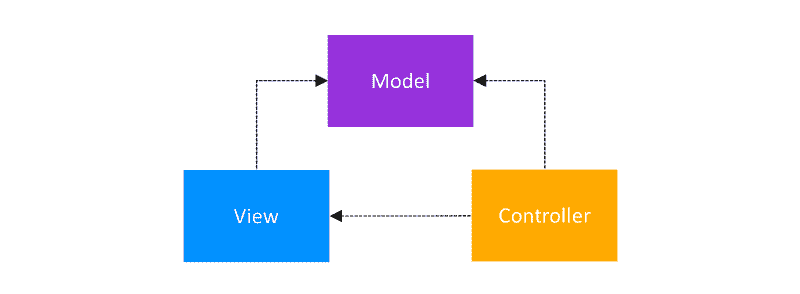
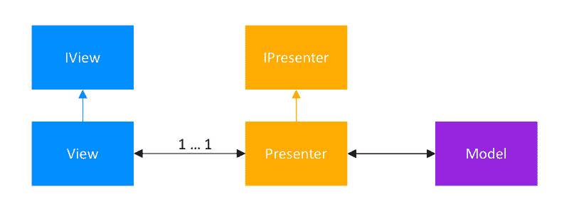
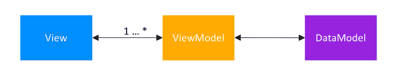
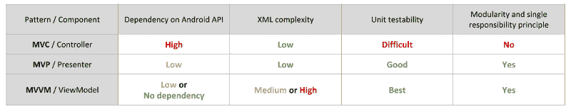
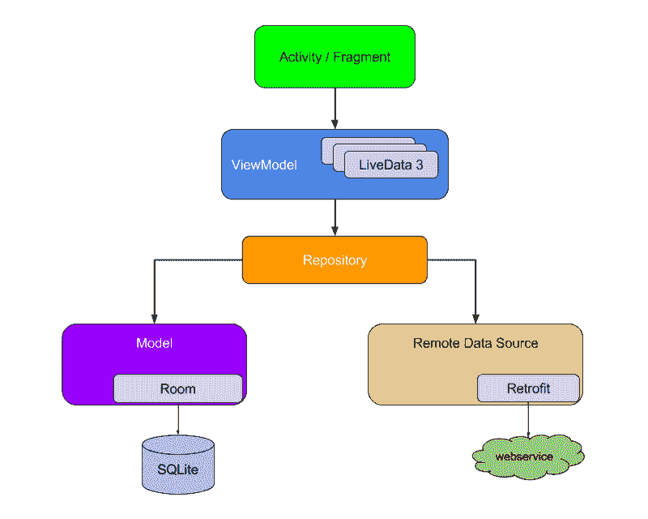
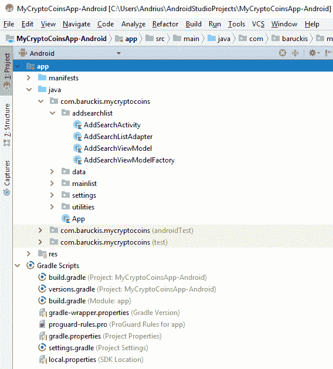
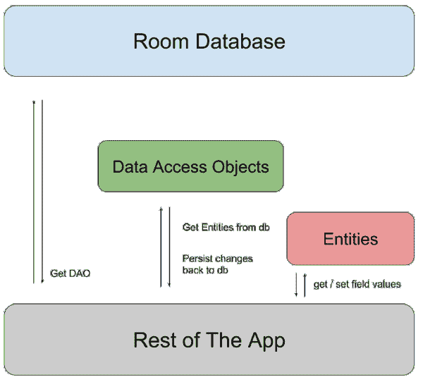
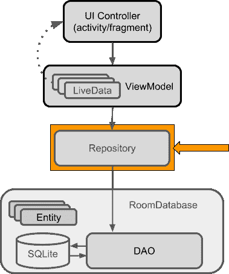

# 关于架构的一切:探索不同的架构模式以及如何在你的应用中使用它们

> 原文：<https://www.freecodecamp.org/news/kriptofolio-app-series-part-3/>

#### Kriptofolio app series - Part 3

当开始构建一个新的应用程序时，最重要的是架构。你可能犯的最大的错误就是完全没有建筑风格。

最近几年，Android 社区对架构选择的话题颇有争议。甚至谷歌也决定参与进来。2017 年，他们通过发布 Android 架构组件，提出了自己的标准化架构方法。它旨在让开发人员的生活更轻松。

在这篇文章中，我将首先讨论为什么我们需要设计我们的应用程序。我们将介绍我们有哪些选择。然后我们将学习如何做到这一点。我们将使用 Android 团队提供的指南，而不是重新发明轮子。

这篇文章对我来说是最难写的，因为我自己缺乏这方面的知识。首先，我必须很好地研究建筑这个主题，才能看到更大的图景。现在我准备与你分享我的发现。

### 系列内容

*   [简介:2018–2019 年打造现代 Android 应用的路线图](https://www.freecodecamp.org/news/kriptofolio-app-series)
*   [第一部分:固体原理介绍](https://www.freecodecamp.org/news/kriptofolio-app-series-part-1)
*   第 2 部分:如何开始构建你的 Android 应用:创建模型、UI 和 XML 布局
*   第 3 部分:关于架构的一切:探索不同的架构模式以及如何在你的应用程序中使用它们(你在这里)
*   [第四部分:如何用 Dagger 2](https://www.freecodecamp.org/news/kriptofolio-app-series-part-4) 在你的应用中实现依赖注入
*   [第 5 部分:使用 refuge、OkHttp、Gson、Glide 和协程处理 RESTful Web 服务](https://www.freecodecamp.org/news/kriptofolio-app-series-part-5)

### 为什么要关心 app 架构？

通常，当你开始使用 Android 时，你最终会以活动或片段的形式编写大部分核心业务逻辑。所有新的 Android 开发者都会遇到这种情况，包括我自己。所有的简短教程和示例都建议这样做。实际上，对于为解释而创建的小应用程序来说，这已经足够好了。

然而，试着在一个真实的应用程序上这样做，它会根据用户的需求不断变化，并以新的功能扩展它。很快你就会看到你的编码体验越来越痛苦。一切都变得像活动或者片段一样被所谓的“神类”管理。这些代码行太多了，你很容易迷失方向。

基本上你所有的代码开始看起来像意大利面条，所有的东西都混在一起了。所有的部分都相互依赖。然后，当业务需要新的变更时，您别无选择，只能重新构建整个项目。这也是架构问题开始出现的地方。

### 有没有更好的方法来组织你的代码？

当然有！高质量代码的关键是遵循坚实的原则。我在之前的帖子中谈到了这一点(并非没有原因)。您还应该应用一些架构模式来分离关注点。事实上，关注点分离应该是你的最终目标。这是表明代码质量的最重要的一点。应用程序架构有相当多的模式。最著名的是经典的三层架构，例如:

*   MVC:模型-视图-控制器
*   MVP:模型-视图-演示者
*   MVVM:模型-视图-视图模型

所有这些模式都代表了主要的相似思想——以不同通用层分离的方式构建项目代码。每一层都有自己的责任。这就是你的项目变得模块化的原因:分离的代码部分更易测试，你的应用足够灵活，可以持续变化。

如果我们单独讨论每一种模式，这个话题就变得太宽泛了。我将只向您介绍每一个，这样您就可以了解主要的区别。

### 模型-视图-控制器(MVC)模式

这种模式是 Android 应用架构在过去的第一次迭代。它建议您将代码分成 3 个不同的层:

模型—数据层。负责处理业务逻辑以及与网络层和数据库层的通信。

视图—用户界面(UI)层。这是模型数据的简单可视化。

控制器——逻辑层，得到用户行为的通知，并根据需要更新模型。



这是 MVC 模式。我们可以看到控制器和视图都依赖于模型。控制器更新数据。视图获取数据。然而，模型是分离的，可以独立于 UI 进行测试。

有几种方法可以应用 MVC 模式。挺混乱的。

一个是当活动和片段像控制器一样工作时。他们负责处理数据和更新视图。这种架构方法的问题是，活动和片段会变得非常大，很难测试。

另一种看起来更符合逻辑(也更正确)的方法是，活动和片段应该是 MVC 世界中的视图。控制器应该是独立的类，不扩展或使用任何 Android 类。模特也一样。

无论如何，如果你对 MVC 研究得更多，你会发现当应用于 Android 项目时，即使代码层以正确的方式相互依赖。这就是为什么我不建议你在下一个 Android 应用中使用它。

### 模型-视图-演示者(MVP)模式

在第一种方法失败后，Android 开发人员继续前进，尝试使用最流行的架构模式之一——MVP。这个模式代表了架构选择的第二次迭代。这种模式被广泛使用，并且仍然是推荐的模式。对于任何开始 Android 开发的人来说，这很容易学会。让我们看一下它的 3 个独立层角色:

模型——数据层，与 MVC 模式相同。负责处理业务逻辑以及与网络层和数据库层的通信。

视图—用户界面(UI)层。显示数据并通知演示者用户操作。

Presenter 从模型中检索数据，应用 UI 逻辑并管理视图的状态，决定显示什么，并对视图中的用户输入通知做出反应。这本质上是 MVC 中的控制器，除了它根本不依赖于视图，只是一个接口。



MVP 模式表明视图和演示者密切相关。他们需要相互参照。它们的关系在一个`Contract`接口类中定义。

这种模式有一个明显但可控的缺点。如果你不够小心，没有根据单一责任原则破坏你的代码，那么演示者往往会扩展到一个巨大的无所不知的类。然而，一般来说，MVP 模式提供了一个非常好的关注点分离。这可能是你项目的主要选择。

### 模型-视图-视图模型(MVVM)模式

MVVM 模式是该方法的第三次迭代。随着 Android 架构组件的发布，它成为了 Android 团队推荐的架构模式。这就是为什么我们将重点学习这个模式。此外，我将用于“我的加密硬币”应用程序。和以前一样，让我们看看它的独立代码层:

模型—抽象数据源。ViewModel 使用模型来获取和保存数据。

视图——通知视图模型用户的操作。

ViewModel —显示与视图相关的数据流。

与 MVP 模式的区别在于，在 MVVM 中，ViewModel 不像 Presenter 那样保存对视图的引用。在 MVVM 中，ViewModel 公开了各种视图可以绑定到的事件流。另一方面，在 MVP 的情况下，演示者直接告诉视图要显示什么。让我们来看看 MVVM 模式:



在 MVVM，视图引用了 ViewModel。ViewModel 没有关于视图的信息。视图和视图模型之间是多对一的关系。

#### MVC vs MVP vs MVVM 的比较

这张表格总结了我谈到的所有模式:



正如你可能已经注意到的，在构建模块化和可测试的现代应用程序时，MVC 与 MVP 和 MVVM 相比并不那么好。但是每种模式都有自己的优点和缺点。如果它完全符合你的需要，这是一个很好的选择。我建议你研究和学习更多关于这些模式的知识，因为这是值得的。

与此同时，我将在 2018 年继续我的趋势模式项目，这也是由谷歌-MVVM 推动的。

### Android 架构组件

如果你熟悉 Android 应用程序的生命周期，你就会知道构建一个应用程序来避免所有的数据流问题以及通常在配置更改期间出现的持久性和稳定性问题是多么令人头疼。

2017 年，Android 团队认为我们已经努力够了。他们承担了责任，并引入了 Android 架构组件框架。这最终让您可以解决所有这些问题，而不会使代码变得复杂，甚至不会对代码进行修改。

Android Architecture Components 是一个库集合，可以帮助您设计健壮、可测试和可维护的应用程序。在我写这篇博文的时候，它由以下几个部分组成:

*   [数据绑定](https://developer.android.com/topic/libraries/data-binding) —声明性地将可观察数据绑定到 UI 元素
*   [生命周期](https://developer.android.com/topic/libraries/architecture/lifecycle) —管理您的活动并分割生命周期
*   [LiveData](https://developer.android.com/topic/libraries/architecture/livedata) —当底层数据库发生变化时通知视图
*   [导航](https://developer.android.com/topic/libraries/architecture/navigation) —处理应用内导航所需的一切
*   [分页](https://developer.android.com/topic/libraries/architecture/paging) —逐渐按需从数据源加载信息
*   [房间](https://developer.android.com/topic/libraries/architecture/room) —流畅的 SQLite 数据库访问
*   [ViewModel](https://developer.android.com/topic/libraries/architecture/viewmodel) —以生命周期意识的方式管理 UI 相关数据
*   [工作管理器](https://developer.android.com/topic/libraries/architecture/workmanager) —管理您的 Android 后台作业

在 Android 架构组件的帮助下，我们将按照下图在我的加密硬币应用程序中实现 MVVM 架构模式:



这是谷歌推荐的架构。它展示了所有模块应该如何相互作用。接下来，我们将只讨论我们将在项目中使用的特定 Android 架构组件。

### 组织您的源文件

在开始开发之前，我们应该考虑如何组织项目的源文件。我们不能对这个问题置之不理，因为以后我们会有一个难以理解和修改的混乱结构。

有几种方法可以做这件事。一种是按组件类别组织。例如，所有活动都转到它们自己的文件夹，所有适配器都转到它们自己的文件夹，依此类推。

另一种方法是根据应用程序的特性来组织一切。例如，在所有加密货币列表中搜索和添加加密功能会进入其自己的`addsearchlist`文件夹。主要的想法是，你需要以某种特定的方式来做这件事，而不是把所有的东西都随意放置。我把这两者混合使用。



My Crypto Coins app folder structure

除了项目的文件夹结构，您还应该考虑应用一些规则来命名项目文件。例如，在命名 Android 类时，你应该在名字中清楚地定义类的用途。

### 视图模型

为了开始我们的应用程序架构开发，首先我们要创建 ViewModel。视图模型是为 UI 组件提供数据并在配置更改后继续存在的对象。

您可以使用 ViewModel 在活动或片段的整个生命周期中保留数据。活动和片段是短命的对象。当用户与应用程序交互时，它们会被频繁地创建和销毁。ViewModel 也更适合管理与网络通信相关的任务，以及数据操作和持久性。

例如，现在让我们为`MainListFragment`创建一个视图模型，将 UI 数据从中分离出来。

```
class MainViewModel : ViewModel() {
    ...
}
```

然后用单行代码获得视图模型。

```
class MainListFragment : Fragment() {
    ...
    private lateinit var viewModel: MainViewModel
    ...
    override fun onActivityCreated(savedInstanceState: Bundle?) {

        super.onActivityCreated(savedInstanceState)

        setupList()

        // Obtain ViewModel from ViewModelProviders, using this fragment as LifecycleOwner.
        viewModel = ViewModelProviders.of(this).get(MainViewModel::class.java)
        ...
    }
    ...
}
```

基本就这些了，恭喜！？我们继续吧。

### 生命资料

LiveData 是一个可观察的数据持有者类。它遵循[观察者模式](https://en.wikipedia.org/wiki/Observer_pattern)。LiveData 具有生命周期意识。这意味着它只更新应用程序组件(活动、片段等)。)处于活动生命周期状态的观察者。

LiveData 类返回数据的最新值。当数据改变时，它返回更新的值。LiveData 最适合 ViewModel。

我们将像这样使用 LiveData 和 ViewModel:

```
...
class MainViewModel : ViewModel() {

    private val liveData = MutableLiveData<ArrayList<Cryptocurrency>>()
    val data: LiveData<ArrayList<Cryptocurrency>>
        get() = liveData

    init {
        val tempData = ArrayList<Cryptocurrency>()

        val btc:Cryptocurrency = Cryptocurrency("Bitcoin", 1, 0.56822348, "BTC", 8328.77, 4732.60, 0.19, -10.60, 0.44, 20.82)
        val eth:Cryptocurrency = Cryptocurrency("Etherium", 2, 6.0, "ETH", 702.99, 4217.94, 0.13, -7.38, 0.79, 33.32)

        tempData.add(btc)
        tempData.add(eth)

        liveData.value = tempData
    }
}
```

观察 ViewModel 上的数据，显示为 LiveData:

```
...
class MainListFragment : Fragment() {

    private lateinit var recyclerView: RecyclerView
    private lateinit var recyclerAdapter: MainRecyclerViewAdapter

    private lateinit var viewModel: MainViewModel

    ...

    override fun onActivityCreated(savedInstanceState: Bundle?) {

        super.onActivityCreated(savedInstanceState)

        setupList()

        // Obtain ViewModel from ViewModelProviders, using this fragment as LifecycleOwner.
        viewModel = ViewModelProviders.of(this).get(MainViewModel::class.java)

        // Observe data on the ViewModel, exposed as a LiveData
        viewModel.data.observe(this, Observer { data ->
            // Set the data exposed by the LiveData
            if (data != null) {
                recyclerAdapter.setData(data)
            }
        })
    }
    ...
}
```

在历史[的这一点浏览存储库。](https://github.com/baruckis/MyCryptoCoinsApp-Android/tree/622cf980c4fb68efab546eeddf31c4bf5aee7ba1)

### 数据绑定

创建数据绑定库是为了删除连接 XML 布局所需的样板代码。

要在 Kotlin 项目中使用数据绑定，您需要用 kapt 编译器插件打开对注释处理器的支持。还要将数据绑定块添加到 Android 配置梯度文件中:

```
...
apply plugin: 'kotlin-kapt'

android {
    ...
    dataBinding {
        enabled = true
    }
}
...
```

要使用数据绑定生成类，我们需要将所有视图代码放在`<layo` ut >标签中。数据绑定最强大的概念是，我们可以将一些数据类绑定到 xml 布局，并将项目属性直接绑定到字段。

```
<layout xmlns:app="http://schemas.android.com/apk/res-auto"
    xmlns:tools="http://schemas.android.com/tools">

    <data>

        <variable
            name="cryptocurrency"
            type="com.baruckis.mycryptocoins.data.Cryptocurrency" />
    </data>

    ...      

            <android.support.v7.widget.AppCompatTextView
                android:id="@+id/item_name"
                style="@style/MainListItemPrimeText"
                android:layout_marginEnd="@dimen/main_cardview_list_item_text_between_margin"
                android:layout_marginStart="@dimen/main_cardview_list_item_inner_margin"
                android:text="@{cryptocurrency.name}"
                android:textAlignment="viewStart"
                app:layout_constraintBottom_toTopOf="@+id/item_amount_symbol"
                app:layout_constraintEnd_toStartOf="@+id/guideline1_percent"
                app:layout_constraintStart_toEndOf="@+id/item_image_icon"
                app:layout_constraintTop_toTopOf="parent"
                app:layout_constraintVertical_chainStyle="spread"
                tools:text="@string/sample_text_item_name" />

     ...
</layout>
```

具有数据绑定的 RecyclerView 适配器如下所示:

```
class MainRecyclerViewAdapter() : RecyclerView.Adapter<MainRecyclerViewAdapter.BindingViewHolder>() {

    private lateinit var dataList: ArrayList<Cryptocurrency>

    fun setData(newDataList: ArrayList<Cryptocurrency>) {
        dataList = newDataList
    }

    override fun onCreateViewHolder(parent: ViewGroup, viewType: Int): BindingViewHolder {
        val inflater = LayoutInflater.from(parent.context)
        val binding = FragmentMainListItemBinding.inflate(inflater, parent, false)

        return BindingViewHolder(binding)
    }

    override fun onBindViewHolder(holder: BindingViewHolder, position: Int) = holder.bind(dataList[position])

    override fun getItemCount(): Int = dataList.size

    ...

    inner class BindingViewHolder(var binding: FragmentMainListItemBinding) : RecyclerView.ViewHolder(binding.root) {
        fun bind(cryptocurrency: Cryptocurrency) {
            binding.cryptocurrency = cryptocurrency

            binding.itemRanking.text = String.format("${cryptocurrency.rank}")
            ...
            binding.executePendingBindings()
        }
    }
}
```

终于不再写作`findViewById`？在历史的这个点浏览存储库[这里](https://github.com/baruckis/Kriptofolio/tree/05a05e0cbc1cac0aefc7a0030fd77779da213214)。

### 房间

我们的应用程序需要存储用户持有的不同加密货币的持久数据。这应该存储在本地数据库中，该数据库是秘密保存在 Android 设备中的。

为了在私有数据库中存储结构化数据，我们将使用 SQLite 数据库。这往往是最好的选择。

为了给我们的应用程序创建 SQLite 数据库，我们将使用 Room。Room 是 Android 团队开发的一个持久性库，它是 SQLite 之上的一个包装器。它是一个抽象层，去除了许多与 SQLite 交互所需的样板代码。它还增加了对 SQL 查询的编译时检查。

最好把它看作是一个 ORM(对象关系映射器)工具，它被设计用来自动生成粘合代码，以便在对象实例和数据库中的行之间进行映射。

房间内基本上有 3 个主要组件:

1.  实体—该组件表示保存数据库行的类。对于每个实体，创建一个数据库表来保存这些项目。
2.  DAO(数据访问对象)——负责定义访问数据库的方法的主要组件。
3.  数据库—一个组件，它是一个 holder 类，使用注释来定义实体列表、Dao 列表和数据库版本，并作为底层连接的主要访问点。



让我们按照这些简单的步骤在我的加密硬币应用程序中设置房间:

1.  创建一个实体。

```
@Entity
data class Cryptocurrency(val name: String,
                          val rank: Short,
                          val amount: Double,
                          @PrimaryKey
                          val symbol: String,
                          val price: Double,
                          val amountFiat: Double,
                          val pricePercentChange1h: Double,
                          val pricePercentChange7d: Double,
                          val pricePercentChange24h: Double,
                          val amountFiatChange24h: Double)
```

添加一些额外的信息来告诉 Room 它在数据库中的结构。

2.创造道。

```
@Dao
interface MyCryptocurrencyDao {

    @Query("SELECT * FROM Cryptocurrency")
    fun getMyCryptocurrencyLiveDataList(): LiveData<List<Cryptocurrency>>

    @Insert
    fun insertDataToMyCryptocurrencyList(data: List<Cryptocurrency>)
}
```

首先，我们将创建一个 DAO，它只允许我们从用 Entity 创建的表中检索记录，并插入一些样本数据。

3.创建和设置数据库。

很重要的一点是，理想情况下，每个会话只构建一次数据库实例。实现这一点的一个方法是使用单例模式。

```
@Database(entities = [Cryptocurrency::class], version = 1, exportSchema = false)
abstract class AppDatabase : RoomDatabase() {

    abstract fun myCryptocurrencyDao(): MyCryptocurrencyDao

    // The AppDatabase a singleton to prevent having multiple instances of the database opened at the same time.
    companion object {

        // Marks the JVM backing field of the annotated property as volatile, meaning that writes to this field are immediately made visible to other threads.
        @Volatile
        private var instance: AppDatabase? = null

        // For Singleton instantiation.
        fun getInstance(context: Context): AppDatabase {
            return instance ?: synchronized(this) {
                instance ?: buildDatabase(context).also { instance = it }
            }
        }

        // Creates and pre-populates the database.
        private fun buildDatabase(context: Context): AppDatabase {
            return Room.databaseBuilder(context, AppDatabase::class.java, DATABASE_NAME)
                    // Prepopulate the database after onCreate was called.
                    .addCallback(object : Callback() {
                        override fun onCreate(db: SupportSQLiteDatabase) {
                            super.onCreate(db)
                            // Insert the data on the IO Thread.
                            ioThread {
                                getInstance(context).myCryptocurrencyDao().insertDataToMyCryptocurrencyList(PREPOPULATE_DATA)
                            }
                        }
                    })
                    .build()
        }

        // Sample data.
        val btc: Cryptocurrency = Cryptocurrency("Bitcoin", 1, 0.56822348, "BTC", 8328.77, 4732.60, 0.19, -10.60, 0.44, 20.82)
        val eth: Cryptocurrency = Cryptocurrency("Etherium", 2, 6.0, "ETH", 702.99, 4217.94, 0.13, -7.38, 0.79, 33.32)

        val PREPOPULATE_DATA = listOf(btc, eth)

    }

}
```

```
private val IO_EXECUTOR = Executors.newSingleThreadExecutor()

// Utility method to run blocks on a dedicated background thread, used for io/database work.
fun ioThread(f : () -> Unit) {
    IO_EXECUTOR.execute(f)
}
```

正如您在第一次运行时所看到的，数据库将被预先填充一些样本数据，只是为了进行测试。

4.**额外的步骤。**创建存储库。

存储库不是架构组件库的一部分。这是代码分离和架构的建议最佳实践。



它代表了所有应用数据的单一来源，以防您必须管理多个数据源。

```
class MyCryptocurrencyRepository private constructor(
        private val myCryptocurrencyDao: MyCryptocurrencyDao
) {

    fun getMyCryptocurrencyLiveDataList(): LiveData<List<Cryptocurrency>> {
        return myCryptocurrencyDao.getMyCryptocurrencyLiveDataList()
    }

    companion object {

        // Marks the JVM backing field of the annotated property as volatile, meaning that writes to this field are immediately made visible to other threads.
        @Volatile
        private var instance: MyCryptocurrencyRepository? = null

        // For Singleton instantiation.
        fun getInstance(myCryptocurrencyDao: MyCryptocurrencyDao) =
                instance ?: synchronized(this) {
                    instance
                            ?: MyCryptocurrencyRepository(myCryptocurrencyDao).also { instance = it }
                }
    }
}
```

我们将在视图模型中使用这个存储库。

```
class MainViewModel(myCryptocurrencyRepository: MyCryptocurrencyRepository) : ViewModel() {

    val liveData = myCryptocurrencyRepository.getMyCryptocurrencyLiveDataList()
}
```

我们的片段代码也在进化。

```
class MainListFragment : Fragment() {

    ...

    private lateinit var viewModel: MainViewModel

    ...

    override fun onActivityCreated(savedInstanceState: Bundle?) {

        super.onActivityCreated(savedInstanceState)

        setupList()
        subscribeUi()
    }

    ...

    private fun subscribeUi() {

        val factory = InjectorUtils.provideMainViewModelFactory(requireContext())
        // Obtain ViewModel from ViewModelProviders, using this fragment as LifecycleOwner.
        viewModel = ViewModelProviders.of(this, factory).get(MainViewModel::class.java)

        // Update the list when the data changes by observing data on the ViewModel, exposed as a LiveData.
        viewModel.liveData.observe(this, Observer<List<Cryptocurrency>> { data ->
            if (data != null && data.isNotEmpty()) {
                emptyListView.visibility = View.GONE
                recyclerView.visibility = View.VISIBLE
                recyclerAdapter.setData(data)
            } else {
                recyclerView.visibility = View.GONE
                emptyListView.visibility = View.VISIBLE
            }
        })

    }

}
```

因为我们的 ViewModel 类现在有一个不再为空的构造函数，所以我们需要实现一个提供者工厂模式。这将作为第二个参数传递给`ViewModelProviders.of()`方法。

```
object InjectorUtils {

    fun provideMainViewModelFactory(
            context: Context
    ): MainViewModelFactory {
        val repository = getMyCryptocurrencyRepository(context)
        return MainViewModelFactory(repository)
    }

    private fun getMyCryptocurrencyRepository(context: Context): MyCryptocurrencyRepository {
        return MyCryptocurrencyRepository.getInstance(
                AppDatabase.getInstance(context).myCryptocurrencyDao())
    }
}
```

```
class MainViewModelFactory(private val repository: MyCryptocurrencyRepository) : ViewModelProvider.NewInstanceFactory() {

    override fun <T : ViewModel?> create(modelClass: Class<T>): T {
        return MainViewModel(repository) as T
    }
}
```

在历史[的这一点浏览存储库。](https://github.com/baruckis/Kriptofolio/tree/b555fd9e2319bd4580122036d71066860fa82589)

### 最后的想法

我们在这一部分中讨论的设计架构应该被用作明智的指导方针，而不是硬性规定。我不想在每个话题上做太多的细节。通过 Android 架构组件，我们了解了编码过程。请记住，每个组件都有更多需要学习的内容，我建议您这样做。

让我们总结一下我们已经取得的成就:

*   在我的加密硬币应用程序中，每个单独的屏幕都有自己的视图模型。这将不受任何配置更改的影响，并保护用户免受任何数据丢失。
*   这款应用的用户界面是反应式的。这意味着当数据在后端发生变化时，它会立即更新。这是在 LiveData 的帮助下完成的。
*   我们的项目有更少的代码，因为我们使用数据绑定直接绑定到代码中的变量。
*   最后，我们的应用程序将用户数据作为 SQLite 数据库存储在本地设备中。该数据库是用 Room 组件方便地创建的。该应用程序的代码由功能构成，所有项目架构都是 MVVM——Android 团队推荐的模式。

### 贮藏室ˌ仓库

现在，正如你看到的“Kriptofolio”(以前是“我的加密硬币”)应用程序真的开始成形了。对于第 3 部分的最新存储库提交，您会发现它很好地向用户显示了预先填充的数据库数据，并正确计算了总持有量投资组合的价值。

#### [在 GitHub 上查看源代码](https://github.com/baruckis/Kriptofolio/tree/Part-3)

* * *

***aěIū！感谢阅读！我最初于 2018 年 8 月 22 日为我的个人博客 www.baruckis.com[发表了这篇文章。](https://www.baruckis.com/android/kriptofolio-app-series-part-3/)***