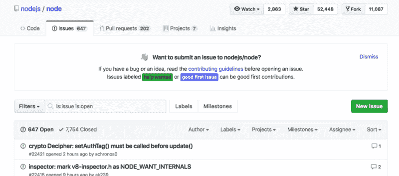

# 为开源做贡献并不难:我为 Node.js 项目做贡献的旅程

> 原文：<https://www.freecodecamp.org/news/contributing-to-open-source-is-not-hard-here-is-my-journey-to-contributing-to-nodejs-d10760e31194/>

作为开发者，你应该考虑为开源软件做贡献。你的许多潜在雇主会看好这些贡献。

但是当你是一个新的开发者时，你可能会觉得为开源做贡献超出了你当前的技能范围。所以我将向你展示如何忽略那些怀疑的感觉，以及如何从现在开始为开源做贡献。

### 我是如何学习 Node.js 的

我第一次了解 Node.js 是在我的编码训练营。训练营专攻 JavaScript。Node.js 为用 JavaScript 编写的项目提供了后端。所以如果你在前端学过 JavaScript，那么用 Node.js 就可以很容易的把技能转移到后端。

一旦我从我的编码训练营毕业，我就有动力尽快提高我的编码技能。做到这一点的唯一方法是尽可能多地编写代码，这样我就可以改进。那时我加入了 freeCodeCamp。

在六个月的时间里，我完成了 freeCodeCamp 课程中所有四个原始认证。当我到了专注于构建项目的部分时，我在后端使用了 JavaScript 和 Node.js。在完成所有认证后，我参与了 freeCodeCamp 最初的一个非盈利项目。该项目是针对针对妇女的犯罪。

### 为开源做贡献

我和丹尼·利宾合作的非营利项目可以在这里找到。丹尼和我都是新开发人员。丹尼是一名药剂师，他决定兼职学习编程。我们都运用了新获得的编程技能来创建这个项目。freeCodeCamp 已经将我们的原始代码转换成一个开源项目，叫做[永久会议](https://github.com/freeCodeCamp/meeting-for-good)。

任何人都可以对这个开源代码做出贡献。记得两个初级开发人员编写了初始代码。所以，即使你认为自己是初级开发人员，你也和我们有同样的技能水平。好消息是，除了这个，freeCodeCamp 还有其他开源代码，你也可以贡献出来。[查看他们的 GitHub repo](https://github.com/freeCodeCamp) 找到一个开源项目。freeCodeCamp 也有一个关于开源的优秀的[指南。](https://github.com/freeCodeCamp/how-to-contribute-to-open-source)

要贡献任何开源代码，请访问他们在 GitHub 上的 repo。代码将有一个标签为“问题”的选项卡这些是人们在代码中发现的问题。它们也可以是代码维护者想要添加的新特性。你可以回顾所有这些问题，找到一些你可以贡献的东西。

大多数开源软件都有一个名为“贡献”的文件。MD”。这份文件将准确地解释你如何能做出贡献。阅读说明并严格遵守。

### 贡献于 Node.js

我的日常工作是 JavaScript 开发人员。自从我学会编码以来，我的每一份工作都在后端使用 Node.js。我已经为亚特兰大的女性程序员讲授了几个关于 Node.js、Express.js 和 MongoDB 的三小时研讨会。因为我已经熟悉了 Node.js，所以我开始对贡献它的源代码感兴趣。

你可以在 GitHub 上查看任何回购的“贡献者”,了解谁在贡献源代码。由此，我了解到弗兰齐斯卡·辛克曼和 T2 是核心贡献者。我给他们发了邮件，询问如何参与 Node.js 的工作。

迈尔斯提到他们将启动一个导师项目。在导师计划宣布之前，他给了我一个直接链接，让我注册。我可能是第一个报名的人。

弗兰齐斯卡回复了我的邮件。她愿意和我一起完成我的第一份稿件。由于我们的日程安排，我们直到几周后才能安排一次会面。在预定的日期和时间，我们通过 Google Hangouts 聚在一起。Franziska 向我展示了如何查看“问题”并找到被标记为“好的第一期”的问题

Click on “good first issue” to find issues you can contribute to

弗兰齐斯卡和我发现了一个简单的问题。她解释了导致问题的原因。我们需要从提出问题的人那里获得更多信息。从那里，我向那个人寻求所需的信息。一旦我得到它，我就能够解决这个问题。然后我可以提交一个请求来解决这个问题。这是我对 Node.js 的第一个开源贡献。

### Node.js 导师计划

Node.js 委员会正在寻找更多的人来贡献 Node.js 源代码。目前，有超过 600 个问题正等待着有人为他们做出贡献。为了让更多的人参与进来，Node.js 委员会已经启动了 Node.js 导师计划。

这个项目对任何对开源软件感兴趣的人开放。这个项目对任何人开放，不管他们目前的技能水平如何。欢迎初级和高级开发人员。

目前，该程序处于测试阶段。他们选择了四个人作为 Beta 计划的第一批学员。幸运的是，我是被选中的四个人之一。我被选中是因为我在 Franziska 的帮助下做出了贡献。

节目上线后，将持续六个月。在此期间，一组学员将与一名导师配对。导师将向他们展示如何为 Node.js 做出贡献。学员将应用他们所学的知识，并为源代码做出贡献。六个月后，这个班将毕业。然后，学员将有资格成为下一堂课的导师，与他们自己的学员一起工作。

如果你有兴趣加入导师计划，[你可以在这里报名](https://github.com/nodejs/mentorship)。

我正在制作一系列视频，详细介绍我使用 Node.js 导师计划测试版的经历。我有展示我的贡献的视频，以及我与导师所有会面的录音。你可以在这里观看它们。我还记下了我在这个项目中的经历，你[可以在这里](https://github.com/nodejs/mentorship/issues/87)看到。

#### 更多文章

以下是我写的一些你可能会感兴趣的文章:

[**使用 Node.js & Express.js 将数据保存到 MongoDB 数据库**](https://codeburst.io/hitchhikers-guide-to-back-end-development-with-examples-3f97c70e0073)
[*MEAN stack 用于描述使用 MongoDB、Express.js、Angular.jS 和 Node.js 的开发在本教程中我…* codeburst.io](https://codeburst.io/hitchhikers-guide-to-back-end-development-with-examples-3f97c70e0073) [**如何在 Node.js 应用程序中使用 EJS 模板**](https://medium.freecodecamp.org/how-to-use-ejs-templating-in-a-node-js-application-ea9347a96c65)
[*EJS，内嵌 javascript，是一个模板 EJS 将数据和模板结合起来生成 HTML。最……*medium.freecodecamp.org](https://medium.freecodecamp.org/how-to-use-ejs-templating-in-a-node-js-application-ea9347a96c65)[**从 Node.js 保存数据到 MongoDB 数据库应用教程**](https://medium.com/@ratracegrad/saving-data-to-mongodb-database-from-node-js-application-tutorial-8e8c1b4a3cec)
[medium.com](https://medium.com/@ratracegrad/saving-data-to-mongodb-database-from-node-js-application-tutorial-8e8c1b4a3cec)