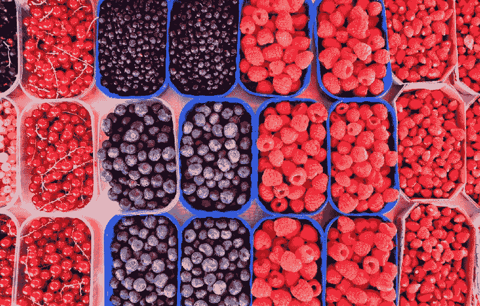
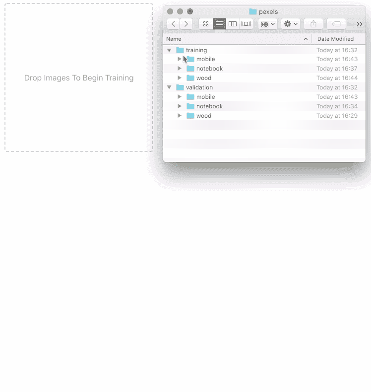
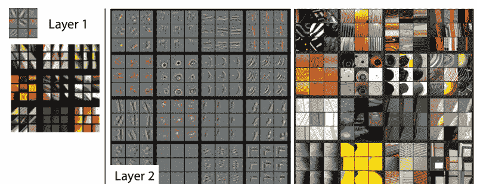
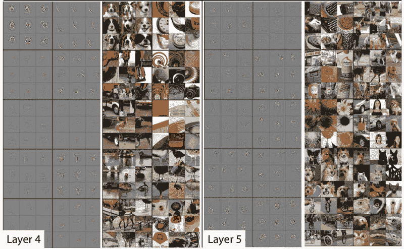
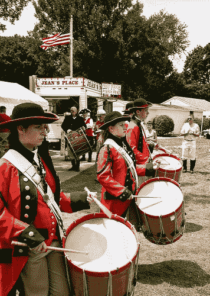
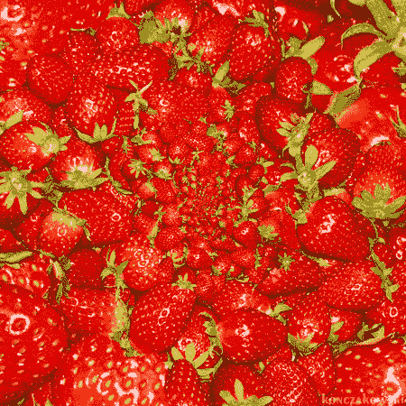

# 用 JavaScript 实现浏览器中的图像分类

> 原文：<https://www.freecodecamp.org/news/image-classification-in-the-browser-with-javascript-bec7b5a7a8c3/>

作者:凯文·斯科特

# 用 JavaScript 实现浏览器中的图像分类



Photo by [Alex Block](https://unsplash.com/photos/vWI1kTcMcDI?utm_source=unsplash&utm_medium=referral&utm_content=creditCopyText) on [Unsplash](https://unsplash.com)

机器学习以要求大量数据和强大的 GPU 计算而闻名。这导致许多人认为，如果没有大量的时间和资源投入，为他们的特定数据集构建定制的机器学习模型是不切实际的。事实上，你可以利用网络上的迁移学习，在不到一分钟的时间内，用几幅带标签的图像训练出一个准确的图像分类器。

### 图像分类有什么用？

教导机器对图像进行分类具有广泛的实际应用。您可能已经在您的照片应用程序中看到了图像分类，它会自动建议朋友或位置进行标记。图像分类可以用来[识别癌细胞](https://www.kaggle.com/c/data-science-bowl-2017)，[识别卫星图像中的船只](https://www.kaggle.com/c/airbus-ship-detection)，或者[自动分类 Yelp 上的图像](https://www.kaggle.com/c/yelp-restaurant-photo-classification)。它甚至可以用于图像领域之外，分析用户活动的热图以发现潜在的欺诈行为，或音频波的傅立叶变换。

我最近[发布了一个开源工具](https://github.com/thekevinscott/ml-classifier)，可以在你的浏览器中快速训练图像分类模型。它是这样工作的:



[https://thekevinscott.github.io/ml-classifier-ui/](https://thekevinscott.github.io/ml-classifier-ui/)

[此处嵌入的](http://thekevinscott.github.io/ml-classifier-ui/)是您可以使用的工具的现场演示。[我在这里整理了一个测试数据集](https://github.com/thekevinscott/dataset-tutorial-for-image-classification/data%3CPaste%3E)(或者随意构建自己的数据集)。我从 pexels.com【手机】、“木头”和“笔记本】三个最流行的搜索中下载了 10 张图片。

将 **train** 文件夹拖到拖放区，一旦模型训练完毕，上传 **validation** 文件夹，看看你的模型对小说图像的分类有多好。

#### 这是如何工作的？

迁移学习是一种特殊的调料，它可以在很短的时间内在你的浏览器中训练出极其精确的模型。模型在大型数据集上进行训练，并保存为预训练模型。这些预训练模型的最终层可以根据您的具体用例进行调整。

这在计算机视觉领域尤其有效，因为图像的许多特征都是可概括的。罗布·弗格斯和马修·泽勒[在他们的论文](https://arxiv.org/abs/1311.2901)中展示了在他们模型的早期阶段学到的特征:



Low Level Features

该模型开始识别通用特征，包括适用于任何图像集的线条、圆形和形状。经过几层之后，它能够识别更复杂的形状，如边缘和文字:



Higher Level Features

绝大多数图像都有一些共同的特征，如线条和圆形。许多都有更高级的特征，比如“眼睛”或“鼻子”。这允许您重复使用已经完成的现有训练，并仅调整特定数据集的最后几个图层，这比从头开始训练速度更快且需要的数据更少。

数据要少多少？**取决于**。您的数据与预先训练好的模型有多不同，数据有多复杂或可变，以及其他因素都会影响您的准确性。有了上面的例子，我得到了 30 个图像 100%的准确率。对于像狗和猫这样的东西，仅仅几个图像就足以获得好的结果。[阿德里安·G 在他的博客](https://medium.com/@bingobee01/how-much-data-to-you-need-ba834d074f3a)上进行了更为严谨的分析。

所以，这取决于你的数据集，但可能比你想象的要少。

### 给我看看代码！

接下来，我们将看看如何在 JavaScript 中导入和调优预训练模型。我们将调优 [MobileNet](https://github.com/tensorflow/models/blob/master/research/slim/nets/mobilenet_v1.md) ，一个由 Google 生产的预训练模型。

> MobileNets 是由谷歌的研究人员设计的一类卷积神经网络。它们被称为“移动优先”,因为它们是从基础上设计的，是资源友好的，运行迅速，就在你的手机上。— [马特·哈维](https://hackernoon.com/creating-insanely-fast-image-classifiers-with-mobilenet-in-tensorflow-f030ce0a2991)

MobileNet 在一个名为 [ImageNet](http://www.image-net.org/) 的巨大图像语料库上接受训练，该语料库包含属于 1000 个不同类别的超过 1400 万张带标签的图像。如果你下载`mobilenet_v1_0.25_224`，你会看到一个文件结构，如下所示:

```
mobilenet_v1_0.25_224.ckpt.data-00000-of-00001mobilenet_v1_0.25_224.ckpt.indexmobilenet_v1_0.25_224.ckpt.metamobilenet_v1_0.25_224.tflitemobilenet_v1_0.25_224_eval.pbtxtmobilenet_v1_0.25_224_frozen.pbmobilenet_v1_0.25_224_info.txt
```

在`mobilenet_v1_0.25_224_eval.pbtxt`中，注意`shape`属性:

```
attr {    key: "shape"    value {      shape {        dim {          size: -1        }        dim {          size: 224        }        dim {          size: 224        }        dim {          size: 3        }      }    }  }
```

这告诉我们，这个 MobileNet 的第一层期望接收维度为`[any, 224, 224, 3]`的秩为 4 的张量。(如果你想知道张量是什么，[先看看这篇文章](https://thekevinscott.com/tensors-in-javascript/)。)

#### 导入和设置

[我已经建立了一个回购协议，包括必要的包装](https://github.com/thekevinscott/dataset-tutorial-for-image-classification)来让你开始。克隆它，并按照 readme 说明安装软件包并运行它。在`index.js`中，导入 Tensorflow.js，使用:

```
import * as tf from '@tensorflow/tfjs';
```

Tensorflow.js 提供了异步加载预训练模型的函数。我们将使用它来加载 MobileNet:

```
function loadMobilenet() {  return tf.loadModel('https://storage.googleapis.com/tfjs-models/tfjs/mobilenet_v1_0.25_224/model.json');}
```

#### 数据管道

你的机器学习模型的核心是数据。建立可靠的数据处理渠道对成功至关重要。通常，你的大部分时间会花在处理数据管道上。

> 学术界可能会感到惊讶的是，在许多机器学习系统中，只有极小一部分代码实际上在进行“机器学习”。当我们认识到一个成熟的系统可能最终(最多)是 5%的机器学习代码和(至少)95%的粘合代码时，重新实现而不是重用一个笨拙的 API 看起来是一个更好的策略。— [D .斯卡利等人](https://ai.google/research/pubs/pub43146)

您可以通过几种常见方式来查看结构化图像数据:

1.  包含图像的文件夹列表，其中文件夹名称是标签
2.  单个文件夹中的图像，图像按标签命名(`dog-1`、`dog-2`)
3.  单个文件夹中的图像，以及具有标签到文件映射的 csv 或其他文件

没有正确的方法来组织你的图片。选择对你和你的团队有意义的任何形式。这个数据集是按文件夹组织的。


我们的数据处理管道将由四部分组成:

1.  加载图像(并将其转换成张量)
2.  裁剪图像
3.  调整图像大小
4.  将张量转换成适当的输入格式

#### 1.加载图像

由于我们的机器学习模型需要[张量](https://thekevinscott.com/tensors-in-javascript/)，所以第一步是加载图像，并将其像素数据转换为张量。浏览器提供了许多方便的工具来加载图像和读取像素，Tensorflow.js 提供了将`Image`对象转换为张量的功能。(如果你在 Node，就要自己处理了)。这个函数将获取图像的一个`src` URL，加载图像，并返回一个带有 3D 形状张量`[width, height, color_channels]`的解析结果:

```
function loadImage(src) {  return new Promise((resolve, reject) => {    const img = new Image();    img.src = src;    img.onload = () => resolve(tf.fromPixels(img));    img.onerror = (err) => reject(err);  });}
```

#### 2.裁剪图像

许多分类器期望正方形图像。这不是一个严格的要求。如果您构建自己的模型，您可以指定任何想要的大小分辨率。然而，标准的 CNN 架构期望图像具有固定的大小。鉴于这种必要性，许多预先训练的模型接受正方形，以支持最广泛的各种图像比率。(正方形也为处理各种[数据增强技术](https://medium.com/ymedialabs-innovation/data-augmentation-techniques-in-cnn-using-tensorflow-371ae43d5be9)提供了灵活性)。

我们在上面确定 MobileNet 需要 224x224 的正方形图像，所以我们需要首先裁剪我们的图像。我们通过切掉长边的边缘来做到这一点:

```
function cropImage(img) {  const width = img.shape[0];  const height = img.shape[1];  // use the shorter side as the size to which we will crop  const shorterSide = Math.min(img.shape[0], img.shape[1]);  // calculate beginning and ending crop points  const startingHeight = (height - shorterSide) / 2;  const startingWidth = (width - shorterSide) / 2;  const endingHeight = startingHeight + shorterSide;  const endingWidth = startingWidth + shorterSide;  // return image data cropped to those points  return img.slice([startingWidth, startingHeight, 0], [endingWidth, endingHeight, 3]);}
```

#### 3.调整图像大小

现在我们的图像是正方形的，我们可以将它的大小调整为 224x224。这一部分很简单:Tensorflow.js 提供了现成的调整大小方法:

```
function resizeImage(image) {  return tf.image.resizeBilinear(image, [224, 224]);}
```

#### 4.平移张量

回想一下，我们的模型需要一个形状为`[any, 224, 224, 3]`的输入对象。这就是所谓的 4 阶张量。这个维度指的是训练样本的数量。如果你有 10 个训练例子，那就是`[10, 224, 224, 3]`。

我们还希望我们的像素数据是介于-1 和 1 之间的浮点数，而不是介于 0 和 255 之间的整数数据，这一过程称为规范化。虽然[神经网络通常不知道进入的数字的大小](https://stackoverflow.com/questions/4674623/why-do-we-have-to-normalize-the-input-for-an-artificial-neural-network)，但是使用较小的数字可以帮助网络训练得更快。

我们可以构建一个函数来扩展我们的张量，并将整数转换成浮点数:

```
function batchImage(image) {  // Expand our tensor to have an additional dimension, whose size is 1  const batchedImage = image.expandDims(0);  // Turn pixel data into a float between -1 and 1\.  return batchedImage.toFloat().div(tf.scalar(127)).sub(tf.scalar(1));}
```

#### 最终的管道

将上述所有函数放在一个函数中，我们得到:

```
function loadAndProcessImage(image) {  const croppedImage = cropImage(image);  const resizedImage = resizeImage(croppedImage);  const batchedImage = batchImage(resizedImage);  return batchedImage;}
```

我们现在可以使用这个函数来测试我们的数据管道是否设置正确。我们将导入一个标签已知的图像(一个鼓)，并查看预测是否与预期的标签匹配:



```
import drum from './data/pretrained-model-data/drum.jpg';loadMobilenet().then(pretrainedModel => {  loadImage(drum).then(img => {    const processedImage = loadAndProcessImage(img);    const prediction = pretrainedModel.predict(processedImage);    // Because of the way Tensorflow.js works, you must call print on a Tensor instead of console.log.    prediction.print();  });});
```

您应该会看到类似这样的内容:

```
[[0.0000273, 5e-7, 4e-7, ..., 0.0001365, 0.0001604, 0.0003134],]
```

如果我们检查这个张量的形状，我们会看到它是`[1, 1000]`。MobileNet 返回一个张量，其中包含每个类别的预测，由于 MobileNet 已经学习了 1000 个类别，因此我们会收到 1000 个预测，每个预测代表给定图像属于给定类别的概率。

为了得到一个实际的预测，我们需要确定最可能的预测。我们将张量展平到一维，并获得最大值，这对应于我们最有信心的预测:

```
prediction.as1D().argMax().print();
```

这将产生:

```
541
```

在 repo 中，你会发现 JSON 格式的 ImageNet 类定义的副本。您可以导入 JSON 文件，将数值预测转换成实际字符串:

```
import labels from './imagenet_labels.json';loadMobilenet().then(pretrainedModel => {  ...  const labelPrediction = prediction.as1D().argMax().dataSync()[0];  console.log(`    Numeric prediction is ${labelPrediction}    The predicted label is ${labels[labelPrediction]}    The actual label is drum, membranophone, tympan  `);});
```

你应该看到`541`对应的是`drum, membranophone, tympan`，这是我们形象所来自的范畴。此时，您已经有了一个工作管道，并且能够利用 MobileNet 来预测 ImageNet 图像。

现在让我们看看如何在您的特定数据集上调优 MobileNet。

#### 训练模型


我们想要建立一个成功预测**新奇数据**的模型——也就是以前没有见过的数据。

要做到这一点，您首先要根据已标记的数据(已经识别的数据)训练模型，然后验证模型在其他已标记的数据*上的性能，这些数据是它在*之前没有见过的。

> 监督学习逆转了这一过程，给定一组 x 和 y，求解 m 和 b。在监督学习中，你从许多细节——数据——开始，并推断出一般等式。学习部分意味着当你看到更多的 x 和 y 时，你可以更新方程，改变直线的斜率以更好地适应数据。该方程几乎从未以 100%的准确度确定每个 x 和 y 之间的关系，但归纳是强大的，因为稍后您可以使用它对新数据进行代数运算。凯瑟琳·休姆

当您通过拖动`training`文件夹来训练上面的模型时，该模型会产生一个训练分数。这表示分类器能够学习多少图像以从训练集中成功预测。它产生的第二个数字表明它可以预测有多少张它在之前*没有见过的图像。这第二个分数是您想要优化的分数(好吧，您想要优化这两个分数，但是后一个数字更适用于新颖的数据)。*

我们将在**颜色**数据集上进行训练。在 repo 中，您会找到一个文件夹`data/colors`，其中包含:

```
validation/  blue/    blue-3.png  red/    red-3.pngtraining/  blue/    blue-1.png    blue-2.png  red/    red-1.png    red-2.png
```

在构建机器学习模型时，我发现与*代码相关的*错误——缺少变量，无法编译——很容易修复，而*训练的*错误——标签顺序不正确，或者图像裁剪不正确——很难调试。详尽的测试和建立健全的测试案例可以帮助你节省一些白发。

`data/colors`文件夹提供了一个红色和蓝色的列表，保证易于训练。在尝试使用更复杂的数据集之前，我们将使用这些来训练我们的模型，并确保我们的机器学习代码正确学习。

```
import blue1 from '../data/colors/training/blue/blue-1.png';import blue2 from '../data/colors/training/blue/blue-2.png';import blue3 from '../data/colors/validation/blue/blue-3.png';import red1 from '../data/colors/training/red/red-1.png';import red2 from '../data/colors/training/red/red-2.png';import red3 from '../data/colors/validation/red/red-3.png';const training = [  blue1,  blue2,  red1,  red2,];// labels should match the positions of their associated imagesconst labels = [  'blue',  'blue',  'red',  'red',];
```

当我们以前加载 MobileNet 时，我们使用了没有任何修改的模型。训练时，我们希望使用其层的子集，具体来说，我们希望忽略产生千分之一分类的最终层。您可以使用`.summary()`检查预训练模型的结构:

```
loadMobilenet().then(mobilenet => {  mobilenet.summary();});
```

在您的控制台中应该是模型输出，在接近末尾时，您应该会看到如下内容:

```
conv_dw_13_bn (BatchNormaliz [null,7,7,256]            1024      _________________________________________________________________conv_dw_13_relu (Activation) [null,7,7,256]            0         _________________________________________________________________conv_pw_13 (Conv2D)          [null,7,7,256]            65536     _________________________________________________________________conv_pw_13_bn (BatchNormaliz [null,7,7,256]            1024      _________________________________________________________________conv_pw_13_relu (Activation) [null,7,7,256]            0         _________________________________________________________________global_average_pooling2d_1 ( [null,256]                0         _________________________________________________________________reshape_1 (Reshape)          [null,1,1,256]            0         _________________________________________________________________dropout (Dropout)            [null,1,1,256]            0         _________________________________________________________________conv_preds (Conv2D)          [null,1,1,1000]           257000    _________________________________________________________________act_softmax (Activation)     [null,1,1,1000]           0         _________________________________________________________________reshape_2 (Reshape)          [null,1000]               0         =================================================================Total params: 475544Trainable params: 470072Non-trainable params: 5472_________________________________________________________________
```

我们要寻找的是最终的`Activation`层，而不是`softmax` ( `[softmax](https://en.wikipedia.org/wiki/Softmax_function)` [是激活](https://en.wikipedia.org/wiki/Softmax_function)，用于将预测归结为一千个类别中的一个)。那层是`conv_pw_13_relu`。我们返回一个预训练模型，它包含了从激活层开始的所有内容:

```
function buildPretrainedModel() {  return loadMobilenet().then(mobilenet => {    const layer = mobilenet.getLayer('conv_pw_13_relu');    return tf.model({      inputs: mobilenet.inputs,      outputs: layer.output,    });  });}
```

让我们编写一个函数来循环遍历一组图像，并返回一个在加载时解析的承诺。

```
function loadImages(images, pretrainedModel) {  let promise = Promise.resolve();  for (let i = 0; i < images.length; i++) {    const image = images[i];    promise = promise.then(data => {      return loadImage(image).then(loadedImage => {        // Note the use of `tf.tidy` and `.dispose()`. These are two memory management        // functions that Tensorflow.js exposes.        // https://js.tensorflow.org/tutorials/core-concepts.html        //        // Handling memory management is crucial for building a performant machine learning        // model in a browser.        return tf.tidy(() => {          const processedImage = loadAndProcessImage(loadedImage, pretrainedModel);          if (data) {            const newData = data.concat(processedImage);            data.dispose();            return newData;          }          return tf.keep(processedImage);        });      });    });  }  return promise;}
```

我们构建了一个连续的 promise，它迭代每个图像并处理它。或者，您可以使用`Promise.all`来并行加载图像，但是这样做的话要注意 UI 性能。

将这些函数放在一起，我们得到:

```
buildPretrainedModel().then(pretrainedModel => {  loadImages(training, pretrainedModel).then(xs => {    xs.print();  })});
```

将你的数据命名为“x”和“y”是机器学习世界的一个惯例，这是从它的数学起源延续下来的。您可以随意命名您的变量，但是我发现尽可能地遵循惯例是非常有用的。

#### 标签

接下来，您需要将标签转换成数字形式。然而，这并不是给每个类别分配一个数字那么简单。为了演示，假设你正在对三种水果进行分类:

```
raspberry - 0blueberry - 1strawberry - 2
```

像这样表示数字可以暗示一种不存在的关系，因为这些数字被认为是顺序值。它们暗示着数据中的某种秩序。现实世界的结果可能是网络决定蓝莓介于树莓和草莓之间，或者草莓是浆果中“最好的”。



为了防止这些不正确的假设，我们使用了一种称为“一次热编码”的过程，产生的数据看起来像:

```
raspberry  - [1, 0, 0]blueberry  - [0, 1, 0]strawberry - [0, 0, 1]
```

(两篇深入探讨热门编码的伟大文章分别是这里的和这里的。)我们可以利用 Tensorflow.js 的内置`oneHot`函数来翻译我们的标签:

```
function oneHot(labelIndex, classLength) {  return tf.tidy(() => tf.oneHot(tf.tensor1d([labelIndex]).toInt(), classLength));};
```

这个函数取一个特定的数(`labelIndex`，一个对应于一个标签的数)，并在给定一些类(`classLength`)的情况下，将其转换为一个热编码。我们可以通过以下代码使用该函数，首先从输入的标签数组中构建数字到标签的映射，然后构建包含这些独热编码标签的张量:

```
function getLabelsAsObject(labels) {  let labelObject = {};  for (let i = 0; i < labels.length; i++) {    const label = labels[i];    if (labelObject[label] === undefined) {      // only assign it if we haven't seen it before      labelObject[label] = Object.keys(labelObject).length;    }  }  return labelObject;}function addLabels(labels) {  return tf.tidy(() => {    const classes = getLabelsAsObject(labels);    const classLength = Object.keys(classes).length;    let ys;    for (let i = 0; i < labels.length; i++) {      const label = labels[i];      const labelIndex = classes[label];      const y = oneHot(labelIndex, classLength);      if (i === 0) {        ys = y;      } else {        ys = ys.concat(y, 0);      }    }    return ys;  });};
```

现在我们有了数据，我们可以建立我们的模型。欢迎您在这个阶段进行创新，但我发现在大多数情况下，建立在他人的约定之上往往会产生足够好的模型。我们将从[网络摄像头 Tensorflow.js 示例](https://github.com/tensorflow/tfjs-examples/tree/master/webcam-transfer-learning)中寻找一个结构良好的迁移学习模型，我们将在很大程度上逐字重复使用。

值得强调的是，第一层匹配我们预训练模型的输出形状，最后的`softmax`层对应于标签的数量，定义为`numberOfClasses`。第二层上的 100 个单位是任意的，您完全可以根据您的特定用例来改变这个数字。

```
function getModel(numberOfClasses) {  const model = tf.sequential({    layers: [      tf.layers.flatten({inputShape: [7, 7, 256]}),      tf.layers.dense({        units: 100,        activation: 'relu',        kernelInitializer: 'varianceScaling',        useBias: true      }),      tf.layers.dense({        units: numberOfClasses,        kernelInitializer: 'varianceScaling',        useBias: false,        activation: 'softmax'      })    ],  });  model.compile({    optimizer: tf.train.adam(0.0001),    loss: 'categoricalCrossentropy',    metrics: ['accuracy'],  });  return model;}
```

如果你想更深入地了解神经网络的内部部分，这里有各种链接:

*   `[tf.sequential](https://js.tensorflow.org/api/0.12.0/#sequential)`
*   `[tf.layers.flatten](https://js.tensorflow.org/api/0.12.0/#layers.flatten)`
*   `[tf.layers.dense](https://js.tensorflow.org/api/0.12.0/#layers.dense)`
*   [激活`relu`](https://www.kaggle.com/dansbecker/rectified-linear-units-relu-in-deep-learning)
*   `[adam](https://machinelearningmastery.com/adam-optimization-algorithm-for-deep-learning/)` [优化器](https://machinelearningmastery.com/adam-optimization-algorithm-for-deep-learning/)
*   `[categoricalCrossentropy](https://keras.io/losses/)` [损失](https://keras.io/losses/)

最后一步实际上是训练模型，我们通过在模型上调用`.fit()`来完成。我们打乱了我们的训练图像，因此模型不会学习依赖于输入训练数据的顺序，我们训练了 20 个时期。(一个时期表示整个训练集的一个周期。)

```
function makePrediction(pretrainedModel, image, expectedLabel) {  loadImage(image).then(loadedImage => {    return loadAndProcessImage(loadedImage, pretrainedModel);  }).then(loadedImage => {    console.log('Expected Label', expectedLabel);    console.log('Predicted Label', predict(model, loadedImage));    loadedImage.dispose();  });}buildPretrainedModel().then(pretrainedModel => {  loadImages(training, pretrainedModel).then(xs => {    const ys = addLabels(labels);    const model = getModel(2);    model.fit(xs, ys, {      epochs: 20,      shuffle: true,    }).then(history => {      // make predictions      makePrediction(pretrainedModel, blue3, "0");      makePrediction(pretrainedModel, red3, "1");    });  });});
```

你应该跑多少个纪元？

> 可惜这个问题没有正确答案。不同的数据集有不同的答案，但是你可以说历元的数量与你的数据的多样性有关— [Sagar Sharma](https://towardsdatascience.com/epoch-vs-iterations-vs-batch-size-4dfb9c7ce9c9)

基本上，你可以运行它，直到它很好，或者直到它明显不起作用，或者你没有时间了。

你应该在上面的训练中看到 100%的准确率。尝试修改代码以处理[像素数据集](https://github.com/thekevinscott/dataset-tutorial-for-image-classification/tree/master/data/pexel-images)。我在测试中发现，对于这个更复杂的数据集，我的准确率有所下降。

#### 最后的想法

总之，在预训练模型的基础上构建一个相当精确的分类器既便宜又快速。

当编码机器学习时，要小心在过程的每个部分测试你的代码，并用你知道有效的数据进行验证。在流程的早期建立一个稳定且可重用的数据管道是值得的，因为您的大部分时间都花在了处理数据上。

最后，如果你有兴趣从头开始学习更多关于训练 CNN 的知识，一个很好的起点是 [Fast.ai](https://fastai.com) 的黑客教程。它是用 Python 构建的，但是如果您想继续使用 Javascript，可以翻译 Node.js 中的思想。

最初发表于[https://thekevinscott.com](https://thekevinscott.com/image-classification-with-javascript)