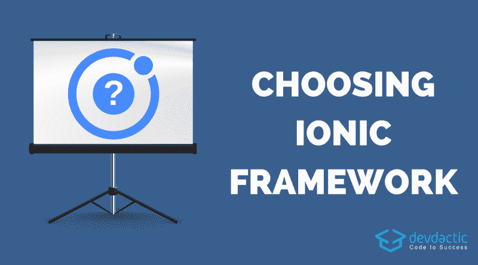

# 如何确定 Ionic 是否是您项目的正确选择

> 原文：<https://www.freecodecamp.org/news/is-ionic-the-right-choice-for-my-project-f15774303956/>

西蒙·格林

# 如何确定 Ionic 是否是您项目的正确选择



爱奥尼亚已经存在好几年了。随着版本 4 的最新[发布，它已经成为开发混合应用的更好选择。尽管如此，仍然有一些缺点和情况，Ionic 可能不是(或者不应该是)你的首选。](https://blog.ionicframework.com/announcing-ionic-4-beta/)

在这篇文章中，我们将看看在为你的下一个项目选择 Ionic 之前你应该回答的问题**。最终，结果很可能仍然是离子型，但也有其他很好的替代品。**

软件开发没有竞争，我们不需要赢家。我们可以接受这个世界上有很多伟大的框架。每一种都有其独特的优势和权衡。你可以为你的工作拥抱一个伟大的框架，或者花时间解释为什么 framework x 如此糟糕。决定权在你，所以明智地选择你想如何度过你的时间。

要知道,**混合应用**这个词有时仍然是决策者的一个危险信号。如果他们在揭开 [10 大杂交神话](https://devdactic.com/myth-hybrid-development/)后还不信服，这篇文章会给他们一条更清晰的道路。

如果你已经爱上了爱奥尼亚或者想进一步了解它，你可以通过我的独家爱奥尼亚学习平台[爱奥尼亚学院](https://ionicacademy.com/)迈出下一步。它提供课程、项目和一个很棒的社区来帮助你成为一名 Ionic 开发者。

### 你的项目是什么？

在开始时，有一个想法或任务会成为一个项目。在这个阶段，你需要弄清楚你想要支持哪些**平台**。你还需要决定你的项目最大的**优先级**是什么。如果你开发全新的东西，选择新的东西会更容易。当您已经有了基于遗留系统的需求时，这就更加困难了。

首先，*你想在哪里提供 app* ？在本地应用商店内，在网络上，作为 PWA，甚至作为桌面应用？

你的答案将是其中一个或多个。如果您的目标是许多平台，Ionic 将是一个不错的选择。

当您只需要一个 web 应用程序时，例如创建一个纯 Angular 项目。如果你只需要桌面应用程序，使用电子或完全不同的东西。(*这不是我主要关注的领域，真的*)。

但是一旦你发现你需要针对移动和网络，Ionic 提供了一个很好的方法来保持你的代码在一个单一语言的代码库中。在这一点上，你是否需要一个原生应用程序或 PWA 并不重要，因为你可以通过 Ionic 获得这两者。

当您将跨平台框架用作跨平台工具时，使用跨平台框架的结果可能会更高。这总是意味着它不会 100%像使用各自平台的固有方法那样做。你可以在一定程度上接近它，同时你的成本降低。

这就把我们带到了项目的优先级。如果你优先考虑的是拥有一个应用程序有史以来最好的 3D 视觉效果，停止阅读这里。这不是 Ionic 的一个用例，而是类似于 [Unity](https://unity3d.com/) 的东西。

如果您的首要任务是为您的客户提供基于他们所有首选平台的解决方案， **Ionic 可以帮助您更快实现目标**。因为你最终可以将你的一个代码库构建成许多不同的形式。您更加灵活，能够针对各种平台。

最后，每个项目都有预算和时间表。这意味着，**这是一个基于许多变量的商业决策**，有时你只能预先估计。做好你的工作，概述什么是重要的，你想去哪里。这将会给你是否使用离子型的第一个提示。

### 你的团队成员的技能是什么？

当你有一个由 5 名非开发人员组成的团队刚刚开始学习什么是数组时，选择框架 a 还是框架 b 没有太大的区别。如果你有一个由 5 名 Angular 开发人员组成的团队，选择 Ionic 的可能性会突然增加很多。

尽管你应该(当然)总是尝试使用最好的工具来为你的项目交付最好的结果，但这并不意味着这个选择最有意义或者具有最高的商业价值。

如果你有很多 C#知识的经验丰富的开发人员，为什么不试试类似于 [Xamarin](https://visualstudio.microsoft.com/xamarin/) 的东西呢？

如果你的团队都知道 React，为什么不用 [React Native](https://facebook.github.io/react-native/) ？


正如我在开始时所说的，有许多很好的框架可供使用。每个人都有自己独特的方法。如果你能从你的开发者的经验中获益，你会更快地开始。也许他们还能从零开始学到一些东西，从而获得更好的结果。

当你有一些具备基本 JavaScript 技能的网络开发人员时， **Ionic 是过渡到移动应用的完美框架**。

此外，如果你有一个由 100 名本地开发人员组成的开发团队，你很有可能应该本地化。看起来你的业务重点是为你的终端用户开发最好的应用。

但是当你的团队还没有到那个阶段(还没有？)评价自己之前的技能。从第一步开始就要记住项目的目标平台，因为并不是所有提到的框架都能像 Ionic 一样在这些平台上交付相同的结果。

结合这两个要素，看看什么样的框架可以匹配！

### 爱奥尼亚给您带来的好处

一旦你决定离子可能是正确的选择，是时候看看使用它的潜在好处了。

#### 代码库

正如已经提到的，你的结果是**一个代码库**，你可以用它来**构建多个平台**。这意味着初始开发时间更快。此外，进一步的维护和更新更容易发布，因为它只需要在一个项目中进行更改。

虽然这听起来很棒，但与为每个目标平台创建 x 项目相比，它永远不会占用开发时间的 50%(或更多)。有时你只需要注意一些特殊的行为，所以你需要添加一些从句，比如:

```
if (this.plt.is('ios')) {  // do ios Stuff}
```

```
if (this.plt.is('android')) {  // do android stuff}
```

Ionic 已经在尽最大努力简化这一过程，推出了一个名为电容器的项目。这定义了一个既能在 web 上工作又能与本地 SDK 一起工作的 API。在写这篇文章的时候，它还没有一个稳定的版本，但是看起来**对未来**很有希望。

#### 平台

因为 Ionic 押注于网络，所以如今 Ionic 应用几乎可以在任何地方运行。Ionic 4 项目是一个 web 应用程序，它被打包到特定平台的正确容器中。

在 web 上，这意味着它可以直接部署。作为 PWA，你需要在一个片段中进行评论，它就准备好了。对于原生应用商店(iOS/Android)， [Cordova](https://cordova.apache.org/) 会打包你的应用。Cordova 使底层 SDK 和设备功能可用。而对于桌面，可以使用[电子](https://electronjs.org/)。它已经被 Visual Studio 或 Slack 等应用程序使用。

#### UI 元素

如果你想非常(非常，非常)简单的解释 Ionic，它是一个**巨大的 UI 库**的元素。特别是随着版本 4 的更新，Ionic 朝着可以轻松添加到任何项目的方向发展。它的组件现在是用自己的工具[模板](https://stenciljs.com/)创建的 web 组件。

虽然 Bootstrap 过去和现在都非常适合 web，但是如果你想让你的用户喜欢你的应用程序，拥有特定平台的组件几乎是必须的。

*见过安卓设计的 iOS 应用吗？*

它要么从未通过苹果提交指南的检查，要么在使用时感觉不对。

Ionic 会根据应用运行的平台自动使用样式。虽然它们开箱后大部分时间都很好看，但**一切都可以定制**以满足您的期望。这不像你必须与预先定义的颜色或任何东西一起生活。有标准值帮助你更快入门。

#### 工具和开发流程

如果你的开发环境很糟糕，你的生产力就会降低。如果你有合适的工具，并且对你的流程感到舒服，你的生产力同样会高很多。

使用 Ionic 4，您可以获得以前版本的 Ionic CLI 的强大功能。此外，您还可以在项目中使用 [Angular CLI](https://cli.angular.io/) 而不会出现任何问题！

这意味着启动项目、添加新文件和创建正确的结构变得容易多了。

此外，与原生开发相比，你的应用程序的**实时重新加载**是那些开发者只能梦想的事情。

结合 [TypeScript](https://www.typescriptlang.org/) 的额外安全性和像 [Visual Studio Code](https://code.visualstudio.com/) 这样的优秀编辑器，开发 Ionic 应用变得不那么费力，更纯粹有趣。

#### 支持和社区

虽然您期望所有著名框架都提供强大的支持和友好的社区，但事情并不总是像您想象的那样。因为爱奥尼亚的主要焦点仍然是角度，你不仅可以从其他爱奥尼亚人那里得到帮助，还可以从整个角度社区中受益。

一旦更多其他框架的用户开始使用 Ionic，社区的规模将随着时间的推移越来越大。

如果你正在寻找另一个伟大的爱奥尼亚社区，你可以在我的[爱奥尼亚学院](https://ionicacademy.com/)找到一个友好的地方。

此外，在文档中查找某些内容可能会非常痛苦。爱奥尼亚将在这一领域提供令人敬畏的体验作为重中之重。看看这里[漂亮的重新设计的 Ionic 4 docs](https://beta.ionicframework.com/docs/) 就明白我的意思了。这绝对超出了你对开源框架的期望！

#### 离子 Pro

虽然 **Ionic 是开源免费的**，但是你可以通过使用 [Ionic Pro](https://ionicframework.com/pro) 添加另一套工具。这项付费服务增加了额外的功能，如创建者的可视化应用程序创建、改进的部署流程(实时应用程序更新)、错误监控或测试渠道。

虽然这些都不是必须拥有的，但如果你能负担得起价格，这是一套你可能想要拥有的令人惊叹的工具。

对于企业团队来说，这些好处显然会有回报。对于认真对待应用程序的小公司来说，这是他们应该考虑的事情，以提高他们开发团队的生产力。

### 爱奥尼亚内部的改进领域

到目前为止，我一直在为爱奥尼亚拼命吹小号。这是因为在过去的几年里，我一次又一次地爱上了它。但是当然每个框架都有缺点，Ionic 也不例外。

#### 表演

对跨平台应用程序最大的担忧永远是性能。是的，Ionic 应用在 Webview 中运行。没有真正的本土元素。它们总是在这个容器中，并且至少比真正的本地应用程序高一层。

一般来说，在网络上，这不是一个问题，因为 Ionic apps 就像其他任何网站一样。

作为一个本地应用，这可能会成为一个痛点，尤其是**如果到本地功能的桥梁是一个瓶颈**，它会一直挂起并降低应用的速度。同样，如果您的首要任务是获得移动应用程序前所未有的最佳性能，那么您可能会想要完全本地化。

此外，JavaScript 的使用非常简单，但与此同时，缺乏经验的开发人员可能会在许多方面出错，导致应用程序运行缓慢。 [Josh Morony 有一篇很棒的文章](https://www.joshmorony.com/ionic-framework-is-fast-but-your-code-might-not-be/)讲述了为什么代码，而不是框架，可能是性能的真正问题。

你肯定可以用 Ionic 构建超级性能的应用程序。与更接近本机代码(或完全本机)的框架相比，它更容易影响性能。

#### 重新加载

很酷的重装功能在几段前还是一个好处，现在却成了一个缺点？

要理解它，你需要了解一下**实时重装**和**热重装**的区别。

第一个与 Ionic 一起使用，意味着一旦你保存代码，你的应用程序就会更新。第二个意思是，一旦你将代码**保存到与**之前完全相同的状态，你的应用程序就会更新。

这是一个区别，特别是如果你在移动设备或模拟器上测试你的应用程序，加载时间真的会减慢你的进程。

当然，这并不是一个精彩的表演，而是开发人员在未来会从中受益匪浅的东西。

#### 原生 SDK

如果你的一个平台是一个本地应用，你很有可能想要使用设备特性或者底层的 SDK。虽然在科尔多瓦这本身不是问题，但有时会很痛苦。

几乎所有你能想到的东西都有 Cordova 插件。一旦你需要一个非常独特的功能，并且发现这个唯一的插件是 3 年前更新的**，你就知道你会有一段艰难的日子**。

这并不意味着这是路的尽头。此时，您可能不得不接触您不熟悉的本机代码。Cordova 意味着**我们不能直接访问本机功能**。

对于 NativeScript 等其他框架，直接使用原生 SDK 要容易得多。对于 Ionic，您目前仍然需要一个桥梁。

一旦电容器为黄金时间做好准备，也许这个痛点将被消除或减少。在那之前，你必须接受你所得到的，或者通过开发你自己的插件变得活跃。

#### AirBnB 和脸书新闻怎么样？

你可能听说过 [AirBnB 用 React Native](https://medium.com/airbnb-engineering/sunsetting-react-native-1868ba28e30a) 晒出他们作品的新闻。你可能已经从扎克那里听说过更老的消息，即[押注 HTML5 是脸书](https://techcrunch.com/2012/09/11/mark-zuckerberg-our-biggest-mistake-with-mobile-was-betting-too-much-on-html5/)最大的错误。

这些文章对通用的跨平台方法提出了很多质疑。

*开发跨平台还有价值吗？*

简短的回答是:**是的，比以往任何时候都多**。

要了解这些公司是如何做出这些决定的，你必须真正了解它们的业务和处境。AirBnB 有超过 100 名原生开发者。你的公司有多少人？

如果我有一个由 100 名有经验的本地开发者组成的团队，我想我会做的最后一件事就是告诉他们停止所有的本地工作，现在就去做 Ionic。

这意味着你不应该被大公司的大标题吓到。

支持或反对 Ionic 或任何框架的决定基于许多因素。仅仅因为一个公司停止使用一个工具并不意味着这个工具很糟糕。这只是不适合他们的需求。

Ionic 可能适合你的下一个项目，也可能不适合。不要让这个决定基于大标题，而是基于你自己的评价。

### 结论

在本文中，我们经历了许多步骤，来看看 Ionic 是否适合您的下一个项目或跨平台应用程序。随着与 Ionic 4 更紧密的角度集成，它是任何 web 和移动项目的绝佳选择。但是它总是取决于你的商业案例、优先事项和你重视的因素！

不要陷入你多年来建立和培养的先入之见。你自己试试吧。

如果你想学习如何用 Ionic 构建优秀的应用程序，请访问 Ionic Academy！

*最初发布于 2018 年 8 月 21 日[devdactic.com](https://devdactic.com/ionic-right-choice-project/)。*