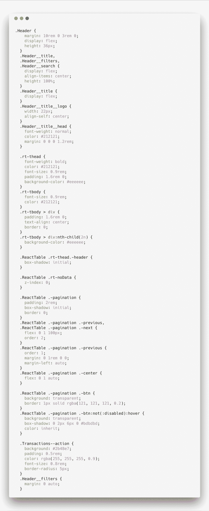
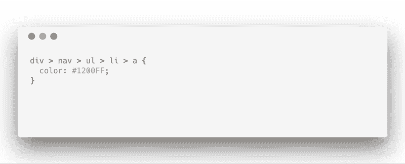
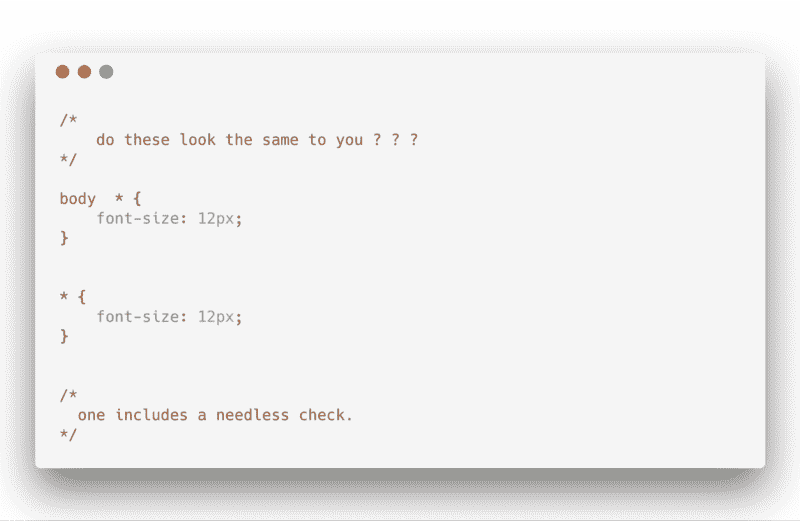
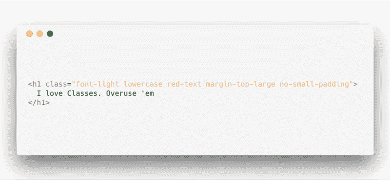
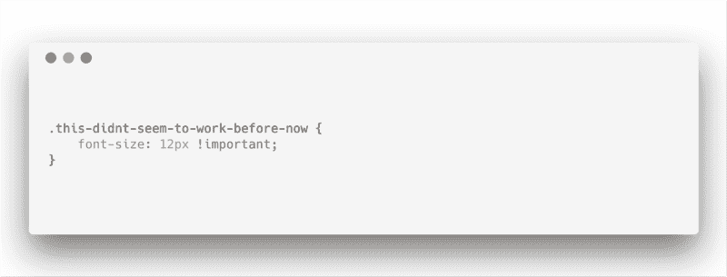

# 如何写出真正可怕的 CSS

> 原文：<https://www.freecodecamp.org/news/how-to-write-truly-terrible-css-214c26c6f729/>

每个人都在谈论写好 CSS 的“技巧”和“亲技巧”。

这没问题，但也许看到糟糕的 CSS 是什么样子会让你有不同的视角。见鬼，它甚至可能对你有好处！

让我带你走一趟如何写真正糟糕的 CSS 的旅程。

准备好了吗？


注意:即使你相信 CSS-in-JS 并且不喜欢普通的 CSS，我们都同意一件事:我们都必须知道一些 CSS…

所以，不管你是写 CSS，还是像 [SASS](https://sass-lang.com) 这样的超集，或者仅仅是 [CSS-in-JS](https://hackernoon.com/all-you-need-to-know-about-css-in-js-984a72d48ebc) ，你仍然会从了解糟糕的 CSS 到底是什么样子中受益。

#### 谁写评论？没有人。



No comments? Actual code I wrote sometime ago but stripped out all comments ?

这里很容易滑倒，所以你不会很快注意到。

我们都知道。你太聪明了，其他人都望尘莫及。即使 CSS 不是最具表现力的“语言”，你也可以对浏览器的怪癖做出假设，修复它们，并假设你会理解几周之后你所做的事情。

多聪明啊。

把你的骄傲放在一边，给你自己和其他队友省点压力。

如果你正在使用一种不太明显的技术，或者已经修复了一些浏览器的怪癖，或者任何你认为不够表达的东西，写下那个评论！不疼。

#### 复杂选择者之地



耶！你刚学了 CSS，感觉自己站在世界之巅。所以，是时候展示一下选择者的肌肉了。

糟糕的举动。

通过使用太多的 CSS 选择器进行选择，你可能已经成功地使你的 CSS 变得非常不可维护。它现在高度依赖于你的应用程序的 HTML 结构。

如果标记的结构稍有改变，你也需要重构你的 CSS。不是最容易的工作流程。

只需在元素中添加一个类，然后继续生活！

即使在需要用多个类来限定选择器的场景中，也要坚持简单性。

简单就是好，几乎都是！

#### 性能？扔掉它！



所以，我明白了。你就是不在乎业绩。很明显，你不关心生意。如果你这样做了，你就不会用糟糕的非性能选择器来烦你的用户了。

但是等等…

我知道计算机的发展速度越来越快，浏览器也在不断优化。无论如何，简单的选择器应该总是首选，并且理解浏览器如何遍历 DOM 来找到您的选择器仍然是一件事情！

很有可能，你从左到右阅读你的选择器。

然而，浏览器从右到左匹配选择器，因此它可以尽快消除不匹配的元素。

如果你知道这一点，你可能会对浏览器更加宽容。他们值得你的爱。

考虑到上面的例子，浏览器将匹配所有元素(*)，并检查它们是否是`body`的后代。

```
body * {  ... } 
```

但是为什么呢？几乎每个可见元素都是元素的后代。那只是不必要的低效检查。

#### 我不擅长给东西起名字，所以我都懒得起。

> 在计算机科学中只有两件困难的事情。命名事物和…

是的，我想你已经听过了。给事物命名可能很难，但这并不意味着你不应该给它们一些想法，或者完全保密。

我怀疑使用单个字母作为类名是否有意义。

```
.u {  font-size: 60rem;}
```

那么超级特定的类名呢？

```
.former-black-now-red-paragraph {  color: red;}
```

那些也没什么用。

虽然这个名字似乎传达了一些意思，但是你很可能破坏了这个类的大部分可重用性。顺便说一下，这是上课的主要原因。

现在，如果你想设计一个常规的段落样式，之前的名字太具体了，没有意义。

使用有意义的名字，但不要太多。

#### 我听说课程很棒。过度使用它们！



hmmm…. When possible, avoid over modularised classes

课程很棒，每个人都喜欢。但是，就像其他事情一样，一件事情做得太多通常不是一个好主意。

你看，如果一组类大部分会一起用，就把它们归到一个类里。

当你选择对这些类进行分组时，可能是主观的。如果您正在构建某种类型的原子库，您可能会倾向于这样做。

如果你正在编写一个大的应用程序，你可能最好以一种有意义的方式对类进行分组，而不是在一个元素上有一大堆类。

尽可能避免过度模块化的类。

#### 我是一个 CSS 纯粹主义者。我不顶嘴，少等等。

你是 CSS 纯粹主义者，我是 CSS 纯粹主义者，我们都是纯粹主义者。让我们把它弄清楚。

现在，来谈谈争论的焦点。

绝对有这样的用例，只写普通的 CSS 就很棒！例如，如果我的 [React](http://reacts.org) 项目没有使用 [CSS-in-JS](https://hackernoon.com/all-you-need-to-know-about-css-in-js-984a72d48ebc) 解决方案，我可以决定走纯 CSS 路线。不疼。

然而，如果你正在编写一个有大量普通 CSS 的大型应用程序，我敢打赌引入 CSS 预处理器会使你的开发更有趣，并有助于实现更易维护的 CSS 代码库。

同样，我并不是说每次都使用预处理器。我是说不要就这么放弃这个选择。它能救你！

#### 你有很多重要的风格！



我讨厌 CSS。它从来没有工作过。那么，解决办法是什么？

当我需要覆盖任何声明时，到处都是大量的`!important`。哈哈！

虽然这听起来像是一个不错的计划，但是过度使用`!important`规则只会导致一个非常不可维护的 CSS 文档。

下一次你需要使用`!important`、[的时候，确保](https://css-tricks.com/when-using-important-is-the-right-choice/)你没有这么做，因为你太懒了，不想解决你的级联问题。

CSS 没那么糟糕。拥抱它。

#### 想写出更好的 CSS？

我已经创建了一个免费的 CSS 指南，让你的 CSS 技能立即得到提高。[获取免费电子书](https://pages.convertkit.com/0c2c62e04a/60e5d19f9b)。


Seven CSS Secrets you didn’t know about