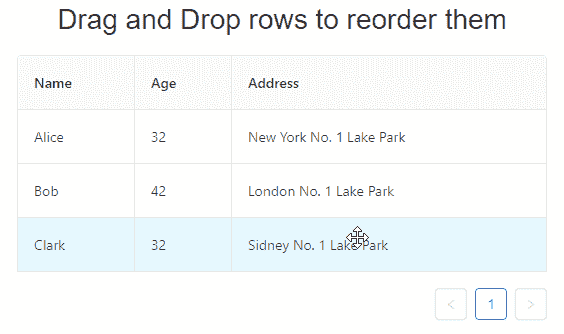

# 如何为浏览器中的拖放操作编写更好的测试

> 原文：<https://www.freecodecamp.org/news/how-to-write-better-tests-for-drag-and-drop-operations-in-the-browser-f9a131f0b281/>

罗纳德·雷伊

# 如何为浏览器中的拖放操作编写更好的测试

#### 同时保持与框架无关


Photo by [Ash Edmonds](https://unsplash.com/photos/SHCViKw3edE?utm_source=unsplash&utm_medium=referral&utm_content=creditCopyText) on [Unsplash](https://unsplash.com/?utm_source=unsplash&utm_medium=referral&utm_content=creditCopyText)

当涉及到用户和 web 应用程序之间的常见交互时，在测试环境中模拟这些动作来断言应用程序的正确功能通常非常简单。我指的是点击按钮、填写表格、导航路线……这些平常的事情。然而，在网络中有一些不太常见的体验更难测试。其中之一是拖放功能。

这部分是因为 HTML5 拖放 API 是多么的不完整和不一致。这导致许多库作者拿出他们自己独特的方法来解决这个问题，这些方法彼此之间往往非常不同。这意味着在你的应用程序中单独实现这样的功能是非常具有挑战性的，对于一个没有经验的开发人员来说，为它编写适当的自动化测试可能更具挑战性。

> 在花了大约一天半的时间进行测试后，我被迫得出结论，HTML5 拖放模块不仅仅是一个灾难，它是一个 f*****g 的灾难。
> 
> - [彼得-保罗·科赫](https://www.quirksmode.org/blog/archives/2009/09/the_html5_drag.html)

令我绝望的是，我目前全职开发的应用程序到处都是与拖放相关的功能。不过，谢天谢地，由于丰富的图书馆生态系统已经解决了这个问题，而且似乎已经解决了这个问题，这已经变得相当容易了。

然而，自动测试这些特性并不简单，我想分享一些我学到的经验。我正在使用 React，许多片段和示例都将以 React 为中心。但实际上，同样的概念可以应用于任何堆栈，这就是它的美妙之处。

### 最初的方法

好吧，假设我需要构建一个包含可拖放行的表，如下所示(顺便说一下，不要太在意实现):

[https://codesandbox.io/embed/github/reyronald/react-dnd-integration-testing-sample/tree/3f90cacea9f99fe7868daf00ffbccaa2611c87e3/?fontsize=14](https://codesandbox.io/embed/github/reyronald/react-dnd-integration-testing-sample/tree/3f90cacea9f99fe7868daf00ffbccaa2611c87e3/?fontsize=14)



如你所见，我使用的是著名的丹·阿布拉莫夫的经典`react-dnd`库。这个特性已经完成了，那么我们现在该如何测试它呢？如果你去看文档，你会发现一个整洁的“[测试”部分，这可能会让你眼前一亮](http://react-dnd.github.io/react-dnd/docs-testing.html)。

有一个关于使用“测试后端”的建议。基本上，你用这个后端来包装修饰过的组件，而不是他们通常提供的 HTML5 后端。这将允许您在浏览器环境之外测试它，也就是说，不需要访问 DOM。

所以在上一段的最后一句话里，我扔给你一大堆怪异的概念:修饰组件、后端、测试后端、HTML5 后端……什么？这些都是`react-dnd`和`dnd-core`的内在基本概念，都与它在引擎盖下如何工作有关。链接指南本身也承认这一点，并声明它是库中最少被记录的部分。

这是否意味着我必须非常熟悉这个库是如何工作的才能测试它？嗯，对我来说，这就是文件所暗示的。这很棘手，因为它可能会误导没有经验的开发人员。

总之，我对他们建议的方法有些不满:

1.  为了测试这个特性，我必须熟悉这个库的内部工作方式及其实现细节。
2.  为了测试这个特性，我还必须熟悉“测试后端”是如何工作的，这是我在使用这个库构建拖放功能时首先不需要熟悉的东西。这意味着我还有另一组文档要消耗，我可能遇到的其他问题不一定与我将用于我的应用程序的常规 HTML5 后端共享。
3.  事实上，我有一个使用这种方法的全面通过测试的套件，这并不一定能保证它真的如我从用户的角度所期望的那样工作。想想看:在我的测试中和在野外，功能将在完全不同的内部工作。尽管维护者的初衷是好的，但这种方法不一定能很好地适应 JS 生态系统的其他部分，并且会给你一种错误的安全感。
4.  如果我决定改变实现该功能的方法并使用另一个库，或者自己编写，我所有的测试将会突然变得过时，我将不得不重新编写它们。

现在，不要误解我的意思——他们花了这么大的力气来创建“测试后端”,以便可以在没有 DOM 的情况下测试功能，这很好。这当然是有用的，也确实有它的位置。但由于我刚刚列出的问题，我不建议这样做。

我要的是以下内容:

1.  一套测试将最大程度地保证功能按预期工作(没有端到端的测试，不可能达到 100%的确定性，这不是我目前关注的)。这意味着我想在测试中从用户的角度断言功能的确切行为。
2.  我可以在任何时候交换或更改特性的实现(包括下面使用的任何库),而对测试的影响最小。
3.  我不需要熟悉功能的实现来编写测试。
4.  我只需要使用我现有的和熟悉的 Web 和 Web APIs 知识来编写这些测试。

### 走向

那么我会推荐什么呢？嗯，只要在你的测试中模拟用户在使用应用程序时会做什么。基本上，我提倡你为这个特性编写完整的集成测试，而不是像文档中建议的那样，编写类似单元/独立的测试。

如今我们有了 [jsdom](https://github.com/jsdom/jsdom) ，它允许我们在内存中启动一个高保真的浏览器环境，而不需要使用真正的浏览器。老实说,`jsdom`已经变得如此之好，以至于我几乎找不到任何理由去编写任何不使用或访问 DOM 的 web 应用程序测试。实际上，你在浏览器开发者控制台中可以做的任何事情都可以在内存中用`jsdom`完成，当然也有一些例外和警告，我们很快就会看到。

免责声明:我并不是说你不应该写单元测试，或者用这种方式写测试。当然，每个场景和问题都是不同的。带上你的思维帽，根据具体情况决定什么是最好的！

好吧，那么，我们怎么做呢？很简单，只需要问自己这样一个问题:如果使用拖放功能，用户会对我的应用程序做什么？当这种情况发生时，浏览器会有什么反应？当你有了答案，只需在测试中使用常规的 DOM APIs 进行编码，并通过`jsdom`！让我们看看如何使用`jest`来测试向下拖动的动作:

```
const getTableCells = () =>
  Array.from(mountNode.querySelectorAll("tr td:nth-of-type(1)"));
const createBubbledEvent = (type, props = {}) => {
  const event = new Event(type, { bubbles: true });
  Object.assign(event, props);
  return event;
};
const tableCells = getTableCells();
const startingNode = tableCells[0];
const endingNode = tableCells[2];
startingNode.dispatchEvent(
  createBubbledEvent("dragstart", { clientX: 0, clientY: 0 })
);
endingNode.dispatchEvent(
  createBubbledEvent("drop", { clientX: 0, clientY: 1 })
);
expect(getTableCells().map(cell => cell.textContent)).toEqual([
  "Bob",
  "Clark",
  "Alice",
]);
```

[react-dnd-integration-testing-sample.js](https://gist.github.com/reyronald/1c846aed9fd7ea52166db8670efb4270#file-react-dnd-integration-testing-sample-js)

这段代码中绝对没有任何与 React 相关的东西，甚至也没有使用 React 测试工具的 Simulate。这意味着我甚至可以完全改变我的 UI 库/框架，比如 Angular(见鬼，甚至是 Backbone，有人知道吗？)而且这个测试还是会有意义的，会像预期的那样工作。

仅这一点就足以正确测试功能的子集，然而，在实际的浏览器中还会发生许多其他事件(`mousedown`、`mousemove`、`dragend`等)。)只是在我们的实现中没有发挥作用。这意味着对于不同的实现，测试可能需要添加或删除一些东西。

(顺便说一下，行业专家公开反对模拟使用。此外，如果你在任何与 GitHub 相关的 Enzyme 事件系统问题上花了超过 5 分钟的时间，你会在那里看到作者自己的相同观点。甚至有评论说在即将到来的版本中会删除它。

> 看起来很酷。我希望它不依赖于 TestUtils。模拟实际的 DOM 事件。不幸的是，这不是 TestUtils。模拟 does？
> 
> — Dan Abramov (@dan_abramov) [April 2, 2018](https://twitter.com/dan_abramov/status/980807288444383232?ref_src=twsrc%5Etfw)