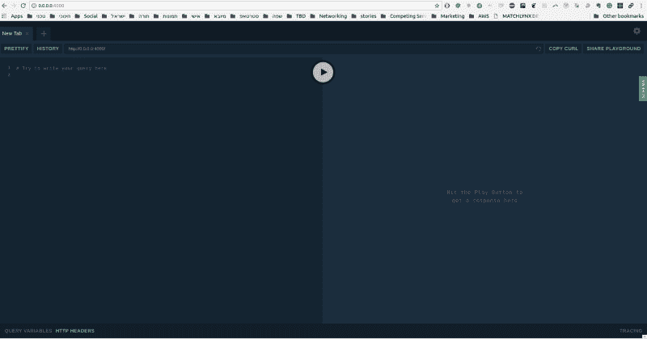
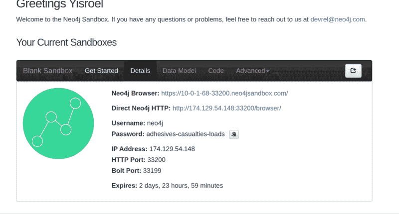
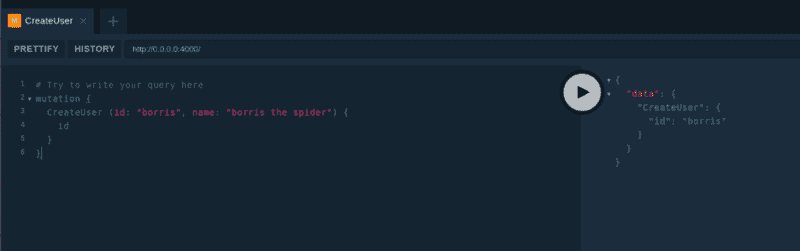
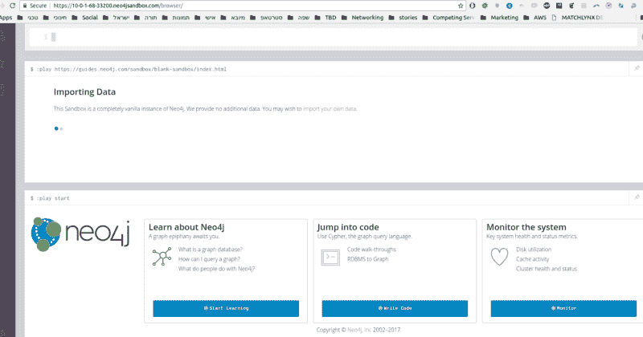
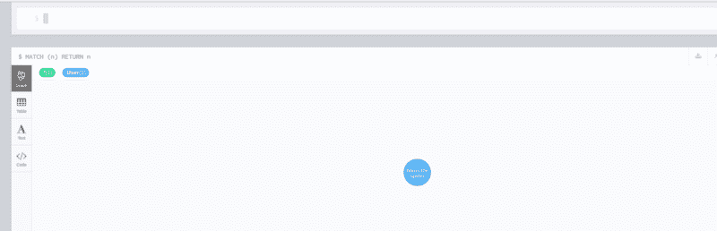
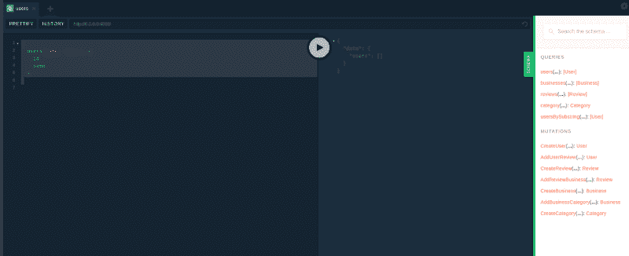
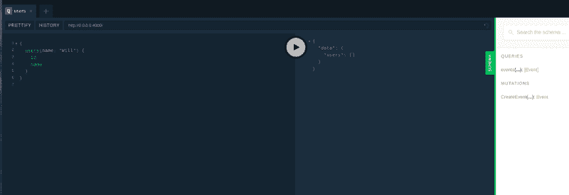
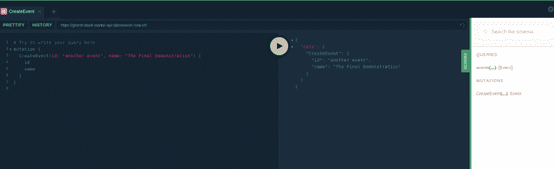

# 如何在一小时内启动你的 MVP 服务器

> 原文：<https://www.freecodecamp.org/news/building-a-full-graph-stack-f95590ade5af/>

作者:Yisroel Yakovson

# 如何在一小时内启动你的 MVP 服务器


### 构建全栈服务器

本文将指导您创建一个真实的、高质量的开发 API 和后端。它应该花费你大约一个小时。而且，顺便说一句，还会免费！

这是关于完整图形堆栈的 3 篇文章系列的第二篇。现在请查看[如何构建尖端服务器](https://medium.freecodecamp.org/meet-the-full-graph-stack-d32150308a87)以获得介绍。

我假设你知道如何编码，但不是说你很高级。这是一个完整的项目。它涉及到很多新工具，所以如果你不理解所有的东西，你不必感到害怕。你会有一些学习曲线，但不会太陡。

正如在[第一篇文章](https://medium.freecodecamp.org/meet-the-full-graph-stack-d32150308a87)中所解释的，这个想法是专注于指定你的应用程序的数据类型图。然后使用新的工具来生成应用程序。

正如我在第一篇文章中所写的，我选择了 [GRANDstack](http://grandstack.io/) 项目。我并不认为这是唯一可行的方法，但我建议您至少检查一下。我的团队自己决定要用 React、GraphQL、Apollo 和一个图形数据库。正面由这些组成，所以这个发现让我很兴奋。

但是真正令人兴奋的是这个包 [neo4j-graphql-js](https://github.com/neo4j-graphql/neo4j-graphql-js) 。它从 TypeDefs 生成(Prisma 风格)一组变异和解析器。如果你不知道这意味着什么，请继续阅读。

在 [GRANDstack Kickstarter](http://grandstack.io/docs/getting-started-grand-stack-starter.html) 页面上，有一段视频展示了如何从头到尾创建一个完整的堆栈。那是我开始的地方。

写这些文章的一个问题是特色包正在开发中。许多你今天仍然需要做的事情可能会在几周内自动完成。我想总结一下这些步骤，并解释一下如何做一些你需要但仍然缺少的事情。但是 Neo4j 的工作人员正在研究它们。如果你发现这些信息已经过时，请在下面更新。

### 替代方法

在我们开始之前，让我重复一遍，我并不认为 GRANDstack 是获得完整图形堆栈的唯一甚至最好的方法。

许多替代方案使用 Prisma 将 GraphQL 模式转换为底层数据库。请务必查看 [GraphCool](https://www.graph.cool/) 。在撰写本文时，这些系统更加成熟，留给开发人员的工作更少。auth 就是一个很好的例子。

Prisma 方法对特定数据库的锁定也较少。实际上，用 GRANDstack 改变数据库并不困难。但是密码查询和指令是 Neo4j 独有的。

也就是说，GRANDstack 项目明确地专注于完整图形堆栈的想法。我推荐他们，因为他们反应灵敏，致力于愿景。也很直白。

### 设置

#### 创建项目

1.  下载启动程序。从 [GRANDstack](http://grandstack.io/) 点击`DOWNLOAD STARTER`，或者从他们的 [GitHub](https://github.com/grand-stack/grand-stack-starter) 页面下载。我使用 GitHub 页面来确保我有最新的版本(反正应该是)。
2.  解压缩到一个文件夹，并将其命名为您的应用程序项目
3.  明智的做法是将新的 app 文件夹移动到通用的**项目**文件夹。

#### Set up Git

我建议您在开始使用 Git 处理版本控制之前不要做任何事情。

1.  [没有的话安装 Git](https://www.linode.com/docs/development/version-control/how-to-install-git-on-linux-mac-and-windows/) 。
2.  在文本编辑器中，修改根项目目录中的`.gitignore`，在`#dependencies`下包含一行`api/node_modules` 和一行`ui/node_modules`。截至本文撰写之时，`.gitignore`只包含了`node_modules`。
3.  在终端中移动到项目的根目录，并创建一个新的 git 项目:

```
git init git add .   # adds the relevant filesgit status  # optional to view the files if you are interestedgit commit -m “Initial App Files” #or whatever name you'd like
```

你可以随心所欲地表演`git add .`和`git commit -m "some description"`。在线查看关于 Git 的无穷无尽的文档。您可以了解分支、提交、恢复以及所有关于版本控制的内容。

### 制作样品后端

注意，您的项目代码有两个目录:`api`和`ui`。这些文章只关注用于创建 API 服务器和后端的`api`目录。关于`ui`的更多信息，请查看[的视频。你也可以在 GRANDstack 查看教程。](http://grandstack.io/docs/getting-started-grand-stack-starter.html)

#### 构建后端

您需要构建代码。你可以使用 npm。在终端中，移动到`api`，并执行以下步骤:

```
npm install # pulls in all of the node modules needed for the apinpm start # begins the app
```

这应该会启动应用程序。您应该在终端中看到类似这样的内容:

```
$ npm start
```

```
> grand-stack-starter-api@0.0.1 start /home/israel/projects/events2/api> nodemon --exec babel-node src/index.js
```

```
[nodemon] 1.18.3[nodemon] to restart at any time, enter `rs`[nodemon] watching: *.*[nodemon] starting `babel-node src/index.js`GraphQL API ready at http://0.0.0.0:4000/
```

打开该链接，您应该会看到一个 GraphQL Playground 页面。



您可以单击右边的绿色 SCHEMA 选项卡，您将看到一个示例数据库的模式。您唯一缺少的是数据库本身。

### 建立一个示例数据库

你必须向 Neo4j 注册才能在下面给出的步骤中使用他们的沙盒。我建议从一开始就进入他们的[松弛频道](https://neo4j-users.slack.com/)。特别是，如果你遵循以下步骤，我会加入 **#grand-stack** 频道，这样你就可以提问了。项目进展很快，所以保持联系很重要。他们很容易接受想法并对问题做出反应。在过去的几周里，他们实施了我和其他人提出的几个想法。

#### 旋转一个空白数据库

1.  登录 [Neo4j 沙盒](https://neo4j.com/sandbox-v2/)。(如开头所述，如果您没有帐户，则需要创建一个帐户。)
2.  找到“空白数据库”并点击它。一分钟后，它应该会生成并显示在您当前的沙箱中。
3.  点击**详细信息**选项卡，您将看到如下内容:



现在，您已经生成了一个实时数据库。你可以在顶部链接的浏览器中访问它。

#### 将您的项目连接到数据库

打开`api/.env`文件，该文件包含 API 中使用的一些全局变量:

```
NEO4J_URI=bolt://localhost:7687NEO4J_USER=neo4jNEO4J_PASSWORD=letmeinGRAPHQL_LISTEN_PORT=4000GRAPHQL_URI=http://localhost:4000
```

您需要从沙盒的详细信息选项卡中设置其中一些

1.  复制 IP 地址(例如，在上面显示的示例中是`174.129.54.148`)，然后复制 bolt 端口，例如`33199`。一起使用它们在`api/.env`文件中为`NEO4J_URI`创建一个新值，替换`bolt://localhost:7687`。请注意，冒号将它们分开。例如，在这种情况下，第一行将是`NEO4J_URI=bolt://174.129.54.148:33199`。
2.  此外，从 Details 复制沙盒数据库密码(例如，在本例中为`adhesives-casualties-loads`)并替换默认密码`letmein`。
3.  当然，确保你已经保存了你的修改。然后回到你的终端，打`ctrl-c`，再次输入`npm start`，回到 [http://0.0.0.0:4000/](http://0.0.0.0:4000/) 重新加载。
4.  现在在左窗格中输入以下变化:

```
# Try to write your query heremutation {  CreateUser (id: "borris", name: "borris the spider") {    id  }}
```

点击中间的箭头按钮执行，您应该在右边的按钮中看到变异的结果:



如果有，恭喜你！您已经有了一个在本地运行的功能 API 服务器。

不要忘记将您的更改提交给 Git。回到应用程序的根目录(不在 API 中)，输入:

```
git add .git commit -m "Working Sandbox Db"
```

### 直接检查数据

现在，在你的 Neo4j 沙盒中点击细节顶部的`Neo4j Browser`链接。(如上图所示，是`[https://10-0-1-68-33200.neo4jsandbox.com/](https://10-0-1-68-33200.neo4jsandbox.com/.))` [。)](https://10-0-1-68-33200.neo4jsandbox.com/.))



你可以在 Neo4j 了解如何使用它。但是出于我们的目的，在提示符下输入下面的查询:`MATCH (n) RETURN n`。该查询返回数据库中的所有节点。单击右边的箭头按钮执行，您应该会看到您创建的新节点:



如果你愿意，你可以回到你的`api`目录中的一个终端并输入`npm seedDb`。大约一分钟后，您将看到示例数据库的启动包附带的种子数据。然后，您可以像这样进行查询:

```
{  users(name: "Will") {    id    name  }}
```

或者，你可以直接进入下一步。

### 添加您自己的 GraphQL 模式

点击操场界面中的绿色模式按钮。您将看到示例数据库附带的一个模式:



现在是时候用您自己的模式替换它了。

1.  打开当前示例模式`api/src/graphql-schema.js`，查看该数据的来源。它在`typeDefs`声明中。
2.  至少了解一下 [GraphQL 类型模式。](https://graphql.org/learn/schema/)你必须能够实现自己需要的类型和一些查询。很直白。
3.  从一两种类型开始试验，逐渐积累。要创建一个查询，您必须同时更改`typeDefs`和`resolvers`(在同一个文件中的`typeDefs`下面)。幸运的是，您的解决方案很简单。只需从 [neo4j-graphql-ps 包](https://github.com/neo4j-graphql/neo4j-graphql-js)中调用`neo4jgraphql`，就像示例数据库中一样。
4.  保存对文件的更改，并确认 npm 正在更新。然后刷新 Playground 选项卡，确认新的模式正在显示。

关于完整图形堆栈的介绍文章提到了一个事件的示例应用程序。这是它的样本应用程序数据类型图:


一下子加起来太多了，但是开始并不难。我们自上而下地工作，GraphQL 非常宽容。

#### 了解 neo4j-graphql-js

了解一下服务器如何使用`neo4j-graphql-js`会有所帮助。

在`index.js`中对`augmentSchema`的调用是产生所有突变的原因。这包括为每个创建的类型提供的 CRUD 功能(创建、更新和删除)。此外，用于创建关系的 Add 和 Remove 函数。

类型之间的关系生成关系函数。当类型 X 将类型 Y 作为字段返回时，这表示一种关系。当使用以下公式定义精确关系时，会生成添加和删除函数:

1.  一个`@cypher`指令或
2.  一个方向为“OUT”的`@relation`指令。

另一个重要的函数是`neo4jgraphql`，它实现了一个解析器。包的[文档解释了细节。](https://grandstack.io/docs/neo4j-graphql-js.html)

上周刚刚在 [GRANDstack 文档页面](https://grandstack.io/docs/neo4j-graphql-js.html)更新了文档。(本文写作时间为 2018 年 8 月 19 日)。文档仍然很少。例如，文档中没有讨论关键的`augmentSchema`功能。他们确实讨论了突变，并且展示了一个使用突变的例子。但是文档是有帮助的。初学者包中包含的示例以及那里提供的示例也是如此。

你也可以查看`[neo4j-graphql](https://github.com/neo4j-graphql/neo4j-graphql)` [的文档。](https://github.com/neo4j-graphql/neo4j-graphql)但是那里的一些东西可能还没有进入`ps`版本。

#### 最初的变化

您可以删除示例中的所有类型，但请注意，您不应该完全删除查询类型。您的查询将需要它，正如您在 GraphQL 文档中看到的那样。

下面是 events 应用程序模式的一个最简单的开头示例:

```
export const typeDefs = `type Event {  id: ID!  name: String}type Query {    events(id: ID, name: String): [Event]}`;export const resolvers = {  Query: {    events: neo4jgraphql,  }};
```

保存后，在运行`npm start`的终端中检查确认信息。大概是这样的:

```
[nodemon] restarting due to changes…[nodemon] starting `babel-node src/index.js`GraphQL API ready at http://0.0.0.0:4000/
```

刷新浏览器中的 Playground 并单击模式按钮。您应该会看到新的模式:



然后，您可以开始添加更多类型。

#### 添加您自己的数据

1.  在沙盒提示符下，输入`MATCH (n) DETACH DELETE n`。这将删除您为项目附带的示例模式添加的任何数据。
2.  使用新模式中生成的突变来创建一些数据。例如:

```
mutation {  CreateEvent(id: "my event", name: "The Big Event") {    id    name  }}
```

### 启动

剩下的唯一一件事就是把你的服务器转移到一个活动的站点，这样你的前端就可以调用它了。(哦，你必须创建前端——转到你的应用文件夹的`ui`目录来处理它)。 [GRANDstack Kickstart 页面](http://grandstack.io/docs/getting-started-grand-stack-starter.html)中的视频推荐现在使用。

进入 [Now 桌面](https://zeit.co/download)点击下载。**但是**:桌面应用目前不支持 Linux。我在 Ubuntu 上，所以我就用了他们的[命令行界面](https://zeit.co/download#now-cli)。这就是我在本说明书中使用的。

1.  在机器上安装后，登录。您应该能够返回到 [Now 站点](https://zeit.co/now)，并在右上角看到您的姓名或照片。
2.  转到`api`目录，键入`now`。你会被提示输入一些东西。如果一切顺利，您将在终端中得到一长串输出，并以一条成功消息结束:

```
$ now> Read more about how to update here: https://zeit.co/update-cli> Deploying ~/projects/events2/api under xxxxxxxxxx@gmail.com> Your deployment's code and logs will be publicly accessible because you are subscribed to the OSS plan.> NOTE: You can use `now --public` or upgrade your plan (https://zeit.co/account/plan) to skip this prompt> Upload [=============-------] 66% 0.1s (192.48KB) [4 files]> Using Node.js 8.11.3 (default)> https://grand-stack-starter-api-qibrvosvuh.now.sh [in clipboard] (bru1) [7s]> Synced 4 files (192.48KB) [7s]> Building…> ▲ npm install> ✓ Using "package-lock.json"> ⧗ Installing 13 main dependencies…> Building "nodemon@1.18.1" remotely> Building "nodemon@1.18.1" remotely> Building "nodemon@1.18.1" remotely> Building "nodemon@1.18.1" remotely> Error: Error parsing `package.json` for nodemon-1.18.1.tar>     at extract (/snapshot/ace/lib/extract.js:36:11)>     at process._tickCallback (internal/process/next_tick.js:188:7)>     at <anonymous>> ▲ npm install> > protobufjs@6.8.6 postinstall /home/nowuser/src/node_modules/protobufjs> node scripts/postinstall> > > nodemon@1.18.1 postinstall /home/nowuser/src/node_modules/nodemon> node bin/postinstall || exit 0> > Love nodemon? You can now support the project via the open collective:>  > https://opencollective.com/nodemon/donate> > npm WARN grand-stack-starter-api@0.0.1 No repository field.> npm WARN optional SKIPPING OPTIONAL DEPENDENCY: fsevents@1.2.4 (node_modules/fsevents):> npm WARN notsup SKIPPING OPTIONAL DEPENDENCY: Unsupported platform for fsevents@1.2.4: wanted {"os":"darwin","arch":"any"} (current: {"os":"linux","arch":"x64"})> > added 564 packages in 9.426s> ▲ Snapshotting deployment> ▲ Saving deployment image (9.0M)> Build completed> Verifying instantiation in bru1> [0] > [0] grand-stack-starter-api@0.0.1 start /home/nowuser/src> [0] nodemon --exec babel-node src/index.js> [0] > [0] [nodemon] 1.18.1> [0] [nodemon] to restart at any time, enter `rs`> [0] [nodemon] watching: *.*> [0] [nodemon] starting `babel-node src/index.js`> ✔ Scaled 1 instance in bru1 [13s]Open that url, and you should see your playground. Try it to be sure that it’s working:
```

最重要的是有一条线表示您的实时端点:

```
https://grand-stack-starter-api-qibrvosvuh.now.sh [in clipboard]
```

打开网址，你应该看到你的游乐场。试一试，确保它能正常工作:



### 你所取得的成就

就是它——一个实时开发服务器，只需很少的时间和金钱！你的筹码已经满了。但是与 LAMP 堆栈不同，这个堆栈包含 API 本身。请注意，您需要修改的只是`typeDefs`和`resolvers`。

明白这还不是生产质量:

*   在没有建立永久数据库的情况下，使用它的时间非常有限。你现在可以在你的前端玩这个，直到你的 Neo4j 沙盒过期。那将是 3 天，但是你可以要求额外的 7 天。当然，你也可以创建一个新的沙箱。如果你愿意，你也可以在`api/src/seed/seed-mutations.js`存储一组突变。每当您切换到一个新的沙箱时，您都可以用命令`npm seedDb` 运行它。
*   每当您现在想要更改您的版本时，URL 将会更改。你可以[设置一个别名](https://zeit.co/docs/features/aliases)来允许你的代码处理它，但是从长远来看这并不理想。

但是对于一个 MVP 和初始开发来说，这就足够了，而且是免费的。如果你有一个域名，你可以使用任何托管服务建立一个 [CNAME 记录](https://www.linode.com/docs/networking/dns/dns-records-an-introduction/#cname)来运行你的 Now 页面。

查看[使您的整个图形堆栈达到生产质量](https://medium.com/@yisroelyakovson/making-your-single-graph-stack-production-quality-ec231a938551)以了解如何部署发布。